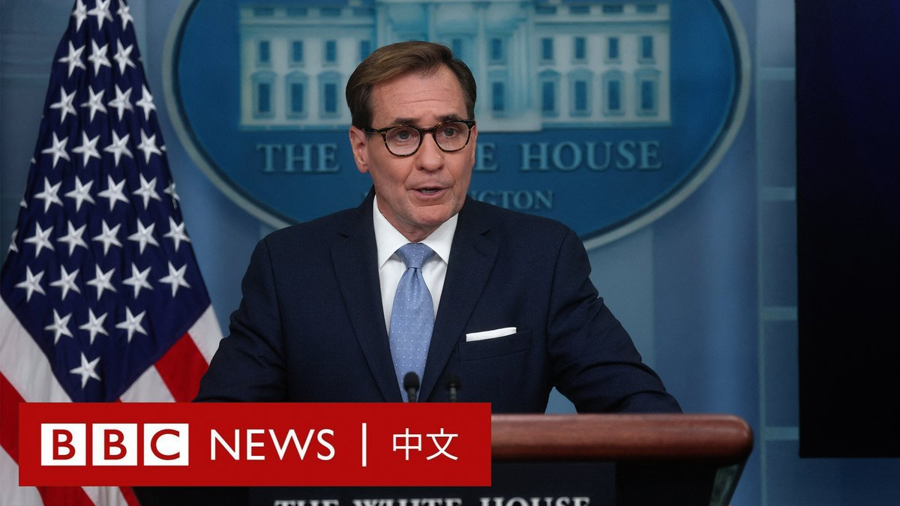
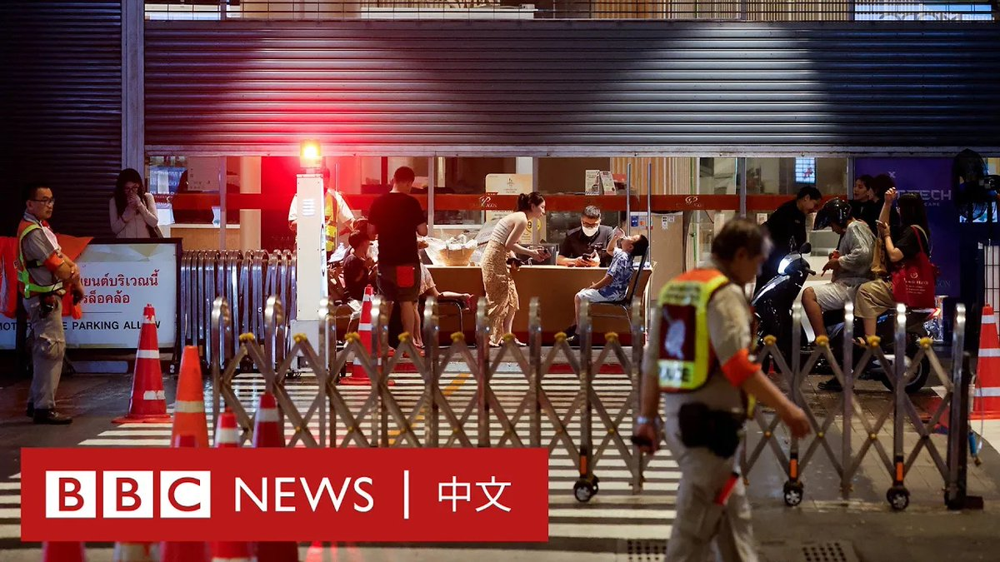
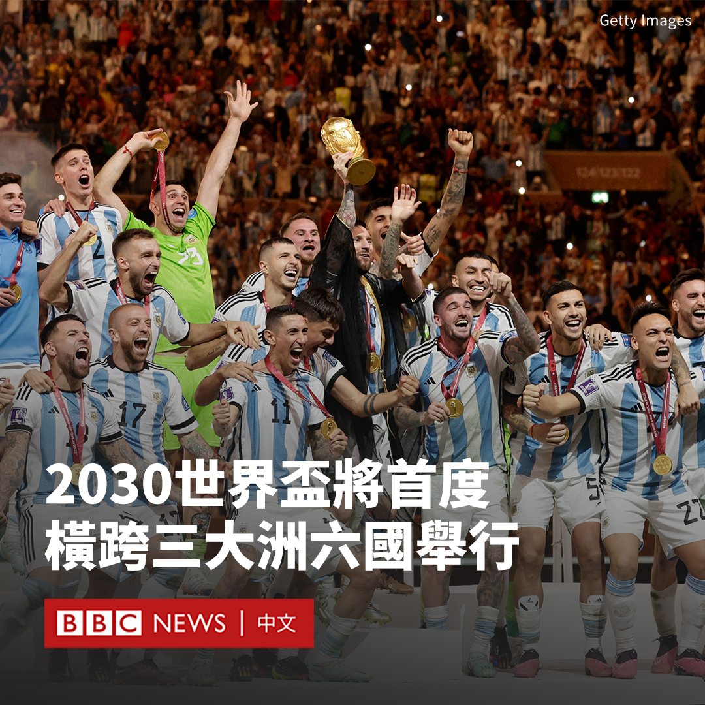

D英国广播公司BBC 北京时间 2023-10-05T23:13:30Z 1709949942893318444 美国国家橄榄球联盟（NFL）最受关注的恋情新闻已经传到了白宫。

在一次例行新闻发布会上，美国国家安全委员会发言人约翰·柯比（John Kirby）被问及泰勒‧斯威夫特（Taylor Swift）和特拉维斯‧凯尔西（Travis Kelce）的恋情。

他开玩笑地说，关于在泰勒‧斯威夫特（Taylor Swift）被发现出现在堪萨斯城酋长队的两场比赛中后，他 “既不能证实也不能否认 ”。   D英国广播公司BBC 北京时间 2023-10-05T16:26:07Z 1709847420493001037 据日本媒体报导，去年该国学校校园霸凌事件和缺勤数均创下历史新高。

日本文部科学省周三（10月4日）公布调查结果显示，2022年度日本中小学经确认的校园霸凌事件共计68.19万起，比去年增加10.8%。

调查还显示，2022年度旷课30天或以上的中小学学生人数高达29.9万人，比2021年度大涨22.1%，同样创历史新高。

学生拒绝上课的首要原因是“嗜睡或焦虑”，占受访者的51.8%。

文部科学省表示，公众对学校的看法正在发生变化，越来越多的人觉得不再需要每天上学。

在小学、初中、高中共发生9.5万起暴力行为，创调查以来的新高；而自杀的学生总数为411人，位居记录第二高。

当局将这些变化归咎于新冠大流行，称疫情导致许多青少年过着更加与社会隔离的生活，使其更难建立人际关系，从而显著影响其行为。

日本文部科学省每年以全国小学、初中、高中和特殊学校为对象，针对学生缺课、校园霸凌和暴力行为进行调查。   D英国广播公司BBC 北京时间 2023-10-05T19:00:09Z 1709886186502676610 泰国曼谷10月3日的商场枪击案让不少中国观光客对泰国旅游却步。疫情前中国旅客是泰国最大宗的客源，但近期不少人对东南亚国家旅游的负面观感升高，中国游客怎么想？ https://t.co/YbQDuDDg7f   D英国广播公司BBC 北京时间 2023-10-05T20:01:06Z 1709901523713417581 在美中关系不稳定的背景下，台湾成了东亚一个潜在的火药库，有分析指北京希望运用灰色地带战术，不发一枪而控制台湾。https://t.co/IhGullgGcX   D英国广播公司BBC 北京时间 2023-10-05T17:37:40Z 1709865429823635485 韩国人气女团Blackpink成员Lisa近日因参加巴黎疯马秀演出在网上掀起两极化的激辩。批评声甚至波及Lisa的母亲和疑似观看该表演的中国明星。

拥有70多年历史的疯马秀是在艳舞夜总会“疯马”（Crazy Horse）内上演的歌舞秀，其表演以奇幻的光影效果和裸体女舞者而闻名。

尽管该舞台曾接待过从乐坛天后碧昂丝（Beyoncé）到蒂塔·万提斯（Dita Von Teese）和帕米拉·安德森（Pamela Anderson）等众多名人，但Lisa上月底一连三天的演出让她在多国遭到批评，指其鼓励裸体并物化女性。

Lisa周三（10月4日）在社交媒体Instagram发帖称：“在疯马秀获得了一次令人惊叹的经历，感谢大家让这一切发生”，并同时上载了多张疯马秀造型照片。

虽然26岁的Lisa并未裸露上身，但有失望的网友写道：“你的粉丝很多都是年轻少女，作为名人应知道自己对社会和年轻一代的影响”。还有网友批评称，作为亚洲顶级女演员却去欧洲跳艳舞，是“赤裸裸的耻辱”。

但她的很多支持者表示“这是艺术自由”，还有很多人赞扬她的造型“性感”“惊艳”。

Lisa的妈妈七提披（Chitthip Bruschweile）也在Instagram上成为众矢之的。有网民批评称：“你怎么能让你的女儿在舞厅跳舞，而你却支持她？ ”

在中国社交媒体上，Lisa也受到如潮水般的批评，一些粉丝宣布“脱粉”。Lisa在中国拥有很高的知名度，她曾在中国真人秀节目《青春有你》中担任导师。

有微博网民声称看到艺人杨颖（Angelababy）和张嘉倪现身“疯马秀”表演场地，也引发轩然大波。一些批评者要求监管部门封杀她们。

疯马秀的官方Instagram账号周三（10月4日）回应称：“我们已经意识到围绕着Angelababy的争论。 遗憾的是，她从未看过我们的表演。”   D英国广播公司BBC 北京时间 2023-10-05T15:30:05Z 1709833322275254335 台湾大选将至，中央选举委员会在9月正式发布台湾第16任总统、副总统选举公告，并预估此次大选合资格的投票人数高达1950万人。以下是BBC中文整理这次选举的重点资讯。https://t.co/6waqMCoOmp   D英国广播公司BBC 北京时间 2023-10-05T14:01:53Z 1709811124420689937 国际足联（FIFA）表示，2030年世界杯将在三大洲的六个国家举行。

西班牙、葡萄牙和摩洛哥被指定为联合主办国，而乌拉圭、阿根廷和巴拉圭将举行三场揭幕战。

在南美洲举行揭幕战是为了纪念世界杯一百周年。1930年，首届国际足联世界杯在乌拉圭蒙得维的亚举行。

这一决定将在明年的国际足联大会上得到正式批准。

国际足联主席詹尼·因凡蒂诺（Gianni Infantino）说：“在一个分裂的世界里，国际足联和足球正在团结起来。”

“代表全世界足坛的国际足联理事会一致同意，以最恰当的方式庆祝国际足联世界杯一百周年，其首次比赛于1930年在乌拉圭举行。”

“在2030年，我们将拥有独特的全球性足迹，非洲、欧洲和南美洲三大洲的六个国家——阿根廷、摩洛哥、巴拉圭、葡萄牙、西班牙和乌拉圭——欢迎并团结全世界，一起共同庆祝精彩的比赛、百年纪念和国际足联世界杯。”

根据国际足联规定，2034年世界杯举办权将会给予来自亚洲和大洋洲国家，这为沙特阿拉伯的申办开辟了道路。   D英国广播公司BBC 北京时间 2023-10-05T12:12:40Z 1709783637577867474 美国政府宣布对25个被指参与生产和贩运芬太尼（fentanyl）相关原料的中国公司和个人实施制裁。

芬太尼是一种用于止痛或镇静的强效类阿片药物，而该药物的滥用成瘾问题长期困扰美国。在2022年，有近11万与之相关的死亡事例。

美国司法部长梅里克·加兰（Merrick Garland）指责芬太尼的全球供应链“通常始于中国的化工公司”，而中国则指芬太尼危机源于美国自身。

美国财政部周二（10月3日）宣布对位于中国的12个实体和13名个人，以及位于加拿大的两个实体和一名个人进行制裁。

华盛顿将这些目标形容为一个“负责制造和分销”芬太尼前体和其他非法药物的中国网络。

制裁将冻结这些实体在美国的资产，并禁止美国人员与其进行往来。

司法部还公布了起诉书，指控八家中国公司及其12名员工涉嫌犯有生产芬太尼和甲基苯丙胺、分销阿片类药物以及销售前体化学品相关的罪行。

美国官员称，芬太尼供应链中的公司经常使用虚假地址和伪装标签来避免其产品被执法部门识别。

中国外交部则表示，“中方坚决反对美国对中国实体和个人实施制裁和起诉，坚决反对美方严重侵犯有关企业和个人的合法权益。”

“中国政府始终严厉打击毒品犯罪……也是世界上易制毒化学品管制最严厉的国家。”中国外交部说。“施压和制裁不能解决美国自身的问题。它只会给中美禁毒合作制造障碍。”

今年3月，墨西哥总统洛佩斯·奥夫拉多尔（Andrés Manuel López Obrador）表示其已致信中国领导人习近平，呼吁北京帮助阻止芬太尼及其前体流入墨西哥。

中国外交部发言人在4月表示，中国和墨西哥之间“不存在芬太尼非法贩运问题”。   D英国广播公司BBC 北京时间 2023-10-05T09:48:29Z 1709747354742439984 社交媒体TikTok为遵守印尼政府的新规定，停止该公司在当地的网上购物服务。这意味着，印尼的内容创作者不能在Tiktok上“直播带货”。

TikTok在印尼有多达1.25亿用户。当局认为该平台和其他社交媒体的商品交易功能，威胁数以千万计的小型企业。https://t.co/vrqMXGzaTs   