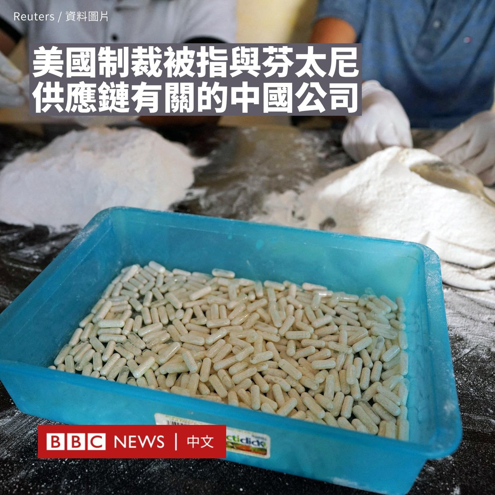

D英国广播公司BBC 北京时间 2023-10-05T12:12:40Z 1709783637577867474 美国政府宣布对25个被指参与生产和贩运芬太尼（fentanyl）相关原料的中国公司和个人实施制裁。

芬太尼是一种用于止痛或镇静的强效类阿片药物，而该药物的滥用成瘾问题长期困扰美国。在2022年，有近11万与之相关的死亡事例。

美国司法部长梅里克·加兰（Merrick Garland）指责芬太尼的全球供应链“通常始于中国的化工公司”，而中国则指芬太尼危机源于美国自身。

美国财政部周二（10月3日）宣布对位于中国的12个实体和13名个人，以及位于加拿大的两个实体和一名个人进行制裁。

华盛顿将这些目标形容为一个“负责制造和分销”芬太尼前体和其他非法药物的中国网络。

制裁将冻结这些实体在美国的资产，并禁止美国人员与其进行往来。

司法部还公布了起诉书，指控八家中国公司及其12名员工涉嫌犯有生产芬太尼和甲基苯丙胺、分销阿片类药物以及销售前体化学品相关的罪行。

美国官员称，芬太尼供应链中的公司经常使用虚假地址和伪装标签来避免其产品被执法部门识别。

中国外交部则表示，“中方坚决反对美国对中国实体和个人实施制裁和起诉，坚决反对美方严重侵犯有关企业和个人的合法权益。”

“中国政府始终严厉打击毒品犯罪……也是世界上易制毒化学品管制最严厉的国家。”中国外交部说。“施压和制裁不能解决美国自身的问题。它只会给中美禁毒合作制造障碍。”

今年3月，墨西哥总统洛佩斯·奥夫拉多尔（Andrés Manuel López Obrador）表示其已致信中国领导人习近平，呼吁北京帮助阻止芬太尼及其前体流入墨西哥。

中国外交部发言人在4月表示，中国和墨西哥之间“不存在芬太尼非法贩运问题”。   D英国广播公司BBC 北京时间 2023-10-05T09:48:29Z 1709747354742439984 社交媒体TikTok为遵守印尼政府的新规定，停止该公司在当地的网上购物服务。这意味着，印尼的内容创作者不能在Tiktok上“直播带货”。

TikTok在印尼有多达1.25亿用户。当局认为该平台和其他社交媒体的商品交易功能，威胁数以千万计的小型企业。https://t.co/vrqMXGzaTs   