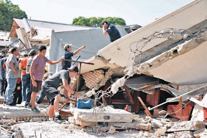
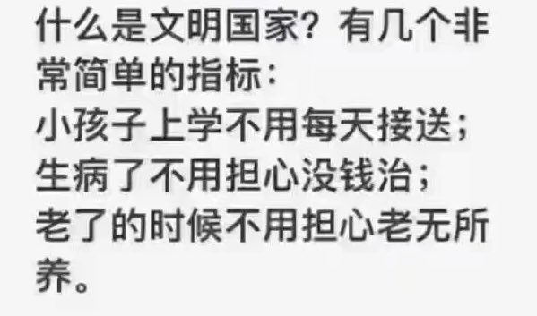
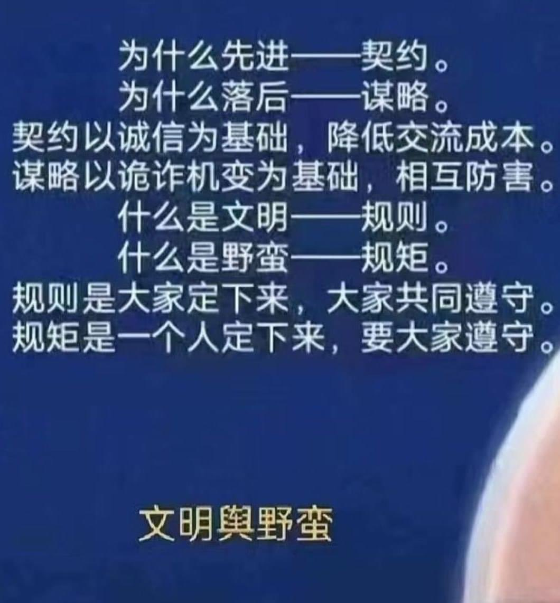
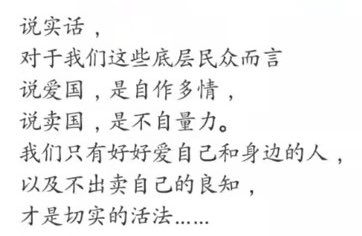
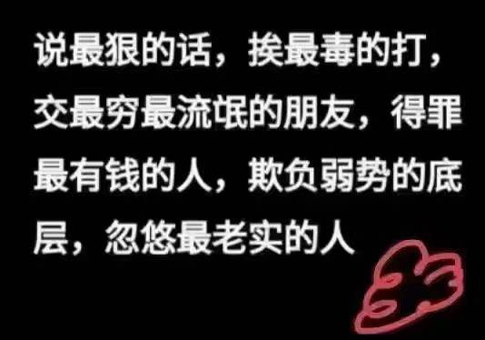
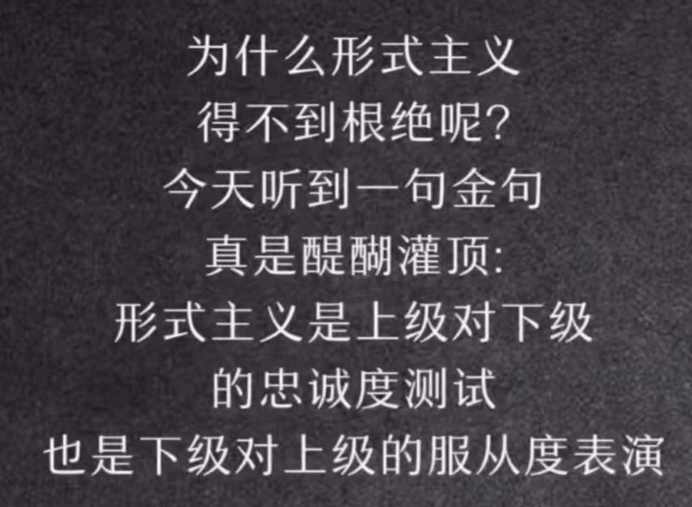

Petrichor 北京时间 2023-10-05T06:56:07Z 1709703977959391572 能跨境抓捕他们吗？
美国司法部周二（10月2日）指控八家总部设在中国的公司及其12名雇员涉嫌生产、分销和进口芬太尼、其他合成阿片类药物、甲基安非他命及其前体化学品。共有八项起诉书在佛罗里达州的中区和南区被公布。
        根据司法部宣布的消息，被起诉的公司及其雇员（均为中国公民）包括：

河北晟浩进出口贸易有限公司（Hebei Shenghao Import and Export Company，音译），同时被起诉的是29岁的李青顺（Qingshun Li，音译）、32岁的李青松（Qingsong Li，音译）、33岁的陈春晖（Chunhui Chen，音译）以及30岁的陈春洲（Chunzhou Chen）

利合医药科技有限公司（Lihe Pharmaceutical Technology Company，音译），同时被起诉的是34岁的王明明（Mingming Wang，音译）和40岁的卢新强（Xinqiang Lu，音译）。
      河南瑞玖生物有限公司（Henan Ruijiu Biotechnology Company，音译），同时被起诉的是30岁的高永乐（Yongle Gao，音译）。
       厦门万德弗生物科技有限公司（Xiamen Wonderful Biotechnology Company，音译），同时被起诉的是34岁的梁国（Guo Liang，音译）。
安徽瑞汉科技公司（Anhui Ruihan Technology Company，音译）。
       翰弘医药科技有限公司（Hanhong Medicine Technology Company,音译）,同时被起诉的是30岁的杜长根（Changgen Du, 音译）和28岁的甘雪碧（Xuebi Gan,音译）。
       江苏邦德雅新材料科技有限公司（Jiangsu Bangdeya New Material Technology Company，音译），同时被起诉的是40岁的王建通（Jiantong Wang，音译）。

       河北冠朗生物科技有限公司（Hubei Guanlang Biotechnology Company，音译），同时被起诉的是28岁的张伟（Wei Zhang，音译）。
       美司法部声明指出，这些中国公司制造和分销芬太尼和甲基安非他命的前体化学品、阿片添加剂和合成阿片类药物，其中许多在互联网上公开发布广告。它们还试图通过使用美国的转运商、假退货标签、假发票、虚假邮资以及掩盖真实内容和分销商身份的包装来逃避执法，并且往往使用加密货币交易来掩盖其身份及其资金的所在地和流动情况。

      司法部指出，芬太尼和芬太尼类似物在北美的主要分销商是位于墨西哥锡那罗亚州的锡那罗亚贩毒集团（Sinaloa Cartel）和位于墨西哥哈利斯科州的哈利斯科新一代贩毒集团（Cartel Jalisco Nueva Generación）。这两个跨国犯罪组织在墨西哥全境都有重要据点，在美国多个城市设有分销中心，并控制着进入美国的走私通道。两者从中国接收芬太尼前体化学品，在秘密实验室大规模合成芬太尼成品，然后分销往美国。

       美国司法部长梅里克·加兰德（Merrick Garland）周二在华盛顿的新闻发布会上说：“我们知道这个网络包括贩毒集团的首领，他们的毒品贩运者、他们的洗钱者、他们的秘密实验室运营者、他们的保安部队、他们的武器提供者，还有他们的化学品供应者。我们知道，这是一个全球芬太尼供应链，终点是美国人的死亡，起点经常是中国的化学公司。”他说：“美国政府聚焦于打破这一链条中的每个环节，将芬太尼清除出我们的社区，并将那些带入芬太尼的人绳之以法。
司法部表示，芬太尼是美国面临的最致命的毒品威胁。司法部指出，从2022年2月到今年1月，至少有10万多名美国人死于用药过量，其中大部分涉及合成类阿片，如芬太尼和芬太尼类似物。
       根据负责打击非法药物贩运的美国缉毒局（DEA）的信息，墨西哥和中国是直接向美国贩运的芬太尼及芬太尼相关物质的主要来源。几乎所有制造芬太尼所需的前体化学品都来自中国。美国缉毒局局长安妮·米尔格拉姆（Anne Milgram）在新闻发布会上说：“这八起案件是美国缉毒局努力打击芬太尼供应链发源地中国的结果。”
       美财政部宣布对参与从事非法药物贸易并向美国贩运芬太尼和赛拉嗪等致命物质的28个实体与个人施行新的重大制裁。根据立即生效的制裁措施，这些位于中国和加拿大的个人与实体被禁止使用美国金融系统，美国人员也被禁止与他们进行交易。此外，财政部还查明和封禁了十余个与这些行为体有关的虚拟货币钱包。   Petrichor 北京时间 2023-10-05T07:16:39Z 1709709144033214567 建筑质量不过关，上帝也没办法保护你。

墨西哥北部一座教堂周日（10月1日）发生屋顶倒塌事故，造成至少10人死亡，包括1名儿童，另有60多人受伤，约30人被困瓦砾堆中，救援人员正全力搜救。
事发现场为塔毛利帕斯州马德罗城的圣克鲁斯教堂，当时正举行下午弥撒，约有100名信众参加。网上片段显示，信众正在领圣餐之际，教堂顶部突然倒塌，扬起大量尘埃，其后一幅黄色砖外牆亦倒塌。 事发后有30人被埋在瓦砾下，警方、民防部门及红十字会人员到场搜救。死者包括5名女性、2名男性及3名儿童。60名伤者中包括多名儿童，目前仍有23人留医。   Petrichor 北京时间 2023-10-05T08:00:27Z 1709720164965454212 您同意吗？ https://t.co/k4HO6UHi6j   Petrichor 北京时间 2023-10-05T00:06:46Z 1709600961704894938 独裁者都喜欢形式主义，最后又都被形式主义搞死。 https://t.co/j07KJo7b4A   