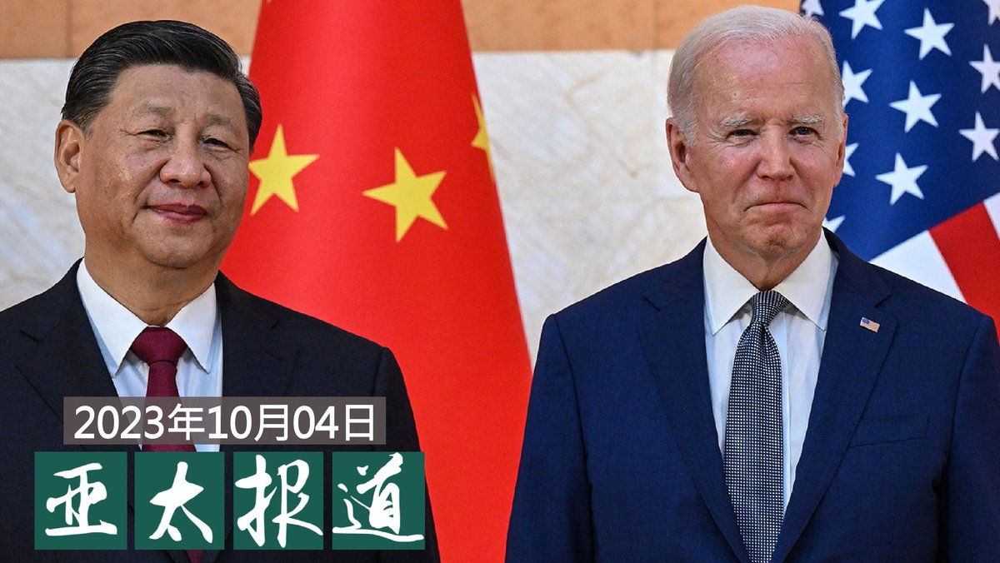

自由亚洲电台 北京时间 2023-10-05T05:01:58Z 1709675248118087985 欢迎收听和订阅播客【亚太报道（２０２３－１０－４）】 https://t.co/MjLNSvVMqc
＃卢思位 遭遣返后被关押 家属怒求真相 /＃内蒙中 小学 ＃蒙古语 教学被削减六成/最火 ＃黄金周“旺丁不旺财”？/中国IT毕业生月薪降七成/美中高层开始“清喉咙”为“＃拜习会”铺路 https://t.co/V7j8MWVfUh   自由亚洲电台 北京时间 2023-10-05T02:44:16Z 1709640595722146103 本台多次问询国家动物园和中国驻美大使馆，但双方均对 ＃熊猫回国 一事三缄其口。目前没有迹象表明熊猫租赁协议被延长或续签，是否会有新的大熊猫项目也不得而知。
持续50多年的“＃熊猫外交”就此终结？
排除政治因素，返回栖息地是否对熊猫更好？
 https://t.co/uSVFfDOqbD   自由亚洲电台 北京时间 2023-10-05T02:54:27Z 1709643158001528838 据英国《每日邮报》3日报导，根据一份英国机密报告，中国093型“＃商级”＃核潜艇 8月被困在一个意在诱捕英、美水下船只的陷阱中，舰上55名中国海军官兵恐已全部罹难。

 https://t.co/j3eHt8tmoE   自由亚洲电台 北京时间 2023-10-05T03:17:28Z 1709648951807471760 两名美国联邦参议员周二（3日）表示，他们正在调查短视频应用程序 ＃TikTok 最近决定从其中国母公司 ＃字节跳动 调任多名高管的问题。

 https://t.co/aWwFNKjdsF   自由亚洲电台 北京时间 2023-10-05T03:55:15Z 1709658461854904688 专栏 | ＃纵横大历史：文革系列 第六十五讲　＃林彪 进京
 https://t.co/c4vCOfdDFS   自由亚洲电台 北京时间 2023-10-05T00:01:29Z 1709599631028441446 RT @RFA_Chinese: 10月10日，台湾将举行中华民国成立112年庆典。国民党籍前总统马英九2日表示，蔡英文政府从前年（民国100年、西元2021年）起，将双十国庆日的英文名改成“Taiwan National Day”，译成中文就是“台湾国庆日”。这是不折不扣的“…   自由亚洲电台 北京时间 2023-10-05T00:43:36Z 1709610229460271423 中国 ＃黄金周 赴日游客大增，说明了什么？
继 ＃核废水 后中国再借“＃游日热”炒作民间不满，又是为什么？ https://t.co/KMMZT62gNg   自由亚洲电台 北京时间 2023-10-05T01:16:08Z 1709618416896917929 据美媒报导，中国外长 #王毅 本月将访问华盛顿为可能的“#拜习会”铺路。台湾的国安局长被问及此事时解读，中美正在进行“清喉咙”的动作。 https://t.co/d2DfsOIDsz   自由亚洲电台 北京时间 2023-10-05T01:54:01Z 1709627950528889141 一个有二十年工作经验的C1编译器老程序员，已经失业一年，他在抖音上说：“我在网上投了四、五百份简历，我每天疯狂投简历，但是基本上全军覆没，石沉大海。偶然会收到几段消息，软件公司要么说我41岁年龄大了，要么他们就说只招java程序员，连一次面试的机会都没有。” https://t.co/oPYfoSkneW   自由亚洲电台 北京时间 2023-10-05T00:21:53Z 1709604765183930859 今年中秋、十一国庆 “＃黄金周”假期，中国各地观光热点人潮汹涌。当局预测，疫情后首个“黄金周”会带来超过7800亿人民币收益。
可为什么有学者说这是“旺丁不旺财”？

 https://t.co/TnFpQBLFFy   