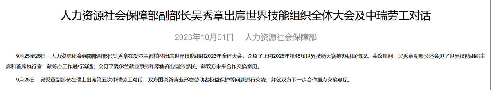
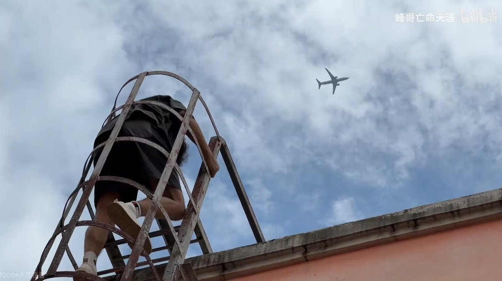

谁将十万横扫三江 北京时间 2023-10-05T22:59:33Z 1709946434680930715 RT @ImAaronChang: 中共说自己是极左
但请问它现在干了哪些左的事？
它干的全是甚至一般右派都做不出来的事
你管一个带头无视劳动法
和资本家站在一起镇压维权工人
对全国普遍996超越八小时工作制坐视不管
对普通人基本没有任何保障的政党叫极左政党？
纯种资本主义国家…   谁将十万横扫三江 北京时间 2023-10-05T21:34:53Z 1709925126136107066 情绪虐待小孩的大人真的太恶了。

在商场的小孩游乐区，有个小女孩玩累了，想从游戏区出来，站在里面说了很多次让抱，大人没回应。

小孩开始哭得很大声，哭喊“抱抱我，抱抱我”，她爸站在栏杆外，用冷漠平静并带讥讽的语气，两手插腰，讲：“你在里面啊，你不是要在里面玩吗？你再多玩会啊，你玩啊，不是你要玩的吗”，不断重复。

小孩开始崩溃了，变成喊：“妈妈抱，妈妈抱”，妈妈没在周围。

小孩爸走到游乐场地出口，女孩在里面追到出口，她爸说：“你自己把鞋穿好，你快点穿鞋，等你什么不哭了再说”，他自己在门口椅子上坐了下来。小孩都要哭崩溃了，妈妈这时急匆匆赶到了，蹲下把她抱在怀里开始安抚情绪，拍背，摸头发，小孩逐渐不哭了。

妈妈在安抚的全程，那个爸，用非常嫌恶的表情就那样坐在旁边，斜着眼睛盯着这对母女，看起来有多大仇多大恨一样。

即使亲眼看到也太夸张，怎么会这样对待孩子，还是公共场合，非常难以理解。   谁将十万横扫三江 北京时间 2023-10-05T11:19:05Z 1709770153972600882 RT @xxLilHy: 啥是老中阴影啊，夏天的时候我和男朋友去了趟天体海滩，天气极好，人特别多，整个海滩上人头涌动，我俩就只能找到最靠近海岸边的一小块地方足够自由伸展，我们就躺下晒太阳，衣服也就脱了垫着了，那原本放在口袋里的东西就得拿出来放进包包，我包又太小，手机装不下就只能…   谁将十万横扫三江 北京时间 2023-10-05T10:31:13Z 1709758108845883594 9月28日，中国人社部副部长吴秀章在瑞士出席第五次中瑞劳工对话时，瑞士方面呼吁中国遵守国际劳工组织劳工权益的最基本原则，中方代表顾左右而言他 https://t.co/hEWVVU3qRL   谁将十万横扫三江 北京时间 2023-10-05T11:32:54Z 1709773633319748033 网上因为迷笛音乐节的事情产生的舆论大致分为两派，其实这是不同的文化和法律观念之间产生的误解罢了。罗马法的物权观念与中国习惯法并不相容，传统的中国人认为，所有权这个概念是流动的，当你对一项财产放弃监督也就自动放弃了对它的所有权，这个所有权发生转移的过程不是偷，叫“拾”。
举例来说，你工地上的钢筋，派了5个小伙子守着，我趁他们睡着了去搬走，这叫偷，中国人具有强烈的道德观念，他们认为偷东西是不应该的。但如果5个小伙子都放假了，人不在工地上，我去把钢筋搬走，这叫拾，是合理合法的物权转移过程。🤗
这种传统有很多正面的意义，比如某些家庭里有智障人士，如果放任她/他们流落街头，那么其他人就可以把他/她们拾走，男的拉去砖窑烧砖，女的用来生孩子，为经济发展或者人口繁衍做出贡献。这种案例在某些特定地区乃至整个中国已经屡见不鲜，反过来又促使智障人士家庭更好的监护他们，提高了他们的福利。
我们在其他地方生活、工作、旅行的时候，要学会尊重不同的文化和风俗，避免因文化沙文主义产生的误解和冲突。（一条二百括号内删，发平台后在群里截图，每一万浏览加五十）   谁将十万横扫三江 北京时间 2023-10-05T09:13:16Z 1709738493088571660 以为登上了高处就能享受更美好的人生，实际上都是别人营造的假象，只有一面虚伪的外墙，内部空无一物。看到天上的飞机在天上飞，就向往着远方能赐予自由，可我们都是被困在笼子里的人 https://t.co/VqMf8pkPpk   