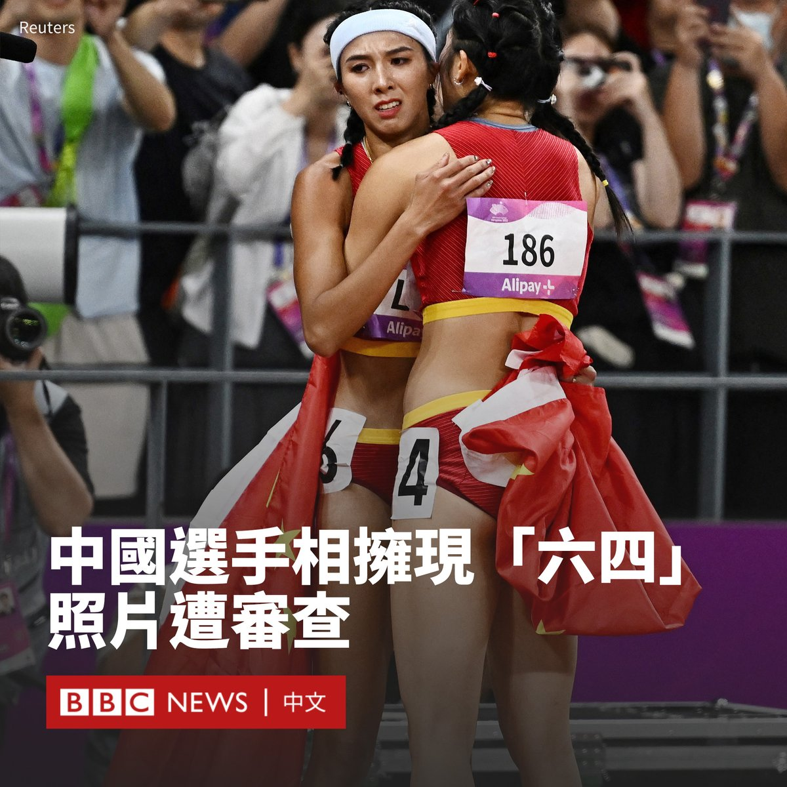
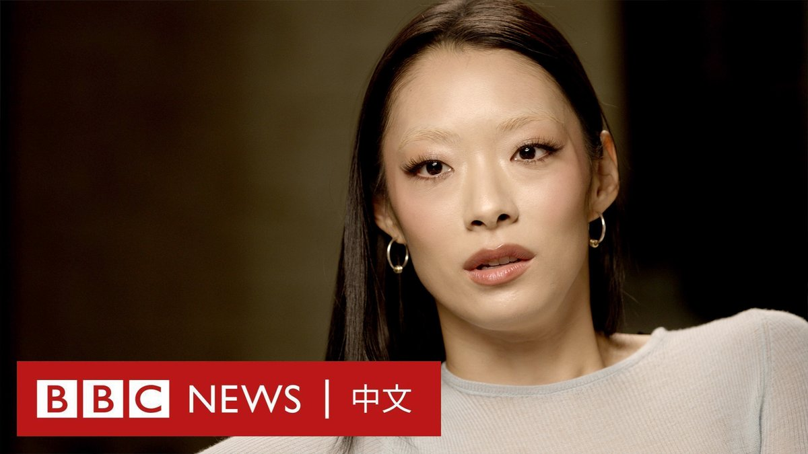

D英国广播公司BBC 北京时间 2023-10-04T17:01:06Z 1709493837083574416 共和党籍的美国国会众议院议长凯文·麦卡锡遭夺权后，公开斥责其政治死敌马特·盖茨“公报私仇”。
https://t.co/cfam7foSv0   D英国广播公司BBC 北京时间 2023-10-04T16:00:02Z 1709478470739505582 在中国杭州举行的亚洲运动会上，两名女选手相拥的照片呈现“六”、“四”数字，怀疑触碰了中国政治的敏感红线，在该国社交媒体上遭到审查。

这两名中国运动员在女子100米跨栏比赛后相拥，林玉薇获得金牌。照片中，她身上挂着六号的跑道号码牌，在旁边的吴燕妮则是四号。

微博上有用户发帖祝贺林玉薇，但有关照片被屏蔽。

该照片似乎并未完全从互联网上清除，至截稿前，部分中国媒体如《南方网》仍展示该照片。

中国在亚洲运动会上迄今已获得近300枚奖牌，赛事将持续到10月8日。

去年，中国最受欢迎的带货主播之一李佳琦，曾在6月3日推销一款造型与坦克相似的多层冰淇淋，其后在社交平台及直播间消失，直到109天后才再度现身淘宝直播间。

1989年的“六四”天安门事件，中国政府动用军队向学生和市民开枪。34年过去，事件在中国仍然是敏感话题，当局经常在互联网上删除相关内容。   D英国广播公司BBC 北京时间 2023-10-04T14:01:05Z 1709448536272638118 BBC记者调查发现，美国时装品牌A&amp;F前总裁（首席执行官）涉嫌利用组织缜密的网络招揽男子进行性爱活动。八名男子告诉BBC他们参加了这些活动，部分人声称遭到剥削或虐待。
https://t.co/pcEeHEdeh1   D英国广播公司BBC 北京时间 2023-10-04T12:01:05Z 1709418335090180458 日英混血流行女歌手泽山璃奈称，她的专辑是关于与一位年长男性的关系。她说：“我从来没有在其他采访中谈过这个话题”，并补充指她可以看到女性、非二元性别者和男同性恋者与她的音乐产生共鸣。 https://t.co/f3AB06Q7NZ   D英国广播公司BBC 北京时间 2023-10-04T10:03:46Z 1709388813909254239 在巴西，300名女性准备起诉制药巨头拜耳公司，指其Essure节育器造成的严重副作用——该产品在2018年已停止使用，但是这并不能解决已经进行手术的女性承受的痛苦。BBC巴西分部记者采访了其中三名女性，了解她们的故事。https://t.co/QiIAO3HPLG   D英国广播公司BBC 北京时间 2023-10-04T00:50:28Z 1709249571833131215 “所有人都在找地方躲，很多人都已经像丧尸电影里一样吓到不行了。”

泰国曼谷市中心知名的商场暹罗百丽宫（Siam Paragon）爆发枪击案，导致至少两人死亡，五人受伤。一名14岁男孩被捕。 https://t.co/yQ1BpxbtcA   