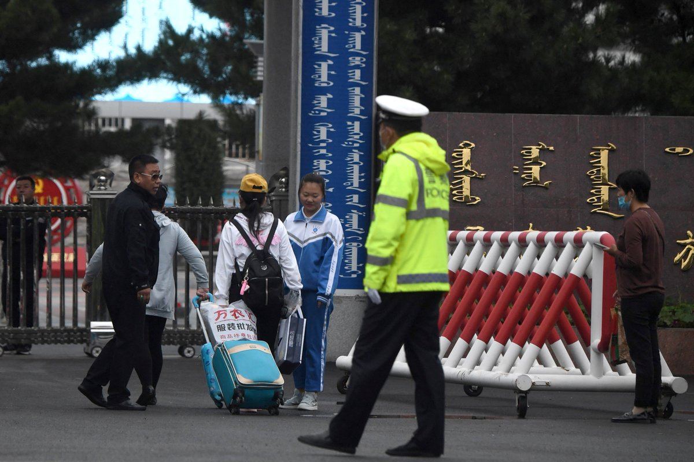
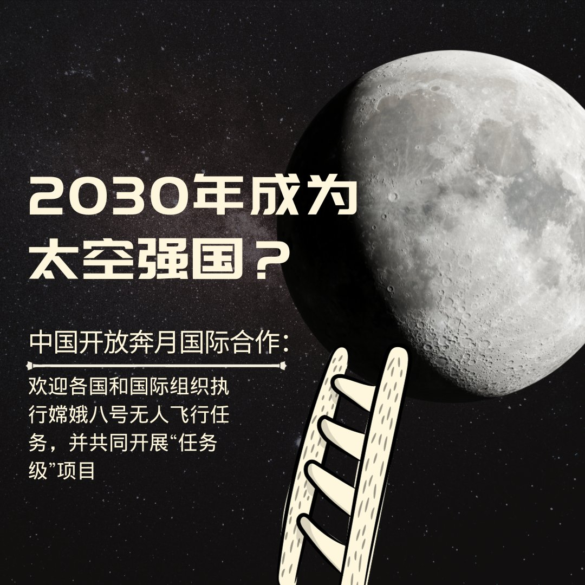
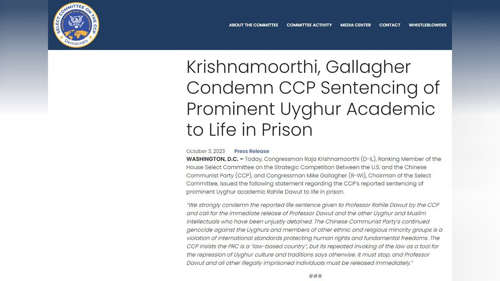
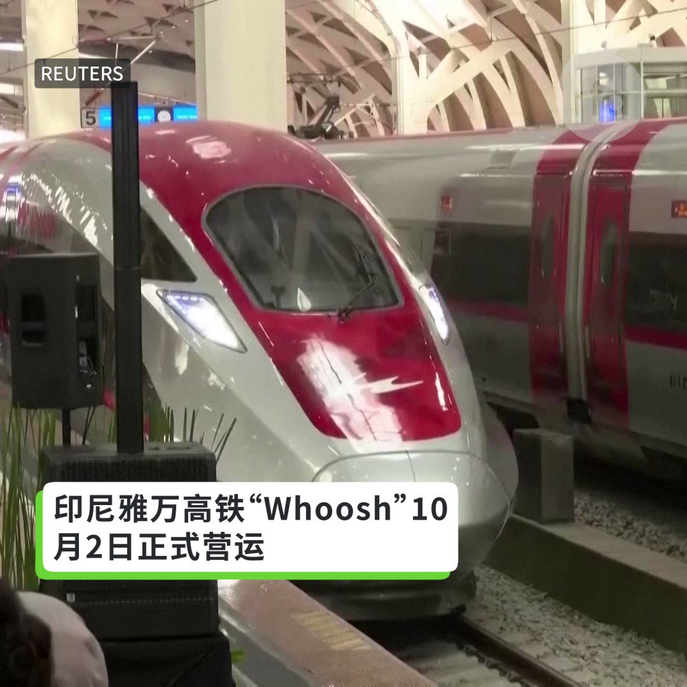

自由亚洲电台 北京时间 2023-10-04T22:14:21Z 1709572669799375010 评论 | 何清涟 @HeQinglian：压垮 #许家印 的"最后一根稻草"
 https://t.co/jeG6tOEGVw   自由亚洲电台 北京时间 2023-10-04T16:56:55Z 1709492787111215223 【内蒙中小学 #蒙古语 教学被削六成】
【高考生明年录取优惠分减】
#内蒙 各中小学今年秋季开学，蒙古族 #母语教学 课程由原来的一周7节削减至3节或更少。幼儿园全部取消母语教学。另外，内蒙古招生考试信息网通报，明后两年，内蒙所有少数民族考生高考录取分，由加送10分改为5分。有教师披露，明年高考取消了蒙语文。
https://t.co/f7ynDGlIUo   自由亚洲电台 北京时间 2023-10-04T13:43:19Z 1709444063873659010 RT @RFA_Chinese: 【#卢思位 被遣返中国 遭关押四川看守所】… https://t.co/N4hO6shcOt   自由亚洲电台 北京时间 2023-10-04T13:44:03Z 1709444248091656487 RT @RFA_Chinese: 欢迎收听和订阅播客【亚太报道（2023-10-3）】 https://t.co/MjLNSvVMqc
#亚运64照片 遭全网封杀 / 《#躺平歌》爆红网络 /  中国多地国企成立 #人武部 / 美国即将实施对华 #芯片 新限制措施 / #恒大…   自由亚洲电台 北京时间 2023-10-04T17:45:36Z 1709505037247107260 台湾国安局长:
习近平整顿火箭军 加强控制军队
中国和公关公司合作发布民调介入台湾大选

台湾明年一月将举行总统大选，台湾国安局长蔡明彦4日指出，中国方面透过假信息、争议信息操作，以及经济和军事施压等多面向介入大选，并指出“中共也跟一些民调公关公司在合作”，发布民调也可能对选举产生影响。此外，台湾立委示警，解放军机以民航机作为掩护，在民航机下飞行，雷达无法侦测。   自由亚洲电台 北京时间 2023-10-04T10:32:01Z 1709395922826776741 【#变态辣椒：陷入赤字的铁路】⁣
中国国家主席习近平的"#一带一路“倡议已进入第十年，由这一倡议所支持的工程项目已给 #老挝 带来巨大的变化。其中最引人注意的是价值五十九亿美元的 #中老铁路，这条铁路把内陆国老挝与相邻的大国中国相连接，并带来了就业机会。但是批评人士表示，这条铁路与中国的其它主要交通基础设施以及水利大坝已使老挝债台高筑，而大部分老挝人正面临高通胀与货币贬值的黯淡前景。   自由亚洲电台 北京时间 2023-10-04T13:45:00Z 1709444489423564802 RT @RFA_Chinese: 东南亚第一条高铁、印尼雅万高铁“Whoosh”10月2日开跑。这个几经延宕、耗资数十亿美元的高铁项目面临许多问题，包括成本增加、土地采购问题等。据中国官媒报道，印尼总统佐科计划在未来邀习近平坐雅万高铁。 https://t.co/3DKEnge…   自由亚洲电台 北京时间 2023-10-04T10:49:57Z 1709400437034827938 #事实查核 | 火遍中文互联网的三个"#纽约水灾"假视频
 https://t.co/oGakGXBRv9   自由亚洲电台 北京时间 2023-10-04T14:23:23Z 1709454146305204644 RT @RFA_Chinese: 于无声处听惊雷  （路透社图片）
#林雨薇 #吴艳妮 https://t.co/X9Cc0Hd0dm   自由亚洲电台 北京时间 2023-10-04T11:23:26Z 1709408862745616852 【#卢思位 被遣返中国 遭关押四川看守所】
中国人权律师卢思位今年七月遭老挝警方逮捕，日前已经被遣返回中国。台北时间4日卢思位的妻子张春晓向本台证实，卢思位目前人被送往四川新都看守所。张春晓表示，卢思位在中国的家属接获看守所通知，让人送衣服、药品以及金钱过去，卢思位患有严重的皮肤病，已经缺药超过两个月。在通话过程中，所方人员完全未告知家属，卢思位何时遣返回中国，又是以何种罪名遭拘留。而家人是否能探视，能否聘用律师？仍是未知数。报道：https://t.co/9tPJL5XDl1   自由亚洲电台 北京时间 2023-10-04T06:25:00Z 1709333758657081463 RT @RFA_Chinese: 【中国《#躺平歌》爆红】
有网友发问，“这个是谁写的词？” 留言有人回应，“是不是说到心坎儿上？”还有人留言，“是谁把人变成这样的？”
不过，也有网友认为，“不上进的人写不出这么好的歌”。 https://t.co/cJoM73v36i   自由亚洲电台 北京时间 2023-10-04T09:12:33Z 1709375922938478908 欢迎收听和订阅播客【亚太报道（2023-10-3）】 https://t.co/MjLNSvVMqc
#亚运64照片 遭全网封杀 / 《#躺平歌》爆红网络 /  中国多地国企成立 #人武部 / 美国即将实施对华 #芯片 新限制措施 / #恒大 金融危机发酵 https://t.co/iEMS9jIlTj   自由亚洲电台 北京时间 2023-10-04T02:30:24Z 1709274718606684255 第三届"#一带一路"国际合作高峰论坛也即将在北京举行。近年来，这项投资近万亿美元的庞大计划受到越来越多国家的批评和抵制，同时中国经济在疫情之后持续疲软，要继续维持也日趋困难。那么，"一带一路"将何去何从呢？本台记者凯迪 @KittyWang5 报道 

 https://t.co/r2pxmI8clY   自由亚洲电台 北京时间 2023-10-04T03:36:12Z 1709291279400792136 【中国《#躺平歌》爆红】
有网友发问，“这个是谁写的词？” 留言有人回应，“是不是说到心坎儿上？”还有人留言，“是谁把人变成这样的？”
不过，也有网友认为，“不上进的人写不出这么好的歌”。 https://t.co/cJoM73v36i   自由亚洲电台 北京时间 2023-10-04T04:20:56Z 1709302535272747097 #美国参议院 即将在下周组成一个跨党派代表团访问北京，议员们希望能与中国国家主席 #习近平 会面。那么，美方议员会与中方探讨哪些议题？此行又会对美中关系带来什么影响？

 https://t.co/ce2j3ctMqF   自由亚洲电台 北京时间 2023-10-04T04:23:16Z 1709303121460023629 【#您怎么看】
据路透社报道，中国国家航天局（CNSA）周一在阿塞拜疆巴库举行的第 74 届国际宇航大会上表示，中国欢迎各国和国际组织执行嫦娥八号无人飞行任务，并共同开展“任务级”项目。
所谓“任务级”项目，意味着中国及其国际合作伙伴可以发射和运行其航天器，进行航天器与航天器的“互动”，并共同探索月球表面。有意者须在 12 月 31 日之前向 CNSA 提交意向书。提案的最终选择将于 2024 年 9 月进行。
目前，美国法律禁止 NASA 直接或间接与中国合作。
中国的目标是到2030年将宇航员送上月球。
您是否看好中国开放奔月国际合作？您认为，2030年，中国能否实现太空强国的目标？   自由亚洲电台 北京时间 2023-10-04T04:35:19Z 1709306156835914215 美国众议院与中共战略竞争特设委员会主席麦克·加拉格尔（Rep. Mike Gallagher, R-WI），与伊利诺伊州民主党众议员拉贾·克利胥纳莫提（Subramanian Raja Krishnamoorthi），3日就著名维吾尔族学者达吾提（Rahile Dawut）被中国政府判处终身监禁发表声明。
声明说，“我们强烈谴责中共对达吾提教授判处无期徒刑，并呼吁立即释放达吾提教授以及其他被不公正拘留的维吾尔族和穆斯林知识分子。中国共产党对维吾尔族以及其他民族和宗教少数群体成员的持续种族灭绝，违反了保护人权和基本自由的国际标准。 中共坚称中华人民共和国是一个“法治国家”，但其一再援引法律作为镇压维吾尔文化和传统的工具的作为，却表明事实并非如此。 达吾提教授和所有其他被非法监禁的人必须立即释放。”   自由亚洲电台 北京时间 2023-10-04T05:00:01Z 1709312373486673959 越南一名人妻2018年遭拐卖至中国当新娘，直到今年9月中旬才被救出。而 #中国男女性别失衡 严重，对“#越南新娘”的需求尤其旺盛。
 https://t.co/yqO2hAqe0D   自由亚洲电台 北京时间 2023-10-04T01:10:48Z 1709254686526894188 #黄宏生 此时“公布真相”，助长 #许家印"人民公敌"之说，是要转移矛盾，替政府甩锅？

 https://t.co/eB1xHk8rLE   自由亚洲电台 北京时间 2023-10-04T03:10:56Z 1709284918424203273 中国 #恒大 集团财务危机让加拿大著名的魁北克蒙特贝罗城堡酒店（Chateau Montebello）蒙上阴影。恒大于2014年买下酒店，但随着财务紧张而缺乏修缮保护，令这家近百年历史的酒店出现残破迹象。

 https://t.co/LqY9FT5JWZ   自由亚洲电台 北京时间 2023-10-04T03:43:39Z 1709293153944302079 东南亚第一条高铁、印尼雅万高铁“Whoosh”10月2日开跑。这个几经延宕、耗资数十亿美元的高铁项目面临许多问题，包括成本增加、土地采购问题等。据中国官媒报道，印尼总统佐科计划在未来邀习近平坐雅万高铁。 https://t.co/3DKEngecry   自由亚洲电台 北京时间 2023-10-04T00:52:23Z 1709250054098211123 于无声处听惊雷  （路透社图片）
#林雨薇 #吴艳妮 https://t.co/X9Cc0Hd0dm   自由亚洲电台 北京时间 2023-10-04T01:40:53Z 1709262259716059574 继多年前，自称“金融界人士”#吴小平 发文“建议中国私营经济退出”，引发热议之后。10月1日，被称为中国毛派“领军人物”的 #张宏良 在左派网站复兴网发文,呼吁立刻冻结私企财产, 张宏良因此再度遭到炮轰，网民要求张宏良“住嘴”。 https://t.co/bnXLlJjkJN   自由亚洲电台 北京时间 2023-10-04T00:10:22Z 1709239477452054940 【看到64就害怕 “#四个自信”在哪里？】
龚与剑说：“一开始，墙内小孩子议论是不是跑步穿的裤子露出的线条，有色情方面、保护方面的问题，没有想到是 #六四，在墙内引起一番探讨。现在打马赛克也阻止不了民众寻根究底，干脆全网封杀，只有海外才看得到。”
#林雨薇 #吴艳妮 https://t.co/sheRayb85r   