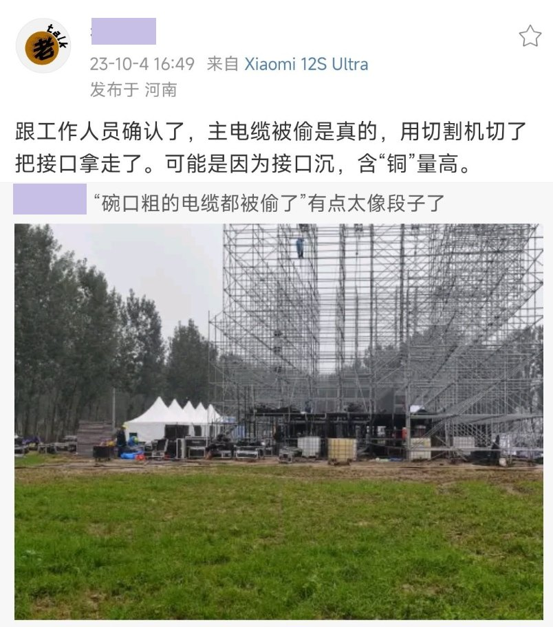
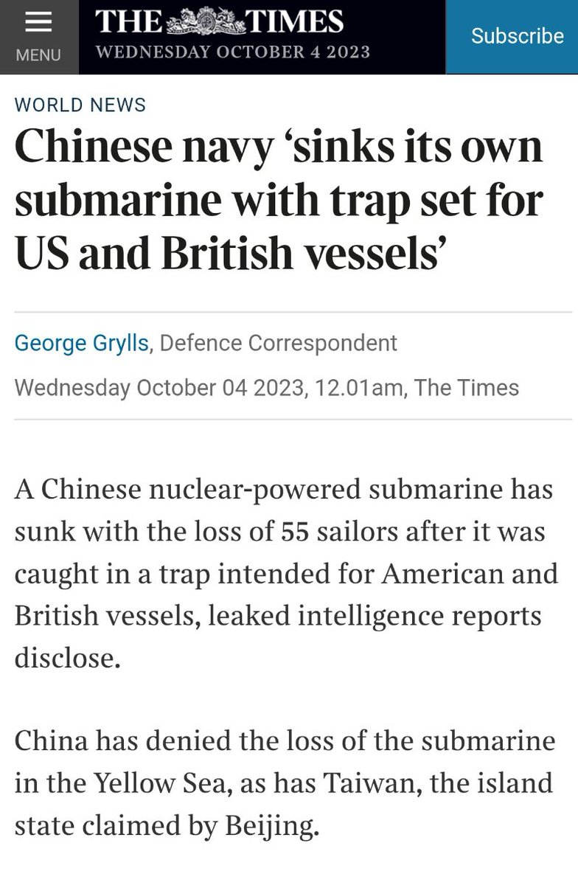

谁将十万横扫三江 北京时间 2023-10-04T18:41:07Z 1709519005957136686 RT @whyyoutouzhele: 9月27日，陕西榆林市榆林中学爆发学生抗议，要求放假。 https://t.co/mAYKLWUDtv   谁将十万横扫三江 北京时间 2023-10-04T22:12:10Z 1709572121968726516 RT @lilaoshizuikeai: 快手真的是中国最下沉社群
我记得五六年前就有人写过一篇《在快手见证魔幻中国》，讲述农村的底层人如何在快手上展现自己的生活，亦或是呈现美恐“畸形秀”式的表演来维生。
总之，时至今日，一切都没有变过。   谁将十万横扫三江 北京时间 2023-10-04T18:41:11Z 1709519025217372269 RT @whyyoutouzhele: 南阳迷笛音乐节，现在据称连主办方的电缆也被乡亲们零元购了 https://t.co/6VItLrawKj   谁将十万横扫三江 北京时间 2023-10-04T15:52:33Z 1709476588180635753 午夜街头，偶遇挂壁大神，中国的流浪汉 https://t.co/cgNyMkrrIZ   谁将十万横扫三江 北京时间 2023-10-04T16:28:34Z 1709485649890537849 RT @whyyoutouzhele: 10月4日，英国泰晤士报和每日邮报报导称，8月21日，一艘中国潜艇在黄海执行任务时发生事故，导致55名船员死亡。
此前这个消息在中文推特圈流传很久，但是被北京方面和台湾方面否认。 https://t.co/cwXr0O4xpU   谁将十万横扫三江 北京时间 2023-10-04T15:56:46Z 1709477646684524672 这都是组织关照😇没有组织你哪里嫁的出去   谁将十万横扫三江 北京时间 2023-10-04T16:10:33Z 1709481117760524695 41岁程序员失业1年，投简历500份被拒，突然崩溃哭了 https://t.co/iWsR2dkf0q   