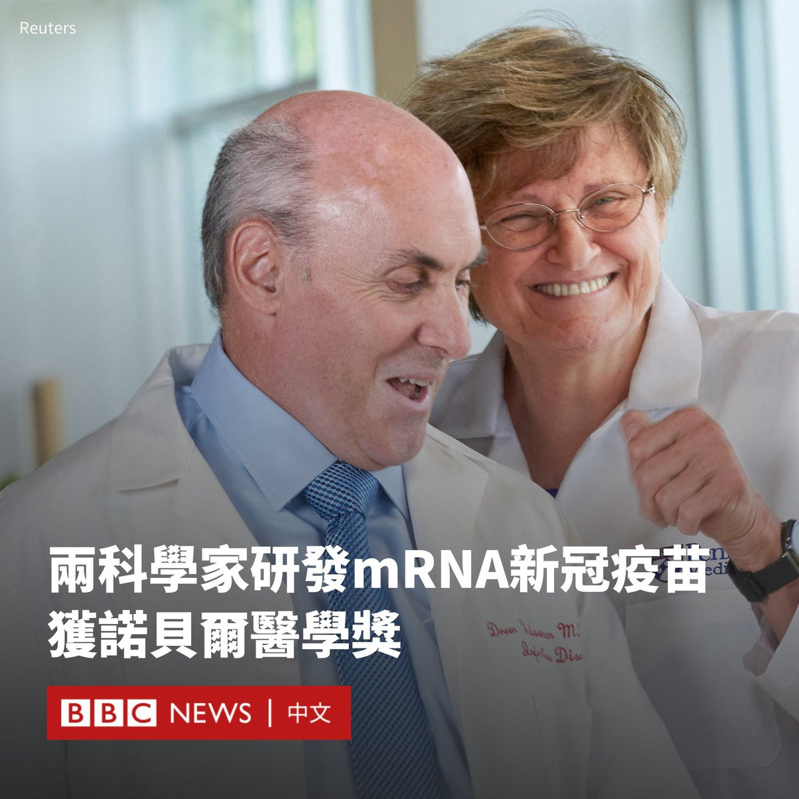
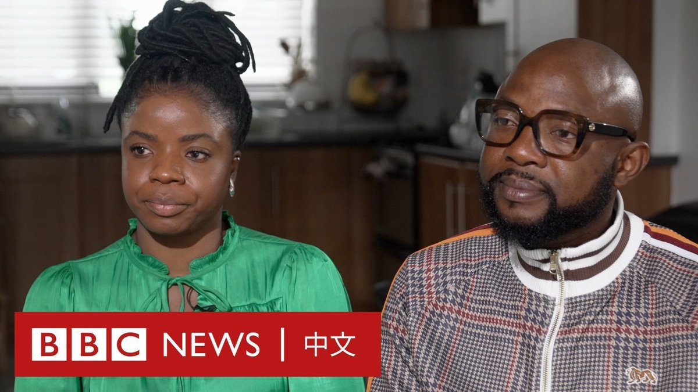

D英国广播公司BBC 北京时间 2023-10-03T16:23:55Z 1709122092996919353 2023诺贝尔医学奖已经揭晓，匈牙利裔美籍生物化学家卡里科（Katalin Kariko）及美国医学家魏斯曼（Drew Weissman）共同分享这一奖项，他们开发了mRNA技术，以应用在新冠疫苗。

这项技术在疫情期间还处于实验阶段，但现在已经被全球数百万人使用，以保护他们免受严重的Covid-19病毒感染。

相同的mRNA技术现在也正在研究用于其他疾病，包括癌症。

诺贝尔委员会表示：“在现代人类健康面临的最大威胁之一中，获奖者以史无前例的速度研发疫苗，应对新冠疫情。”

在新冠疫情期间，辉瑞(Pfizer)及莫德纳(Moderna)疫苗都基于mRNA技术。

卡里科教授和魏斯曼教授在90年代初在美国宾夕法尼亚大学工作时相识，当时他们对mRNA的兴趣被视为科学上的僻壤。

魏斯曼教授告诉BBC Newshour节目：“我去开会介绍我正在研究的内容，人们会看着我说：‘嗯，很好，但你为什么不把时间用在一些有价值的事情上呢，mRNA永远不会奏效。’但是卡里科和我一直在努力推动。”

当被问及他们第一次听到自己获奖消息时的反应时，卡里科教授说她最初以为这只是个“玩笑”。

同样地，魏斯曼教授有点怀疑是否有反疫苗者在捉弄他们，并说：“但当我们看到公告时，我们知道这是真实的，那种感觉真是太棒了”。   D英国广播公司BBC 北京时间 2023-10-03T18:56:31Z 1709160493901111432 【10:52GMT 更新】泰国警方称，曼谷市中心暹罗百丽宫购物广场（ Siam Paragon ）。发生枪击事件。泰国应急部门表示，枪手已经被逮捕，事件造成三人死亡以及三人受伤。

当地居民在社交媒体上称发生了枪击事件，当局尚未对此发表评论。

社交媒体上的视频显示，购物者纷纷跑出购物中心，据说购物中心已经关闭了所有入口。

网上还有一段疑似从购物中心内部拍摄的视频，可以清楚地听到购物中心内传出四声类似枪声的巨响。

目击者还在网上称，他们已经躲进了商店和洗手间。

据当地媒体报道，附近的暹罗（Siam）捷运站已关闭。   D英国广播公司BBC 北京时间 2023-10-03T19:01:08Z 1709161657971232968 美国前总统特朗普周一（10月2日）就涉嫌虚报资产的民事诉讼案在纽约曼哈顿法院首次出庭，他被控诈骗罪，涉谎报资产而获利逾一亿美元，特朗普形容案件是“政治迫害”和“骗局”。

此案的审讯预计要持续至12月初，期间预计将会有150多人出庭作证。 https://t.co/8klJO1NPyU   D英国广播公司BBC 北京时间 2023-10-03T17:01:04Z 1709131439864738074 一年多前承诺撤出俄罗斯的汉堡王，至今还在照常营业。有学者批评：“在普京入侵乌克兰的18个月内，他们继续在俄罗斯做生意，这就是在协助普京政权。”https://t.co/rWzKNFob7z   D英国广播公司BBC 北京时间 2023-10-03T15:11:47Z 1709103939486896201 最近出现的一段视频显示，去年在都柏林举办的体操赛事颁奖礼上，一名官员无视了一名黑人女孩体操运动员，并涉嫌对其进行种族主义对待。她的母亲说，当时看到事件发生的过程“令人发指”。爱尔兰体操协会对“造成的不愉快 ”表示歉意。 https://t.co/wV1HnPXy5n   D英国广播公司BBC 北京时间 2023-10-03T13:01:08Z 1709071062216962073 马尔代夫9月30日举行总统选举决选，亲中派在野党候选人穆伊祖（Mohamed Muizzu）获胜当选，击败亲印派现任总统萨利赫（Ibrahim Mohamed Solih）。

这预示着这个印度洋岛国的外交政策，将从“印度优先”再次转为“向中国靠拢”。 https://t.co/nMBZ2RwFuM   D英国广播公司BBC 北京时间 2023-10-03T14:01:05Z 1709086145957511311 中国政府在2020年对澳大利亚大麦和葡萄酒征收高额的反倾销关税，令精酿啤酒行业在过去三年面临挑战。如今贸易紧张局势缓和，有助于降低中国所有啤酒酿造商的成本。 https://t.co/BLABRlSD7z   D英国广播公司BBC 北京时间 2023-10-03T11:51:25Z 1709053514578817537 2023诺贝尔医学奖已经揭晓，匈牙利裔美籍生技科学家卡里科（Katalin Kariko）及美国医学家魏斯曼（Drew Weissman）共同分享这一奖项，他们开发了mRNA技术，以应用在新冠疫苗。

这项技术在疫情期间还处于实验阶段，但现在已经被全球数百万人使用，以保护他们免受严重的 Covid-19 病毒感染。

相同的mRNA技术现在也正在研究用于其他疾病，包括癌症。

诺贝尔委员会表示：“在现代人类健康面临的最大威胁之一中，获奖者以史无前例的速度研发疫苗，应对新冠疫情。”

在新冠疫情期间，辉瑞(Pfizer)及莫德纳(Moderna)疫苗都基于mRNA技术。

卡里科教授和魏斯曼教授在90年代初在美国宾夕法尼亚大学工作时相识，当时他们对mRNA的兴趣被视为科学上的僻壤。

魏斯曼教授告诉BBC Newshour节目：“我去开会介绍我正在研究的内容，人们会看着我说：‘嗯，很好，但你为什么不把时间用在一些有价值的事情上呢，mRNA永远不会奏效。’但是卡里科和我一直在努力推动。”

当被问及他们第一次听到自己获奖消息时的反应时，卡里科教授说她最初以为这只是个“玩笑”。

同样地，魏斯曼教授有点怀疑是否有反疫苗者在捉弄他们，并说：“但当我们看到公告时，我们知道这是真实的，那种感觉真是太棒了”。   