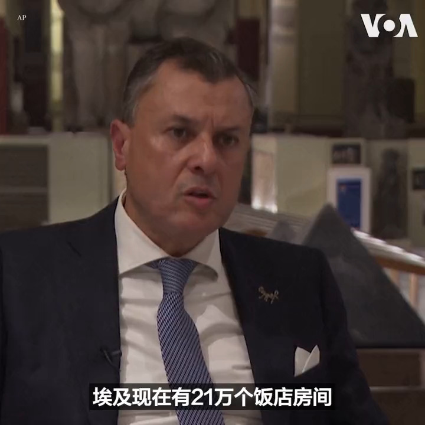
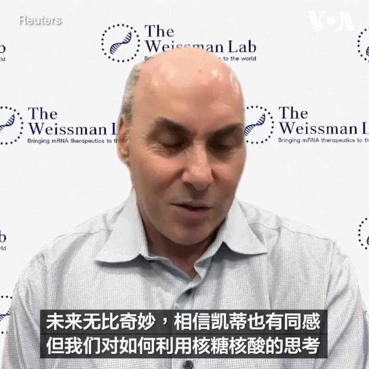

美国之音中文网 北京时间 2023-10-03T08:13:10Z 1708998592827113907 塞尔维亚在美国表示关切后减少靠近科索沃的驻军 https://t.co/fkDVSgMgyR   美国之音中文网 北京时间 2023-10-03T09:20:05Z 1709015433414869310 联合国安理会授权国际部队支持海地警方 中俄弃权 https://t.co/ihW0JedRYy   美国之音中文网 北京时间 2023-10-03T09:51:10Z 1709023252532887924 被中国监禁的维吾尔族学者维热依拉·达吾提的女儿呼吁全球学者支持 https://t.co/kly07DYLpZ   美国之音中文网 北京时间 2023-10-03T10:03:35Z 1709026379571061054 中国采取措施，将加强智能汽车创新 https://t.co/2Pz57kcS0U   美国之音中文网 北京时间 2023-10-03T01:19:34Z 1708894506622603443 因mRNA研究和应用突破性发现 两美国科学家获诺贝尔生理学或医学奖 https://t.co/c0rtZe5oJY   美国之音中文网 北京时间 2023-10-03T04:23:20Z 1708940750250037406 意大利即将退出一带一路，但是中国仍在推进一带一路项目，只是避谈其名，新项目在地方政府和大学悄然展开。批评人士指意大利为退一带一路避免惹怒中国而做出让步。留学生批评意大学与中国大学联合培养人权专业博士生。https://t.co/Nplq9c3IA9 https://t.co/g13BBvRvZr   美国之音中文网 北京时间 2023-10-03T07:00:01Z 1708980180532785234 习近平在国庆74周年招待会上警示，中国“脚下的路不会是一马平川”。过去国家主席只在“逢五逢十”的扩大庆祝会上才讲话，一般年份由总理讲话。习近平打破惯例为哪桩？有哪些内忧外患？《参考消息》发表文章《北京正成为世界的思想首都》，信吗？中国出了什么思想？请看10月3号的【#时事大家谈】并留言。 https://t.co/ZDTA0KKdfl   美国之音中文网 北京时间 2023-10-03T07:31:35Z 1708988128029987115 世界卫生组织宣布推荐第二种疟疾疫苗 https://t.co/CL7SSFlM0l   美国之音中文网 北京时间 2023-10-03T07:31:37Z 1708988136230195697 欧盟在基辅举行外长会并宣布2024年逾50亿美元援乌提案 https://t.co/Rl2jDG4CiT   美国之音中文网 北京时间 2023-10-03T07:58:07Z 1708994802564653185 特朗普纽约商业欺诈案开庭,前总统抨击法官和检察官 https://t.co/aqlkoKUmGk   美国之音中文网 北京时间 2023-10-03T08:13:12Z 1708998601157038510 乌克兰官员呼吁使用更具性价比的武器反击俄罗斯无人机 https://t.co/Yk1fAUyKk7   美国之音中文网 北京时间 2023-10-03T01:17:32Z 1708893994900492474 林培瑞：“不要谈政治！” 中国留学生海外求学的障碍
https://t.co/UOsdoXMlU8   美国之音中文网 北京时间 2023-10-03T03:46:08Z 1708931389159264626 500人伦敦示威 抗议中共建政74周年 https://t.co/3fq05vicoq   美国之音中文网 北京时间 2023-10-03T04:44:33Z 1708946089808916651 消息人士：罗马不会限制中国在意大利国家电网公司的存在 https://t.co/m2hUKBrHnM   美国之音中文网 北京时间 2023-10-03T04:58:34Z 1708949618279825411 马尔代夫新总统会再次拥抱一带一路吗？ https://t.co/pDEpr2RSJ2   美国之音中文网 北京时间 2023-10-03T05:13:05Z 1708953272277520474 菲律宾与盟国在亚太紧张局势中启动海军演习 https://t.co/QIrvXbDMUw   美国之音中文网 北京时间 2023-10-03T01:04:12Z 1708890639172034905 埃及旅游和文物部长艾哈迈德·伊萨近日接受美联社采访时说，埃及今后5年将努力推动旅游业，希望到2028年游客增加到3千万。伊萨说，埃及2023年头8个月的游客数量为1千万，很有可能在年底达到1千5百万的目标。旅游业是埃及外汇的主要来源，去年埃及的旅游业收入达到107亿美元，2021年为50亿。 https://t.co/YBrE43V0I1   美国之音中文网 北京时间 2023-10-03T02:24:33Z 1708910860868223259 台湾总统参选人柯文哲访问旧金山，推动台湾产业与硅谷接轨 https://t.co/w4PzjzcBHX   美国之音中文网 北京时间 2023-10-03T02:42:34Z 1708915393186955413 人权活动人士日内瓦揭批中国女权真实现状 https://t.co/mSXlk1WKfE   美国之音中文网 北京时间 2023-10-03T03:56:45Z 1708934063992508819 瑞典卡罗林斯卡学院10月2日宣布，将2023年诺贝尔生理学或医学奖授予制药公司BioNTech高级副总裁卡塔林·卡里科和美国宾夕法尼亚大学佩雷尔曼医学院教授德鲁·魏斯曼，以表彰他们在信使核糖核酸（mRNA）研究上的突破性发现。两位科学家当天在接受媒体采访时分享了获奖后的想法。 https://t.co/ZmU0VAUmsl   美国之音中文网 北京时间 2023-10-03T03:58:06Z 1708934402645073932 “一带一路”迈入十周年: 东南亚是大幅受益或反招不良后果？(2) https://t.co/NA9QWpT9FG   美国之音中文网 北京时间 2023-10-03T04:14:34Z 1708938547397550499 一带一路在意大利: 名亡实存？ https://t.co/DrXeyGa6DX   美国之音中文网 北京时间 2023-10-03T01:08:07Z 1708891622258487686 美国在台协会台北办事处处长：维持现状有利于台湾和印太地区 https://t.co/tagY4KuBaz   美国之音中文网 北京时间 2023-10-03T01:51:16Z 1708902482905125228 纳粹德国领导人希特勒位于奥地利布劳瑙小镇出生地的改建工程于10月2日正式启动。奥地利内政部决定将这里建成一个警察局。此前，如何处理希特勒故居的问题在奥地利官方和民间经过了多年的辩论。奥地利政府在2019年宣布将这位纳粹独裁者的出生地建成警察局。 https://t.co/XAwOKUqPdU   