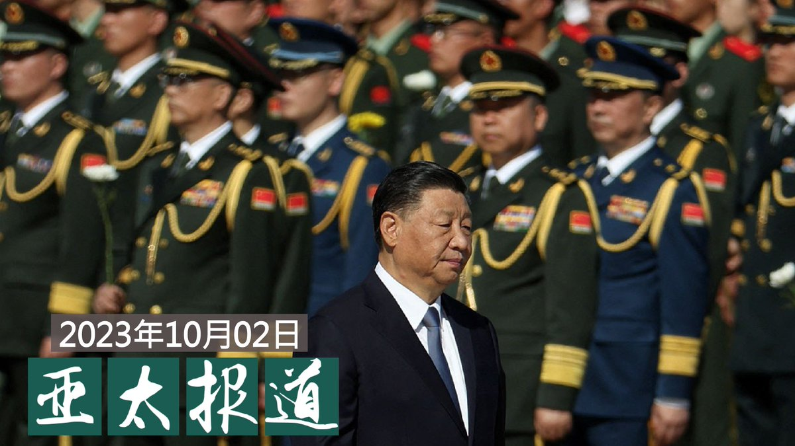
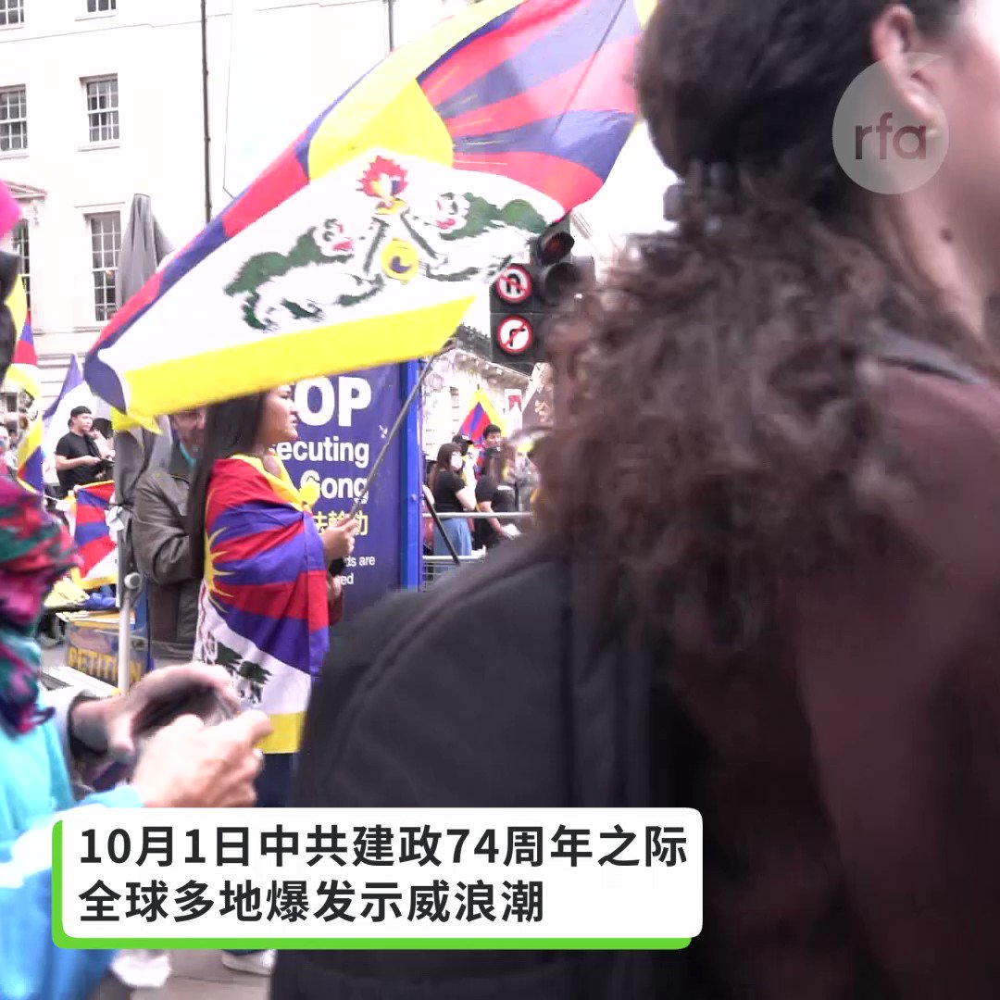
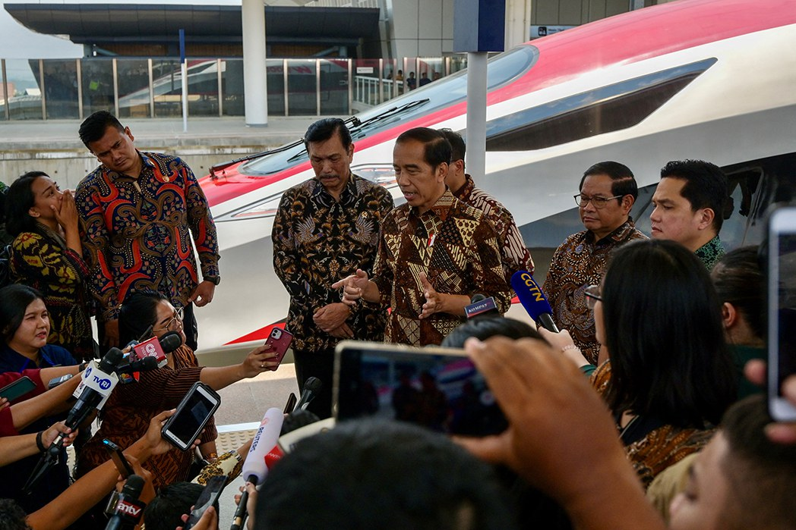

自由亚洲电台 北京时间 2023-10-03T07:00:08Z 1708980211688308883 欢迎收听和订阅播客【亚太报道（2023-10-2）】
 https://t.co/MjLNSvVMqc
#习近平 借 #国庆讲话 立威 / 美、英、加、台举行 #十一 抗议游行 / #恒大 受害家庭达数百万 / #中国制造业采购经理指数 出台 https://t.co/zDzKaM4bQH   自由亚洲电台 北京时间 2023-10-03T04:58:26Z 1708949583341207601 10月2日，#美国 与 #菲律宾 两国海军的“齐心协力”（Sama Sama）军演在马尼拉所处吕宋岛南部展开。综合国际媒体的报道，此次 #美菲军演 涉及超过一千八百名士兵，英国、加拿大和日本将派遣舰艇参与演习，澳大利亚、法国参与沙盘推演，印尼和新西兰则派出军事专家观摩演练。

 https://t.co/sIH5qFOLSb   自由亚洲电台 北京时间 2023-10-03T07:30:01Z 1708987731748221028 #中国人权律师团特稿 | 中国人权律师与 #法轮功 反迫害
 https://t.co/7gr6Ipn7LL   自由亚洲电台 北京时间 2023-10-03T00:37:57Z 1708884033076359596 江苏常州一对母女多年来因政府涉嫌违法征地多次 #上访。近日她们在北京先后遭到 #截访，其中母亲被伪装成医护人员的地方 #维稳 人员带走。女儿被拘留期间一度绝食抗议。

 https://t.co/DMnS3ucs7p   自由亚洲电台 北京时间 2023-10-03T05:12:20Z 1708953081881477555 国际原子能机构总干事格罗西在会上强调，该机构已经在 #福岛第一核电站 设立办公室，并将继续实施独立监测。格罗西还在社交媒体帐号上特别点名中国，重申 #国际原子能机构 将与中国国家原子能机构共同努力，“以解决中方在日本福岛第一核电站排水问题上存在的关切”。

 https://t.co/Vz2oh5Itfc   自由亚洲电台 北京时间 2023-10-03T05:30:01Z 1708957531408908721 #事实查核 | #中国海外警察站 是"反华组织"恶意编造的谣言吗？
 https://t.co/T9EYVQiiuy   自由亚洲电台 北京时间 2023-10-03T06:27:51Z 1708972089523482999 #中国人权律师团特稿 | 致敬反暴政之战的英雄--中国维权律师
 https://t.co/EiqBjTkYWP   自由亚洲电台 北京时间 2023-10-03T06:33:20Z 1708973467255619720 10月1日中共建政74周年之际，全球多地爆发示威浪潮，在英国伦敦，伦敦藏族、维吾尔族、蒙古族及港人举办联合抗议游行，示威者从市中心特拉法加广场出发，穿越唐人街等闹市地区。（记者 /吕熙 摄影/石头） https://t.co/csQ3ln8M5M   自由亚洲电台 北京时间 2023-10-03T07:45:46Z 1708991697928241644 【#您怎么看】日本经济新闻社近日汇总的“100名日本企业家问卷调查”中，关于今后在华业务的风险，63.8%受访者认为风险上升，30.6%认为风险不变，0.8% 认为风险下降。 认为“上升” 的回答超过日本受访企业家的6成。您认为，日本企业家是否太悲观了？ https://t.co/9YSrqmltIm   自由亚洲电台 北京时间 2023-10-03T03:13:38Z 1708923211117932778 #读者广场 | #习近平 把人民放心上了吗？
 https://t.co/DGSSN4BCM3   自由亚洲电台 北京时间 2023-10-03T04:59:20Z 1708949811700158625 台湾民众党主席及总统参选人 #柯文哲 于10月1日到访美国加州湾区，出席了旧金山台北姐妹市委员会暨矽谷（硅谷）科技业界举办的欢迎餐会活动。在活动中，柯文哲与多位硅谷业界人士举行闭门交流和午餐会，并展开了座谈。

 https://t.co/OMs8GDyePY   自由亚洲电台 北京时间 2023-10-03T05:20:13Z 1708955067087495368 今年 #诺贝尔和平奖 最热门人选是乌克兰总统 #泽连斯基， 其次则是俄罗斯反对派领袖纳瓦尔尼和来自中国新疆的维族经济学者及异议人士伊力哈木·#土赫提。 https://t.co/0DfYIkGzre   自由亚洲电台 北京时间 2023-10-03T05:44:26Z 1708961162514374708 专栏 | #夜话中南海：#邓小平 和 #毛泽东 家庭的冤冤相报
 https://t.co/zEZU2Smc6J   自由亚洲电台 北京时间 2023-10-03T02:48:16Z 1708916825772392774 在今年十月一日中国 #国庆 日到来之际，美国加州湾区和洛杉矶的一些民众举行了游行示威，表达对中国当局的抗议。#洛杉矶 的游行活动组织者表示，今年他们没有在街头遇到反对者。

 https://t.co/NZhHdWnAo6   自由亚洲电台 北京时间 2023-10-03T03:41:04Z 1708930115638526424 今年十月一日是中共建政74周年，加拿大多伦多和温哥华分别有大型集会游行等活动。来自不同族裔社区的人士在中国领事馆前抗议中国持续镇压人权民主，并对加拿大进行干预渗透。

 https://t.co/Nt3hXpAm61   自由亚洲电台 北京时间 2023-10-03T01:15:25Z 1708893461938569680 【#雅万高铁 开通  印尼人真的需要它吗？】
印度尼西亚总统佐科·维多多周一（2日）为耗资 73 亿美元的雅万高速铁路揭幕，该铁路连接印尼首都雅加达和万隆市，全长 142 公里。这是中国支持的“#一带一路” 项目，也是佐科的旗舰基础设施项目之一，但一直存在土地采购、疫情相关的工期延误和成本膨胀等问题，备受争议。
综合路透社和美联社的报道，这条周一启动的名为“Whoosh”的高速铁路，于2016年破土动工，原本预计2019 年开始运营，但实际完工远远落后于此。工程原计划耗资43 亿美元，实际金额却激增至73 亿美元， 其中75%的资金来自中国国家开发银行的贷款，并由中国和印尼合资的印尼-中国高速铁路公司（PT KCIC）承建。
雅加达非政府组织交通研究所执行主任赫兰邦（Deddy Herlambang）表示，公众并不真的需要雅万高铁，因为两座城市之间已有许多其他交通方式。高铁无法取代，因为人们更愿意使用更便宜的方式进行短程旅行。他也对此铁路项目能否在30年内营利感到悲观。   自由亚洲电台 北京时间 2023-10-03T02:04:43Z 1708905866173530470 耗时七年的台湾自造潜艇“#海鲲号”在 9月28日亮相后，有台媒报道，项目召集人 #黄曙光 指责有立委针对潜舰国造“一直在搞”，媒体追问所指何人？他只说，“你们自己去猜”。此话引发舆论关注。

 https://t.co/2hqmUoFoyQ   自由亚洲电台 北京时间 2023-10-03T00:20:53Z 1708879737534497017 【#恒大 千个党支部管不了腐败】恒大拥有38个党委、1133个党支部，管理12075名党员，实现基层党组织覆盖率100%。#许家印 担任集团党委书记。 https://t.co/wWnC9A5NQn   