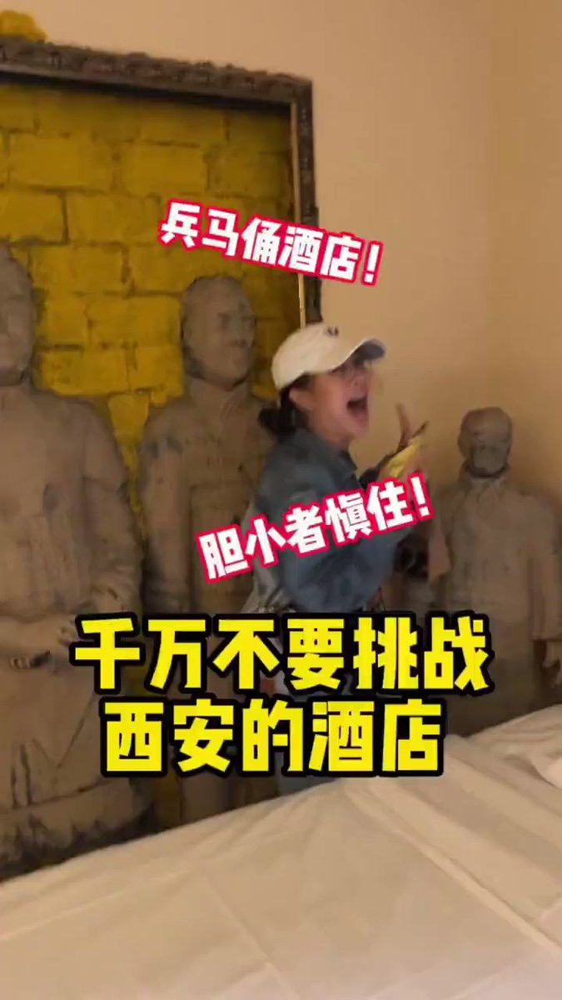
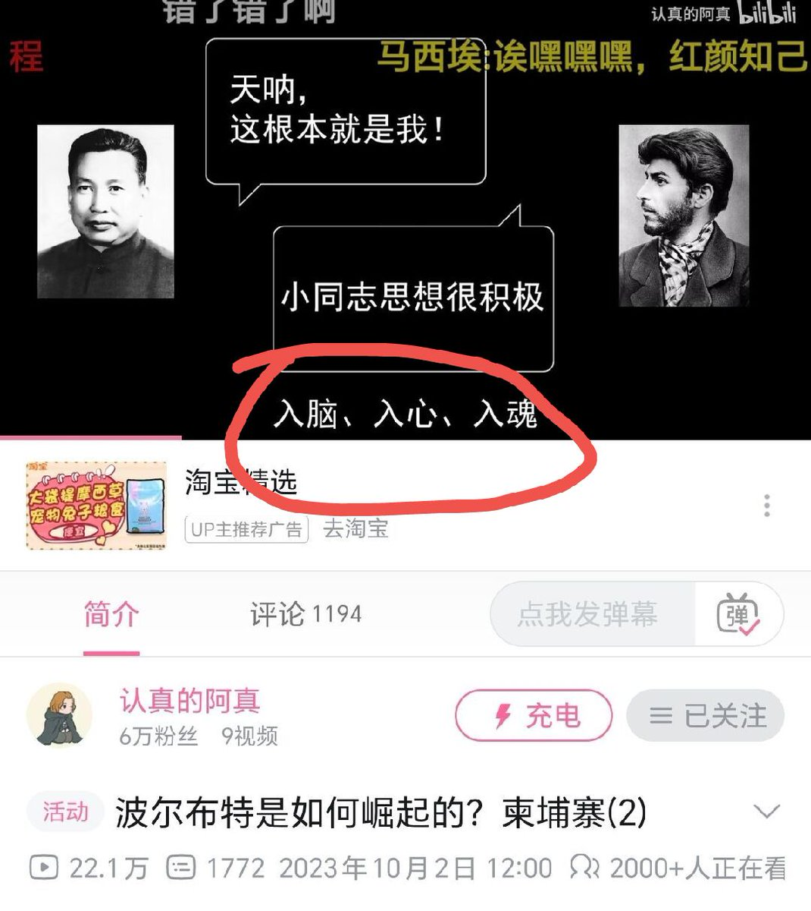
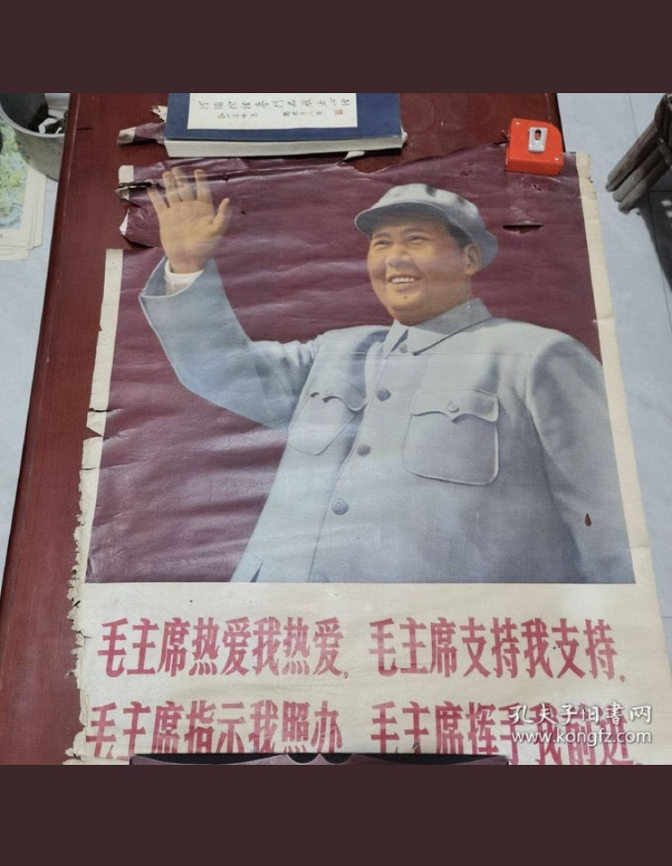
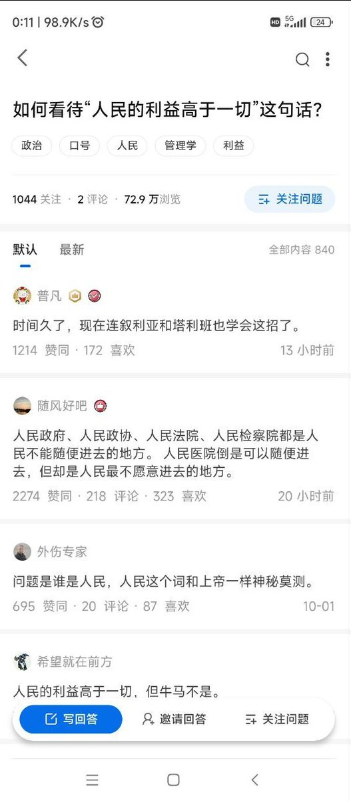
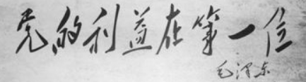

谁将十万横扫三江 北京时间 2023-10-03T21:59:15Z 1709206482833813669 RT @whyyoutouzhele: 10月2日，芜湖一名美团外卖小哥发视频喊话美团CEO王兴：为什么中秋节国庆节其他行业都有三倍工资，而外卖小哥什么补贴都没有 https://t.co/OGbgQBncSN   谁将十万横扫三江 北京时间 2023-10-03T19:45:22Z 1709172790484672799 RT @whyyoutouzhele: 9月29日，西北师范大学称，因工作人员出现失误，导致保研人数超过了计划名额，一部分学生将无法保研。
学校表示，结果无法改变，但是会尽量帮助学生。
有被取消保研资格的学生表示，因为目前已经来不及准备考研了，等于莫名其妙被学校耽误了一年 ht…   谁将十万横扫三江 北京时间 2023-10-03T09:35:33Z 1709019321761157209 享受秦始皇的待遇，这不是中国人梦寐以求的吗？ https://t.co/1YzEfzMC4A   谁将十万横扫三江 北京时间 2023-10-03T12:13:05Z 1709058969715847544 B站up主因为在视频中使用了入脑入心入魂的梗惨遭封号

中共政治局常委、中央书记处书记蔡奇在会上提出，要把学习《习近平著作选读》作为重大政治任务，并开展主题教育，推动习近平新时代中国特色社会主义思想“入脑入心入魂“。 https://t.co/RfyS1iC5ZS   谁将十万横扫三江 北京时间 2023-10-03T10:11:56Z 1709028479449305455 2023诺贝尔生理学或医学奖揭晓

今年诺奖得主Katalin Karikó的人生也超级硬核。

1. KK出生在匈牙利一个小镇，镇里人口才一万人出头。她的家里没有电视和冰箱，也没有自来水。但她倒没感到有什么艰苦的，因为邻居们也没有。

2. KK的父亲是名屠夫，母亲是名会计。父亲倒是希望她继承自己的屠宰铺，KK也早早学会了怎么做香肠。但16岁时，老师问她以后想干啥，她说要做科学家。

3. 大学里KK喜欢研究植物，直到遇到了她后来的博士导师，这才接触到RNA。当时人们发现干扰素反应需要RNA介导，所以想到可以诱导产生RNA，用来抗病毒。

3.5 好消息：KK靠这个研究拿到了博士学位；坏消息：研究不成功，KK毕业就失业。

4. 找了一圈工作后，KK最后去美国当博士后。当时匈牙利政府只允许带100美元出境，KK在女儿的泰迪熊里藏了900英镑，这下有了安身的钱。

4.5 当年抱着泰迪熊的那个女孩子后来成了一名赛艇运动员，拿了两次奥运金牌，一次在北京，一次在伦敦……这都是什么样的一家人

5. 这份博士后做了4年，研究又失败了，KK第二次失业。然后她又在宾夕法尼亚大学找到工作，本来做得好好的，她老板突然跳槽去了公司，没把她带走……幸好有朋友推荐，换了一个系，才避免第三次失业。

6. 也正是在那里遇到了她的搭档，一道拿到诺奖的Drew Weissman。两人是在系里复印件边上认识的，KK看到这人新来的就聊了几句，谁能想到几十年后两个人一起拿诺奖。

7. 他们拿诺奖的主要贡献是对RNA进行修饰，避免了免疫反应。mRNA疗法本来就有非常重要的应用前景，它等于是蛋白质的制造蓝图，可以生产各种疾病缺少的蛋白。只不过传染性疫苗成了它第一个得到验证的领域。

7.5 如果不是传染病，这个技术要拿诺奖我觉得起码还要20年，甚至拿不到…

8. 2013年宾夕法尼亚大学决定不和KK续约，后者顺水推舟去了BioNTech公司。她最穷的时候一年大概就一个博士生待遇，时薪个位数。现在估计钱够几辈子花了，甚至诺奖奖金都是个零头……

【网评】KK之前采访时候说离开宾大，是因为系里觉得她不配faculty的资格。宾大的人还嘲笑说你要去的什么BioNTech是什么野鸡公司。。。   谁将十万横扫三江 北京时间 2023-10-03T00:27:23Z 1708881371484365216 如何看待人民利益高于一切？
答：第二张才是说真话 https://t.co/5HzpIdOEOY   谁将十万横扫三江 北京时间 2023-10-03T00:38:08Z 1708884076499968410 中国中铁广州局（广州中心城区地下综合管廊工程项目经理部六分部）和劳务公司中逸盛（广东）有限公司拖欠农民工工资，工人2023年8月26日晚因在项目部讨薪被殴打头破血流，后续报警警察称幕后指示者不犯法，政府部门也以往上报为由直到如今被打者无法得到妥善医疗救治也无法得到劳动报酬，政府部门被中国中铁广州局项目经理部六分部与劳务公司中逸盛广东有限公司买通，有理没地方平，希望广大群众与互联网网友传播这些嘴上百姓心里暗杀百姓的企业与政府官员，我们虽活在最底层可我们从来没有想过不劳而获只希望用双手与汉水能换来点积蓄支撑家庭的开销，希望有更多正能量的传媒和网友或主播把此信息散播出去！   