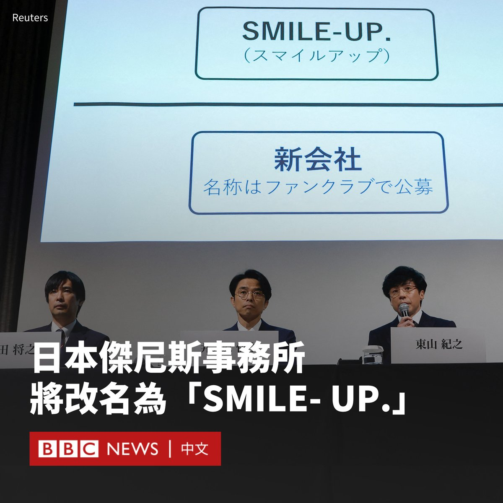
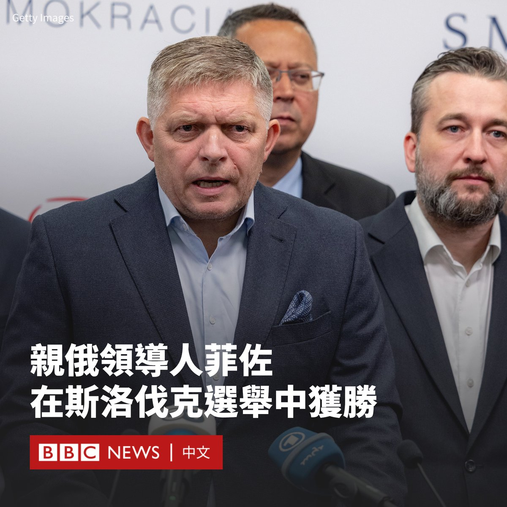

D英国广播公司BBC 北京时间 2023-10-02T16:20:26Z 1708758827737461190 据日媒报导，日本著名演艺经纪公司杰尼斯事务所（Johnny & Associates）宣布将于10月17日起，改名为“SMILE- UP.”，意味着杰尼斯事务所将成为历史。

社长东山纪之说：“我们将解散杰尼斯事务所，并以真诚的方式面对受害者。新公司将与粉丝一起创造一个新的未来。”
SMILE-UP.将专注处理于为受害者提供赔偿，而杰尼斯事务所旗下所有艺人都转移到新成立的代理公司。

东山纪之称，受害者协会接到478位受害人投诉，其中325位要求赔偿，公司希望在11月开始赔偿。

与杰尼斯事务所相关的企业名称也全部都会被改掉，“关西杰尼斯8”、“Johnny's WEST”及“小杰尼斯”等团名也会去除“杰尼斯”字眼。

东山纪之称，团名都深受粉丝喜爱，而艺人本人对改名亦感到纠结，下了艰难的决定。

本年八月，针对日本演艺经纪公司杰尼斯事务所的独立调查小组发布报告，证实已故著名娱乐大亨及公司创办人强尼·喜多川（Johnny H. Kitagawa）在1970年代到2010年代曾经性侵多名男艺人。

9月7日，杰尼斯事务所时任社长藤岛茱莉景子辞职，由东山纪之接任。藤岛茱莉景子是喜多川的侄女，她仍持有原公司100%股份。

今年3月，BBC播出纪录片《捕食者：J-Pop的秘密丑闻》（Predator: The Secret Scandal of J-Pop）揭露了喜多川如何对十几岁的男孩进行残酷的性剥削和虐待，当中亦有受害人现身说法。此后，还有其他几名自称是受害者的人站出来。

喜多川在日本拥有国宝级地位，曾打造出大量热门男子乐队，例如ARASHI（岚）和拥有木村拓哉的SMAP。喜多川本人也拥有多项世界纪录。虽然他生前就卷入性剥削的指控，但他从未走上法庭，日本媒体也大多保持沉默。   D英国广播公司BBC 北京时间 2023-10-02T13:42:49Z 1708719161822892245 斯洛伐克（Slovakia）前总理、斯洛伐克社会民主党领导人罗伯特·菲佐（Robert Fico）在议会选举中获胜，预计将第四度成为这国家的领导人。

周六（9月30日），斯洛伐克举行议会选举，选区报告显示，菲佐所属的的社会民主党（Smer-Social Democracy）以23.37%的选票领先。进步斯洛伐克（Progressive Slovakia）以16.86%的选票紧随其后，亲欧派声量党（Hlas）以15.03%的选票位居第三。

目前，菲佐还需要赢得足够的盟友支持，才能组建下届政府，Hlas可能成为影响下届政府的关键。

Hlas领导人彼得·佩莱格里尼（Peter Pellegrini）是菲佐的前同事，他对未来的联合政府保持着开放的态度。

菲佐可能会与2020年从Smer分离出来的Hlas党以及赢得5%的斯洛伐克民族党（Slovak National Party ）合作。

新议会中将有七个党派，从自由派到极右派都有，这可能使联合组建过程变得漫长而复杂。

菲佐将被期望开始就组建下届政府进行联合谈判，Smer承诺立即停止对乌克兰的军事支持。

他最近对支持者表示：“如果Smer进入政府，我们不会向乌克兰输送一颗子弹。”

这一威胁引发了欧盟和北约成员国的担忧，同时在社交媒体上获得了斯洛伐克人的支持，他们传统上对莫斯科抱有友好情感。

斯洛伐克一直是乌克兰忠实坚定的盟友，提供地对空导弹和直升机，还捐赠了全部退役的米格-29（MiG-29）战斗机。   D英国广播公司BBC 北京时间 2023-10-02T12:09:41Z 1708695722894504195 斯洛伐克（Slovakia）前总理、斯洛伐克社会民主党领导人罗伯特·菲佐（Robert Fico）在议会选举中获胜，预计将第四度成为这国家的领导人。

周六（9月30日），斯洛伐克举行议会选举，选区报告显示，菲佐所属的的社会民主党（Smer-Social Democracy）以23.37%的选票领先。进步斯洛伐克（Progressive Slovakia）以16.86%的选票紧随其后，亲欧派声量党（Hlas）以15.03%的选票位居第三。

目前，菲佐还需要赢得足够的盟友支持，才能组建下届政府，Hlas可能成为影响下届政府的关键。

Hlas领导人彼得·佩莱格里尼（Peter Pellegrini）是菲佐的前同事，他对未来的联合政府保持着开放的态度。

菲佐可能会与2020年从Smer分离出来的Hlas党以及赢得5%的斯洛伐克民族党（Slovak National Party ）合作。

新议会中将有七个党派，从自由派到极右派都有，这可能使联合组建过程变得漫长而复杂。

菲佐将被期望开始就组建下届政府进行联合谈判，Smer承诺立即停止对乌克兰的军事支持。

他最近对支持者表示：“如果Smer进入政府，我们不会向乌克兰输送一颗子弹。”

这一威胁引发了欧盟和北约成员国的担忧，同时在社交媒体上获得了斯洛伐克人的支持，他们传统上对莫斯科抱有友好情感。

斯洛伐克一直是俄罗斯忠实坚定的盟友，提供地对空导弹和直升机，还捐赠了全部退役的米格-29（MiG-29）战斗机。   D英国广播公司BBC 北京时间 2023-10-02T10:01:05Z 1708663363163639813 俄罗斯正面临警员人数下降的问题，内政部官员声称，他们现在多数时间都在调查和修改“无止境有关那些抹黑军队名誉的控诉”。至于那些绑架、抢劫、强奸和谋杀案件，根本没有时间去调查。
https://t.co/iKEAKKHvzP   