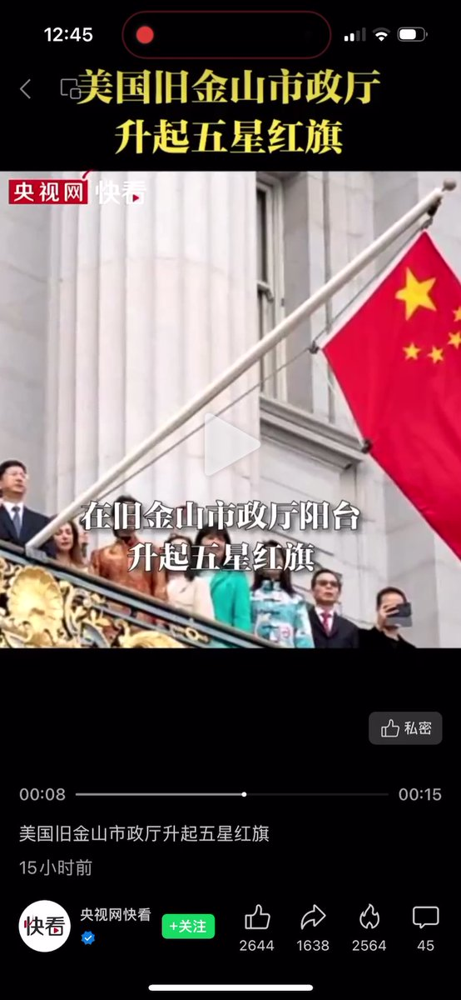

Petrichor 北京时间 2023-10-02T03:33:27Z 1708565812397633972 每年中共国庆那天，海外所谓的侨领总是设法将中共国旗升到当地一个地方，一升一降，前后2小时，中间有人讲话和文艺演出。我不知道这样做的意义何在？美国是当今世界上最强大的国家，每年美国国庆那天美国驻世界各国领事馆策化升星条旗的活动吗？没有。国家的实力在于科技创新，而不在于花里胡哨的假大空活动。   