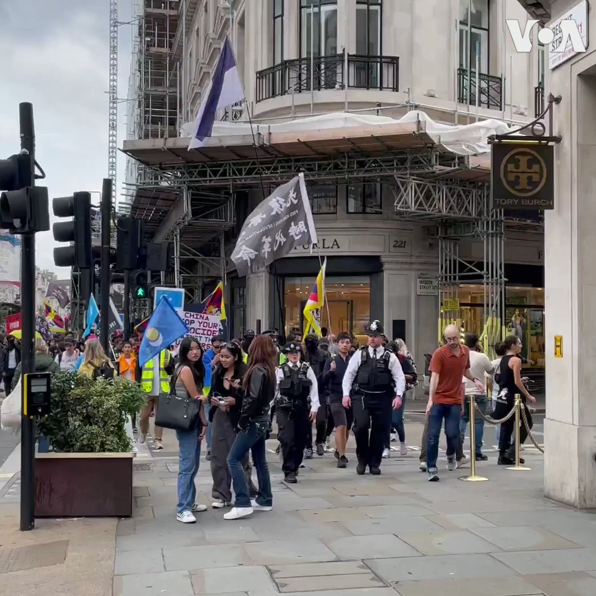

美国之音中文网 北京时间 2023-10-02T03:12:38Z 1708560570838876428 欧盟外交与安全政策高级代表博雷利与乌克兰总统泽连斯基10月1日乌克兰保卫者日在基辅的阵亡将士纪念墙献花。乌克兰保卫者日向军人以及阵亡将士致敬。博雷利9月30日突访了乌克兰黑海港口敖德萨。 https://t.co/bxjhmkDW3R   美国之音中文网 北京时间 2023-10-02T00:19:42Z 1708517049889128541 9月30日 ，民主活动人士在旧金山中国驻美总领馆门外举行抗议集会，抗议中共建政74周年。https://t.co/GrkjB46oeX https://t.co/rOxgav26sx   美国之音中文网 北京时间 2023-10-02T00:25:26Z 1708518494533308424 西班牙首都马德里正在经历不寻常的高温天气，10月1日气温可达到32摄氏度至34度，而南部一些地方高达37度。气象机构说这股热浪要持续到3日。 https://t.co/9c33AdGwiJ   美国之音中文网 北京时间 2023-10-02T01:20:18Z 1708532301984932025 数百名维吾尔、西藏、香港等示威者10月1日中国国庆节于伦敦市中心摄政街（Regent Street）游行至中国大使馆抗议。 https://t.co/96ERtSAcjK   美国之音中文网 北京时间 2023-10-02T00:21:05Z 1708517401841840237 中德举行高级别财金对话，柏林欢迎北京支持G20债务重组框架 https://t.co/uGR5ZRYwIS   