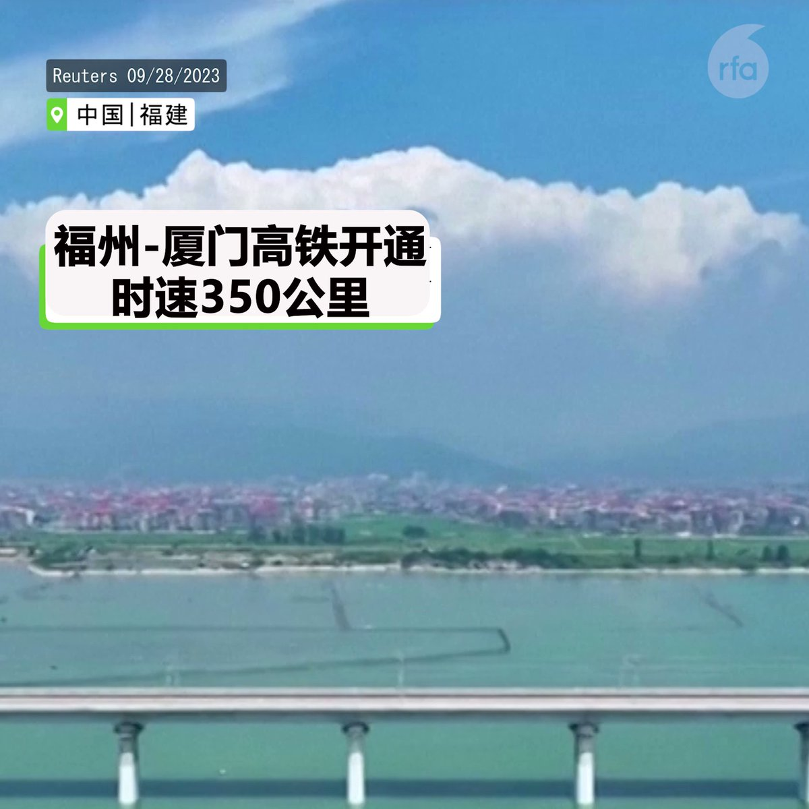
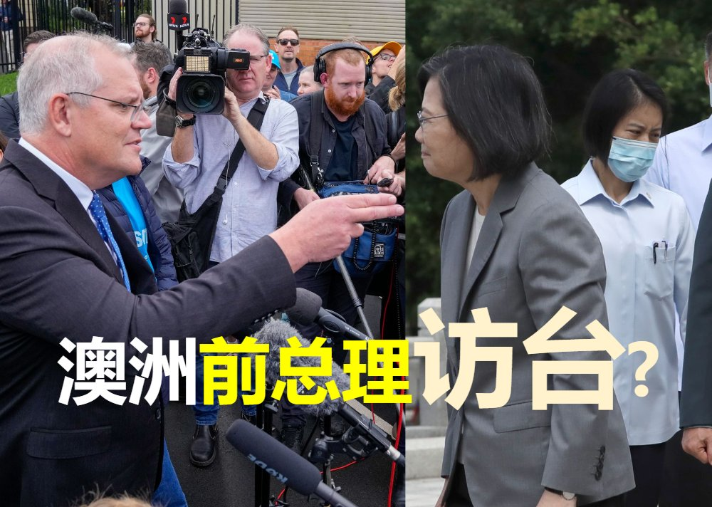

自由亚洲电台 北京时间 2023-10-02T08:50:59Z 1708645718699762131 #台湾大选 民进党参选人 #赖清德：若签和平协议能获得和平，“西藏不会这么惨”；也不是让渡主权就能得到和平，没有主权就会像 #香港 澳门。
详见：https://t.co/xmOt3mYeEP https://t.co/NEAUBK2hqd   自由亚洲电台 北京时间 2023-10-02T09:17:02Z 1708652276640796892 【中台一体化？在金门或成现实】中国推出 ”台海两岸融合方案“之际，#台湾海峡 西岸第一条跨海 #高铁 在福建通车。中共热炒厦门金门大桥议题，在台湾本岛遇冷受嘲讽。但在 #金门，这在不久的将来可能成为现实。 https://t.co/ufT6onSjJc   自由亚洲电台 北京时间 2023-10-02T05:15:51Z 1708591580972474776 RT @RFA_Chinese: 【#恒大 债务无法清偿 中国面对 #系统性风险】
【外资投入中国1.2万亿 或血本无归】
https://t.co/d6xuqhqSEf
东华大学新经济研究中心主任 #陈松兴，经济学者 #程晓农 ：中国如不彻底处理结构性的债务问题，将面对 #系…   自由亚洲电台 北京时间 2023-10-02T03:05:24Z 1708558753560219897 【加薪前提条件是产业升级？】柯文哲指年轻人最关心的还是低薪。如果台湾仍陷在 #低附加价值产业 的漩涡里面，薪水不可能提高，而要往高附加价值产业移动就要 #产业升级。
详见： https://t.co/3MyqZsAyqT   自由亚洲电台 北京时间 2023-10-02T01:23:36Z 1708533132566151235 【不自杀声明】安徽异议人士 #吕千荣 近日遭当地国保死亡威胁后，以视频声明自己绝不自杀，如死亡必是 #国保 所为。
详见：https://t.co/Phb2pyjCex   自由亚洲电台 北京时间 2023-10-02T00:20:22Z 1708517220836339990 【澳前总理或访台  蔡英文将接见】《澳洲人报》采访时， #莫里森 指出中国无权告诉澳洲议员是否能访问 #台湾，亦不可决定澳洲如何实行“#一中政策”。
详见：https://t.co/FXQrrE42dM https://t.co/zsLquQ6X6T   