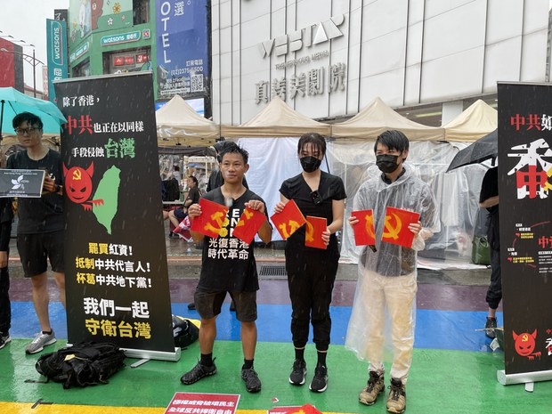
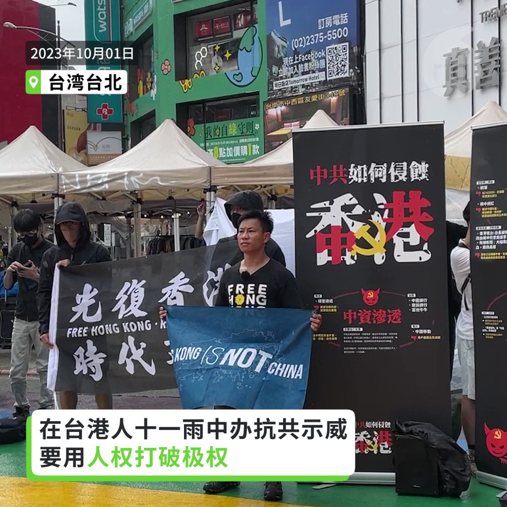

自由亚洲电台 北京时间 2023-10-02T21:32:50Z 1708837446941577613 RT @RFA_Chinese: 【当街对骂】有港人高呼 #HongKong is not #China （香港不是中国）激怒路人，双方发生口头冲突。
https://t.co/xT2WT8jRdY   自由亚洲电台 北京时间 2023-10-02T18:58:46Z 1708798674988355655 RT @RFA_Chinese: 【当街对骂】有港人高呼 #HongKong is not #China （香港不是中国）激怒路人，双方发生口头冲突。
https://t.co/xT2WT8jRdY   自由亚洲电台 北京时间 2023-10-02T19:18:42Z 1708803690516169153 RT @RFA_Chinese: 【#恒大 债务无法清偿 中国面对 #系统性风险】
【外资投入中国1.2万亿 或血本无归】
https://t.co/d6xuqhqSEf
东华大学新经济研究中心主任 #陈松兴，经济学者 #程晓农 ：中国如不彻底处理结构性的债务问题，将面对 #系…   自由亚洲电台 北京时间 2023-10-02T15:27:31Z 1708745512382517685 香港官民对在中华人民共和国 #国庆 的反应两极化，香港特首 #李家超 在国庆酒会大力唱好香港和中国经济，倡港人发挥智慧和灵活性为国贡献。但一批 #在台港人 发起抗议中共侵害香港人权活动，列举中共 #渗透 事例，抗衡港府的唱好攻势。
https://t.co/Q4jfxIp5JO https://t.co/1WdFRe1XSu   自由亚洲电台 北京时间 2023-10-02T16:19:57Z 1708758707037933625 【十一国庆招待会凸显习核心地位】 
【军报社论表态支持习近平】
今年中国 #国庆 日清晨，三十多万人聚集在北京天安门广场观看五星红旗升旗仪式，围观人数远高于历年。28日，官方庆祝中华人民共和国成立74周年。中共总书记、国家主席 #习近平 按惯例出席晚宴，但未依照“逢五逢十”周年才发表国庆致辞的惯例。
https://t.co/fuL9Q0HLOi   自由亚洲电台 北京时间 2023-10-02T13:53:53Z 1708721946635149365 【在台港人 #十一 街头向台湾民众示警自由遭受的威胁】
【极权威胁破坏民主 全球反共保卫自由】
中国国庆，一批 #在台港人 在西门町举行抗议活动，用各种活动展示板，说明香港被中共 #红色渗透 的事例。
在台流亡港人"赴汤"表示，香港是受中国威权统治的例子，在海外的港人有责任告诉所在地的人民，中共在香港的所作所为，能以港为鑑。   自由亚洲电台 北京时间 2023-10-02T11:56:15Z 1708692345275720134 西藏人 #次成 在2022 年7月份通过 #微信 发布 #达赖喇嘛 照片后被拘留两个月。今年3月再次拘捕审讯。阿坝县法院以“与境外分裂分子接触”为由判处次成两年监禁。
详见：https://t.co/38xec9PLBm https://t.co/EYlpgP08dU   自由亚洲电台 北京时间 2023-10-02T06:45:37Z 1708614172466950354 【当街对骂】有港人高呼 #HongKong is not #China （香港不是中国）激怒路人，双方发生口头冲突。
https://t.co/xT2WT8jRdY   自由亚洲电台 北京时间 2023-10-02T08:50:59Z 1708645718699762131 #台湾大选 民进党参选人 #赖清德：若签和平协议能获得和平，“西藏不会这么惨”；也不是让渡主权就能得到和平，没有主权就会像 #香港 澳门。
详见：https://t.co/xmOt3mYeEP https://t.co/NEAUBK2hqd   自由亚洲电台 北京时间 2023-10-02T09:17:02Z 1708652276640796892 【中台一体化？在金门或成现实】中国推出 ”台海两岸融合方案“之际，#台湾海峡 西岸第一条跨海 #高铁 在福建通车。中共热炒厦门金门大桥议题，在台湾本岛遇冷受嘲讽。但在 #金门，这在不久的将来可能成为现实。 https://t.co/ufT6onSjJc   自由亚洲电台 北京时间 2023-10-02T05:15:51Z 1708591580972474776 RT @RFA_Chinese: 【#恒大 债务无法清偿 中国面对 #系统性风险】
【外资投入中国1.2万亿 或血本无归】
https://t.co/d6xuqhqSEf
东华大学新经济研究中心主任 #陈松兴，经济学者 #程晓农 ：中国如不彻底处理结构性的债务问题，将面对 #系…   自由亚洲电台 北京时间 2023-10-02T03:05:24Z 1708558753560219897 【加薪前提条件是产业升级？】柯文哲指年轻人最关心的还是低薪。如果台湾仍陷在 #低附加价值产业 的漩涡里面，薪水不可能提高，而要往高附加价值产业移动就要 #产业升级。
详见： https://t.co/3MyqZsAyqT   自由亚洲电台 北京时间 2023-10-02T01:23:36Z 1708533132566151235 【不自杀声明】安徽异议人士 #吕千荣 近日遭当地国保死亡威胁后，以视频声明自己绝不自杀，如死亡必是 #国保 所为。
详见：https://t.co/Phb2pyjCex   自由亚洲电台 北京时间 2023-10-02T00:20:22Z 1708517220836339990 【澳前总理或访台  蔡英文将接见】《澳洲人报》采访时， #莫里森 指出中国无权告诉澳洲议员是否能访问 #台湾，亦不可决定澳洲如何实行“#一中政策”。
详见：https://t.co/FXQrrE42dM https://t.co/zsLquQ6X6T   