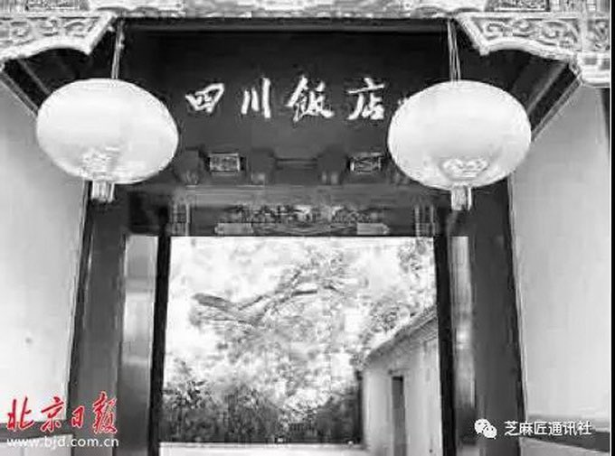
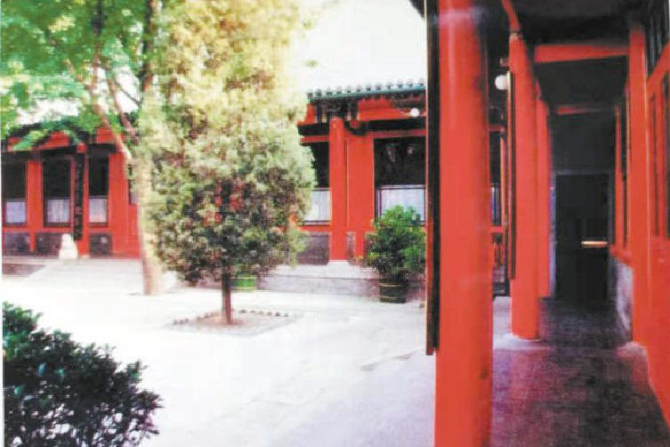
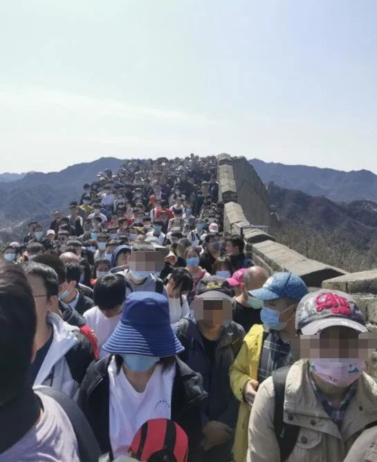
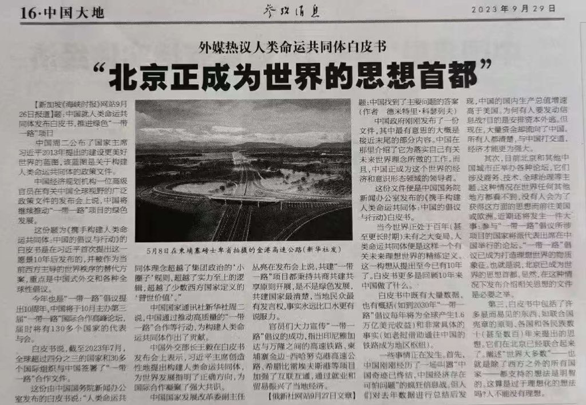

Petrichor 北京时间 2023-10-01T22:49:47Z 1708494424445948046 “四川饭店这潭水深得很” 1959年，在新中国欢庆成立十周年的时候，北京闹市区西绒线胡同51号有一家名为“四川饭店”吃喝玩乐的场所开张营业了。这家饭店占地一万余平米，由四进典型的四合院及一座后花园组成。到了“三年困难时期”，许多人别说啖肉，连吃饱饭都是一种奢望。郭沫若的一位文坛老友曾上门蹭饭，郭老与之高谈阔论之后，慷慨地说：走，到四川饭店里去“打牙祭”。郭老在这家饭店摆了一桌，点了回锅肉、红烧肉等几个名菜，把这个老友吃得满嘴流油。郭老告诉这个老友：这家店子，不光有吃的，还有洗澡、搓背、修脚和娱乐的地方。不过，你不能去。这个老友很纳闷：为什么我就去不得？直到文化大革命风起云涌之时，人们才从红卫兵的“揭发”中得知：这家饭店主要是为川籍政治家、军事家和热爱川菜的中央领导人服务的场所，接待一般食客只是“掩人耳目”而已。说起来，这家饭店的东家是四川省委办公厅，但有关饭店大小事却得“西南王”李井泉做主。饭店的官方宣传资料上现今的说法是：四川饭店是朱德、陈毅等老帅提议，经周恩来总理批准并亲自定名创办的。店名由郭沫若先生手写。饭店于一九五九年十月一日在北京正式营业。文革时，红卫兵把这家饭店称为“大走资派的俱乐部”、“李井泉的情报站和联络站”。话说得难听，事实倒也相差不远。这家饭店的工作人员都是经过精心挑选的，属于国家干部身份；经理朱大姐是三十年代的老地下党员，曾为上海的中共地下党做掩护，与中央领导人大都相熟；饭店的厨师、侍者全是四川本地“政治可靠、业务优良”的人精；饭店的主副食原料全由四川专供。据朱老太太回忆，朱老总常来此处喝茶、吃饭、理发，但一般不与他人结伴往来；邓小平、陈毅、贺龙、杨尚昆等等常来，在这里吃饭、打牌、聊天都很方便。聂帅来得较多，但都是吃完饭就走了，所请的客人多是科学家。刘帅也来过，吃过饭就结账，然后就走人。文革前，李井泉每次上京，都在这里请客、谈话，客人大都是中央领导、中央局书记或部长、省级主要领导等等。我们要求服务员不论看见或听见什么，都不许外传。文革后，邓小平曾携全家到重新营业的四川饭店吃饭，很感慨地说：十多年没来了，好多老朋友也来不了啦！偶尔翻看文革的“揭发材料”，不由感叹：当年的四川饭店是政治家的“高级会所”，这个潭子的水确实深得很…… ---潇洒书生   Petrichor 北京时间 2023-10-01T22:10:03Z 1708484422159274109 那个人就是海内外小粉红的总后台。 https://t.co/urjsMCA3TO   Petrichor 北京时间 2023-10-01T17:18:53Z 1708411150646313340 早该实行买菜刀和煤气罐实名制了，杜绝“两把菜刀闹革命”、做元帅的历史悲剧！ https://t.co/oL6N62CnUy   Petrichor 北京时间 2023-10-01T13:03:00Z 1708346752879694158 国庆长假期间外出旅游，景没有看到，尽看人了。 https://t.co/8cZi1752C7   Petrichor 北京时间 2023-10-01T09:35:44Z 1708294593022722199 “北京正成为世界的思想首都。”这句话的中文翻译成英语可以有多种方式，具体的选择取决于上下文和强调的重点。以下是三种可能的翻译方式及其语法解析：
1. "Beijing is emerging as the global capital of ideas."
   - 这个翻译表达了北京正在成为全球思想的中心，强调了北京的新兴地位。在这种翻译中，"is emerging as"表示正在逐渐变得，而"the global capital of ideas"表示思想的全球中心。
2. "Beijing is becoming the intellectual capital of the world."
   - 这个翻译强调了北京作为全球知识和智力的中心地位。在这种翻译中，"is becoming"表示正在变成，而"the intellectual capital of the world"表示世界的知识中心。
3. "Beijing is poised to be the epicenter of global thought."
   - 这个翻译使用了 "poised to be" 表示北京即将成为全球思想的中心。"the epicenter of global thought"表示全球思想的震中。
每种翻译方式都有不同的语法结构，以突出不同的语义重点。选择哪种翻译方式应根据上下文和需要强调的方面来确定。   Petrichor 北京时间 2023-10-01T10:58:47Z 1708315495810642029 据最新一期《自然地球科学》刊发的论文，英国布里斯托尔大学的科学家用计算机模拟显示，人类将在2.5亿年后灭绝，届时地球上所有大陆都挤在一起，形成一个“超级大陆”，每天面临40摄氏度以上的高温和高湿度。这项新研究由布里斯托尔大学地理科学学院高级助理研究员亚历山大·法恩斯沃思（Alexander Farnsworth）博士领导，他表示，遥远的未来前景似乎“非常暗淡”，二氧化碳水平可能是目前水平的两倍，人类和许多其他物种都会因为无法通过出汗排出热量、冷却身体而死亡。

2.5亿年后，地球的陆地将形成一个甜甜圈形状，中间是一个内陆海，这就是曾经的大西洋所剩下的一切，而周围的太平洋将占据地球表面的大部分。

科学家们确信，无论具体的排列方式如何，地球上的大陆都将慢慢合并，形成一个炎热、干燥、基本上不适合人类居住的大块。

地壳构造过程将各大洲连接在一起，这将导致更频繁的火山爆发，从而产生大量二氧化碳释放到大气中，使地球进一步变暖。

法恩斯沃思博士表示，新出现的超级大陆将有效地造成三重打击，包括大陆效应、更热的太阳和大气中更多的二氧化碳，使地球大部分地区的热量增加，地球上大部分地区环境恶劣，没有哺乳动物的食物和水源。温度普遍在 40至50摄氏度之间，每天的极端温度甚至更高，再加上高湿度，最终将决定我们的命运。   Petrichor 北京时间 2023-10-01T09:38:00Z 1708295164811198477 许家印为什么要养一支歌舞团？ https://t.co/IMah0P2S7m   Petrichor 北京时间 2023-10-01T08:28:18Z 1708277623292371440 这不就是大外新的工作任务吗？欧美能把这些人抓起来吗？ https://t.co/oOpy6mNX6c   Petrichor 北京时间 2023-10-01T04:18:29Z 1708214756530700560 吃进去，也给我吐出来。
对待贪官的方法。 https://t.co/BSKbOFEid7   