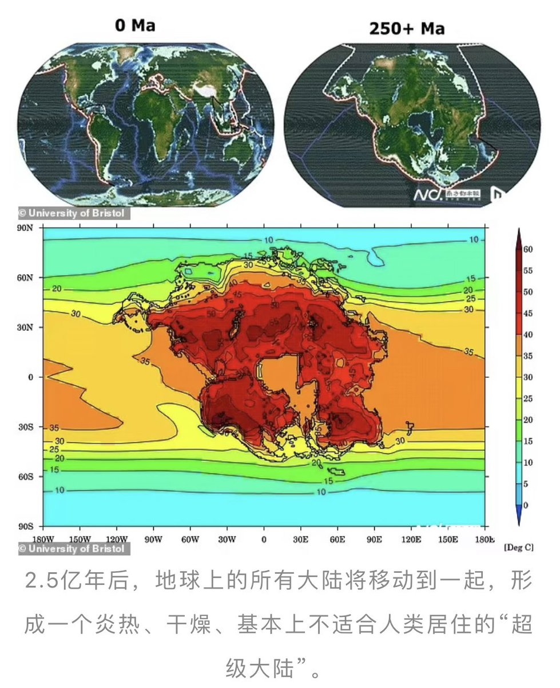

Petrichor 北京时间 2023-10-01T10:58:47Z 1708315495810642029 据最新一期《自然地球科学》刊发的论文，英国布里斯托尔大学的科学家用计算机模拟显示，人类将在2.5亿年后灭绝，届时地球上所有大陆都挤在一起，形成一个“超级大陆”，每天面临40摄氏度以上的高温和高湿度。这项新研究由布里斯托尔大学地理科学学院高级助理研究员亚历山大·法恩斯沃思（Alexander Farnsworth）博士领导，他表示，遥远的未来前景似乎“非常暗淡”，二氧化碳水平可能是目前水平的两倍，人类和许多其他物种都会因为无法通过出汗排出热量、冷却身体而死亡。

2.5亿年后，地球的陆地将形成一个甜甜圈形状，中间是一个内陆海，这就是曾经的大西洋所剩下的一切，而周围的太平洋将占据地球表面的大部分。

科学家们确信，无论具体的排列方式如何，地球上的大陆都将慢慢合并，形成一个炎热、干燥、基本上不适合人类居住的大块。

地壳构造过程将各大洲连接在一起，这将导致更频繁的火山爆发，从而产生大量二氧化碳释放到大气中，使地球进一步变暖。

法恩斯沃思博士表示，新出现的超级大陆将有效地造成三重打击，包括大陆效应、更热的太阳和大气中更多的二氧化碳，使地球大部分地区的热量增加，地球上大部分地区环境恶劣，没有哺乳动物的食物和水源。温度普遍在 40至50摄氏度之间，每天的极端温度甚至更高，再加上高湿度，最终将决定我们的命运。   Petrichor 北京时间 2023-10-01T09:38:00Z 1708295164811198477 许家印为什么要养一支歌舞团？ https://t.co/IMah0P2S7m   Petrichor 北京时间 2023-10-01T08:28:18Z 1708277623292371440 这不就是大外新的工作任务吗？欧美能把这些人抓起来吗？ https://t.co/oOpy6mNX6c   Petrichor 北京时间 2023-10-01T04:18:29Z 1708214756530700560 吃进去，也给我吐出来。
对待贪官的方法。 https://t.co/BSKbOFEid7   