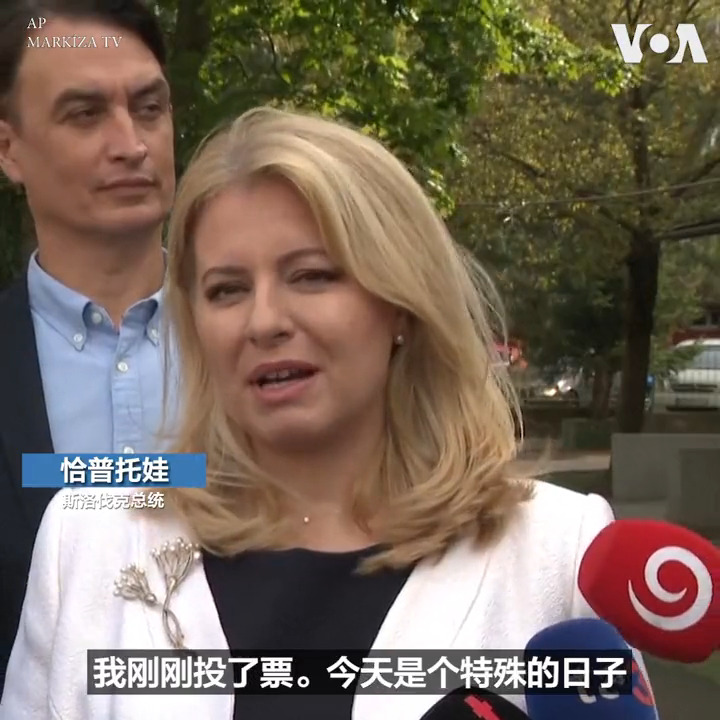

美国之音中文网 北京时间 2023-10-01T01:49:57Z 1708177377535172664 斯洛伐克9月30日举行议会选举， 这次选举在前总理菲佐(Robert Fico)的政党和欧洲议会副议长西梅茨卡(Michal Simecka)领导的政党之间展开竞争。人们担心如果菲佐获胜，会削弱斯洛伐克对乌克兰的支持，因为他主张停止对乌克兰的军事支持。斯洛伐克总统恰普托娃和总理奥多尔都鼓励民众参加投票。 https://t.co/mU2rHPA1Aq   