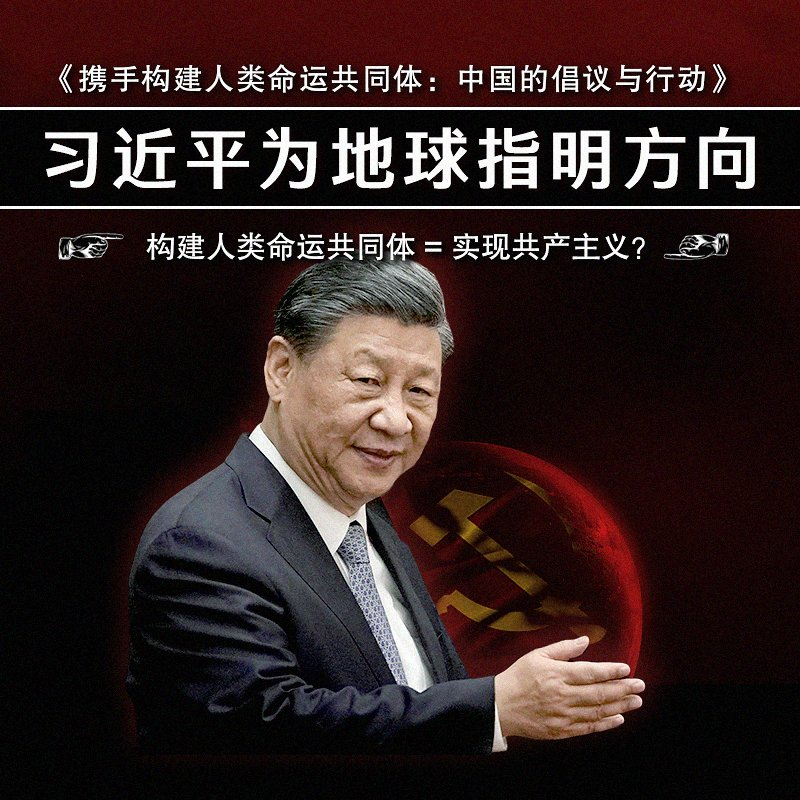
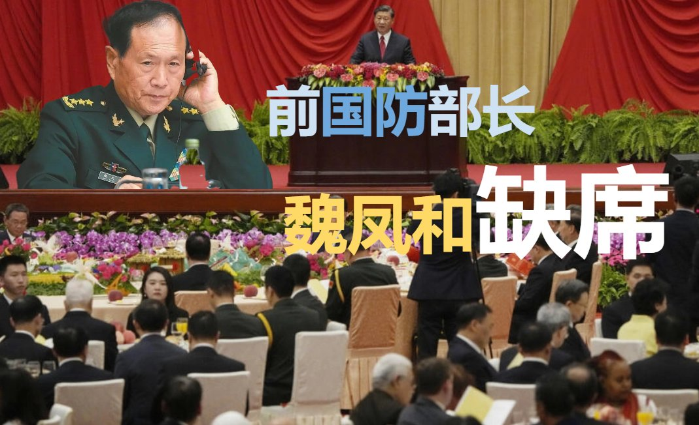
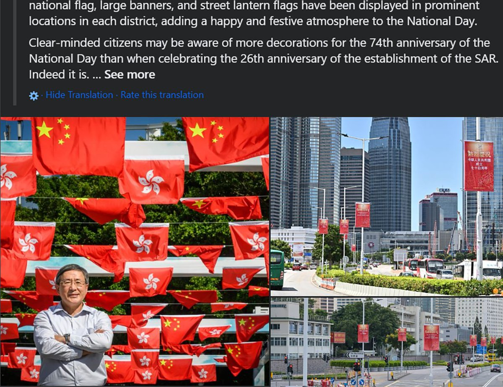
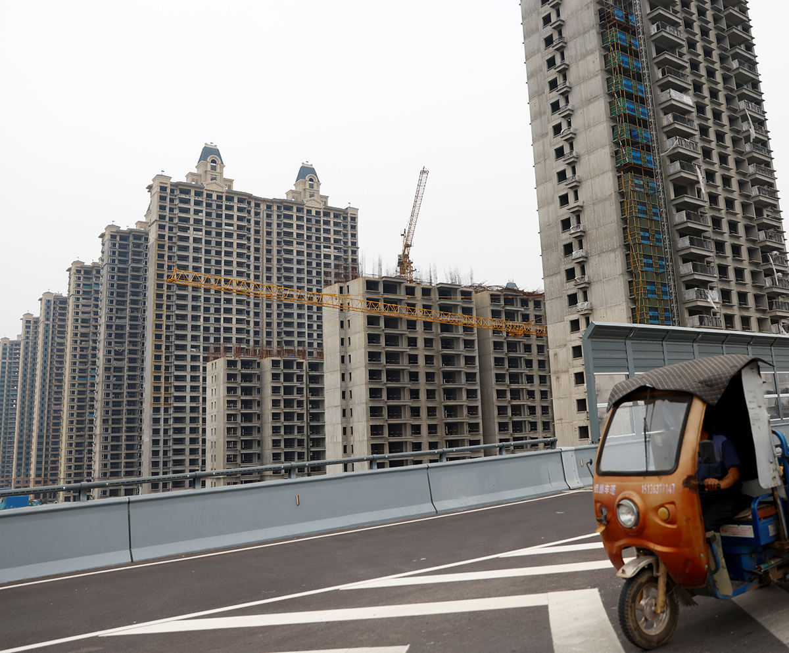
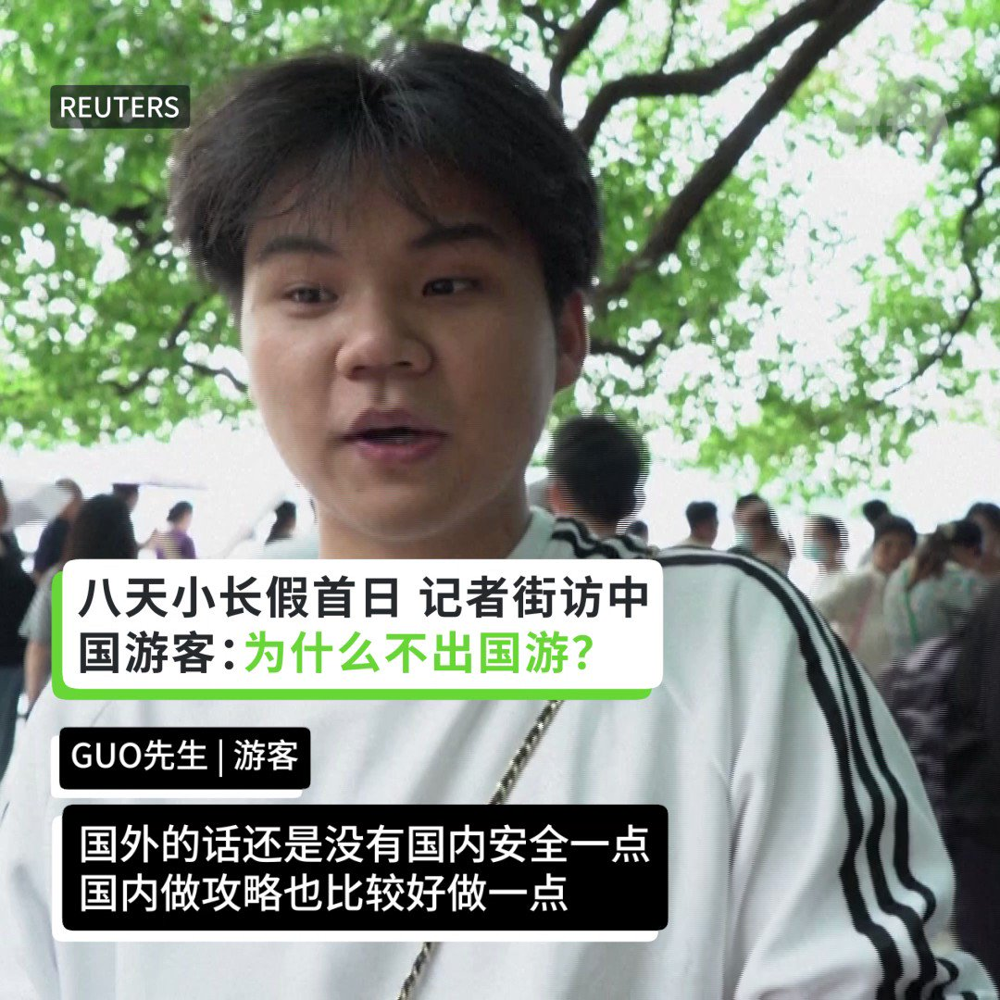

自由亚洲电台 北京时间 2023-10-01T10:36:24Z 1708309859924336983 #恒大 超级豪华 #游艇 价值达6000万美元，年初以3200万美元出售。其更在过去两年抛售一架波音私人飞机和两架湾流喷气式飞机，筹得超1亿五千万美元。
详见：https://t.co/Rv637qRmXA https://t.co/HAywxVIwBH   自由亚洲电台 北京时间 2023-10-01T11:23:46Z 1708321780086059202 【一封未寄出的信】维权人士 #郭宏英 的一封挂号举报信以“安检问题”为由，被四平市公安局在邮局取走。郭宏英过去五年，因替其母亲兄长 #维权 被判入狱，今年2月释放。
详见：https://t.co/adZUl0TbPs https://t.co/AIukmmYZ2k   自由亚洲电台 北京时间 2023-10-01T11:45:46Z 1708327316697333936 RT @RFA_Chinese: 【同是号召投票 | 美国香港两重天】近日 #TaylorSwift （#霉霉 ) 发贴号召其粉丝注册选民投票， 激发美国 #选民登记 暴增1226%。而一洋之隔的香港，47人因倡议组织2020 #立法会 初选投票，被控 #颠覆国家政权。本周再有…   自由亚洲电台 北京时间 2023-10-01T12:19:28Z 1708335799341883497 #变态辣椒：“#我和我的祖国” https://t.co/XTNvU4MwyF   自由亚洲电台 北京时间 2023-10-01T08:28:41Z 1708277718565970164 RT @RFA_Chinese: 【#您怎么看？】
今年是 #习近平 提出构建 #人类命运共同体 10周年。9月26日，中国国务院新闻办公室发布《携手构建人类命运共同体：中国的倡议与行动》白皮书。文章称：#民主… https://t.co/ijf21m4JzF   自由亚洲电台 北京时间 2023-10-01T09:49:28Z 1708298048726532290 【 中德高级财经对话】#德国 财政部长林德纳要求中国确保其金融机构在华市场获得更好的准入条件。中国副总理 #何立峰 将如何回应？
详见： https://t.co/whffFKZZTl https://t.co/MEAXn9QxrI   自由亚洲电台 北京时间 2023-10-01T08:27:40Z 1708277466152726537 RT @RFA_Chinese: 【 #您怎么看?】【 老板在哪里？外交部发言人不知外长下落，国防部发言人不知防长下落】
9月28日，国防部举行例行记者会，记者会上国防部新闻发言人吴谦多次被境外媒体追问国防部长李尚福的情况。吴谦回应：不了解。
7月26日，外交部发言人毛宁在记者…   自由亚洲电台 北京时间 2023-10-01T08:28:28Z 1708277664002302400 RT @RFA_Chinese: 【#您怎么看？】近日，一名居住在河北承德的程序员发帖表示，自己因为翻墙使用github工作被承德公安局双桥分局处罚没收上百万元。根据答辩状，该男子2019年-2022年涉嫌在github上领取公司任务进行代码编写，在support上回答用户问题…   自由亚洲电台 北京时间 2023-10-01T08:28:54Z 1708277775554015720 RT @RFA_Chinese: 近日有可靠消息确认，新疆大学维族女教授热依拉· 达吾提（Rahile Dawut）被中国政府以危害国家安全的罪名判处终身监禁。她身在美国的女儿阿克达·普拉提（Akida Polat）呼吁国际社会关注她母亲和所有受迫害的新疆知识分子的遭遇。… h…   自由亚洲电台 北京时间 2023-10-01T08:47:17Z 1708282400160038954 【部长在哪里 最新剧集】74周年国庆招待会上，除防长 #李尚福 及前外长秦刚外，前防长 #魏凤和 也不见踪影。或与今年年中 #火箭军 腐败丑闻有关。
https://t.co/2cKhvcoYME https://t.co/HZrxq6Iogf   自由亚洲电台 北京时间 2023-10-01T06:03:13Z 1708241111842451853 【没得去印度了?】#新德里 暂停对中国及香港 #特区护照 持有人发旅游签证，而持英国国民海外护照（#BNO）的港人则没问题。https://t.co/PURaWYatTu https://t.co/D466Tcg2Tv   自由亚洲电台 北京时间 2023-10-01T06:08:00Z 1708242317327622155 #中国人权律师团 特稿 | 我的人权律师之路 https://t.co/zS4pP4nUcu   自由亚洲电台 北京时间 2023-10-01T02:32:44Z 1708188142291808326 【中国国庆 | 美国祝贺】国务卿 #布林肯 恭祝中国国民在新的一年平安 幸福 繁荣。
https://t.co/29C9dpeXnX https://t.co/HRAzEG9nt2   自由亚洲电台 北京时间 2023-10-01T03:56:14Z 1708209155843199448 前任美国驻京大使馆外交官马克·兰伯特（＃MarkLambert）被任命为副助理国务卿，领导负责中台事务的　＃ChinaHouse。
https://t.co/ChqPMEw6y1 https://t.co/M0fAReqHAQ   自由亚洲电台 北京时间 2023-10-01T00:52:56Z 1708163027000820161 【是越多越好看吗?】#香港 政务司副司长卓永兴在脸书自豪地表示，港府今年 #国庆 在超过3000个地点展示逾11万件装饰，国旗及特区区旗由5000件增至超过7万件，远超过今年“#七一”26周年的布建。https://t.co/bzew0lCj0T https://t.co/SqeNgFT1v5   自由亚洲电台 北京时间 2023-10-01T01:40:17Z 1708174944339742862 【自食其果?】经过连年政府对房市打压，多家 #房地产 企业爆发债务危机。#恒大 留下烂尾楼162万间，涉及业主600万人。分析猜测中国政府为 #维稳 介入接管重组。
https://t.co/3avQpAesJ2 https://t.co/Tn1aja8YQ1   自由亚洲电台 北京时间 2023-10-01T00:12:37Z 1708152882711630065 【看图说话】#苹果 连月与中国政府洽谈无果，最终屈服， 昨日更新 #Apple 中国区要求：#应用程式 必须具备有效的官方备案号才能在App Store上架。https://t.co/m8udRhAFd4 https://t.co/uNCA4vg4RP   自由亚洲电台 北京时间 2023-10-01T00:18:46Z 1708154427842998408 RT @RFA_Chinese: 9月29日是中国黄金周第一天，国内游客涌入杭州西湖。当路透社记者街头采访中国游客“为什么不出国游？”他们这样回答……#您怎么看？ https://t.co/qeNMDO8nGV   