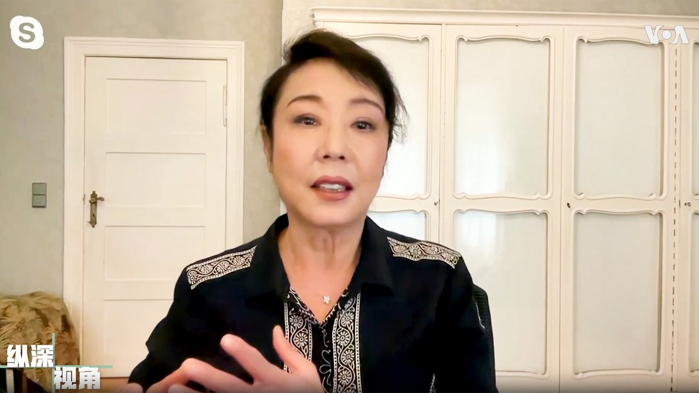
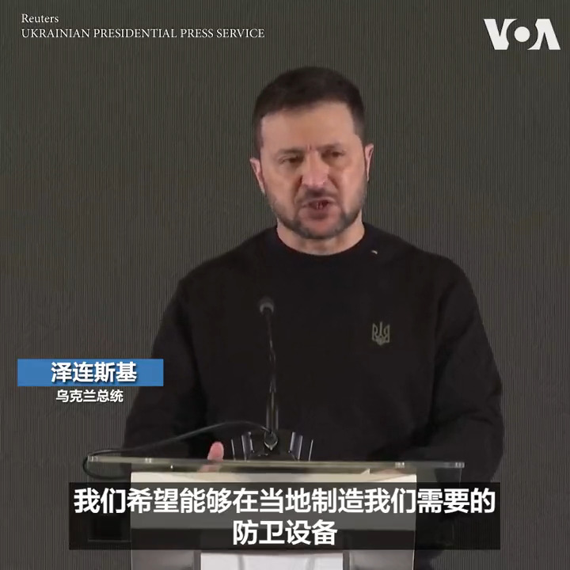
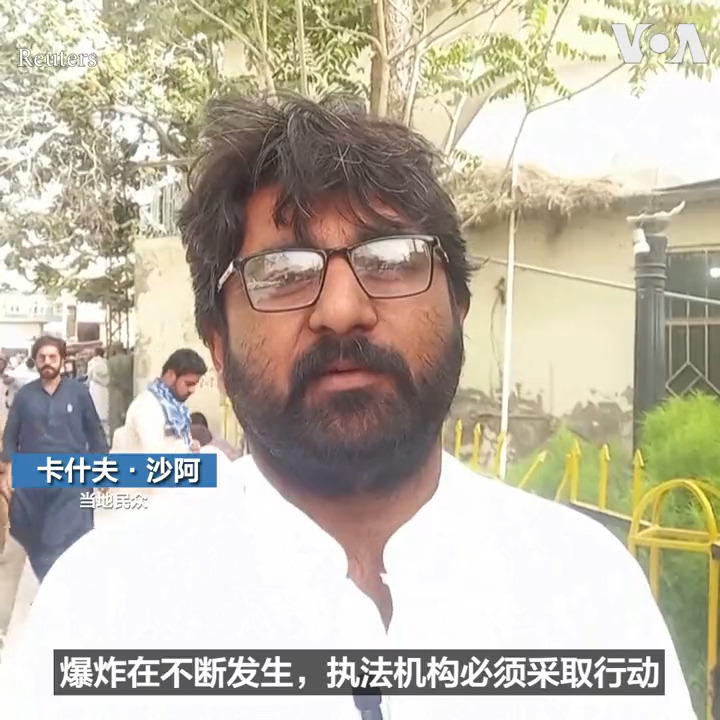
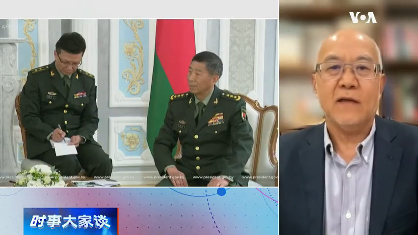
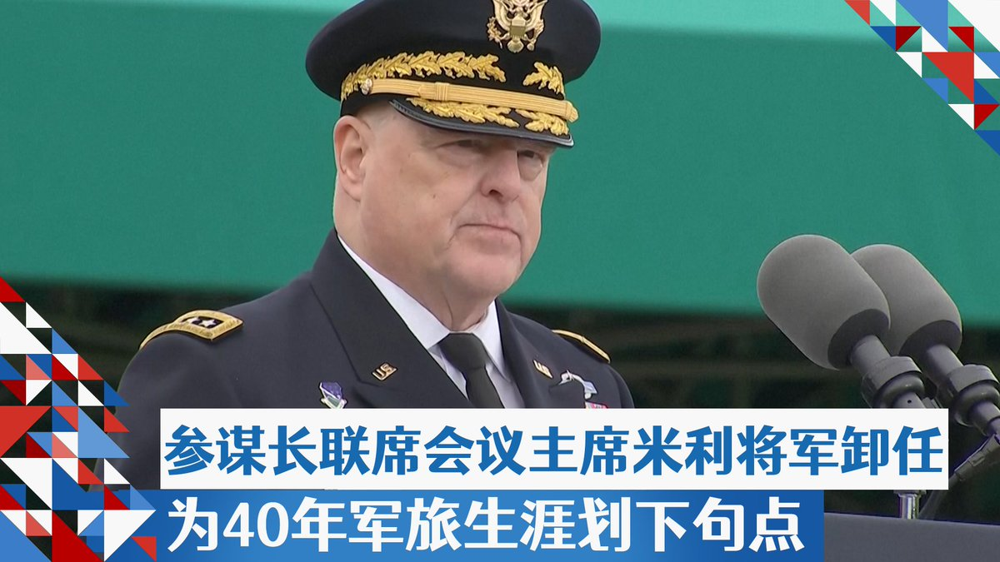
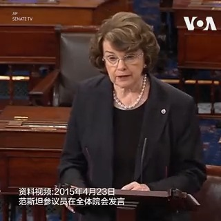
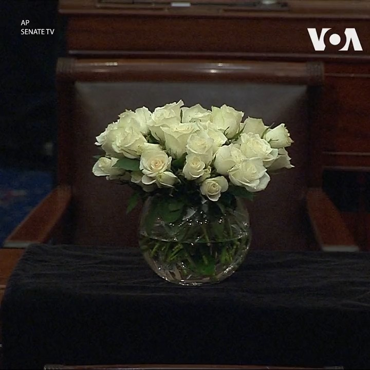

美国之音中文网 北京时间 2023-09-30T23:10:05Z 1708137142818677169 外资三季度抛售中国股票创纪录，资本加快逃离 https://t.co/i82zmTDbJh   美国之音中文网 北京时间 2023-09-30T23:00:02Z 1708134616392225277 美籍华人作家严歌苓刚出版她第一本完全不受中共审查的禁书《米拉蒂》，她表示，中国人正在经历的已经超乎常理，三年疫情后现在领导又一个接一个失踪，根本不是一个正常社会，也已无法用控诉、愤怒、哀伤来表现，她只能用荒诞才能写出这种苦难和魔幻。#美国之音纵深视角完整版 https://t.co/op3cs7uLnR https://t.co/2Ow0a2m3o8   美国之音中文网 北京时间 2023-09-30T23:14:32Z 1708138265335722413 罗马天主教教宗方济各30日主持了包括香港教区主教周守仁在内的21位新枢机主教cardinals的任命仪式。 https://t.co/21MsPLNkhf   美国之音中文网 北京时间 2023-09-30T21:43:11Z 1708115276187713997 乌克兰总统泽连斯基30日在一个国际制造商论坛上表示希望与西方武器制造商合作来提高乌克兰的制造和维修能力。来自30多个国家的武器制造商的代表参加了这次论坛。 https://t.co/53pJ5QKAeL   美国之音中文网 北京时间 2023-09-30T21:50:33Z 1708117131106402518 专访严歌苓：中国知识分子的觉醒与幻灭 https://t.co/HUe49RinI7   美国之音中文网 北京时间 2023-09-30T22:00:01Z 1708119510363107351 9月以来，乌克兰反攻在东部和南部两条战线上都继续取得进展，在南部扎波罗热地区已经十分接近俄军最核心的防线。乌克兰军队随时会发动正面强攻，可能成为反攻行动以来最激烈的战斗。主持人马克在本期《鹰与盾》节目中为您详细分析这一战争态势背后的重要意义。 https://t.co/wgsY0yqjW7   美国之音中文网 北京时间 2023-09-30T19:01:05Z 1708074481489674749 马尔代夫总统决选成为亲印、亲中路线角力场 https://t.co/MqBYts9I5y   美国之音中文网 北京时间 2023-09-30T19:44:05Z 1708085302508552543 巴基斯坦俾路支省 Balochistan 的民众30日悼念29日死于自杀式炸弹袭击的死难者并呼吁政府采取行动。在当地一家医院，人们在看望受伤的亲属。巴基斯坦官员说这次袭击造成了55人死亡。袭击者在一辆警车附近引爆了炸弹。临近的开伯尔-普什图省的一家清真寺同一天也发生爆炸，造成5人死亡。 https://t.co/ecmFL2S28O   美国之音中文网 北京时间 2023-09-30T19:50:00Z 1708086790543020476 【家事国事天下事，你有何见解】
中国国防部长长期失踪，记者问该部发言人部长的下落，发言人说不知情。中国外交部长长期失踪，记者问其发言人部长的下落，发言人说不知情。联合国成员国193个，发生这种怪事的只有中国。有人说这显示了中国当局的笨拙，有人说显示了中国的不稳定。世界之大无奇不有。 https://t.co/NcEAuAcosf   美国之音中文网 北京时间 2023-09-30T16:23:34Z 1708034838912282762 美国谴责中国对维吾尔族学者热依拉·达吾提的无期徒刑判决 https://t.co/YIVoITmdIf   美国之音中文网 北京时间 2023-09-30T15:39:34Z 1708023768705302613 中国房市低迷下 官方公布新数据显示经济触底回升迹象 https://t.co/JFR1V0ga8K   美国之音中文网 北京时间 2023-09-30T13:42:33Z 1707994321679712397 美国国务院任命资深外交官马克·兰伯特为对华政策最高官员 https://t.co/ac6oEcNVc6   美国之音中文网 北京时间 2023-09-30T04:48:33Z 1707859933629444199 发布限制措施引发反弹后，中国宣布将对某些跨境数据传输免除安全审查 https://t.co/bRxfXBpqsr   美国之音中文网 北京时间 2023-09-30T07:00:00Z 1707893013928952068 美籍华人作家严歌苓刚刚出版她第一本完全不受中共审查的禁书《米拉蒂》，从文革贯穿到六四、生动描绘中国80年代知识份子的觉醒与幻灭。美东时间本週六上午9点到10点，【#纵深视角】带您随着严歌苓的《米拉蒂》，走进当今中国这齣荒诞而悲怆的讽刺剧、透视中国社会美丑颠倒的“罗刹海市”。 https://t.co/6tehRzMHtR   美国之音中文网 北京时间 2023-09-30T11:55:34Z 1707967396991156298 分析：中国向塔利班派驻大使彰显北京在阿富汗的野心 https://t.co/23XUtOZQWY   美国之音中文网 北京时间 2023-09-30T05:59:33Z 1707877803641954677 中国官媒大肆渲染印度和加拿大之间的争端 https://t.co/bfJhaz84jy   美国之音中文网 北京时间 2023-09-30T07:50:00Z 1707905596308033828 【家事国事天下事，你有何见解】
中国国防部长长期失踪，记者问该部发言人部长的下落，发言人说不知情。中国外交部长长期失踪，记者问其发言人部长的下落，发言人说不知情。联合国成员国193个，发生这种怪事的只有中国。有人说这显示了中国当局的笨拙，有人说显示了中国的不稳定。世界之大无奇不有。 https://t.co/OOTRewXO04   美国之音中文网 北京时间 2023-09-30T08:08:10Z 1707910170733662356 美国联邦政府停摆迫近，北京借机“大做文章” https://t.co/zqpDYcMHjT   美国之音中文网 北京时间 2023-09-30T09:29:09Z 1707930548583252118 活动人士对中国支持的乌干达石油管道感到担忧 https://t.co/tAnXDyfm6r   美国之音中文网 北京时间 2023-09-30T03:23:33Z 1707838543555604886 美最高法院同意审理限制社交媒体平台的州法是否违宪 https://t.co/fczYFP0pXR   美国之音中文网 北京时间 2023-09-30T05:30:00Z 1707870364775461320 李尚福、秦刚神秘消失，斯坦福大学中国经济与制度中心高级研究员吴国光认为这不是反腐败而是习近平斯大林式大清洗。他指出，历史现象不可能完全重复，这里关注的是逻辑问题。他大胆预言这两人失踪只是开头，在未来的5-10年中，中国高层政坛不会平静。#时事大家谈 完整版：https://t.co/J9BvEKRyJm https://t.co/QmlvjfFWOA   美国之音中文网 北京时间 2023-09-30T06:40:09Z 1707888018856779990 承认在亚洲行贿,美国雅宝公司支付数亿美元罚款 https://t.co/xluX7ByTC2   美国之音中文网 北京时间 2023-09-30T07:03:30Z 1707893894942204204 年9月，中国提出“一带一路”倡议已满十周年，东南亚是这项大型基建投资计划的重点区域。尽管中国与东盟的经贸投资金额履创新高，但有观察人士忧心“一带一路”带来的债务、环保及非法犯罪问题，也凸显东南亚多国的法规机制仍不够完善。https://t.co/bNvYSESKRJ https://t.co/IhoWbAoSdk   美国之音中文网 北京时间 2023-09-30T08:08:09Z 1707910163209019573 美国与马绍尔群岛安全协议因核试赔偿法律定义纠结而遇阻，批评人士警告中国将趁虚而入 https://t.co/cXW1jEWypn   美国之音中文网 北京时间 2023-09-30T08:36:35Z 1707917319509303664 美军最高将领米利将军卸任，为40多年军旅生涯划下句点 https://t.co/3ro7dQnyDm   美国之音中文网 北京时间 2023-09-30T09:02:17Z 1707923789059608816 “在战争造成最大伤亡时，他照顾部下身体和精神上的伤害。这就是领导力，这就是爱国，这就是力量。这就是马克·米利，”拜登总统9月29日在谈到当天卸任的美军参谋长联席会议主席米利将军时说。参联会主席是美军最高将领，带您了解米利是位什么样的领导者。报道： https://t.co/O0wJLKlRRI https://t.co/4fh3AAXEaA   美国之音中文网 北京时间 2023-09-30T09:03:05Z 1707923990118109360 一次看懂“美国联邦政府关门危机”六大重点 https://t.co/bJ5QujlS03   美国之音中文网 北京时间 2023-09-30T01:24:04Z 1707808473130610818 东帝汶总统要邻国安心，它与中国没有军事合作也会警惕债务陷阱 https://t.co/Gt1IWAK5DA   美国之音中文网 北京时间 2023-09-30T05:59:35Z 1707877811107901448 退役参联会主席米利将军告别讲话，誓言绝不效忠“想当独裁者的人” https://t.co/ajghmsrmVi   美国之音中文网 北京时间 2023-09-30T00:05:35Z 1707788725030392103 恒大一众高管均被警方控制，覆巢之下安有完卵？ https://t.co/IDH6xlcoEL   美国之音中文网 北京时间 2023-09-30T00:23:54Z 1707793333383229599 香港中秋节传统民俗活动大坑舞火龙9月28日拉开帷幕。夜幕降临后，一条由珍珠草扎成的火龙在舞者的操作下起伏翻飞。这场活动将持续三天。受疫情影响，大坑舞火龙曾停办三年，今年是疫情过后首次举办。 https://t.co/gm7d6Fg6ls   美国之音中文网 北京时间 2023-09-30T02:07:05Z 1707819297811345684 名画被指裸露 初选案还柙邹家成拟司法覆核寻文化公义 囚权组织忧或更被针对 https://t.co/mWe5Cka7qa   美国之音中文网 北京时间 2023-09-30T03:29:05Z 1707839934705578075 “一带一路”迈入十周年: 东南亚是大幅受益或反招不良后果? (1) https://t.co/CmxnRWP8Nt   美国之音中文网 北京时间 2023-09-30T00:02:19Z 1707787901092667535 美国国会代表加州的民主党参议员范斯坦 Dianne Feinstein28日晚去世,  享年90岁。范斯坦1992年当选参议员，是目前国会最年长的参议员,  也是美国历史上任职时间最长的女参议员。 https://t.co/WEfIsu7D2v   美国之音中文网 北京时间 2023-09-30T00:21:09Z 1707792639901458653 普京下令瓦格纳“志愿军部队”换将继续在乌克兰作战 https://t.co/jjS10In03L   美国之音中文网 北京时间 2023-09-30T01:38:35Z 1707812127204127001 美国民主党籍资深联邦参议员范恩斯坦辞世，拜登赞她是“历史性人物” https://t.co/rfyll6i5Os   美国之音中文网 北京时间 2023-09-30T02:07:10Z 1707819322226389183 一带一路在中亚：中国借机扩大经济和地缘政治影响力 https://t.co/vR6EqBvZOm   美国之音中文网 北京时间 2023-09-30T02:12:00Z 1707820538519822406 美国国会参议院29日举行默哀, 悼念民主党参议员范斯坦 (Sen. Dianne Feinstein)。范斯坦在参议院的桌子盖上了黑丝绒布, 桌上摆着装有白色玫瑰的花瓶 。范斯坦参议员28日去世,  享年90岁。她1992年当选参议员，是目前国会最年长的参议员, 也是美国历史上任职时间最长的女参议员。 https://t.co/QsrRF1SbqJ   美国之音中文网 北京时间 2023-09-30T00:21:13Z 1707792655588225209 中俄贸易增长有多快？俄罗斯停靠的大量中国集装箱空船说明一切 https://t.co/CjuZbxcilA   