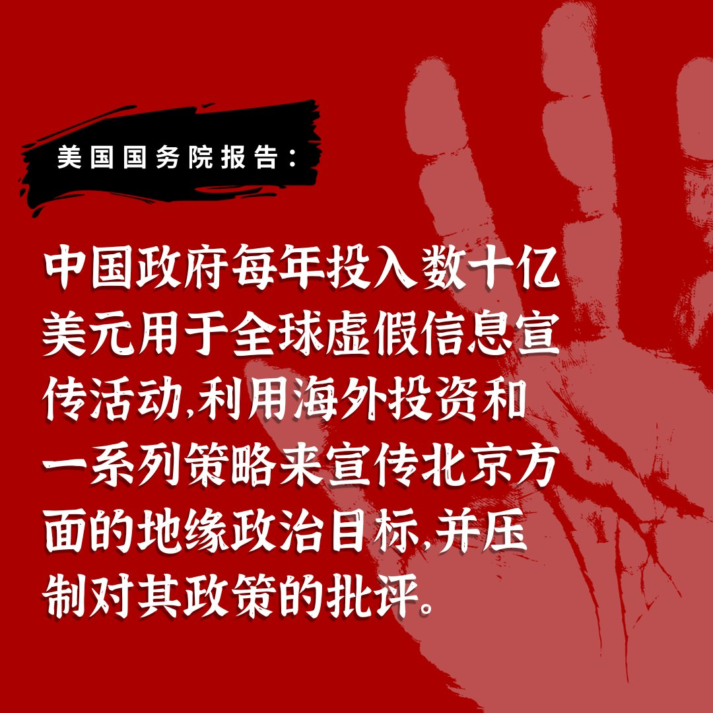
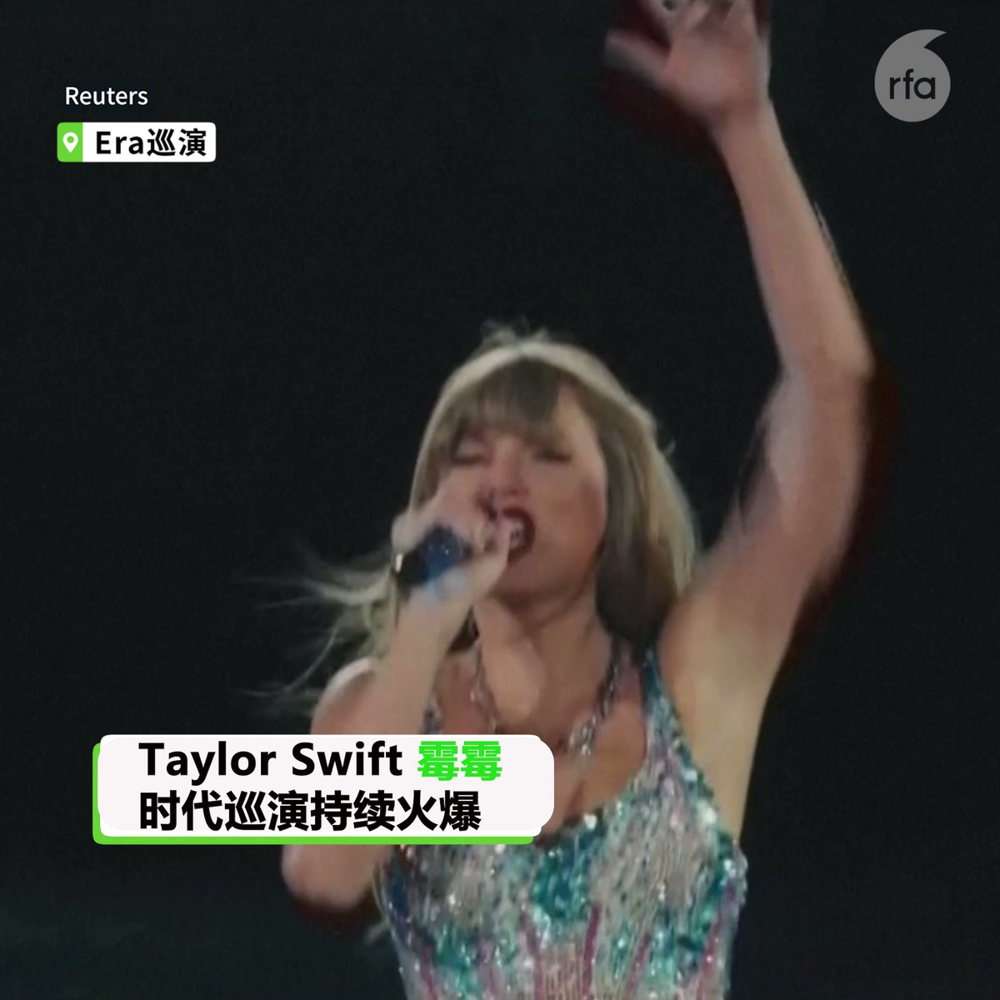
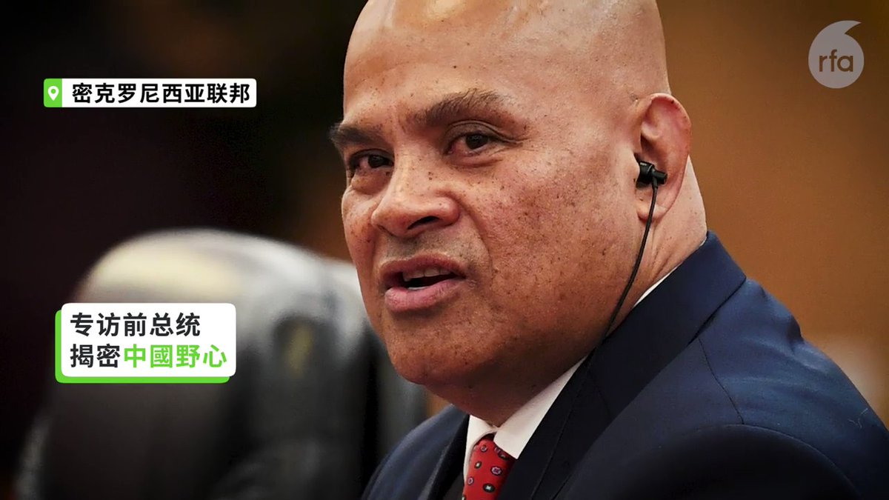

自由亚洲电台 北京时间 2023-09-30T21:48:51Z 1708116699612864648 RT @RFA_Chinese: 【同是号召投票 | 美国香港两重天】近日 #TaylorSwift （#霉霉 ) 发贴号召其粉丝注册选民投票， 激发美国 #选民登记 暴增1226%。而一洋之隔的香港，47人因倡议组织2020 #立法会 初选投票，被控 #颠覆国家政权。本周再有…   自由亚洲电台 北京时间 2023-09-30T18:48:55Z 1708071420180189489 RT @RFA_Chinese: 【#恒大 债务无法清偿 中国面对 #系统性风险】
【外资投入中国1.2万亿 或血本无归】
https://t.co/d6xuqhqSEf
东华大学新经济研究中心主任 #陈松兴，经济学者 #程晓农 ：中国如不彻底处理结构性的债务问题，将面对 #系…   自由亚洲电台 北京时间 2023-09-30T18:52:15Z 1708072259749859680 RT @RFA_Chinese: 【亚太报道（2023-9-23）】
欢迎收听和订阅播客 https://t.co/MjLNSvVMqc

#习近平 发表 #国庆讲话 / #陈思明 在台湾机场度过中秋 / #许家印 被抓或牵动中国政经走向 / 网民热议“#降薪时代”来临 / 中…   自由亚洲电台 北京时间 2023-09-30T20:02:09Z 1708089850635698551 RT @RFA_Chinese: #陈思明：“第一天到台湾，桃园机场移民局的长官就给我一盒月饼，#台湾… https://t.co/2057tQ1I1y   自由亚洲电台 北京时间 2023-09-30T12:24:02Z 1707974562460119242 RT @RFA_Chinese: 9月29日《参考消息》称：“北京正成为世界的思想首都”
【#您怎么看？】请用一句话写观后感。 https://t.co/rTdJDD2BDp   自由亚洲电台 北京时间 2023-09-30T05:26:08Z 1707869392891945464 【#您怎么看】9月28日，美国国务院发布《中华人民共和国如何重塑全球信息环境》报告，称中国正在使用各种方法进行宣传，包括购买媒体机构的股份和使用社交媒体。报告警告，北京的信息操纵如果不加以控制，中国的努力将重塑全球信息格局，造成偏见和差距，甚至可能导致各国做出将其经济和安全利益置于北京利益之下的决策。   自由亚洲电台 北京时间 2023-09-30T07:00:09Z 1707893053909074194 【亚太报道（2023-9-23）】
欢迎收听和订阅播客 https://t.co/MjLNSvVMqc

#习近平 发表 #国庆讲话 / #陈思明 在台湾机场度过中秋 / #许家印 被抓或牵动中国政经走向 / 网民热议“#降薪时代”来临 / 中国副外长 #孙卫东 访美 https://t.co/lsmhIl8Cwa   自由亚洲电台 北京时间 2023-09-30T12:01:32Z 1707968899906425226 【同是号召投票 | 美国香港两重天】近日 #TaylorSwift （#霉霉 ) 发贴号召其粉丝注册选民投票， 激发美国 #选民登记 暴增1226%。而一洋之隔的香港，47人因倡议组织2020 #立法会 初选投票，被控 #颠覆国家政权。本周再有两人认罪。 https://t.co/Mqyc4bP7cc   自由亚洲电台 北京时间 2023-09-30T05:34:19Z 1707871451200856398 9月28日，美国务院报告《#中华人民共和国如何重塑全球信息环境》警告：若北京当局成功输出 #数位威权，将使全球 #言论自由 急速收缩。同时，各国民众、媒体、学术界和政府官员等各界人士在接收到与中国相关的信息时，相关资讯都会是经过审查、宣传和假信息扭曲的内容。

 https://t.co/FJzN25Zgvn   自由亚洲电台 北京时间 2023-09-30T08:30:01Z 1707915667129946167 专栏 | #财经时时听：末日临近？#恒大 美元债重组生变清算倒计时
 https://t.co/jjUEljDRO4   自由亚洲电台 北京时间 2023-09-30T05:53:54Z 1707876380820799610 中国国务院周五（9月29日）发布了《关于释放旅游消费潜力推动旅游业高质量发展的若干措施》，文件显示，中国将恢复免签政策，并考虑将更多国家列入免签名单，以帮助提振疫情后的旅游业务。 https://t.co/M1UlrIyliC   自由亚洲电台 北京时间 2023-09-30T07:30:02Z 1707900571481739691 专栏 | #周末茶馆：中国 #医疗反腐 风暴能斩断腐败链吗？
 https://t.co/t1MfrGaA7Y   自由亚洲电台 北京时间 2023-09-30T07:37:05Z 1707902345462333445 【专栏 | #夜话中南海：#邓朴方 和他的 #康华 在 #八九学潮 中的政治表演】 
详见https://t.co/xCGQkzUKCA https://t.co/fgkeGY5WtM   自由亚洲电台 北京时间 2023-09-30T08:00:06Z 1707908140950499775 专栏 | #周嘉有话说：低迷的经济与奢华的 #亚运
#周孝正
 https://t.co/Xhlb9nDBjI   自由亚洲电台 北京时间 2023-09-30T08:36:45Z 1707917363243630989 9月29日是中国黄金周第一天，国内游客涌入杭州西湖。当路透社记者街头采访中国游客“为什么不出国游？”他们这样回答……#您怎么看？ https://t.co/qeNMDO8nGV   自由亚洲电台 北京时间 2023-09-30T03:00:29Z 1707832739175739824 近期中国海警船只使用激光、水炮等驱赶当地菲律宾渔民 并且设置浮动屏障，引发国际批评。美国众议院外交事务委员会亚太小组主席金映玉指出，中国的行径堪称“霸凌及恐吓”：“我们八月出访时，听到每个国家的表态都是一致的，那就是中国能这么做是因为几乎或根本不会受到抵制”

 https://t.co/1feLK4bjCO   自由亚洲电台 北京时间 2023-09-30T04:31:00Z 1707855518688284968 #美中关系 已经“止跌”？
近日，中国外交部副部长孙卫东访美，并在华盛顿会见了美国亚太事务助理国务卿康达。外界普遍认为，美中两国今年以来频频推动高层官员互访，是为中国领导人 #习近平 年底访美铺路。

 https://t.co/lQPKIVTHnD   自由亚洲电台 北京时间 2023-09-30T06:01:44Z 1707878352978067630 【“#电报”与 #腾讯 合作打造新微信　网友跳船为时已晚？】
美国科技媒体TechCrunch周二（26日）报道，即时通讯软件Telegram正与其加密货币合作伙伴TON基金会及中国腾讯公司合作，打造一个类似于微信的应用软件。

Telegram被中文用户称为“电报”，在中文世界拥有大量用户；尤其不少大陆的用户，为了逃避中国的网路审查，使用电报与外界联系。海外媒体也经常通过电报寻找国内的受访者。

据本台粤语部报道，电报与腾讯合作的消息传出后，不少人担心国内的审查机制会延伸到电报上，对自己使用电报的安全性造成影响。

一位信息技术业内人士告诉本台，他担心电报与腾讯合作后会向中国妥协，被迫向中国政府交出用户数据。他建议用户考虑转往其他平台。

也有海外媒体人士称，现在电报用户跳船已经为时已晚；很多异议人士使用电报，留下了大量的重要信息；一旦电报与腾讯的合作达成，更换平台也无济于事。他认为，电报之所以与腾讯合作，是因为资金紧张。

人权组织“中国人权”则警告说，这一合作可能会令电报和第三方开发者收集大量的用户身份数据。   自由亚洲电台 北京时间 2023-09-30T03:27:43Z 1707839591737340280 不逢五，不逢十，#习近平 发表 #国庆讲话 是为贬低总理， 抬高自己吗？

 https://t.co/3FoiZgsJgM   自由亚洲电台 北京时间 2023-09-30T03:43:49Z 1707843642419982786 在第78届联合国大会开幕之后，北加州的多个 #台湾 侨团发布了挺 #台湾加入联合国 的影片，于9月28日公布在推特（X）、油管（YouTube）、脸书（Facebook）等多个社交平台上。这是当地台侨近期声援台湾入联活动的一部分。

 https://t.co/XGt9C5lRck   自由亚洲电台 北京时间 2023-09-30T00:44:52Z 1707798608026984958 9月29日《参考消息》称：“北京正成为世界的思想首都”
【#您怎么看？】请用一句话写观后感。 https://t.co/rTdJDD2BDp   自由亚洲电台 北京时间 2023-09-30T01:14:08Z 1707805975871160369 #陈思明：“第一天到台湾，桃园机场移民局的长官就给我一盒月饼，#台湾 月饼。昨天（9月28日）又送我一盒月饼。甚至给我买来了辣椒。我湖南人喜欢吃辣椒。这跟在中国大陆完全不同。我觉得他们都像是我们的亲人，给我的感觉很温馨、很礼貌、很热情。在中国只有家人才会这样对待我。台湾社会真的是温良恭俭让。人与人之间的关系跟中国（大陆）完全不同。”
https://t.co/7kEvLtOHep   自由亚洲电台 北京时间 2023-09-30T01:41:05Z 1707812755040846151 RFA推出"#一带一路十周年 专题"，记者赴西太平洋岛国 #密克罗尼西亚，专访在卸任前以一封长信揭露中国威胁的前总统帕努埃洛，并考察 #中国援建项目，发现工程品质堪忧，聘雇当地人的承诺也不符预期。
https://t.co/QRo3an6Sof https://t.co/l62z9b02u7   