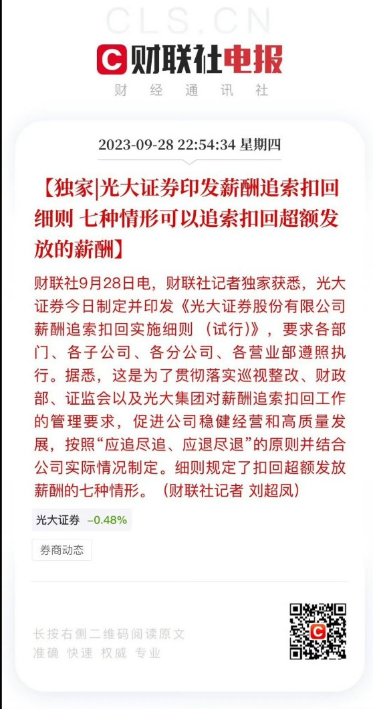
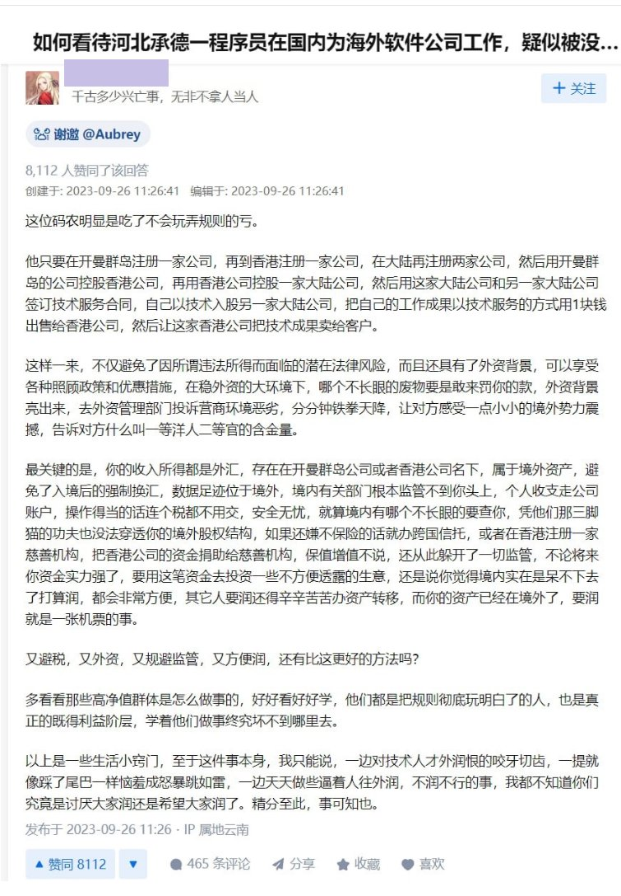
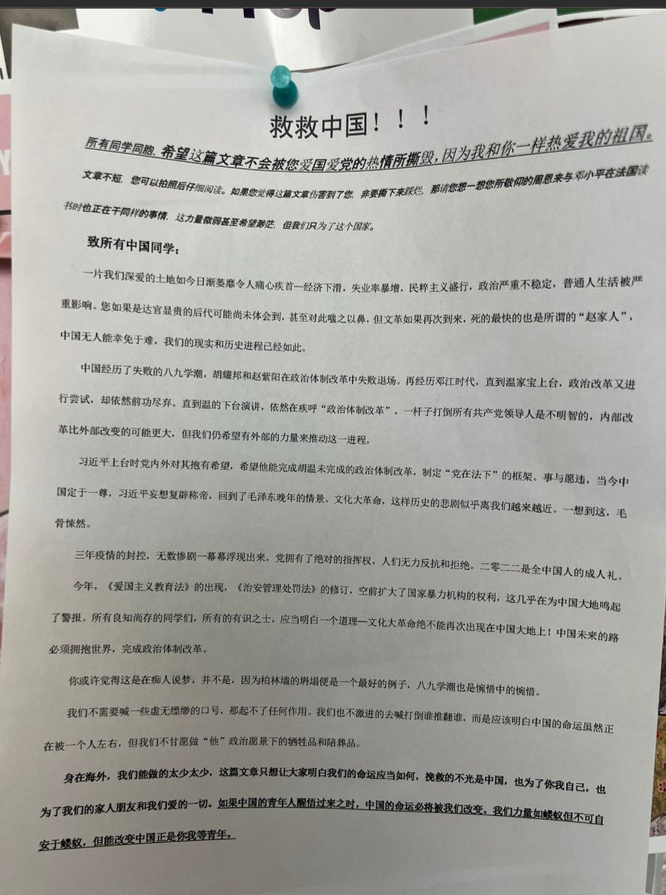
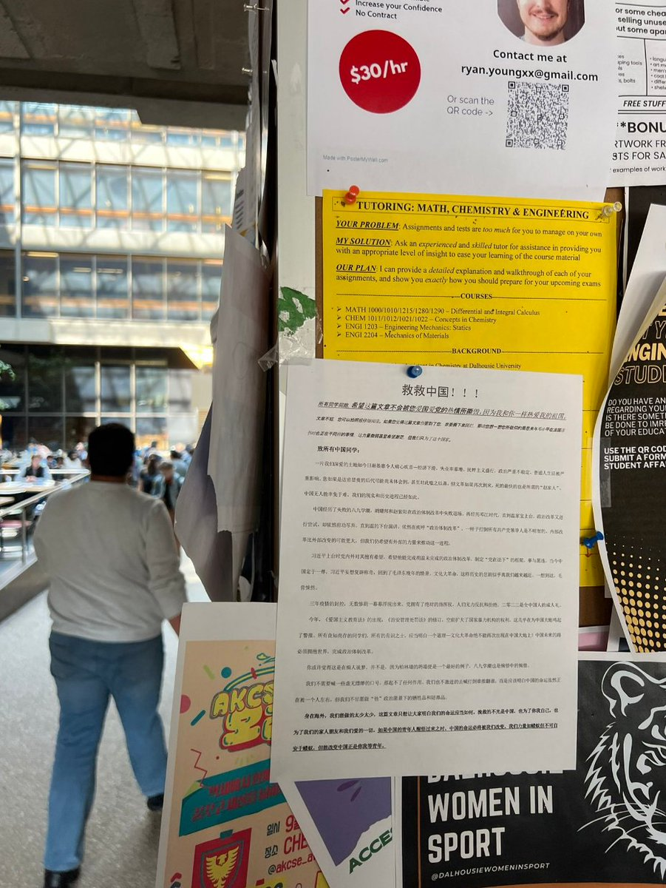

A李老师不是你老师 北京时间 2023-09-29T13:45:00Z 1707632547323080802 “应追尽追，应退尽退”
继各地公务员系统开始追索绩效奖后，9月28日，光大证券引发薪酬追索扣回细则。七种情形下可以追索扣回超额发放的薪酬。 https://t.co/y4iqNlrPgF   A李老师不是你老师 北京时间 2023-09-29T07:22:48Z 1707536363615076518 网友投稿
如何看待承德程序员被罚款事件？
高赞回答：一些生活中的小窍门 https://t.co/xyXX4pzLNE   A李老师不是你老师 北京时间 2023-09-29T04:58:46Z 1707500118641914191 9月28日，加拿大达尔豪斯大学
有学生张贴告示，呼吁“救救中国” https://t.co/JZDkQZTVDX   