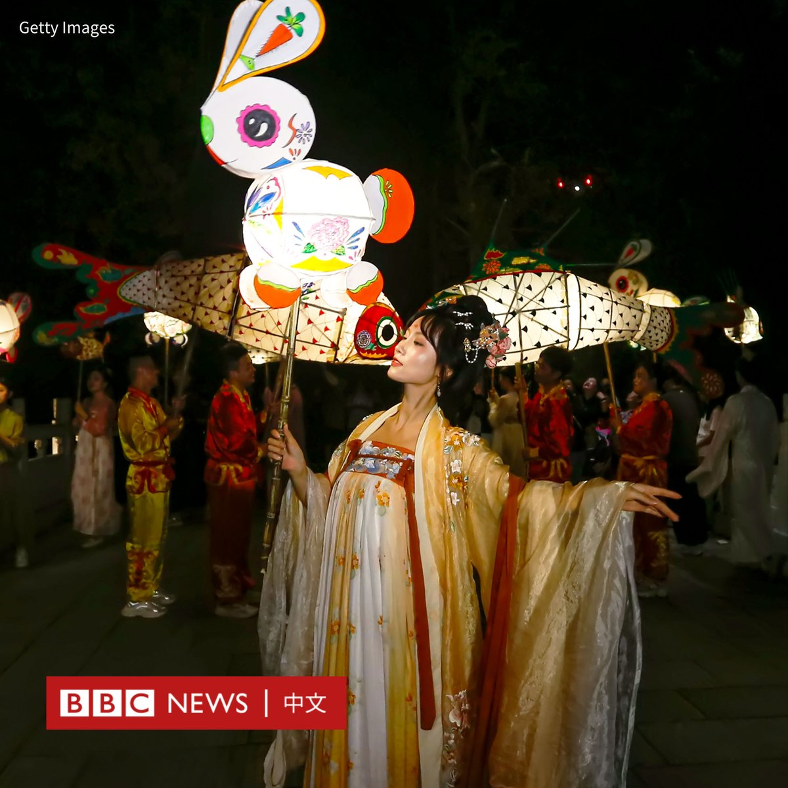
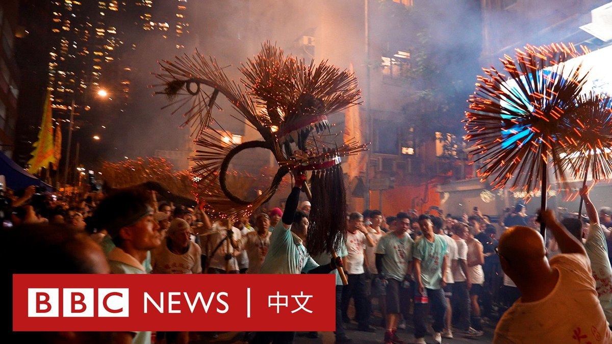
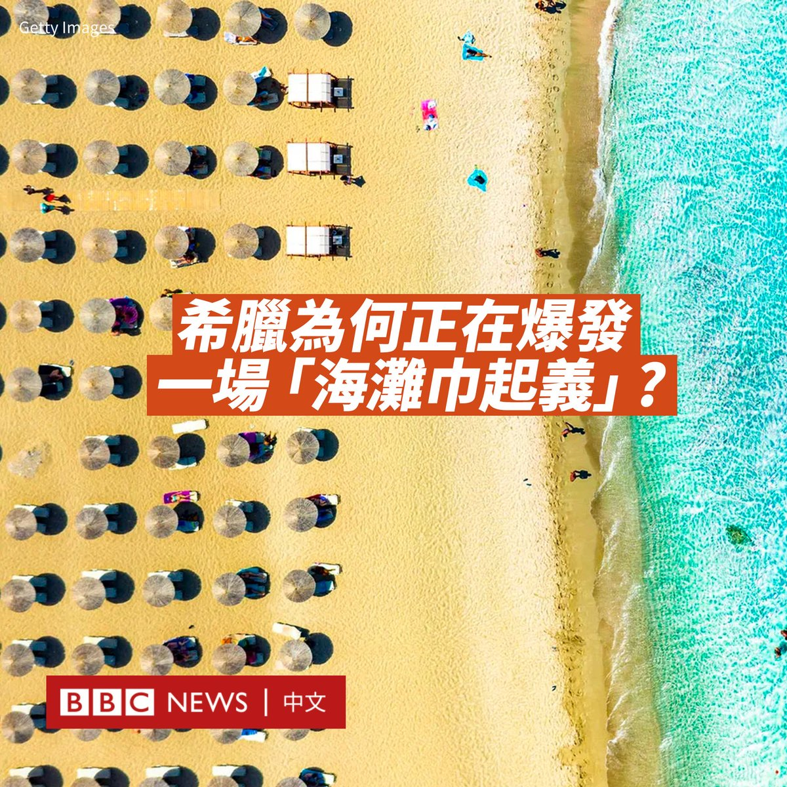
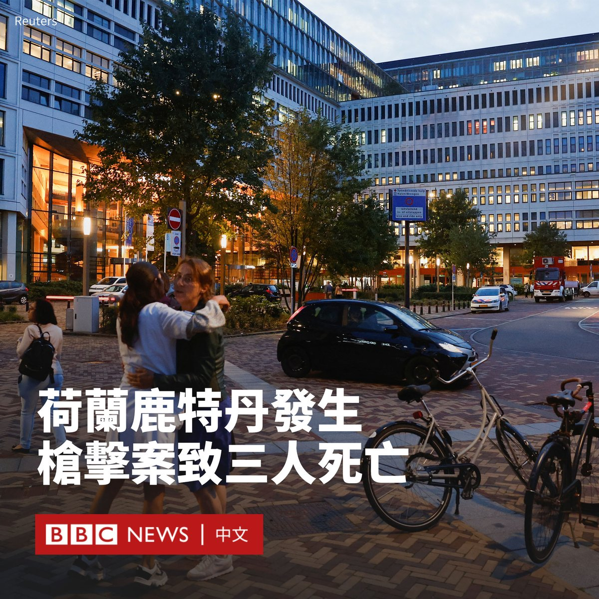
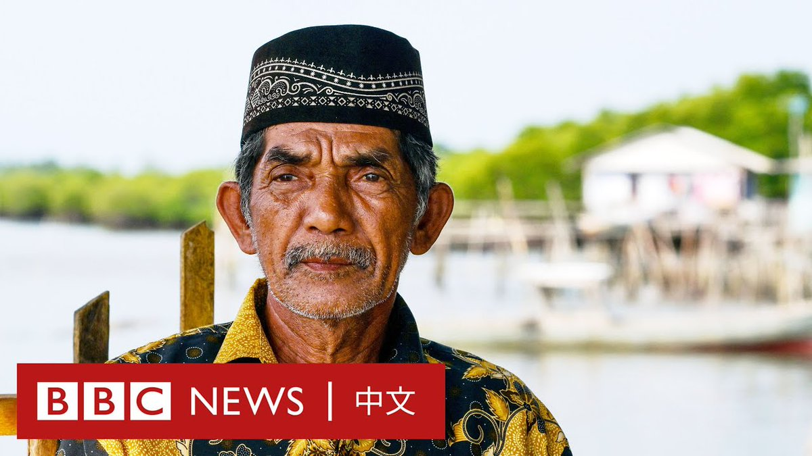

D英国广播公司BBC 北京时间 2023-09-29T21:16:14Z 1707746105822433330 中秋节来临，中国东部的安徽古镇宏村周四（9月28日）举办了花灯巡游活动，庆祝这个仅次于春节的华人第二大传统节日。🥮🌕

人们舞动兔子和鱼形状的花灯，点亮了这个黄山脚下的村落，也吸引了很多游客驻足观看。

据中国媒体报道，“闹灯会”是该镇所在的徽州地区拥有千年历史的文化传统。这些花灯是手工用棉纸糊制，有喜庆平安之意。   D英国广播公司BBC 北京时间 2023-09-29T19:54:44Z 1707725595772358825 随着中秋节的来临，在香港有着百年历史的“大坑舞火龙”在一片人声鼎沸中登场，这是该活动时隔三年后首次恢复举办。

在夜色中，全长近70米的火龙熠熠生辉，其长度相当于五辆巴士。不断舞动的龙身还插满数万支长寿线香，以求祛病消灾。 https://t.co/m5dXDUg1AD   D英国广播公司BBC 北京时间 2023-09-29T18:07:10Z 1707698523242946735 Meta宣布将推出一系列新的聊天机器人，以此吸引年轻用户。这些聊天机器人据称将拥有“个性”，并专注于特定主题，例如假期安排或烹饪建议。

Meta的老板扎克伯格（Mark Zuckerberg）表示，这些聊天机器人仍处于“有限的”的开发阶段。

Meta日前在加州举办了自疫情爆发以来的首次现场活动，扎克伯格表示，对人工智能来说这是“令人惊叹的一年”。

该公司将其主要聊天机器人称为“Meta AI”，可用于短讯聊天。例如，用户可以在聊天中向Meta AI提问以“解决争论”，又或提出其他问题。

该聊天机器人基于Llama 2，这是Meta于7月发布的大型语言模型。扎克伯格表示：“这不仅仅是为了回答问题。这是关于娱乐。”

几位名人也已经签约，将自己的个性“借”给不同类型的聊天机器人，包括美国饶舌歌手史努比狗狗（Snoop Dogg）和真人秀明星肯达尔·詹娜（Kendall Jenner）。

据Meta称，美国国家橄榄球联盟（NFL）明星汤姆·布雷迪（Tom Brady）将扮演一个名为“布鲁”（Bru）的人工智能角色——一名“幽默风趣的体育辩论者”，YouTube博主MrBeast将扮演一个名为“扎克”（Zach）的会时常讥讽人的大哥角色。

这些聊天机器人将在未来几天先于美国推出。   D英国广播公司BBC 北京时间 2023-09-29T14:25:25Z 1707642717969465446 在希腊，一场名为“海滩巾起义”的抗议浪潮席卷了全国多地。许多当地人带着毛巾前往海滩，铺在沙滩上“宣誓主权”，而拒绝向划地为王的度假村缴纳任何费用。

抗议活动始于今年5月。爱琴海中部帕罗斯岛上的居民们表示，人们可以免费游泳和日光浴的地方越来越少。由于游客的大量涌入，很多滨海区域都被酒吧、酒店或其他度假场所占据。

希腊规定在海滩边搭建躺椅和雨伞的企业必须向希腊财政部申请使用海滩指定区域的许可证，而当局会定期进行检查，以确保它们不会占用超出许可的空间。然而，抗议者声称，这些检查鲜有进行。

居民们创建了一个脸书页面开始组织示威活动，呼吁当局打击这些违规的运营者。他们还使用无人机对非法安装日光浴躺椅的商家进行记录，将其位置与许可区域进行比较。他们称，一些地方的躺椅和雨伞区域是许可区域的十倍大。

9月以来，这场运动的势头迅速增强，蔓延到全国各地。9月3日，希腊多个地区同时爆发了“海滩巾起义”，包括邻近的纳克索斯岛和南部的克里特岛。

纳克索斯岛抗议活动发言人埃莱妮·安德里亚诺普鲁（Eleni Andrianopoulou）表示，她和其他当地人近年来一直对海滩的过度开发感到沮丧，但一直不确定如何行动。在得知帕罗斯的抗议后，他们立即受到启发，加入其中。

自十多年前希腊的债务危机以来，许多希腊人仍然生活拮据，甚至无法负担起海滩的躺椅。而由于阳光和大海是希腊文化中的重要一部分，很多希腊人对在海滩度假有着强烈的童年记忆。

希腊是欧洲最受欢迎的度假胜地之一。2021年，该国迎来了1500万游客，是希腊总人口的1.5倍。

在舆论压力之下，当局对帕罗斯岛受影响最严重的海滩进行了检查，一些日光浴躺椅被撤走。在纳克索斯岛，当局也进行了检查，但许多企业主提前得到了警报，在检查人员到达之前移走了违规的躺椅。

活动人士表示，海滩只是更大斗争的一部分，他们希望过度旅游以及随之而来的社会和环境问题得到解决。   D英国广播公司BBC 北京时间 2023-09-29T13:12:54Z 1707624468678607185 荷兰鹿特丹周四（9月28日）发生枪击案，造成至少三人死亡。当地警方指，已经逮捕涉案男子。

据报道，这名32岁的男子先闯入一所住宅，枪杀了一名39岁的女子和她14岁的女儿，并进行纵火。

然后，他再到附近的一家医院行凶，导致一名43岁的大学男教师死亡。

画面显示，一名身穿迷彩服的男子在医院被戴上手铐带走。行凶动机尚不清楚。

一名自称最先到场的保安告诉BBC，这是“令人震惊”的一天，表示“太可怕了”。他说，这名枪手并非通过正门进入该医院。

目击者称，有人看到医院工作人员带着病患跑出大楼，其中一些患者躺在担架上。另一名目击者称，首先听到四五声枪声，然后有人投掷了燃烧瓶。

案发后，包括狙击手在内的警察赶往医院，有直升机在医院大楼上空盘旋。

荷兰首相马克·吕特（Mark Rutte）在社交媒体上写道：“我向暴力事件的受害者、他们的亲人以及所有深陷恐惧的人们表示哀悼”。

鹿特丹警方在新闻发布会上表示，这名嫌犯并不是初犯，他两年前曾因虐待动物被定罪。没有迹象表明有第二名凶手。

据报道，他曾在该医院所属的伊拉斯姆斯大学（Erasmus University）就读。   D英国广播公司BBC 北京时间 2023-09-29T14:23:17Z 1707642183548117390 在希腊，一场名为“海滩巾起义”的抗议浪潮席卷了全国多地。许多当地人带着毛巾前往海滩，铺在沙滩上“宣誓主权”，而拒绝向划地为王的度假村缴纳任何费用。

抗议活动始于今年5月。愛琴海中部帕羅斯島（Paros）上的居民们表示，人们可以免费游泳和日光浴的地方越来越少。由于游客的大量涌入，很多滨海区域都被酒吧、酒店或其他度假场所占据。

希腊规定在海滩边搭建躺椅和雨伞的企业必须向希腊财政部申请使用海滩指定区域的许可证，而当局会定期进行检查，以确保它们不会占用超出许可的空间。然而，抗议者声称，这些检查鲜有进行。

居民们创建了一个脸书页面开始组织示威活动，呼吁当局打击这些违规的运营者。他们还使用无人机对非法安装日光浴躺椅的商家进行记录，将其位置与许可区域进行比较。他们称，一些地方的躺椅和雨伞区域是许可区域的十倍大。

9月以来，这场运动的势头迅速增强，蔓延到全国各地。9月3日，希腊多个地区同时爆发了“海滩巾起义”，包括邻近的纳克索斯岛和南部的克里特岛。

纳克索斯岛抗议活动发言人埃莱妮·安德里亚诺普鲁（Eleni Andrianopoulou）表示，她和其他当地人近年来一直对海滩的过度开发感到沮丧，但一直不确定如何行动。在得知帕罗斯的抗议后，他们立即受到启发，加入其中。

自十多年前希腊的债务危机以来，许多希腊人仍然生活拮据，甚至无法负担起海滩的躺椅。而由于阳光和大海是希腊文化中的重要一部分，很多希腊人对在海滩度假有着强烈的童年记忆。

希腊是欧洲最受欢迎的度假胜地之一。2021年，该国迎来了1500万游客，是希腊总人口的1.5倍。

在舆论压力之下，当局对帕罗斯岛受影响最严重的海滩进行了检查，一些日光浴躺椅被撤走。在纳克索斯岛，当局也进行了检查，但许多企业主提前得到了警报，在检查人员到达之前移走了违规的躺椅。

活动人士表示，海滩只是更大斗争的一部分，他们希望过度旅游以及随之而来的社会和环境问题得到解决。   D英国广播公司BBC 北京时间 2023-09-29T10:53:41Z 1707589436958224699 印尼政府要求林邦岛（Rempang Island）的7500名居民在本月底前搬离，取而代之的将是一个巨大的中资玻璃和太阳能电池板工厂。当局更希望将该岛打造成一座创造大量就业机会的“生态城”。

然而，林邦岛的居民主要以捕鱼为生，搬迁将使他们失去工作，并彻底改变其生活方式。一些当地居民不久前在抗议时与警方发生冲突。目前，搬迁工作被推迟，但居民们担忧被驱逐只是早晚的问题。   D英国广播公司BBC 北京时间 2023-09-29T08:25:53Z 1707552239215423526 演员迈克尔·甘本爵士（Sir Michael Gambon）的家人表示，这名在《哈利波特》（Harry Potter）中饰演邓布利多的知名演员去世，享年82岁。

他的遗孀甘本夫人和儿子弗格斯（Fergus）表示，他们“挚爱的丈夫和父亲”因肺炎在医院安详去世，家人陪伴在他身边。

甘本出生于爱尔兰都柏林，在少年时搬到伦敦居住。在他长达六十年的演艺生涯中，曾广泛涉足电视、电影、戏剧和广播等领域工作，四次获得英国电影学院奖。

1960年代，他在莎士比亚作品《奥赛罗》（Othello）中初露头角。1980年代后，他凭借在国家剧院的演出三度获得奥利弗奖（Olivier Awards）。

他最出名的角色是在八部《哈利波特》系列电影中的六部里，扮演阿不思·邓布利多教授（Albus Dumbledore）——一个强大的巫师和魔法学校霍格沃茨（Hogwarts）的校长。

他还曾在2010年《国王的演讲》（The King's Speech）中饰演有口吃的国王乔治六世（George VI）的父亲乔治五世（George V）。

1998年，他因对娱乐业的贡献而被封为爵士。虽然他出生在爱尔兰，但在童年时加入英国国籍。他还在演艺界有着“伟大的甘本”（The Great Gambon）之称。

《哈利波特》电影账号在推特上发文表示哀悼：“得知迈克尔·甘本爵士去世的消息，我们深感悲痛。他用他的幽默、善良和优雅给来自世界各地的哈利·波特粉丝带来了无穷的欢乐。我们将永远把对他的记忆铭记于心。”   