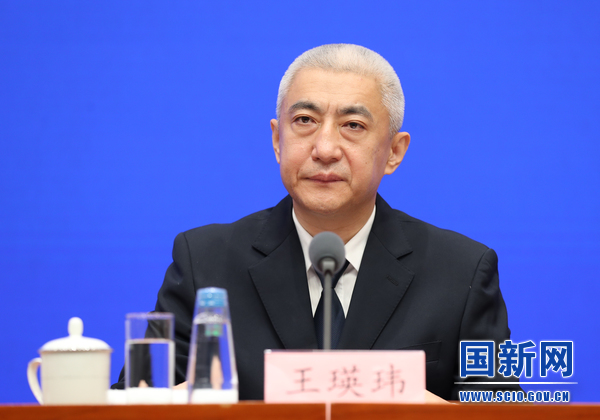
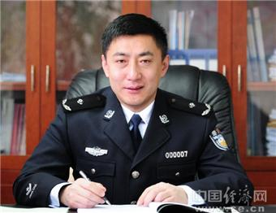
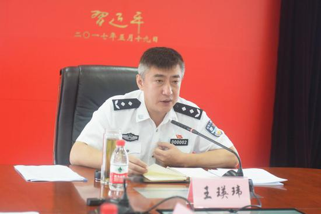
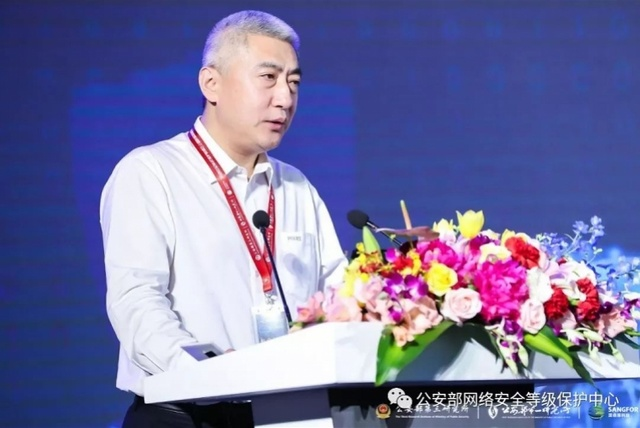

拆墙运动公号 北京时间 2023-09-29T02:38:02Z 1707464700072509856 【 #2259专案组 互联网防火墙第092号嫌犯 #王瑛玮】性别：男
生日：1969年12月29日
身份证号：110108196912291832
学历：北京大学数学系博士
职务：公安部网络安全保卫局局长
单位：公安部
地址：北京市海淀区燕西台嘉苑64号楼5单元

简历： 1987年至1997年就读于北京大学本科、硕士、博士。毕业后长期在公安部刑事侦察局工作， 历任刑侦基础工作指导处、犯罪情报信息工作处处长，2010年5月至2018年历任贵州省公安厅厅长助理、副厅长、常务副厅长。2019年1月调任中共公安部网安局党委书记、局长。

擅长网络加密和监控控制
#拆墙运动 #BanGFW #反人类罪

1987.09--1991.07 北京大学计算机系学生
1991.07--1994.09 北京大学信息科学中心硕士研究生
1994.09--1997.07 北京大学数学学院应用数学专业博士研究生
1997.07--2000.05 公安部第二研究所助理研究员
2000.05--2001.04 公安部刑事侦察局刑侦基础工作指导处助理研究员
2001.04--2005.09 公安部刑事侦察局刑侦基础工作指导处副处长
2005.09--2009.12 公安部刑事侦察局刑侦基础工作指导处处长
2009.12--2011.09 公安部刑事侦察局刑事犯罪情报信息工作处处长
2011.09--2012.04 公安部刑事侦察局正处级干部
2012.04--2012.12 公安部刑事侦察局副局级干部（其间：2010.05-2012.11 挂任贵州省公安厅党委委员、厅长助理）
2012.12--2017.08 贵州省公安厅党委委员、副厅长
2017.08-- 贵州省公安厅党委副书记、常务副厅长
涉案：恶俗维基案
详细资料见: #BanGFW拆墙运动（建墙罪犯录）（#ban_great.wall）https://t.co/DyLGUUZAEv   