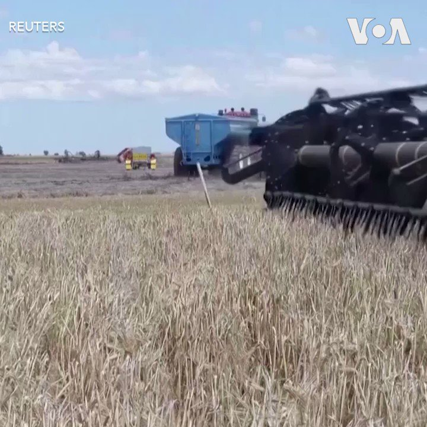
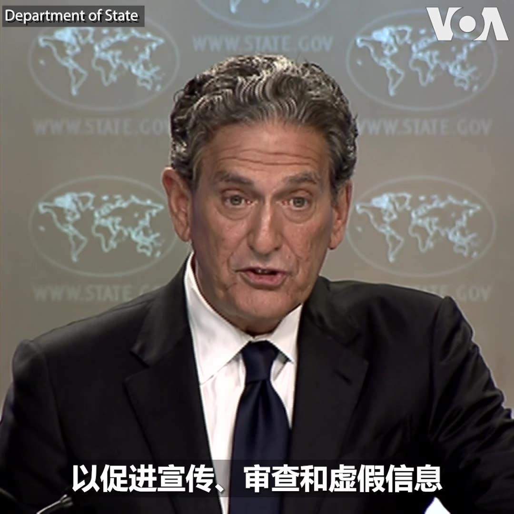
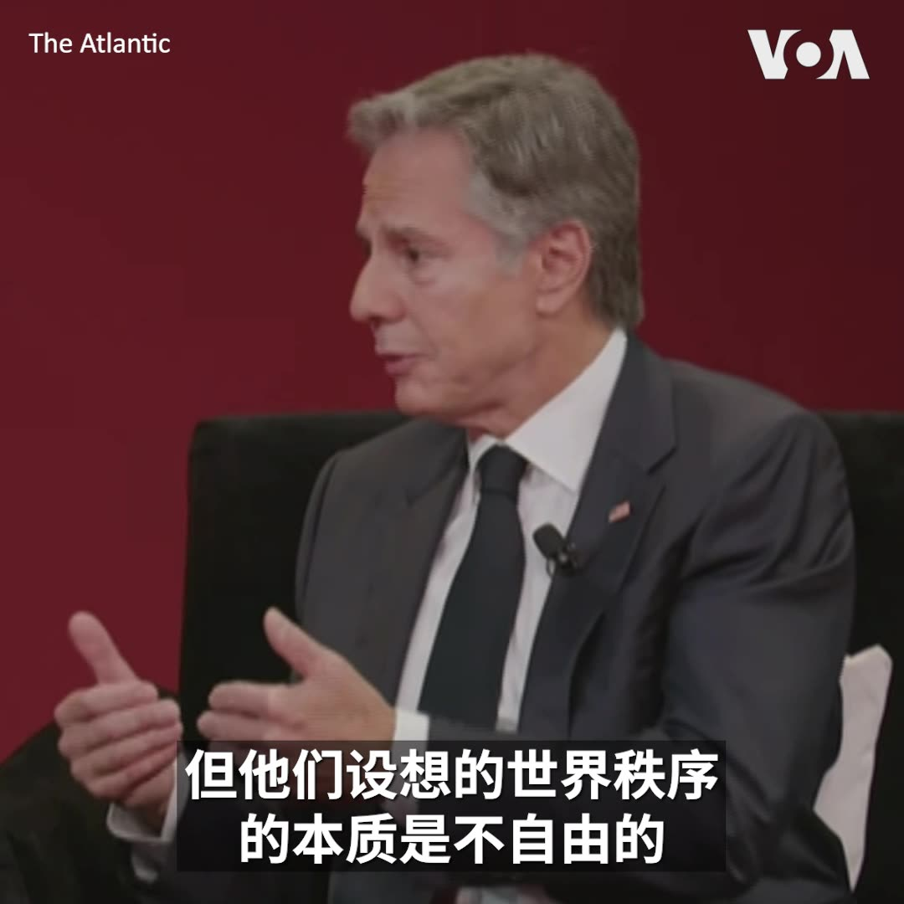
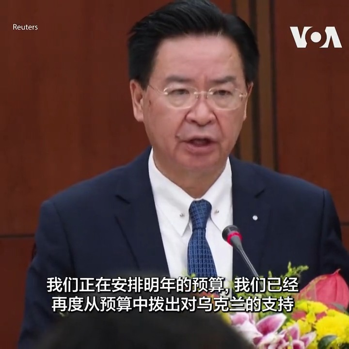
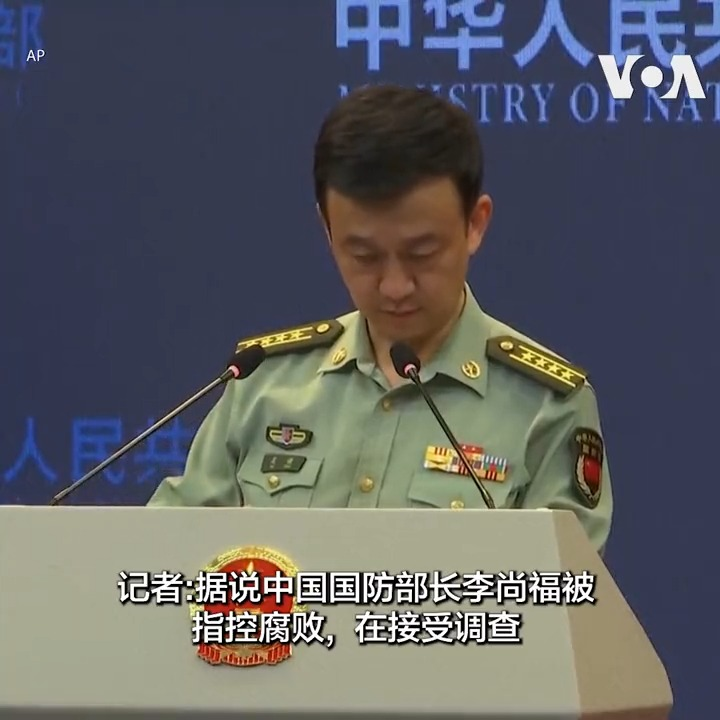
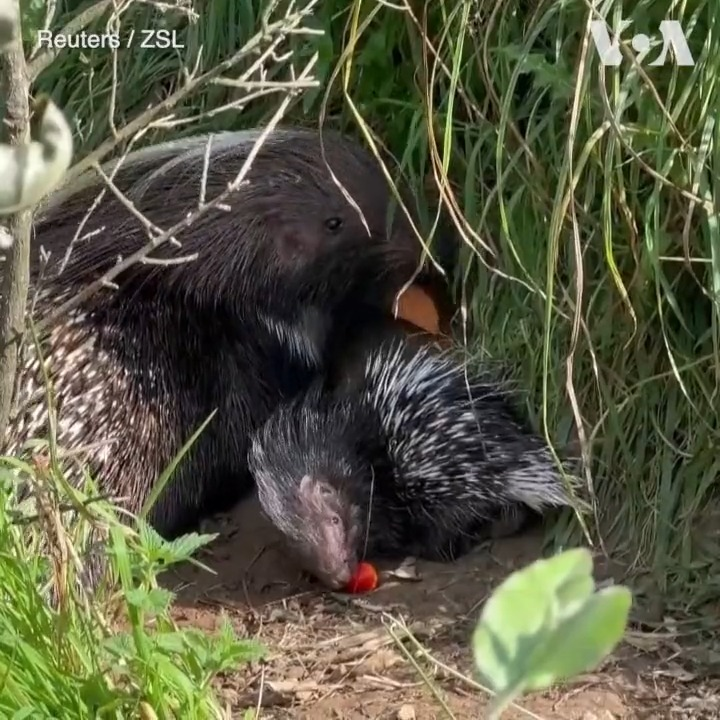

美国之音中文网 北京时间 2023-09-29T16:40:11Z 1707676632843202626 美中高级外交官在华盛顿会面 保持沟通渠道预计为习近平访美铺路 https://t.co/krwyspZDJ3   美国之音中文网 北京时间 2023-09-29T19:50:00Z 1707724402513813735 【家事国事天下事，你有何见解】运动会本应是欢乐的盛会，中秋节本应是欢乐的节日，但今年的中秋节和中国国庆节却使众多浙江人格外苦不堪言。亚运会在浙江省会杭州举行，当地和周围地区实行交通管制，开幕式那天许多人被堵在路上只能在路上过夜，中秋节、国庆节也不得放假，而是要上班报到。 https://t.co/07HPjnCLWE   美国之音中文网 北京时间 2023-09-29T21:43:56Z 1707753075685871736 拉美妇女28日集会游行呼吁堕胎权。阿根廷示威者对总统候选人米莱考虑推翻2020年的允许堕胎的法律表示担忧。在智利, 在强奸、孕妇生命有危险或胎儿有先天缺陷的情况下才允许堕胎。在巴西和玻利维亚，只有在强奸、孕妇生命有危险的情况下才能堕胎。在秘鲁，堕胎是非法的,  除非孕妇生命或健康受到威胁。 https://t.co/2i9shXEdYL   美国之音中文网 北京时间 2023-09-29T21:52:18Z 1707755180853543252 教宗月初对华示好 北京表示欢迎，大陆一位主教获准访问香港 https://t.co/g6SYIVk1ru   美国之音中文网 北京时间 2023-09-29T22:07:50Z 1707759092528267710 菲律宾总统小马科斯9月29日表示，菲律宾将坚决捍卫其领土和渔民权利，而且这不是在找麻烦。近期，菲律宾与中国就南中国海一处战略性浅滩问题发生争端。详细：https://t.co/JzUM2yeZXB https://t.co/cx5kChdk7o   美国之音中文网 北京时间 2023-09-29T19:06:34Z 1707713472958738538 绚烂亚运对比低迷经济 中国离共同富裕更远了？ https://t.co/CEQbsHCZKB   美国之音中文网 北京时间 2023-09-29T19:51:09Z 1707724692780462519 中国8月初取消对澳大利亚大麦历时三年多的惩罚性关税后，澳麦终于得以重返中国市场。位于上海的精酿啤酒业者说，三年来，他们被迫转往他国采购大麦，酿酒成本大增，最终受伤的是消费者的荷包，如今两国经贸关系回暖，他们也喜迎进口澳麦。 https://t.co/Zn2d2CmLIA   美国之音中文网 北京时间 2023-09-29T20:15:45Z 1707730882738758058 巴基斯坦官员说，俾路支省 Balochistan 29日发生的自杀式爆炸至少造成52人死亡，50多人受伤。许多伤者在附近城镇的医院接受治疗。当时，人们正在举行宗教集会，庆祝先知穆罕默德的诞辰。 https://t.co/vzpILVGz3B   美国之音中文网 北京时间 2023-09-29T18:14:06Z 1707700269151391949 菲律宾拆中国浮动屏障 小马科斯：坚决捍卫领土和渔民权利 https://t.co/T51HyNkSfD   美国之音中文网 北京时间 2023-09-29T13:43:34Z 1707632188752306195 报道说汇丰银行高管因谴责英国对华立场即将辞职 https://t.co/qgxm15TXOF   美国之音中文网 北京时间 2023-09-29T10:42:09Z 1707586534130454932 下个月，中国将举行第三届“一带一路”国际合作高峰论坛。不久前，美国、印度和欧盟共同宣布将推出印度-中东-欧洲经济走廊（IMEC）。印欧经济走廊能抗衡中国的“一带一路”吗？https://t.co/MrPQ6oqjKL https://t.co/VdiFj1oZqy   美国之音中文网 北京时间 2023-09-29T10:46:03Z 1707587514952020277 详解美国务院最新报告：中国正试图重塑全球信息环境 https://t.co/LmmH579v1W   美国之音中文网 北京时间 2023-09-29T09:31:35Z 1707568772511654293 分析人士：尽管存在分歧，习近平和普京仍将作为盟友会晤 https://t.co/Orr0eipJI3   美国之音中文网 北京时间 2023-09-29T10:00:33Z 1707576063478681660 北约秘书长说乌军逐渐取得进展；五角大楼表示政府关门将影响援乌 https://t.co/W8TX4CCzOI   美国之音中文网 北京时间 2023-09-29T04:18:12Z 1707489907201970595 乌克兰联合武装部队司令谢尔盖·纳耶夫9月27日在首都基辅附近的一座射击场测试了西方国家援助的武器装备。他说，乌克兰军人将携带这些武器前往东部和南部前线，持续推进乌军的反攻。 https://t.co/Fgpu3R7RXM   美国之音中文网 北京时间 2023-09-29T06:51:35Z 1707528506954125548 北京的南中国海策略促使马尼拉强硬起来 https://t.co/JG2V3Wpcqj   美国之音中文网 北京时间 2023-09-29T06:51:37Z 1707528515216908411 美国联邦政府周日可能面临部分关门 https://t.co/i4KKOWpR4J   美国之音中文网 北京时间 2023-09-29T06:56:04Z 1707529635385254267 “中国正在试图搅局，想在台湾问题上改变现状，”美国国务卿布林肯9月28日在和《大西洋》月刊主编戈德堡对谈中谈到台湾问题时说。不过他相信，“中国越来越多地从世界各国听到的信息是：不要搅局，每个人都希望和平与稳定，每个人都希望维持现状。” https://t.co/QUrAWtaWLw   美国之音中文网 北京时间 2023-09-29T07:09:55Z 1707533120898044351 菲律宾海岸警卫队强势拆除了中国在南中国海设置的一个300米长的浮动障碍。为什么曾经 “蓬勃发展” 的菲中关系现在冲突不断？小马科斯现在“弃中亲美”？北京高层最近戏剧性消息接二连三 ，这标志习近平进入清理“亲信”的斯大林逻辑时刻？请看美国之音9月29日上午9点《时事大家谈》。 https://t.co/FNEZlWunc8   美国之音中文网 北京时间 2023-09-29T07:50:00Z 1707543208618865146 【家事国事天下事，你有何见解】运动会本应是欢乐的盛会，中秋节本应是欢乐的节日，但今年的中秋节和中国国庆节却使众多浙江人格外苦不堪言。亚运会在浙江省会杭州举行，当地和周围地区实行交通管制，开幕式那天许多人被堵在路上只能在路上过夜，中秋节、国庆节也不得放假，而是要上班报到。 https://t.co/UNuWPVzrGY   美国之音中文网 北京时间 2023-09-29T07:50:35Z 1707543358464471271 美军：伊朗部队用激光照射美军直升机 https://t.co/v82gprmCxs   美国之音中文网 北京时间 2023-09-29T09:00:01Z 1707560828788994365 #揭谎频道  12年内战后，叙利亚总统阿萨德访华，受到中国高规格礼遇。中国主席习近平称西方应当立即解除所有对叙利亚的“非法单边制裁”。习近平混淆了国际组织制裁和单边国家制裁的法律概念，并且完全忽略了阿萨德政权受制裁的根本原因。https://t.co/VkFgYnoqku   美国之音中文网 北京时间 2023-09-29T09:02:33Z 1707561469729239230 美国国家安全局开始启动人工智能安全中心 https://t.co/R3p2Xm61kX   美国之音中文网 北京时间 2023-09-29T09:17:05Z 1707565126067667142 美国防部官员赞扬菲律宾拆除中国在争议水域设置的障碍物 https://t.co/XsZn1YKK7j   美国之音中文网 北京时间 2023-09-29T00:50:35Z 1707437660569235845 欧盟11国抵制华为中兴设备 确保欧盟5G网络的安全 https://t.co/meSp8Qch0J   美国之音中文网 北京时间 2023-09-29T02:44:05Z 1707466223129395313 英政府加强支援被迫离开香港的年轻人 商贸官员出席中国国庆酒会 https://t.co/iXZIUrUdNn   美国之音中文网 北京时间 2023-09-29T05:01:50Z 1707500890138030556 "中国已投资数十亿美元构建全球信息生态系统，以促进宣传、审查和虚假信息，” 美国务院全球接触中心特使鲁宾(James Rubin)周四在国务院例行记者会上说。鲁宾领导的全球接触中心当天发表报告，阐述北京如何采用欺骗和胁迫手段试图影响国际信息环境。 报道：https://t.co/FhJZaqp7MA https://t.co/96UCvDoTuq   美国之音中文网 北京时间 2023-09-29T05:25:48Z 1707506922385981491 【中国最终想要什么？】“我认为中国正在军事上，经济上，外交上寻求成为全球主导力量，”美国国务卿布林肯周四在《大西洋》月刊主办的一场的活动上回答月刊主编戈德堡的问题时说，“我认为基本上，那就是中国在追求的，是习近平在追求的。” https://t.co/cDvx525TL8   美国之音中文网 北京时间 2023-09-29T06:09:18Z 1707517866235322738 下个月，中国将举行第三届“一带一路”国际合作高峰论坛。鉴于2023年也是中国领导人习近平主席提出“一带一路”的十周年，预计，中国会将这次大会演绎成“一带一路”的十周年庆典，虽然越来越多的国家对这个项目的可持续性提出质疑。https://t.co/MrPQ6oqjKL https://t.co/alJnSf4sfO   美国之音中文网 北京时间 2023-09-29T01:06:06Z 1707441564426072313 政治局开会还不见李尚福和秦刚，二位“失联”状态尚未结束 https://t.co/Nw5Z0Zfeng   美国之音中文网 北京时间 2023-09-29T02:56:49Z 1707469427925455276 台湾外交部长吴钊燮28日表示,  中国领导层知道用威胁手段来影响选举结果不会奏效,  因此他认为中国在台湾选举期间不会采取重大行动。  
报道:https://t.co/vo0ZqoycOH https://t.co/lYujvQUVU9   美国之音中文网 北京时间 2023-09-29T03:03:34Z 1707471125402550565 美众议院开始对拜登总统的弹劾调查 https://t.co/TsBlPN0kop   美国之音中文网 北京时间 2023-09-29T03:45:35Z 1707481701927252015 美国政府公布报告：中国投入巨资在全球散布虚假信息，威胁世界言论自由 https://t.co/trK0tAujse   美国之音中文网 北京时间 2023-09-29T03:58:49Z 1707485031696904450 美国国务卿布林肯27日在国务院启动全球音乐外交倡议项目 Global Music Diplomacy Initiative 。社交媒体X上公布的视频显示了布林肯自弹自唱1950年代的一首经典歌曲《Hoochie Coochie Man》。他在X上写道”我无法错过今晚的机会来将音乐与外交结合起来,  非常高兴能启动国务院新的全球音乐外交倡议” 。 https://t.co/QWFvTXteV8   美国之音中文网 北京时间 2023-09-29T00:32:04Z 1707433002299543796 #美中对标 中国学校食堂预制菜搬上餐桌，让广大家长直呼不放心；美国学校自1946年起为低收入家庭孩子提供免费早午餐以来，一直遵循农业部的管理规范。本期视频来关注美国学生的食堂。完整版戳：https://t.co/KKfbmW4630 https://t.co/fRlCCBVSZe   美国之音中文网 北京时间 2023-09-29T00:36:04Z 1707434004977496234 许家印丧失自由对中国和世界意味着什么 https://t.co/2HZ7opCVuF   美国之音中文网 北京时间 2023-09-29T00:55:21Z 1707438861343736191 “你谈到的情况我不了解”, 中国国防部发言人吴谦28日在记者会上被问到中国国防部长李尚福是否在接受腐败调查时说。李尚福最后一次公开露面是8月29日。吴谦还谈到中国军队最近在台湾周边进行的军事演习“是年度计划内的正常安排，旨在检验部队的联合训练成果” 。 https://t.co/FJQcrCpPZE   美国之音中文网 北京时间 2023-09-29T02:03:10Z 1707455927618621652 一只8月下旬出生的开普豪猪（Cape Porcupine）日前在英国卫普斯奈德动物园展出。动物园9月28日公布的视频显示，这只一个多月大的豪猪宝宝已经可以离开巢穴，在围栏里四处走动。开普豪猪原产于非洲中部和南部，是世界上体型最大的豪猪以及非洲大陆第二大的啮齿类动物。 https://t.co/one8Vk3imC   美国之音中文网 北京时间 2023-09-29T02:23:05Z 1707460938184720388 移英港人后代粤语现传承危机 保育工作者吁多推动文化创新 https://t.co/X0Ccd03hUS   美国之音中文网 北京时间 2023-09-29T00:07:34Z 1707426835372589369 台湾自制潜艇“海鲲号”下水，蔡英文：展现“国防自主”决心 https://t.co/rgo0tXEqIV   