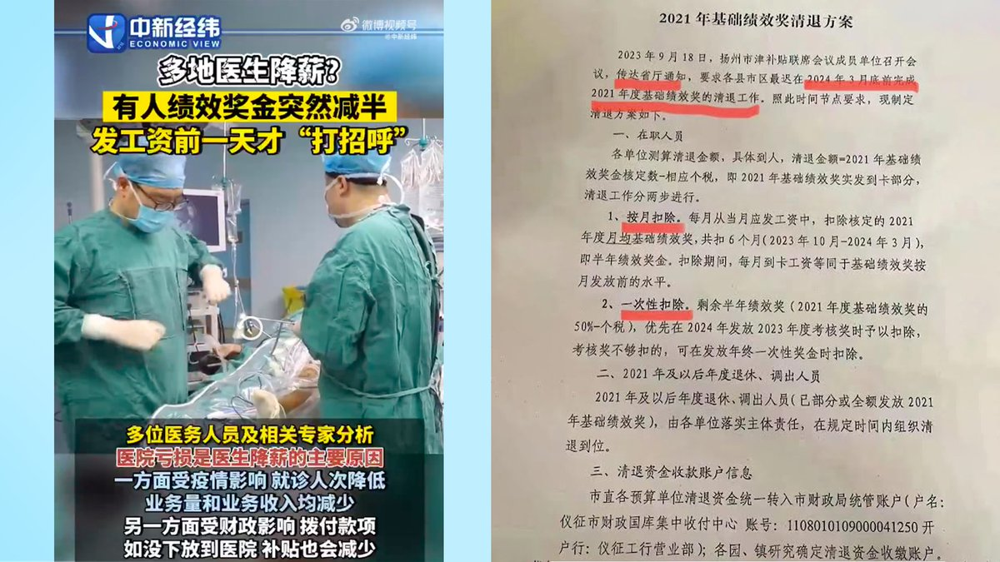
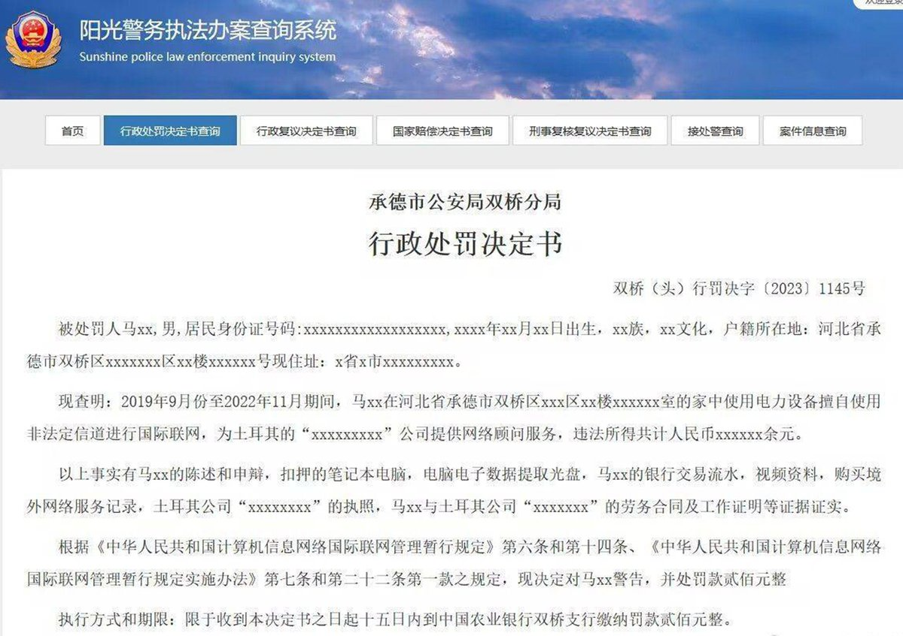
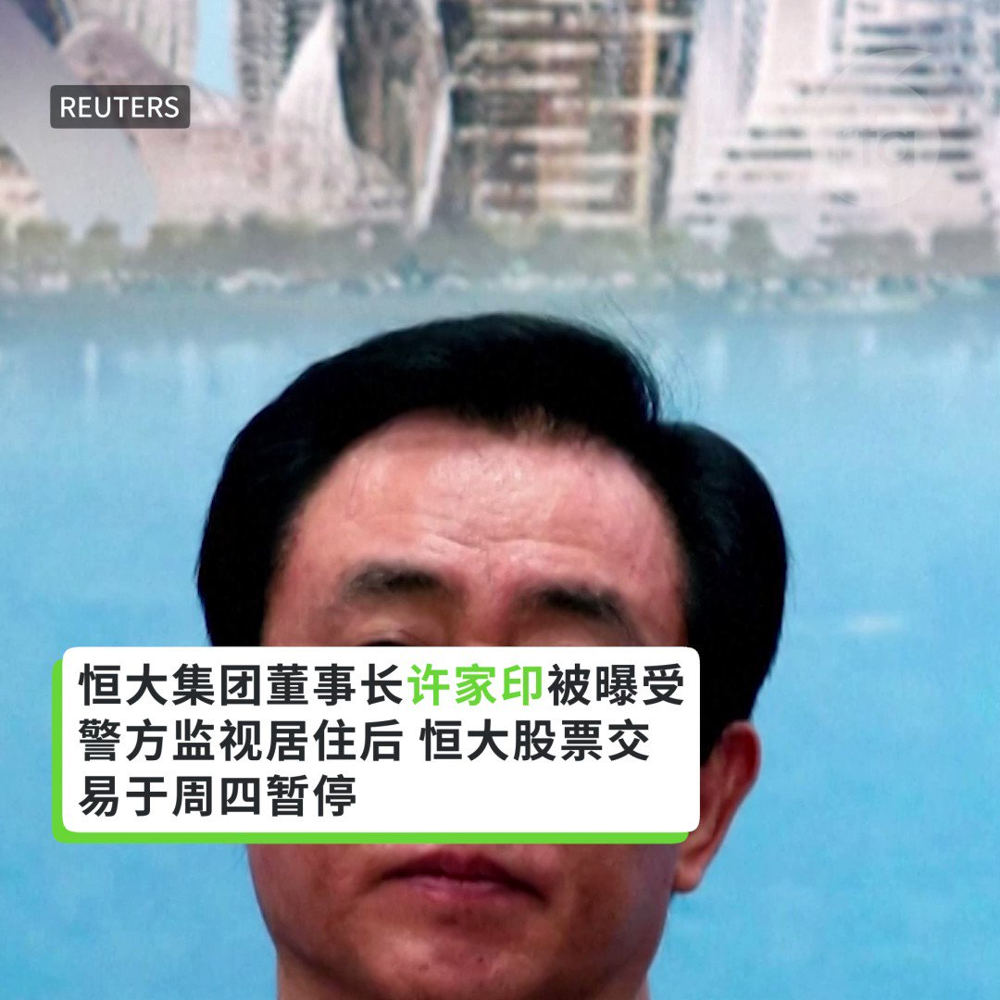
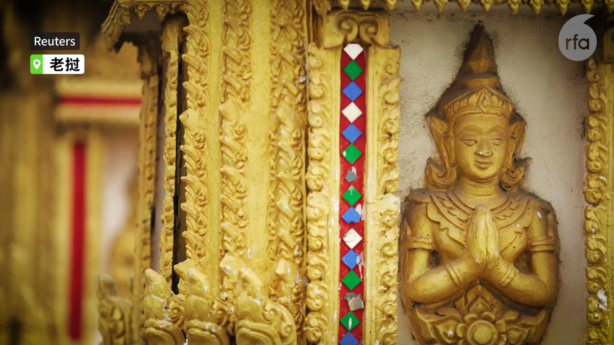
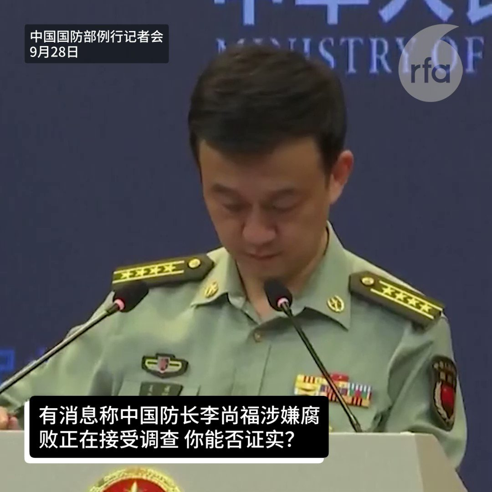

自由亚洲电台 北京时间 2023-09-29T21:34:54Z 1707750803002511423 专栏 | #中国透视: 美中越的恩怨情仇
 https://t.co/3rsKYiKRbG   自由亚洲电台 北京时间 2023-09-29T23:56:30Z 1707786435942904056 #许家印 在住所被带走时有没有反抗？
许家印碰到中共哪个底线？
许家印的太太会不会拿钱来赎他？
许家印为中国糟糕的经济背锅？
......
 https://t.co/lLvGuaAPnA   自由亚洲电台 北京时间 2023-09-29T21:23:02Z 1707747817106677796 RT @RFA_Chinese: 【 #您怎么看?】【 老板在哪里？外交部发言人不知外长下落，国防部发言人不知防长下落】
9月28日，国防部举行例行记者会，记者会上国防部新闻发言人吴谦多次被境外媒体追问国防部长李尚福的情况。吴谦回应：不了解。
7月26日，外交部发言人毛宁在记者…   自由亚洲电台 北京时间 2023-09-29T22:03:52Z 1707758092610633881 长期关注中国问题的东京大学综合文化研究科教授阿古智子寄语 #中国人权律师团 成立十周年
 https://t.co/NgzTZeCx1B   自由亚洲电台 北京时间 2023-09-29T18:05:28Z 1707698096942330293 【京沪等地事业单位降薪降绩效奖】
 【网民热议“全民降薪”时代】
北京、上海及扬州等地近期再度传出因 #政府财政补贴 减少，导致退休教师、医生等政府 #事业单位 员工的收入严重下降，网民热议中国是否进入了“#全民降薪”时代。
https://t.co/a5uiSI0GaW https://t.co/I1YPxYozaw   自由亚洲电台 北京时间 2023-09-29T11:03:28Z 1707591896065822743 【新华社帮承德招揽人才  时机可疑】
中国官媒新华社周三（9月27日）转发了《河北日报》的一篇报道。报道称，#承德 市用真金白银激励人才创新创业。其中提到，承德市对新建的院士工作站、博士后科研工作站等，一次性给予最高20万元支持资金；对国家级、省级企业技术中心等创新平台，一次性分别给予300万元、100万元奖励等等政策。

报道还强调，承德市坚持把优化人才发展环境作为人才工作的重要内容，帮助高层次人才心无旁骛地开展科研工作。

但这一报道转发的时间和平台引起了网友的猜疑。就在上个周末，一名居住在河北承德的程序员因为 #翻墙 远程工作，被当地警方处以百万罚金并没收"违法所得"，引起外界广泛关注。有不少人在社媒上表达不满，有人揶揄说如果这样搞下去，所有翻墙从事经营活动的人都被罚款，中国政府至少可以增加上万亿收入。

新华社转发了这篇文章后，有网友在社媒平台X上说，承德政府还有脸在事后找新华社发这种宣传稿，承德可是打个电话就有专人来帮助罚没你五年所得。   自由亚洲电台 北京时间 2023-09-29T09:23:18Z 1707566689490173996 中国政府每年在对外信息操纵方面花费数十亿美元。
中国的信息操纵方法包括利用宣传和审查、促进数字专制主义、利用国际组织和双边伙伴关系、结合收买和压力，以及控制中文媒体。 https://t.co/hnFhFxCIqM   自由亚洲电台 北京时间 2023-09-29T03:41:17Z 1707480619268374913 美众议院美中战略竞争特设委员会罗伯·惠特曼 ：“中国想要称霸，因此将使用一切邪恶的、道德或不道德的手段，来赢得这场支配美国、支配世界经济的竞争…这与1938年世界所面临的情况相当，但表面上有所不同–—中国在某些方面更邪恶” https://t.co/iJaJxy7RFH   自由亚洲电台 北京时间 2023-09-29T04:54:10Z 1707498961949659487 美国国家安全局（NSA）、联邦调查局（FBI）、和日本警方在周三晚间共同发布网路安全公告，警告跨国公司需要提防与中国政府有联系的 #黑客 组织BlackTech。相关调查显示，BlackTech有能力修改企业下属公司的网络路由器，从而攻击跨国企业的母公司。 https://t.co/M9HJDZnWrh   自由亚洲电台 北京时间 2023-09-29T06:00:01Z 1707515530037584265 近日，随着中国 #国庆 和 #中秋 双节来临，中国民众迎来了一次长假。然而，原本有七天的国庆假和三天的中秋假加起来却只有八天时间。对于这一情况，有不少民众在网上写下了"7+3=8"或"3+7=8"这种看似错误的等式，表达自己的不满。

 https://t.co/6g1jTVlVMw   自由亚洲电台 北京时间 2023-09-29T07:00:10Z 1707530667473719663 【亚太报道(2023-9-28)】
欢迎收听和订阅播客 https://t.co/MjLNSvVMqc
#王全璋、#李和平 等律师家属求学受阻 / 7+3=8吗？/ 习近平提出“积极参与”#世贸改革 / #台湾首艘自制潜艇建成下水 / #中国黑客 盗取多达60000份美国国务院邮件 https://t.co/DJMS3n08FI   自由亚洲电台 北京时间 2023-09-29T09:09:07Z 1707563122255417803 RT @RFA_Chinese: 【 #您怎么看?】【 老板在哪里？外交部发言人不知外长下落，国防部发言人不知防长下落】
9月28日，国防部举行例行记者会，记者会上国防部新闻发言人吴谦多次被境外媒体追问国防部长李尚福的情况。吴谦回应：不了解。
7月26日，外交部发言人毛宁在记者…   自由亚洲电台 北京时间 2023-09-29T00:45:29Z 1707436375442870650 台湾的外交部长 #吴钊燮  9月28日与外国媒体见面时表示，从1996年 #台湾 有 #民主选举 以来，中国已透过各种方法介入，包括以军演恐吓、动员台商返台投票，以及近年的 #认知战 等，均不能成功影响选举结果。但他认为，中国对台湾的操作，值得国际关注和防范。
 https://t.co/XegkMV1vHw   自由亚洲电台 北京时间 2023-09-29T02:32:35Z 1707463329143521319 针对美国国务院的 #网络攻击 行动导致十个帐号的多达六万份邮件被盗，而在这十个被侵入的帐号中，有九个涉及东亚和太平洋事务。 https://t.co/CBQdyKTREq   自由亚洲电台 北京时间 2023-09-29T04:26:23Z 1707491968971120748 在有报道称中国恒大集团董事长已受到警方监视后，二儿子也被带走。中国恒大集团的股票交易于周四暂停。 https://t.co/AuVoDie09F   自由亚洲电台 北京时间 2023-09-29T05:30:01Z 1707507981791989919 专栏 | #军事无禁区：反航母作战－看 #山东舰 担任假想敌
 https://t.co/stS0nTSpJU   自由亚洲电台 北京时间 2023-09-29T06:00:01Z 1707515530155045318 #事实查核｜#柬埔寨 总理：美国在内180多个国家承认"一个中国原则"？
 https://t.co/fR3BmT3Knr   自由亚洲电台 北京时间 2023-09-29T02:41:22Z 1707465539369763220 【#一带一路十周年(3)】 中老铁路没能带来中国人潮，却带来了中国地产公司与性产业
#老挝 原本希望借“#一带一路”项目发展成另一个新加坡，现在却产生“成为中国附属国”的焦虑。详见https://t.co/KjX5IFezkJ https://t.co/tVdnbnoLlZ   自由亚洲电台 北京时间 2023-09-29T03:17:39Z 1707474671518503230 【 #您怎么看?】【 老板在哪里？外交部发言人不知外长下落，国防部发言人不知防长下落】
9月28日，国防部举行例行记者会，记者会上国防部新闻发言人吴谦多次被境外媒体追问国防部长李尚福的情况。吴谦回应：不了解。
7月26日，外交部发言人毛宁在记者穷追秦刚下落时，一句应万句：我没有可以提供的信息 https://t.co/Mh8ojCBE8z   自由亚洲电台 北京时间 2023-09-29T03:27:27Z 1707477135290728685 长江商学院9月27日发布了2023年第三季度《#投资者情绪调查报告》，报告显示，愿意投资 #房地产 人数则自2020年8月以来持续大幅下降，今年第三季度愿意计划在未来一年削减国内房地产投资的受访者净占比升至创纪录的31.7%，比2020年8月上升了32.5个百分点。 https://t.co/vJfd6ZUlMp   自由亚洲电台 北京时间 2023-09-29T04:02:11Z 1707485879407915429 “中国政府不应害怕世界听到她们的声音。然而中国却使她们失踪、威胁她们的家人，把她们定罪判监。然而这些女性在做的，只是把一点点尊严，还给被体制压迫的人。”“#中国人权捍卫者” @CHRDnet 代表Faye Chen说。
#女权  https://t.co/6XSRdKuL9Z   自由亚洲电台 北京时间 2023-09-29T01:10:23Z 1707442642219630828 新高层主管从“#字节跳动”调任 #TikTok 之后，参与更多TikTok的战略决策。而多年来，TikTok努力说服美国议员，该公司在美营运可独立于中国母公司“字节跳动”之外。
此事引发部分TikTok美国员工的关切和不满。
 https://t.co/YRfhdwXT3A   自由亚洲电台 北京时间 2023-09-29T01:23:10Z 1707445861209538812 #王全璋 说，如今再度失学给儿子带来了巨大的心理创伤，甚至把自己的不幸归咎于王全璋和妻子 #李文足：“现在孩子很郁闷很受挫折，不愿意去上学，不愿意接受美好的事物，很容易愤怒，会把问题归结到父母身上。我带他出去玩，或者带他找别的学校，他都不愿意去。” https://t.co/kgczOwpAPH   自由亚洲电台 北京时间 2023-09-29T02:00:19Z 1707455208442495262 台湾首艘自制潜艇 #海鲲号 建成下水 详见
https://t.co/hfBK4UTsua
中国国防部发言人吴谦评论：“不过是螳臂当车 终将会自取灭亡。无论民进党当局建造或购买多少武器，都阻挡不了祖国统一的大势，撼动不了解放军捍卫国家主权和领土完整的坚强决心、坚定意志和强大能力。”
#您怎么看？ https://t.co/FJMEeYQyEX   