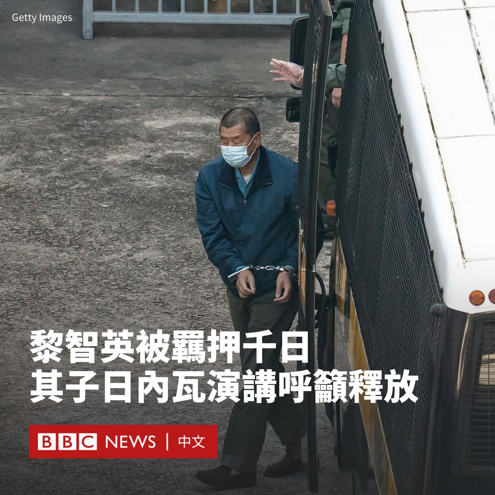

D英国广播公司BBC 北京时间 2023-09-28T16:39:05Z 1707313970082939336 在香港前媒体大亨黎智英被羁押近一千天之际，他的儿子黎崇恩于周三（9月27日）出席一场联合国人权理事会周边活动时表示，释放他的父亲而避免让其死在狱中，符合香港的利益。

75岁的黎智英自2020年以来一直被当局羁押，他被控“勾结外国势力”罪与“煽动”罪，最高可判处终身监禁。

这场以“香港新闻自由”为主题的活动由英国常驻联合国代表团发起，来自美国、亚洲和欧洲多国的外交官参加了该活动，而中国则书面呼吁各国抵制此次活动，称与香港有关的问题属于中国内政。

“我很乐观，因为我相信香港政府让我父亲死在监狱里没有任何好处。”黎崇恩在谈及父亲获释可能性时说。

他表示：“（黎智英）是一名民主活动家、出版商，也是一个非常和平的人......现在他们已经夺走了他的一切，把他关在监狱里实在是太残忍了。”

黎崇恩还指，黎智英是英国公民，但没有获得领事访问权。

黎智英是现已停刊《苹果日报》的创办人，也是中国共产党的高调批评者之一。

香港政府周四（9月28日）发表声明称，强烈反对英国和其他国家一再试图对香港的人权状况作出“罔顾事实、颠倒是非的政治炒作”。

在另一份声明中，中国外交部驻香港特派员公署指责英国和美国“公然为反中乱港分子黎智英撑腰张目”。

“黎智英作为反中乱港事件的策划者和煽动者，作为美西方反华势力的‘代理人’和‘马前卒’，挟洋自重，恶行累累。”外交部驻港公署发言人说道。   D英国广播公司BBC 北京时间 2023-09-28T14:54:01Z 1707287530805055603 柬埔寨七星海特区由中国公司开发，涵盖柬埔寨近五分之一的海岸线，其宏伟目标是打造自成一体的旅游城市。但签约15年来，该项目已经近乎停滞，对当地居民和环境的影响却难以逆转。https://t.co/YSklkznV4U   D英国广播公司BBC 北京时间 2023-09-28T13:19:31Z 1707263749311406383 台湾周四（9月28日）公开了其第一艘自制潜舰，并将其命名为“海鲲号”。这是台北多年来试图强化其防卫力量以应对来自北京的军事威慑的成果之一。

在周四上午举行的下水典礼上，这艘潜舰在位于高雄的台湾国际造船公司海昌厂亮相。总统蔡英文出席了典礼。

据中央社报导，台湾军方将中华民国国旗图案遮盖潜舰正面，并掩盖鱼雷发射管等机密设备。

“过去潜舰国造被认为是‘不可能的任务’，但今天由国人自己设计打造的潜舰就在大家的眼前。我们做到了。”蔡英文说。

她称，潜舰是台湾海军发展“不对称战力的重要装备”。

台湾将自造潜舰的项目称为“海昌计划”，这也被称为“潜舰国造”。蔡英文上台后在2016年宣布启动该计划，被视为是其任内最重要的国防战略之一。

此次下水的“海鲲号”在2020年正式开工，是计划的八艘潜舰中的第一艘。

路透社2021年曾报道，台湾至少从美国、英国、韩国和澳大利亚等七国的厂商和专业人士取得技术、人力与零件等支援。

该项目负责人黄曙光早前表示，台湾希望在2027年之前部署至少两艘这样的自制潜舰，并可能在后续型号上配备导弹。

他称，潜舰部署的重点任务是阻止中国解放军进入太平洋以包围台湾。

中国国台办发言人朱凤莲周三（9月27日）表示，台湾当局的做法是“以武谋独、不自量力”。她称，这“只会进一步加剧台海紧张动荡，把台湾民众推向危险境地”。

“海鲲号”造价493.6亿新台币（15.3亿美元），将会使用洛克希德马丁（Lockheed Martin）的作战系统，并携带美国制造的Mk 48型鱼雷，它将于下个月展开泊港测试，然后于2024年底交付海军。   D英国广播公司BBC 北京时间 2023-09-28T10:53:24Z 1707226978057941107 深陷困境的中国房地产开发商恒大集团的股票周四（9月28日）在香港交易所暂停交易。中国恒大、恒大物业和恒大汽车均停牌。

这是“恒大系”港股复牌一个月后，再度集体停牌。

彭博社周三（9月27日）报道称，恒大集团创办人和董事局主席许家印本月被警方带走，并在指定地点监视居住。“恒大系”股价应声跳水。

彭博社报道称，根据中国的《刑事诉讼法》，监视居住要求许家印交出护照和身份证，未经批准不得离开居住地，不得与其他人会面或联系。

恒大集团尚未对投资人披露该信息。BBC无法独立证实该消息。

恒大集团在2021年12月首次出现美元债务违约后，于去年3月21日宣布停牌。今年8月28日，恒大股票满足条件复牌。

恒大的债务危机本周急转直下。该集团表示，由于附属公司恒大地产正在被立案调查，无法满足新票据的发行资格，这使得境外债务重组计划遇到更大阻力。   