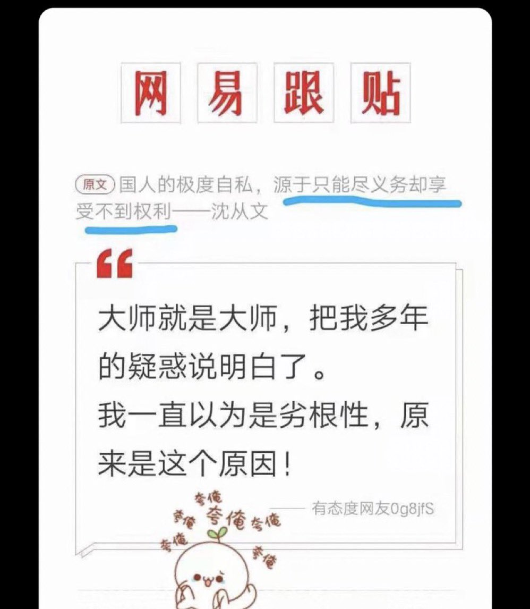

Ivy未央 北京时间 2023-09-28T11:31:59Z 1707236685036007653 多数西方人不太执着于赚钱，把追求精神理想和个人爱好当做人生目标，因为有了那么好的社会保障，确实不需要拼命去挣钱了。而多数中国老百姓，总是不知疲佬的挣钱，他们的意识里充满了恐慌，宁愿今天吃苦，也得留些钱防备末来的灾难，因为那时候只能靠自己！社会或政府从不会在你危难时伸出援手。 https://t.co/XNskmoBLSE   