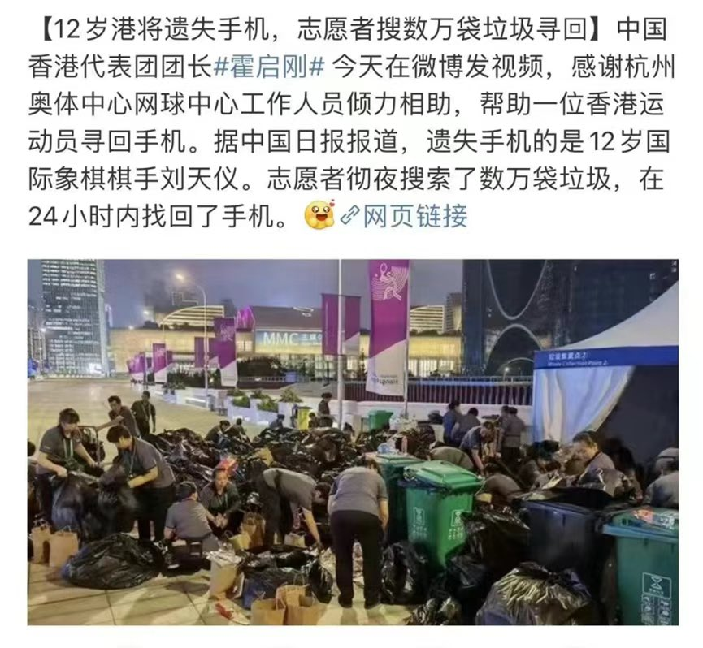
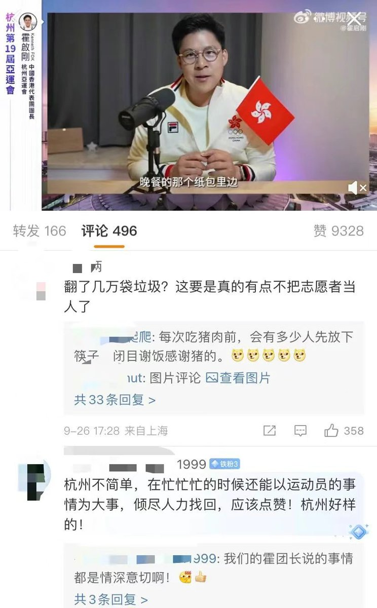
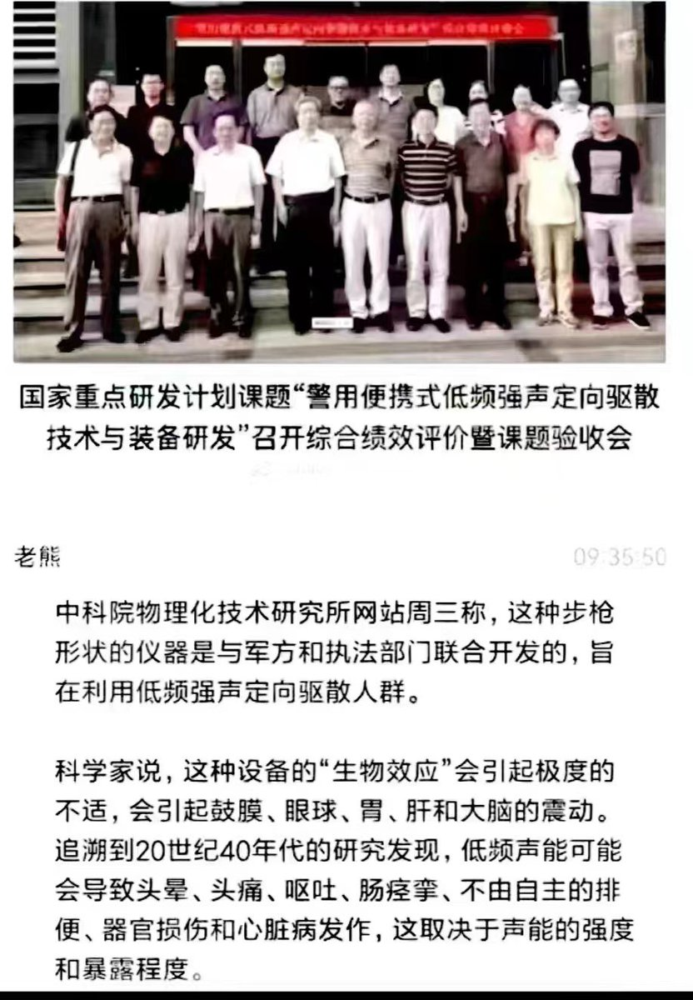
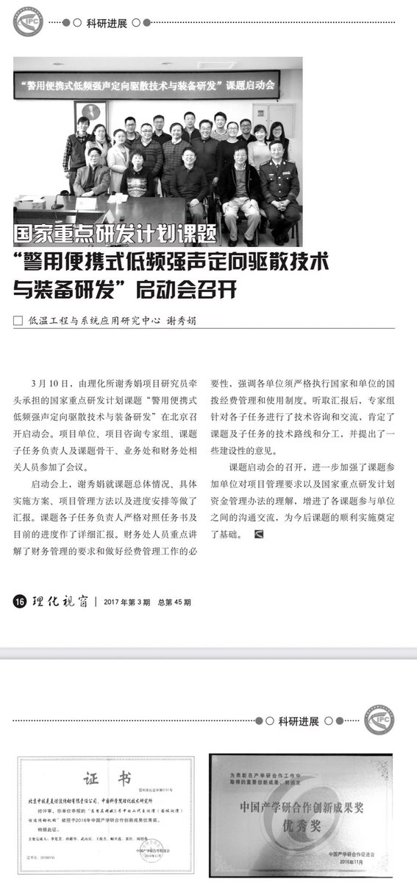

Petrichor 北京时间 2023-09-28T22:37:45Z 1707404231529959514 本届亚运会，集中展示了真正的中共和中国力量。在饭菜上，20块钱的奥运餐，愣是搞出了国宴般的标准。在交通上，科学规划，认真调研，合理安排，面对海量人潮，愣是没有出现拥堵。在服务上，就光找手机这一举动，就惊艳到了香港媒体。只要中共想办的事，一定办的圆满，因为不惜代价。那么问题来了，每年数万的孩子丢了，找不回来，20年后变八孩妈铁链女了。不是政府找不到，而是他们不想找。
把盛会标准，普及到神州的每一处，才是真正的中国力量。   Petrichor 北京时间 2023-09-28T23:02:57Z 1707410574743625956 “学术屁话”的分类（Kirchherr, J. (2023). Bullshit in the Sustainability and Transitions Literature: a Provocation. Circular Economy and Sustainability (Online), 3(1), 167–172. https://t.co/czZDbJzFGo）：

1乏味问题的研究：这类研究往往是对前人工作的简单复制，例如不断研究中小企业的循环经济的障碍和推动因素，虽然没有太多新意，但也为该领域知识体系加固了基础。因此，这种类型可能只是边缘性“屁话”。
2文献综述的文献综述：这种“屁话”是由于文献综述研究的过度增长，尤其是对那些已经被详尽探讨的子领域。这些综述只是重复我们已经知道的事实，而没有提供任何新的见解。
3回收性研究：虽然很多关于可持续性和转型的理念已经被研究过，但一些学者仍然把它们重新包装并称之为循环经济研究，仅仅为了迎合当前的研究趋势。
4学位论文疯狂灌水：有些知名学者与研究生合作发表的研究只是为了迅速增加发表量，这些研究往往缺乏深度，理论框架混乱，结论支离破碎。
5激进分子的咆哮：这类研究通常基于个人的激进观点，它们更多是情感表达，而不是基于实证的学术研究。   Petrichor 北京时间 2023-09-28T12:25:32Z 1707250163037700391 中科院物理化技术研究所的“贡献”仅次于中科院武汉病毒研究所，至少没有祸及海外。 https://t.co/f9ffc49kaM   Petrichor 北京时间 2023-09-28T10:52:32Z 1707226756913021007 遇到这种情况怎么办？幸亏是黑熊，要是北极熊，情况会更糟。 https://t.co/duOrtTgSV3   Petrichor 北京时间 2023-09-28T06:53:52Z 1707166695339475014 最受不了这样不要脸的自吹自擂，要饭不嫌饭馊的人，自吹换道超车，把自己给骗了。 https://t.co/tejmmMFruM   