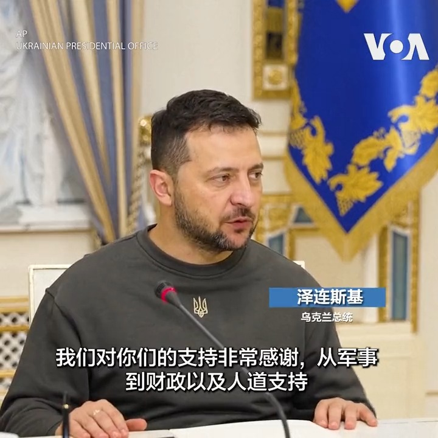
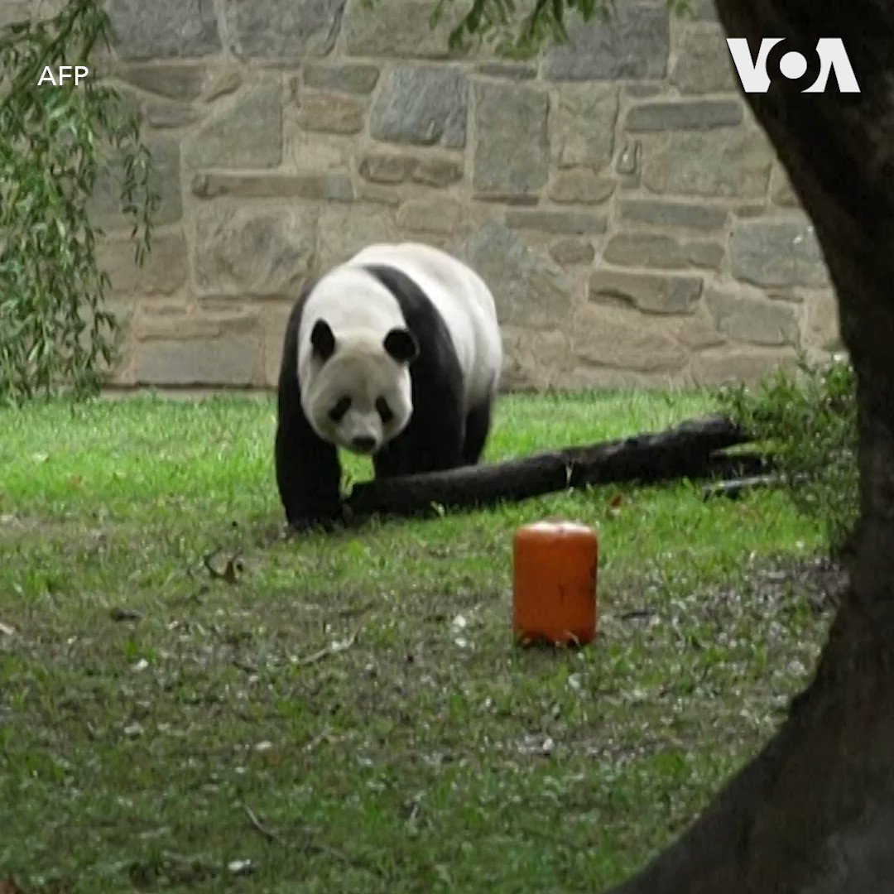
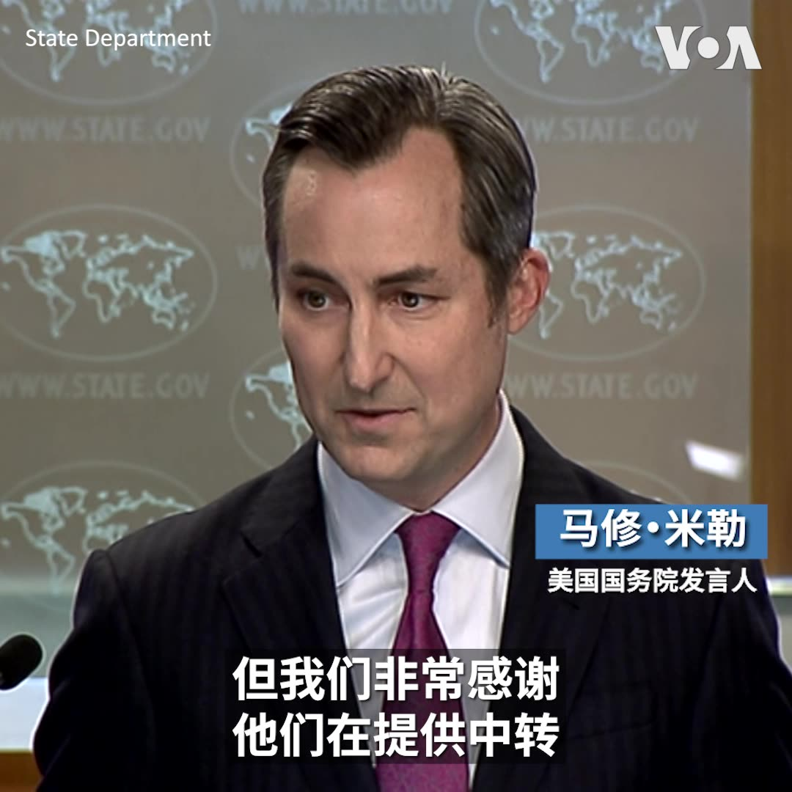
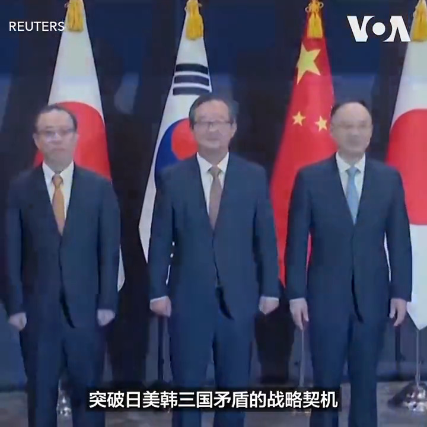

美国之音中文网 北京时间 2023-09-28T20:50:00Z 1707377114259902664 【家事国事天下事，你有何见解】
中共上周重申党员监管从严，工作之余的“八小时外也要管起来”。在“党政军民学东西南北中，党是领导一切的”当今中国，这似乎意味着中国老百姓的八小时以外也正式进入了中共的管辖范围，中共成为其党员和亿万民众的超级保姆。或者，这次中共会放亿万民众一马不去管？ https://t.co/U3D3sCepqX   美国之音中文网 北京时间 2023-09-28T21:13:54Z 1707383129806193093 今年7月非法越境进入朝鲜的一名美国军人已于9月28日返回美国。本星期稍早，美国陆军二等兵特拉维斯·金被朝鲜交出，并在瑞典政府的帮助下从朝鲜进入中国，美国在中国接收了金，把他转送回国。详细：https://t.co/avfWkyR9yO https://t.co/D0H9ilcmKa   美国之音中文网 北京时间 2023-09-28T22:05:07Z 1707396021066850691 经济放缓囊中羞涩 创纪录中国人黄金周选择国内旅行 https://t.co/4zk4rU1QPZ   美国之音中文网 北京时间 2023-09-28T22:06:18Z 1707396317293477939 乌克兰总统泽连斯基在基辅会晤了最近刚上任的英国国防大臣沙普斯(Grant Shapps) 。沙普斯在会晤中强调了英国依然坚定地支持乌克兰。泽连斯基对英国的支持表示感谢。 https://t.co/bhmAaIbDBU   美国之音中文网 北京时间 2023-09-28T17:23:34Z 1707325165078802463 美日联合警告各跨国公司提防中国黑客组织 https://t.co/lfpwBf6sij   美国之音中文网 北京时间 2023-09-28T17:34:06Z 1707327817267212605 菲律宾“特别行动”排除争议水域障碍物？中国讥菲方自导自演 https://t.co/Lcw8DcVWzN   美国之音中文网 北京时间 2023-09-28T18:27:34Z 1707341270841258360 美中关系持续紧张下 华盛顿三只大熊猫年底将返中 “熊猫外交”画下句点 https://t.co/V2hVIup0lH   美国之音中文网 北京时间 2023-09-28T19:50:00Z 1707362014736097406 【家事国事天下事，你有何见解】
菲律宾海岸警卫队拆除中国日前在菲律宾西海的菲律宾专属经济区部署的浮标障碍，并声言将不会容忍这种事情。中国则警告菲律宾不要“挑衅滋事”。在国内政治经济形势吃紧之际，中国当局看似大力对外挑事，这是纯属不智？还是中共当局的计算精明（以转移中国公众视线）？ https://t.co/eul3Utolyg   美国之音中文网 北京时间 2023-09-28T19:58:31Z 1707364158188998703 台湾首艘自制潜舰28日在高雄举行下水典礼，台湾总统蔡英文亲自掷瓶并将新潜舰命名为“海鲲号”。蔡英文说，过去认为台湾自制潜舰是不可能的，但“我们做到了”。造舰单位台船公司透露，该舰采用新设计的“X型尾舵”，性能远高于四艘现役潜舰，服役后将成为台湾“不对称作战”的利器。 https://t.co/CnXTfO7Evn   美国之音中文网 北京时间 2023-09-28T17:56:05Z 1707333348614631531 日首相会晤美印太司令 强化同盟威慑以应对朝鲜、中国 https://t.co/QubMws5aCX   美国之音中文网 北京时间 2023-09-28T14:48:07Z 1707286045669408869 美国共和党总统参选人第二轮辩论聚焦中国 德桑蒂斯称要硬对中国 拉马斯瓦米使用TikTok被围攻 https://t.co/8AvZO6WWEM   美国之音中文网 北京时间 2023-09-28T14:54:23Z 1707287622375079957 位于美国首都华盛顿的史密森尼国家动物园，2023年底前将归还园内三只熊猫，动物园正为熊猫举办欢送派对，吸引许多游客参加。尽管由于租借协议，这些熊猫的离开已在预料中，但不少人仍将归还熊猫视为北京和华盛顿关系日益紧张的印证。 https://t.co/EUatmAwWiB   美国之音中文网 北京时间 2023-09-28T06:31:45Z 1707161128193683775 9月27日，美国参议院农业委员会就外国对美国的农业用地投资举行听证会，来自奥克拉荷马州的联邦参议员兰克福德在听证会上说，过去的十年里，他们州的外国土地所有权增加了500%，除了国家安全问题外，中国等国家的人在该州大举买地种大麻还带来大量的犯罪问题。https://t.co/6kgaBB4pkm https://t.co/VvC6klfY15   美国之音中文网 北京时间 2023-09-28T13:37:33Z 1707268287468609772 朝鲜将核武政策明文写入宪法 专家忧朝鲜半岛紧张局势将再加剧 https://t.co/B3W3TSEPZe   美国之音中文网 北京时间 2023-09-28T04:39:10Z 1707132797515948302 美国制裁帮助伊朗自杀式无人机采购敏感部件的国际网络，含中国实体与个人 https://t.co/aEqdBsysLJ   美国之音中文网 北京时间 2023-09-28T06:35:10Z 1707161988563099691 斯洛伐克的选举威胁颠覆西方对乌克兰的团结 https://t.co/bjunoIm1qz   美国之音中文网 北京时间 2023-09-28T07:00:01Z 1707168242140123478 彭博新闻报道，中国地产巨头恒大集团董事局主席许家印已被警方控制。这位党员商人的个人兴衰讲述了怎样的“中国故事”？恒大暴雷如何收场？习近平再提毛泽东时代的“枫桥经验”，中共的“群众路线”对社会有哪些深远影响？欢迎留言参与9/28的《时事大家谈》。 https://t.co/7ZtcJSe1w3   美国之音中文网 北京时间 2023-09-28T07:50:00Z 1707180820656480313 【家事国事天下事，你有何见解】
菲律宾海岸警卫队拆除中国日前在菲律宾西海的菲律宾专属经济区部署的浮标障碍，并声言将不会容忍这种事情。中国则警告菲律宾不要“挑衅滋事”。在国内政治经济形势吃紧之际，中国当局看似大力对外挑事，这是纯属不智？还是中共当局的计算精明（以转移中国公众视线）？ https://t.co/pt28tDX6tm   美国之音中文网 北京时间 2023-09-28T07:50:12Z 1707180870946419178 好莱坞编剧罢工结束后，深夜电视节目宣布回归 https://t.co/4rvoaC0ICU   美国之音中文网 北京时间 2023-09-28T10:54:09Z 1707227163156791429 白宫发起新倡议，加强美国与非洲的联系 https://t.co/TgmdwHbVCi   美国之音中文网 北京时间 2023-09-28T05:08:10Z 1707140094296293839 逃到朝鲜的美国军人特拉维斯·金已被移交美国，华盛顿感谢北京为中转提供便利 https://t.co/sTNXZtttKC   美国之音中文网 北京时间 2023-09-28T06:35:06Z 1707161972838691020 美议员：中国人大批涌入俄克拉荷马州买地种大麻，并与墨西哥毒贩合作 https://t.co/zkSs1Z6ZP2   美国之音中文网 北京时间 2023-09-28T06:37:31Z 1707162579917828392 美国要台湾建生化武器实验室？美国想炸台积电？这类“爆炸新闻”近日被指是中国针对台湾大选散播的“疑美论”虚假信息。《经济学人》杂志称，这类虚假信息虽扭曲台湾公共讨论，但对选情影响有限。而且即便台湾人“疑美”，他们对频繁出动军机扰台的中国戒心更高。您的看法？ https://t.co/XEv3E3S2zR   美国之音中文网 北京时间 2023-09-28T06:48:07Z 1707165246631313510 本·卡丁参议员接任参议院外委会主席 https://t.co/RX70l2pInV   美国之音中文网 北京时间 2023-09-28T07:17:34Z 1707172658864124103 加拿大众议长因泽连斯基演讲期间邀请和表彰纳粹老兵事件而辞职 https://t.co/iVE7KZEozQ   美国之音中文网 北京时间 2023-09-28T08:50:00Z 1707195920327053380 【家事国事天下事，你有何见解】
中共上周重申党员监管从严，工作之余的“八小时外也要管起来”。在“党政军民学东西南北中，党是领导一切的”当今中国，这似乎意味着中国老百姓的八小时以外也正式进入了中共的管辖范围，中共成为其党员和亿万民众的超级保姆。或者，这次中共会放亿万民众一马不去管？ https://t.co/VmWFuLMvv2   美国之音中文网 北京时间 2023-09-28T09:17:03Z 1707202729259741194 共和党总统参选人再次辩论，特朗普仍缺席 https://t.co/2FLpzJvUA9   美国之音中文网 北京时间 2023-09-28T09:52:03Z 1707211538107596841 美参院两党情报领袖示警北京渗透，鲁比奥：中共致力于不战而制服美国 https://t.co/Hq0aoBy3y6   美国之音中文网 北京时间 2023-09-28T10:17:58Z 1707218059948159378 美国会参议院情报委员会两党领袖27日在一场讨论美国如何对抗中国影响力渗透问题的听证会上表示，来自中共所构成的威胁“远远超出美国所面临过的其它任何问题”。共和党参议员鲁比奥进一步指出，中国影响力渗透美国社会各层面，“中共致力于不用打仗就制伏美国”。报道：https://t.co/1IqpUGkyrM https://t.co/ziFBZskKvi   美国之音中文网 北京时间 2023-09-28T05:08:06Z 1707140078940905476 美国允许以色列加入免签证计划 https://t.co/r7mYuwuwdt   美国之音中文网 北京时间 2023-09-28T05:59:41Z 1707153059522949561 今年7月逃到朝鲜的美国二等兵特拉维斯·金(Travis King)被朝鲜驱逐后，在瑞典政府帮助下从朝鲜进入中国，美方在中朝边境接收了金。美国务院发言人米勒在周三的例行记者会上表示，美国非常感谢中国为中转提供便利所发挥的作用。详细报道: https://t.co/avfWkyR9yO https://t.co/Lnk54d5vhr   美国之音中文网 北京时间 2023-09-28T00:57:55Z 1707077119082107306 东北亚关系学者表示，中国将寻找突破日美韩三国矛盾的战略契机。朝鲜半岛专家认为，中国很可能对韩国实施认知作战。报道：https://t.co/vRbUAgeyc4 https://t.co/sz4Wu63RZs   美国之音中文网 北京时间 2023-09-28T01:30:35Z 1707085338014044345 美军士兵金被朝鲜驱逐出境，美国官员称在美方羁押下 https://t.co/lUK9s74Pa1   美国之音中文网 北京时间 2023-09-28T01:30:38Z 1707085351603310995 印度尼西亚伦庞岛的数千名居民日前举行抗议活动，反对中国在该岛投资上百亿美元建设一座大型石英砂加工厂。抗议者以岛上的渔民和原住民为主。他们说，这项庞大的投资项目将使他们的生活方式遭到不可弥补的破坏，并可能被迫离开家园。 https://t.co/EePsO0OyU4   美国之音中文网 北京时间 2023-09-28T02:49:57Z 1707105313172635935 欧洲人权法院9月27日开庭审理6名葡萄牙青少年提出的诉讼。他们指控欧盟成员国及英国、挪威、瑞士、俄罗斯和土耳其共32个国家的政府未能在对抗全球气候变化中尽职。这些年龄从11岁到24岁的原告寻求法院作出具有约束力的裁决，促使多国政府采取行动缓解气候危机。 https://t.co/DPsSom98th   美国之音中文网 北京时间 2023-09-28T03:09:35Z 1707110252699947498 被控受贿的梅嫩德斯参议员在法庭宣称无罪 https://t.co/feBcYdVXA6   美国之音中文网 北京时间 2023-09-28T01:30:37Z 1707085345731547598 澳洲学术界就澳中学术交流的安全问题展开激烈讨论 https://t.co/7BJNV25RQ2   美国之音中文网 北京时间 2023-09-28T01:47:13Z 1707089524675981485 印尼针对TikTok颁布新规，禁止在社媒体上从事商业活动 https://t.co/ssxPMGs9fn   美国之音中文网 北京时间 2023-09-28T01:55:05Z 1707091503762575657 黄浦江封：白纸革命还在继续：中国爆发反修例运动 https://t.co/FfL9IIkkdL   美国之音中文网 北京时间 2023-09-28T00:04:34Z 1707063693685711118 日本三菱汽车决定退出中国，中国经济政治风险上升外资加速撤离 https://t.co/b544uTla2T   美国之音中文网 北京时间 2023-09-28T00:21:15Z 1707067891320004659 移英港人求职多由低做起 晋升机会未明朗 不清楚工会组织 https://t.co/xA0oaBBoJE   