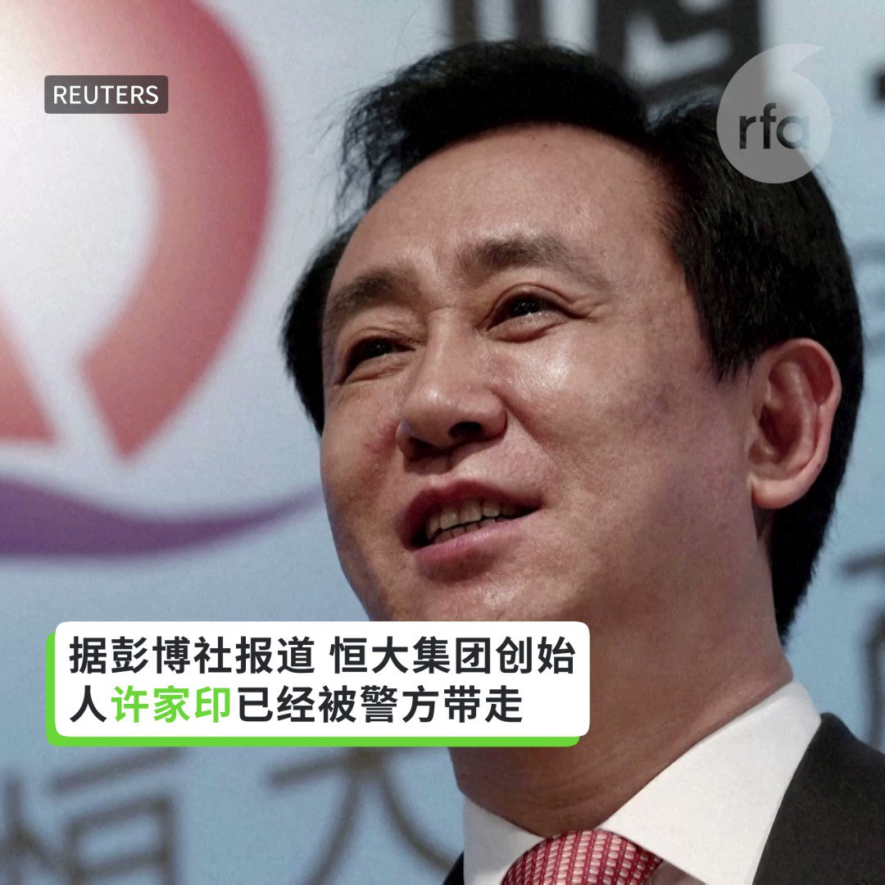
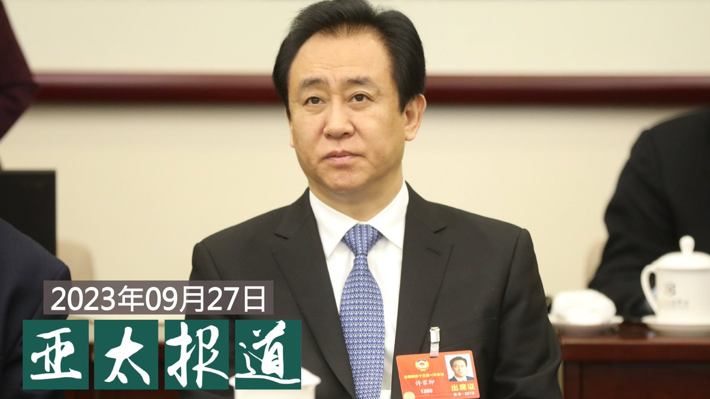
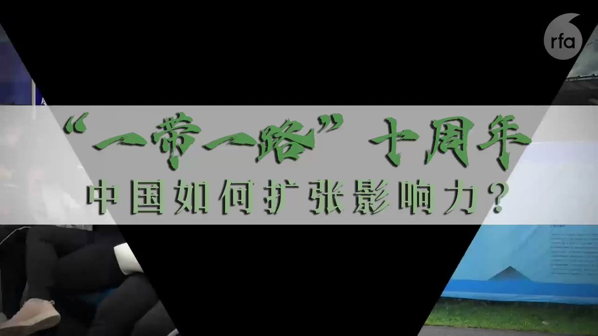

自由亚洲电台 北京时间 2023-09-28T05:18:06Z 1707142595091276132 据彭博社9月27日报道，恒大董事局主席许家印遭警方监视居住。 https://t.co/reiVbbu5Nh   自由亚洲电台 北京时间 2023-09-28T07:30:01Z 1707175792432791691 #事实查核｜美国母亲冲进教室怒撕 #彩虹旗？
 https://t.co/46Rs8QTF2s   自由亚洲电台 北京时间 2023-09-28T08:04:16Z 1707184412776182040 欢迎收听和订阅播客【亚太报道（2023-9-27）】
 https://t.co/MjLNSvVMqc
#许家印 已被警方监视居住 / 内蒙警察拦查路人促装 #反诈软件 / 律师 #李昱函 被羁押近六年 / 中共利用网红洗白涉港涉疆议题 / #美国出口管制清单 又增十家中国企业 https://t.co/ZGygd7adfz   自由亚洲电台 北京时间 2023-09-28T04:24:16Z 1707129047095103725 中国要致力于成为全球 #人工智能 的引航者，会对近年来景气低迷的经济有什么影响？总部位于美国纽约的亚洲协会中国分析中心本周三邀请专家学者，讨论中国人工智能的机遇和挑战。

 https://t.co/DVD9e9ManS   自由亚洲电台 北京时间 2023-09-28T05:20:35Z 1707143221271293960 RFA推出“#一带一路十周年”专题，聚焦一个领域、三个国家，试图回答：这个被习近平称为“世纪工程”的倡议在十年内发生了怎样的改变；又如何影响合作国家及其人民。
第一集 【#数字丝绸之路：中国能建立一个平行的科技帝国吗？】
详见 https://t.co/rPCV8QnnuF https://t.co/OGVls6xguV   自由亚洲电台 北京时间 2023-09-28T05:25:08Z 1707144365317967977 【#您怎么看？】千万救命款被卷走，中华儿慈会说是志愿者所为。
据中国民政部网站9月27日消息，近日，陷入“配捐”诈骗风波的中华少年儿童慈善救助基金会被调查。涉案人员柯某孝被指涉嫌诈骗9958儿童大病紧急救助项目数十名大病患儿家长，卷走上千万元善款。事发后，中华儿慈会回应称，柯某孝不是该会工作人员，曾在9958项目河北廊坊地区合作机构中短暂当过志愿者，中华儿慈会从未委托柯某孝个人筹集资金。目前柯某孝已被拘押调查。据介绍，“中华儿慈会”是具有民间色彩的全国性公募基金会，于2010年1月12日成立。
儿慈会的声明和众多家长的说法变成“罗生门”，柯某孝究竟是什么身份？中华儿慈会陷入信任危机，您还敢献爱心吗？   自由亚洲电台 北京时间 2023-09-28T05:50:51Z 1707150835585863790 继饱含隐喻的歌曲《罗刹海市》火遍全网后，新歌曲《#大梦》一经播出，也"听哭"了广大中国人。这首写尽中国人一生困惑的歌曲为何能够引发如此热烈的反响？

 https://t.co/hgabntM9PO   自由亚洲电台 北京时间 2023-09-28T06:00:34Z 1707153280625721405 【稚子何辜？#王全璋 之子又被失学】
王全璋律师周三在其社交媒体X上贴文说：“原以为在舆论的声援之下，不法势力有所收敛，我们终于稳定下来，但是我们想错了。不法分子像幽灵一样游荡在我们的周围，甚至对我们的孩子下手。短时间内，我们先后上了两个学校，第二个在我们通过了面试、笔试、交费办理了入学手续之后的当天下午即被学校拒绝。我们的孩子又又又又被失学！”

在另一则贴文中，王全璋说：“恶之平庸（the banality of evil）——北京市新府学外国语学校，这个号称以‘明德至善、中西通才’为校训的学校，在孩子入学的当天下午，不假思索地拒绝了我们，完全不考虑我们的感受，没有任何解释，我们给校长、法定代表人写信，跟招生老师耐心沟通，一个多星期，没有得到任何回应，好像我们从来没有来过。”

王全璋律师是709大抓捕案中的主要受害者之一。他和妻子李文足一直遭受中国当局的迫害，今年4月以来，他们一家在北京一直被不断骚扰、逼迫搬迁。

9月初，李文足曾推文说，她和孩子在湖北老家度过了两个月暑假，在开学前一天回到了北京昌平家中。但是，她们家的周围依然被“那些人”（指当局派来的人）占据。王全璋忙于生计各地奔波，她每天接送孩子学习，往返要四小时路程。   自由亚洲电台 北京时间 2023-09-28T06:08:22Z 1707155246902874239 【#您怎么看？】
法国《世界报》北京通讯员勒梅特（Frédéric Lemaître）9月26日在专栏中写道：“虽然中国经济状况不太好，但很多中国人的经济状况可是一点也不差。“中国2023年的增长率预期为5%，美国和德国公司比如星巴克、宝马等的投资，以及中国人的储蓄率都维持在高水平，习治下的中国表现出的不都是危机迹象。勒梅特说，中国是一个大陆，单一地解读中国必然是错误的。
您同意吗？您对中国经济的现实体感怎么样？   自由亚洲电台 北京时间 2023-09-28T01:30:01Z 1707085195915243630 #李昱函 的代表律师何伟上周到沈阳市和平区法院与法官与庭长沟通。基于安全考量要求匿名的知情人士透露，何伟认为，李昱函在审而不判的情况下被羁押接近六年，严重违法。姓叶的庭长当场承诺，会在今年年底前对李昱函作出裁决。

 https://t.co/EMnDqjfcri   自由亚洲电台 北京时间 2023-09-28T02:00:10Z 1707092783348297781 美国商务部宣布将二十八个实体和个人列入"#实体清单"，其中有十家中国企业以及一名个人。美国商务部长雷蒙多早前表示，出口管制未来仍将是中美两国意见分歧最多的领域。

 https://t.co/rMsqgNXhss   自由亚洲电台 北京时间 2023-09-28T02:48:36Z 1707104971689505209 #彭定康：“许多在香港争取自由的人，都遭到报复，这令人非常不安，就像黎智英。 #黎智英 是一位勇敢的中国爱国者，但他不是共产党员。你想想，怎会有港人以对中共的热爱，来定义自己的爱国情怀？他们都是因为共产党而逃离中国，在香港寻找避难所。”

 https://t.co/oiaP1EWz8N   自由亚洲电台 北京时间 2023-09-28T03:09:59Z 1707110353795190898 研究 #西藏寄宿学校 制度的教育社会学者嘉洛（Gyal Lo）指出，中国的寄宿教育政策于2016年开始施行于学前儿童。现在在这个年龄段中，每4位孩子中就有3位就读于寄宿学校，这也包括他在 #西藏 的年幼亲戚。

 https://t.co/nYcMEUpyyt   自由亚洲电台 北京时间 2023-09-28T03:55:34Z 1707121823656386974 彭博社援引消息人士的说法称，中国最大房地产公司之一的恒大集团董事局主席 #许家印 目前已被警方监视居住。
消息一出，引起外界广泛关注。在 #中国房地产 公司不断爆出债务危机的趋势下，有观察家指出，这一事件表明中国经济崩溃的多米诺骨牌倒下的速度正在加快。

 https://t.co/1qIdfdk4Lb   自由亚洲电台 北京时间 2023-09-28T01:00:02Z 1707077651297644822 从2019年以来中断的 #中日韩领导人会议 有望今年十二月在首尔举行。#习近平 上次到韩国进行国是访问还是2014年，而韩国总统办公室日前证实，将同中方就中国国家主席习近平访韩进行正式协商。

 https://t.co/txQvNNRlLn   自由亚洲电台 北京时间 2023-09-28T02:05:33Z 1707094136728551758 #一带一路十年专题 ｜#华为“攻占”印尼通信产业：“他们控制了市场，就控制了国家”
https://t.co/QeAfe5FAoA https://t.co/V8bMJlz5P1   自由亚洲电台 北京时间 2023-09-28T00:06:11Z 1707064098905891096 本台“#亚洲很想聊” 节目针对中国是否步上日本后尘，陷入失落30年展开讨论。旅美经济学家程晓农认为，所谓日本失落30年，指的是经济景气循环，“中国是长期性的，现在开始从高点一直往下滑落，不再有周期，它不会回去了。不存在三十年的问题，端视何时触底，就趴成水平线，” https://t.co/TnNiFvXyR9   