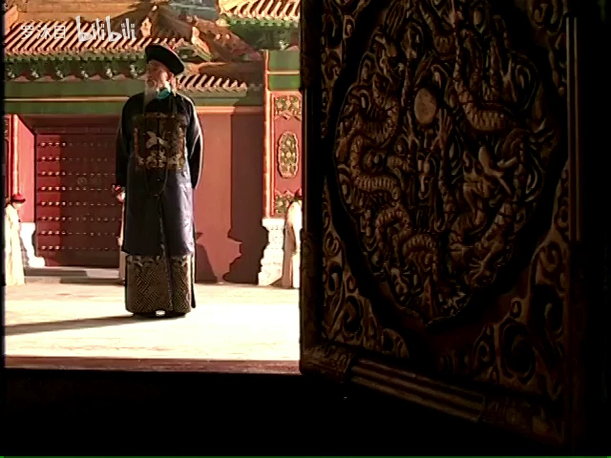

谁将十万横扫三江 北京时间 2023-09-28T12:10:26Z 1707246363917083067 RT @torontobigface: 看到许家印出事情。
让我想起了大明王朝里的一句话。
上下挥霍无度，便掠之于民
民变在即，便掠之于商 https://t.co/whGk8zYMfm   谁将十万横扫三江 北京时间 2023-09-28T12:10:33Z 1707246390341152856 RT @torontobigface: 冬奥会，亚运会是不是就是当代的慈禧过生日？ https://t.co/alJL4pkrL6   谁将十万横扫三江 北京时间 2023-09-28T08:27:34Z 1707190276216029447 RT @zhengyichangcun: 今天，我来到乌克兰驻德国大使馆，展示了支持乌克兰反侵略抗争、希望战争早日结束实现和平的海报，并递交了信件。我递交信件时，说“Slave Ukraini”。工作人员表示非常感谢。
我在信中，表达了对乌克兰同情支持，也劝说乌克兰努力寻求务实…   谁将十万横扫三江 北京时间 2023-09-28T10:00:32Z 1707213670365978713 【生活成本抗议 - 加拿大】10 万多名公务员在魁北克省蒙特利尔举行示威游行，要求提高工资以跟上通货膨胀。
他们威胁说，如果政府不采取行动，他们将举行无限期大罢工。 https://t.co/H0TFt7iVFE   