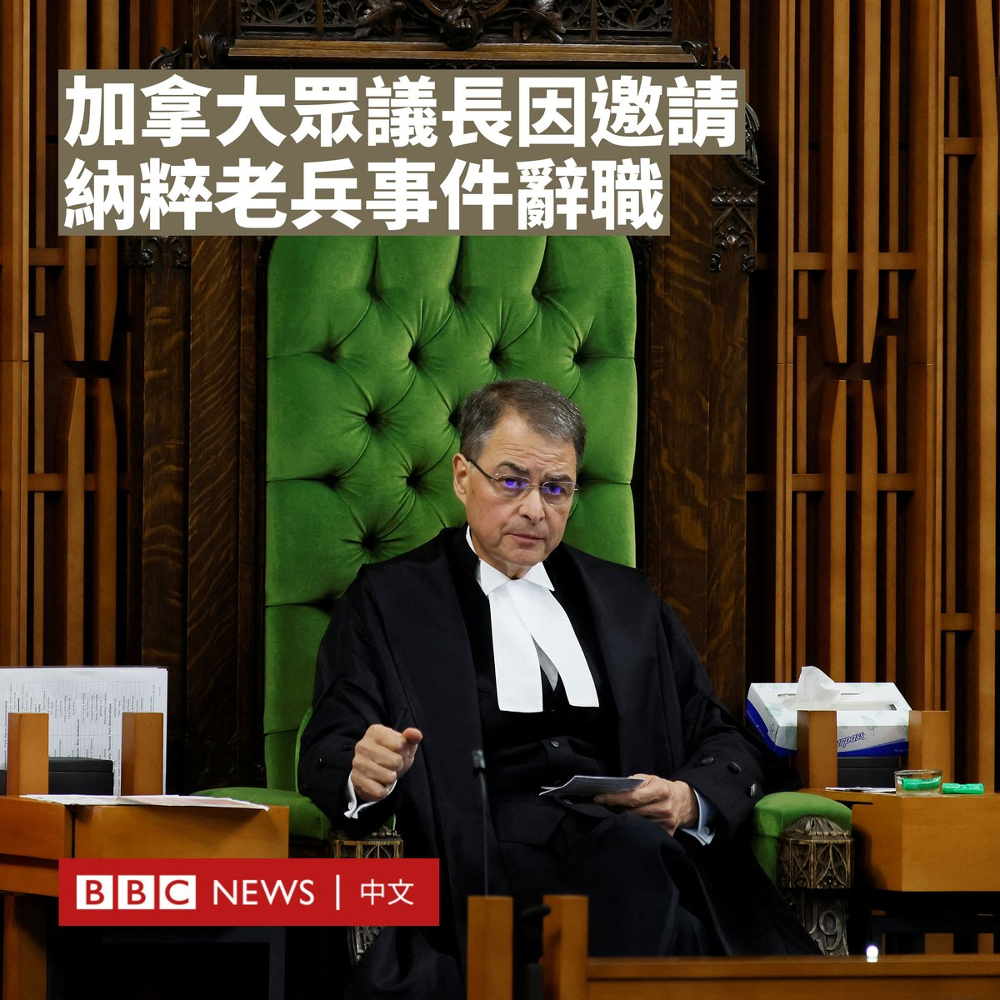
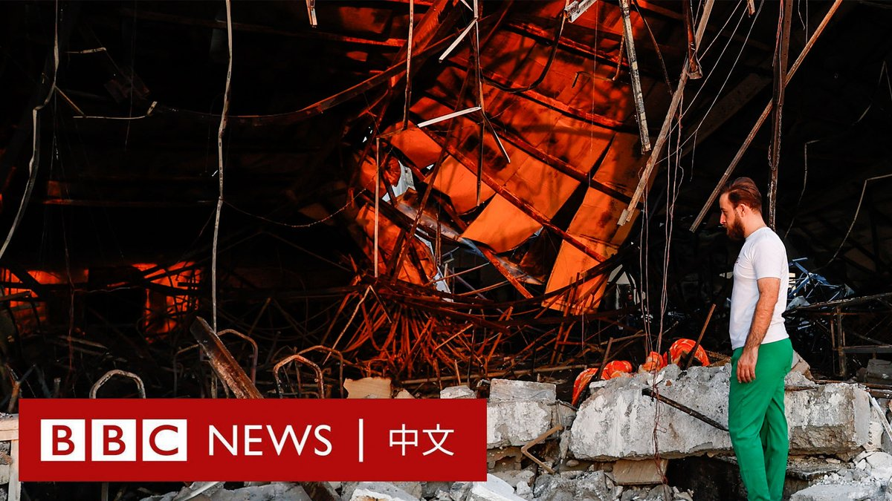

D英国广播公司BBC 北京时间 2023-09-27T14:24:49Z 1706917794544320597 在墨西哥新莱昂州的奇平克生态公园，一群游客在野餐时，突然闯入一位不速之客。

一只饥饿的黑熊登上桌子，大快朵颐地将桌上的食物一扫而光。旁边的游客则待在原地不动。它随后跳下桌子，扬长而去。

这段影片在社交媒体平台TikTok上疯传，浏览量超过1000万。 https://t.co/87d54JxQAu   D英国广播公司BBC 北京时间 2023-09-27T19:56:03Z 1707001149365313776 加拿大众议院议长罗塔（Anthony Rota）宣布辞去议长职位，原因是他早前于国会邀请了一名前乌克兰裔纳粹士兵，并对他表示赞扬。
 
 在多党都有呼声要求他辞职后，罗塔于周二（9月26日）对国会表示：“我必须辞去议长职务”，并称“再次表示深切的歉意”。

在乌克兰总统泽连斯基（Volodomyr Zelensky）上周五（9月22日）造访加拿大众议院期间，罗塔发表演讲时提及一名他邀请的嘉宾——98岁的乌克兰裔老兵雅罗斯拉夫·洪卡（Yaroslav Hunka）。

罗塔把他誉作“英雄”，而洪卡因此获得全场起立鼓掌，泽连斯基也向其致意。但是很快有人发现，洪卡当年是在效忠纳粹德国的部队中作战。

该事件迅速引发了全球的谴责。罗塔辩称他不知道洪卡与纳粹有关，并承认邀请他出席是个错误。

加拿大总理特鲁多（Justin Trudeau）于周一（9月25日）表示，这件事“非常令人不安”。他说：“这对加拿大国会以及所有加拿大人来说都是一件令人深感尴尬的事情。”

在罗塔宣布辞职的几小时前，加拿大外长乔利（Melanie Joly）也称这个错误是“完全不可接受的”。

在二战期间，洪卡所在的部队是一支主要由乌克兰人组成、接受纳粹指挥的志愿军队。尽管该部队尚未被法庭判定犯下战争罪，但其成员被指控曾杀害波兰和犹太平民。   D英国广播公司BBC 北京时间 2023-09-27T17:20:08Z 1706961913819664449 这是马尔代夫现任总统与反对派的一次决选，并很可能决定中国和印度之间谁将在这个具有战略意义的岛国占据上风。https://t.co/0a1ohGtb0M   D英国广播公司BBC 北京时间 2023-09-27T16:14:30Z 1706945396009058380 伊拉克北部尼尼微省的一个婚礼现场发生火灾，造成至少100人死亡，150人受伤。卫生官员表示，遇害者中包括这对新婚夫妇。

目前尚不清楚是什么原因导致了这场大火，但此前有报道称，大火是在燃放烟花后发生的。

伊拉克民防总局发表声明称，婚礼大厅使用了高度易燃的建筑材料，火灾导致大厅部分倒塌。 https://t.co/vnof1B8eGc   D英国广播公司BBC 北京时间 2023-09-27T12:45:25Z 1706892778469486948 在阿塞拜疆上周夺取纳戈尔诺-卡拉巴赫（Nagorno-Karabakh）地区的控制权后，当地有四分之一的亚美尼亚族人踏上逃亡之路。

阿塞拜疆称当地居民的安全受到保障，但是亚美尼亚总理警告“种族清洗”已经开始。

纳卡地区被国际承认为阿塞拜疆的一部分，但30年来一直由亚美尼亚族人统治。 https://t.co/PljGsWniUT   D英国广播公司BBC 北京时间 2023-09-27T11:21:22Z 1706871628221825299 美国纽约州法官裁定，前总统特朗普（Donald Trump）向银行和保险公司提供了虚假财务报表，应对欺诈行为负责。

这是纽约州总检察长莱蒂西亚·詹姆斯（Letitia James）在针对特朗普的民事诉讼中提出的关键指控之一。此次裁决以庭前简易判决形式进行，对特朗普来说是一大挫败，该诉讼将在下周开庭审理。

法官还裁决取消特朗普集团在纽约的商业执照，这可能会终止特朗普对特朗普大厦等纽约标志性地产的控制。

特朗普的律师在周二（9月26日）晚发布声明称，该裁决是“审判不公”。

去年9月，纽约州总检察长詹姆斯起诉特朗普，指控他以及两子和特朗普集团在2011年至2021年间谎报他的净资产和资产价值。

她称，特朗普提供的财务文件中，为包括位于佛罗里达州的海湖庄园（Mar-a-Lago）、特朗普大楼等多个物业资产作出虚假及误导估价，令其身家抬高多达近36亿美元。

詹姆斯声称，被告出具虚假的商业记录和财务报表，以便在银行贷款和保险交易中获得更优厚的条件，并缴纳更少税款。

在解决其诉讼中剩余六项指控的审判中，她将寻求2.5亿美元的罚款，并禁止特朗普在纽约开展业务。

这个无陪审团的审判定于10月2日开始，至少持续到12月。

特朗普的辩护律师呼吁撤销这起诉讼，辩称公众没有受到特朗普行为的伤害，而且相关贷款发生在很久以前。

特朗普否认有任何不当行为，并在周二驳斥纽约的这起案件是检察官对他有偏见而进行的又一次政治“迫害”。他指责法官“高度政治化”。

他的律师在一份声明中表示，该裁决无视“基本的法律、会计和商业原则”。   