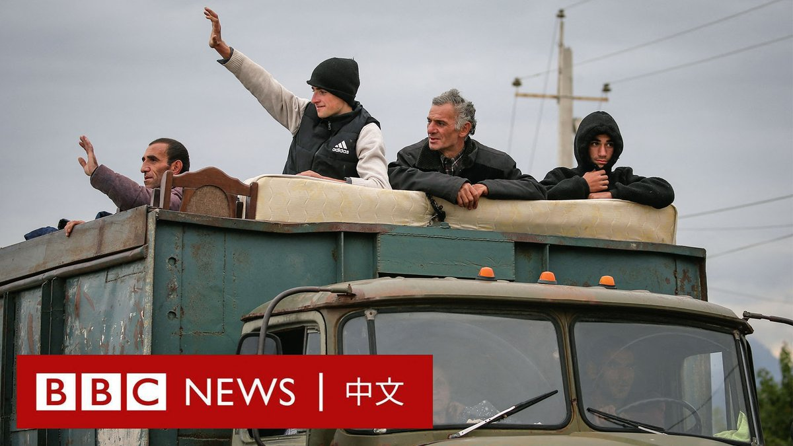
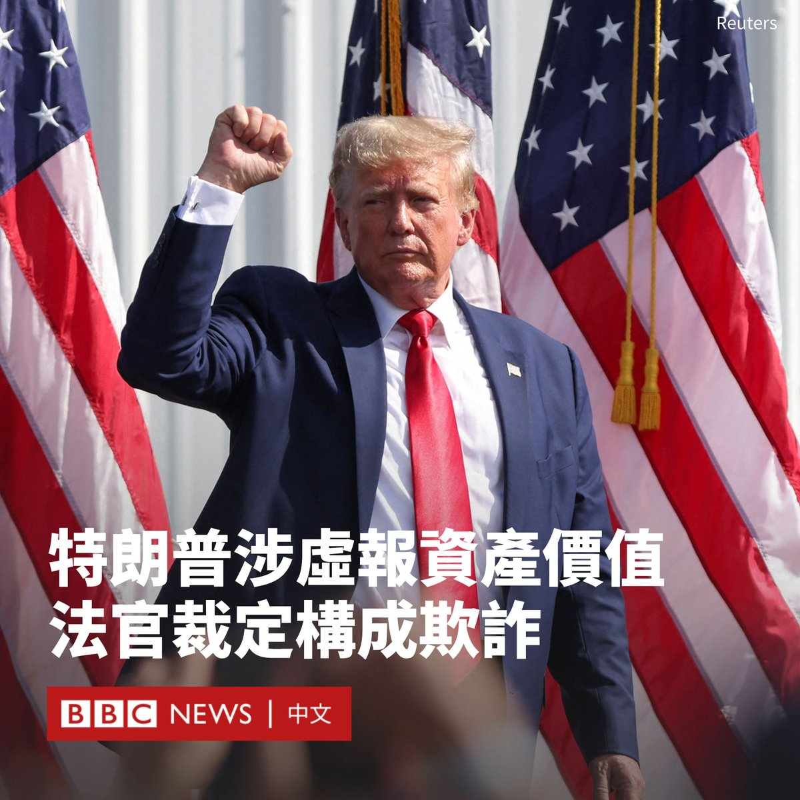

D英国广播公司BBC 北京时间 2023-09-27T12:45:25Z 1706892778469486948 在阿塞拜疆上周夺取纳戈尔诺-卡拉巴赫（Nagorno-Karabakh）地区的控制权后，当地有四分之一的亚美尼亚族人踏上逃亡之路。

阿塞拜疆称当地居民的安全受到保障，但是亚美尼亚总理警告“种族清洗”已经开始。

纳卡地区被国际承认为阿塞拜疆的一部分，但30年来一直由亚美尼亚族人统治。 https://t.co/PljGsWniUT   D英国广播公司BBC 北京时间 2023-09-27T11:21:22Z 1706871628221825299 美国纽约州法官裁定，前总统特朗普（Donald Trump）向银行和保险公司提供了虚假财务报表，应对欺诈行为负责。

这是纽约州总检察长莱蒂西亚·詹姆斯（Letitia James）在针对特朗普的民事诉讼中提出的关键指控之一。此次裁决以庭前简易判决形式进行，对特朗普来说是一大挫败，该诉讼将在下周开庭审理。

法官还裁决取消特朗普集团在纽约的商业执照，这可能会终止特朗普对特朗普大厦等纽约标志性地产的控制。

特朗普的律师在周二（9月26日）晚发布声明称，该裁决是“审判不公”。

去年9月，纽约州总检察长詹姆斯起诉特朗普，指控他以及两子和特朗普集团在2011年至2021年间谎报他的净资产和资产价值。

她称，特朗普提供的财务文件中，为包括位于佛罗里达州的海湖庄园（Mar-a-Lago）、特朗普大楼等多个物业资产作出虚假及误导估价，令其身家抬高多达近36亿美元。

詹姆斯声称，被告出具虚假的商业记录和财务报表，以便在银行贷款和保险交易中获得更优厚的条件，并缴纳更少税款。

在解决其诉讼中剩余六项指控的审判中，她将寻求2.5亿美元的罚款，并禁止特朗普在纽约开展业务。

这个无陪审团的审判定于10月2日开始，至少持续到12月。

特朗普的辩护律师呼吁撤销这起诉讼，辩称公众没有受到特朗普行为的伤害，而且相关贷款发生在很久以前。

特朗普否认有任何不当行为，并在周二驳斥纽约的这起案件是检察官对他有偏见而进行的又一次政治“迫害”。他指责法官“高度政治化”。

他的律师在一份声明中表示，该裁决无视“基本的法律、会计和商业原则”。   