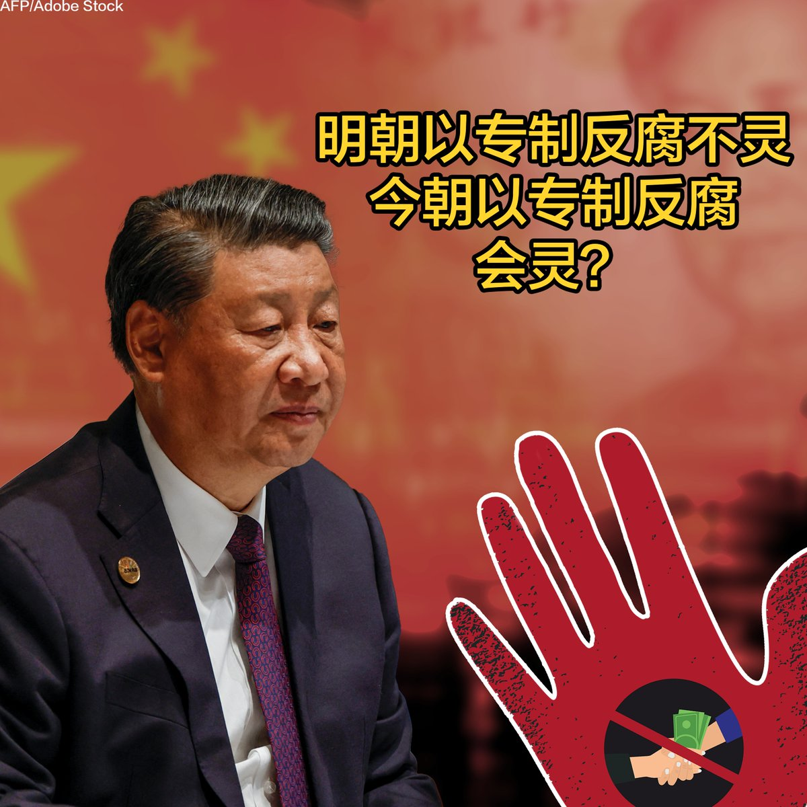

美国之音中文网 北京时间 2023-09-27T06:53:53Z 1706804310456041551 《外交事务》杂志26日刊文称，中国军队长期腐败横生，根源在于邓小平以来中共在文官体系与军权上做的交易：让文职技术官僚理政，军官回归军务，但允许军队自我监督，只要对党忠诚。缺乏外部监督伴以军费暴涨，腐败猖獗。习是想整肃军队，确保和提升备战力，但出于政治需要也动不了这笔交易。 https://t.co/ti24ey3odS   美国之音中文网 北京时间 2023-09-27T07:00:01Z 1706805855054897294 华为高调举行新品发布会，为什么没有透露有关新手机Mate 60 Pro的任何细节，也没有报告先进芯片的突破？本土产品啃不动苹果？中国证监会推出迄今“最严”减持新规，禁止公司大股东抛售股票，能否刹住股市下滑？行政干预是救市大招，还是恶性循环？请看9月27号的【#时事大家谈】并留言。 https://t.co/vliJLpxucq   美国之音中文网 北京时间 2023-09-27T07:33:35Z 1706814302458683858 又有三家中国公司因涉新疆强迫劳动而被美国纳入制裁名单 https://t.co/UIbFFB3VBF   美国之音中文网 北京时间 2023-09-27T08:04:27Z 1706822071920046457 美国前国务卿希拉里·克林顿的肖像9月26日在国务院揭幕。“欢迎回家！” 现任国务卿布林肯在揭幕仪式上对这位前国务卿说。克林顿于2009年到2013年期间，也就是奥巴马总统第一任期内担任国务卿，在任内对中国进行了七次访问。 https://t.co/G2kRMGMBOr   美国之音中文网 北京时间 2023-09-27T08:13:27Z 1706824336231797016 【家事国事天下事，你有何见解】十多年高唱坚决反腐“苍蝇老虎一起打的”习近平当局近日来再放反腐狠话，声言要“刀刃向内推进党的自我革命”。但历史学者们说，明朝当年也动用狠力和酷刑反腐，也通过类似于今日监察委那样的直接听命于皇上且不受法律和其他政府机构制约的东厂西厂反腐，结果乏善可陈。 https://t.co/wWAU3md9LS   美国之音中文网 北京时间 2023-09-27T08:23:33Z 1706826878437490962 高校要“去英语化”？中国年轻人学英语热度不减 https://t.co/SG7OR2nXMa   美国之音中文网 北京时间 2023-09-27T08:42:10Z 1706831562690736586 在中国影响力增加时，印度和美国陆军负责人呼吁自由稳定的印太地区 https://t.co/FikFKVwI3A   美国之音中文网 北京时间 2023-09-27T09:04:33Z 1706837194990850325 法官裁决特朗普在打造房地产帝国期间欺骗了银行与保险公司 https://t.co/ysWkzLpmNb   美国之音中文网 北京时间 2023-09-27T00:57:07Z 1706714526748753992 进一步加重外商寒蝉效应 中国再传外商高管被“边控” https://t.co/evSqUfXcnm   美国之音中文网 北京时间 2023-09-27T01:28:05Z 1706722320218456569 韩国宪法法院推翻一项禁止散发反朝宣传传单的法律 https://t.co/7aWcN06iD7   美国之音中文网 北京时间 2023-09-27T04:16:23Z 1706764676913143961 今年的9月27日，谷歌将庆祝其创立25周年，这家公司如今已发展成为市值一万亿美元的科技巨头。从搜索引擎到地图，谷歌从根本上定义了人们获取信息和解决问题的方式。让我们听听人们如何评价这家改变了他们生活方式和行为习惯的公司。 https://t.co/0F7nNFDPIa   美国之音中文网 北京时间 2023-09-27T05:16:05Z 1706779699681341465 美国联邦贸易委员会联手17个州指控亚马逊公司非法垄断 https://t.co/OGQl4n2lRp   美国之音中文网 北京时间 2023-09-27T05:37:06Z 1706784987360702696 乌克兰女军人首次获得正式女兵制服 https://t.co/Y3FoyLxruA   美国之音中文网 北京时间 2023-09-27T05:52:05Z 1706788759612834065 纳卡地区爆炸炸死几十人 https://t.co/OSyI2Ilyts   美国之音中文网 北京时间 2023-09-27T00:57:11Z 1706714544595251444 中国政府秘密要求各国抵制黎智英儿子出席联合国活动 https://t.co/dXGH73SfMm   美国之音中文网 北京时间 2023-09-27T02:51:06Z 1706743211530780916 中国驻美使领馆敦促中国公民登记个人信息引发华人不同反应 https://t.co/8ZfvTFn7v3   美国之音中文网 北京时间 2023-09-27T03:32:04Z 1706753524393295896 以色列内阁成员访问沙特 https://t.co/PjtAct0W6E   美国之音中文网 北京时间 2023-09-27T03:57:12Z 1706759847138803889 美国政府公布《新疆供应链工商咨询公报》增订版 https://t.co/alFREe7GEH   美国之音中文网 北京时间 2023-09-27T04:18:34Z 1706765223754072291 联合国辩论落幕，11邦交国为台湾发声，专家：2758号决议并未决定台湾地位 https://t.co/NMhPBlZm23   美国之音中文网 北京时间 2023-09-27T01:07:08Z 1706717050767655422 恒大如不能如期拿出新的重组方案，债权人将寻求法院强制清算 https://t.co/ur5BaxoOZg   美国之音中文网 北京时间 2023-09-27T02:01:45Z 1706730794109067680 三位因签证问题无法参加杭州亚运会的印度武术运动员9月26日在接受媒体采访时表达了他们的难过和失望。这三位运动员来自阿鲁纳恰尔邦（中国称藏南）。由于这一地区是印中两国的争议领土，三位运动员无法获得中国政府正常的入境签证而被迫退赛。 https://t.co/64UVp2oXj3   美国之音中文网 北京时间 2023-09-27T00:15:35Z 1706704076229247018 日中韩外交高官探讨首脑峰会可能性 美国因素影响重大 https://t.co/rn6HdV2ztZ   