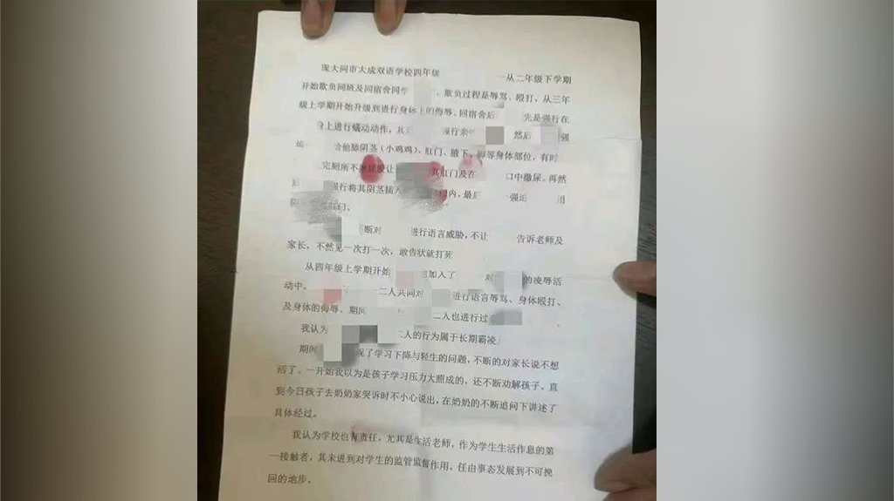

自由亚洲电台 北京时间 2023-09-27T00:51:13Z 1706713044594966933 #太平洋岛国领导人峰会 在华盛顿举办之际，美国总统拜登宣布将为太平洋岛国提供海军训练。而 #帕劳 总统则透露，两国正就在当地部署 #爱国者导弹防空系统 进行讨论，以因应中国的威胁。

 https://t.co/azzBwHYAPS   自由亚洲电台 北京时间 2023-09-27T01:32:58Z 1706723550298800406 据彭博社9月26日报道，国际管理咨询公司奥纬咨询（Oliver Wyman）9月的一项调查表明，疫情前经常 #出国游 的中国受访者中有54%表示在2023年有出游计划，而在6月同样的调查中这个比例是62%。有22%的受访者表示未来三年不会到海外旅行，6月份的调查中这个比例是6%。

 https://t.co/ALWbZcinBW   自由亚洲电台 北京时间 2023-09-27T03:43:16Z 1706756341791178889 “为了自由和民主，你愿意承受多大的风险？ 我父亲的回答是，一切。”这是 #黎崇恩 在《泰晤士报》最新文章中的第一句话, 阐述父亲 #黎智英 毕生坚守的信念。黎崇恩在文中强调，父亲是英国国民，却未获英国政府重视。
 https://t.co/uXjf0OGPhI   自由亚洲电台 北京时间 2023-09-27T04:01:31Z 1706760934058778852 【网友：这是性侵，不是普通霸凌！】
据《法制日报》等大陆媒体报道，山西 大同市 #大成双语学校 两名男性小学生被指控 霸凌性侵另一男同学，校长因此被解职，两名肇事学生受到训诫。

肇事和受害男童三人都是四年级学生。事件发生后，大同市教育局派驻工作组进驻学校，并在周二（9月26日）发布了通报。学校被认为在管理上失职，被责令整改，许姓校长被解职，两名副校长、涉事班主任和生活老师也被辞退。教育局还决定缩减这所学校新学年招生规模。

据新加坡联合早报报道，通报发出后，不少网民觉得对肇事学生的处罚太轻，有网民强调，这是 #性侵，而不是普通的霸凌。有网友呼吁应该对 #校园霸凌 立法。

另据央视网报道，山西新修订的《#山西省未成年人保护条例》将从2024年1月1日开始实施，其中规定，校长是学校保护未成年学生的第一责任人。   自由亚洲电台 北京时间 2023-09-27T01:06:11Z 1706716809477734572 中国在"#人类命运共同体"口号提出十周年之时发表新白皮书，不点名批评个别国家搞霸权主义。这也是在重掌外交部后，#王毅 首次见中外媒体。
王毅是在为 #习近平 不出席APEC铺垫和找台阶，把中国不参与国际活动的责任推给美国？ https://t.co/Bg3eKi6QEV   自由亚洲电台 北京时间 2023-09-27T02:06:07Z 1706731893872640158 美国商务部长吉娜·雷蒙多上周在国会众议院听证会上表示，现在有超过700家中国公司被列入 #出口管制名单，其中超过三分之一是在拜登政府任内添加的。她当时还强调，美国需要更多的出口执法特工，需要更多的技术专家；国家安全与技术的相关性越来越高。 https://t.co/5vXjaPfd9M   自由亚洲电台 北京时间 2023-09-27T02:19:48Z 1706735335898857643 美国政府正在与 #越南 就一项历史上最大规模的武器转让协议进行谈判，该协议可能会激怒中国并排挤俄罗斯。

 https://t.co/crG7ByZHjg   自由亚洲电台 北京时间 2023-09-27T00:23:16Z 1706706008108871979 旅美评论人士蔡慎坤 @cskun1989 表示，所谓的“#枫桥经验”就是给基层放权，让基层胡作非为、群众斗群众。一个法治国家若 #依法治国 根本不存在让基层化解矛盾的问题，毛泽东时代充分肯定“枫桥经验”，最终导致中国社会出现了巨大的灾难。 习近平的表态是非常危险的信号... https://t.co/HqRHqZhE6j   