A李老师不是你老师 北京时间 2023-09-26T20:35:29Z 1706648684413301246 9月26日，广州白云区人和镇，原本每天跳广场舞的大妈今天突然开始练习忠字舞 https://t.co/pXEEHCgNWs 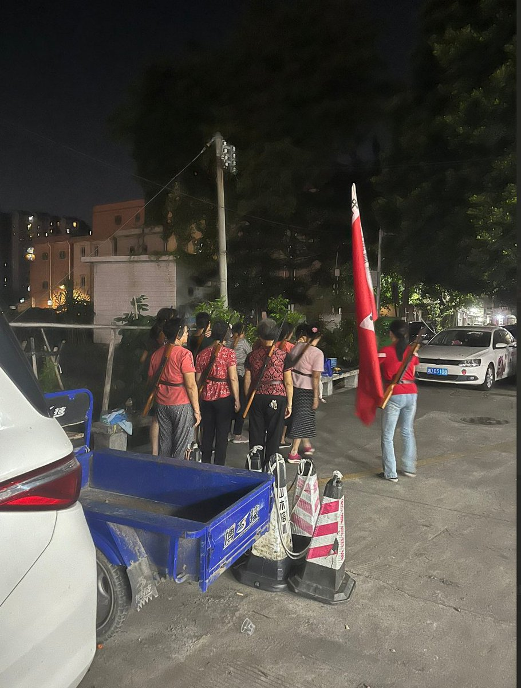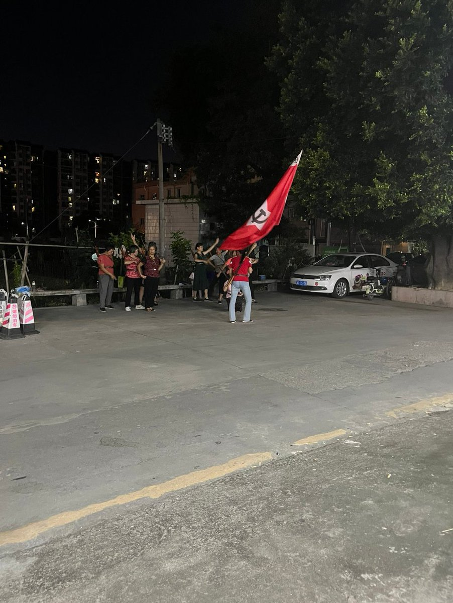  A李老师不是你老师 北京时间 2023-09-26T15:42:44Z 1706575013803913246 文章由朱军案当事人 @maishaotongxue 女士投稿

《朱军案，从2014年6月到2023年9月发生了什么》

2014年6月10日，在央视《艺术人生》栏目组实习的弦子被主持人朱军在化妆间猥亵，因为郁钧剑等人进入化妆间，朱军停止猥亵，弦子表示了拒绝。

2014年6月10日，弦子与同学、亲属沟通询问应该怎样处理，得到的回复是不要声张。

2014年6月11日，弦子与Z老师沟通，Z老师建议弦子报警，在Z老师、Z老师的朋友（身份为律师）和同学的陪同下，弦子前往北京市公安局海淀分局羊坊店派出所报警。警方对弦子和Z老师分别作了笔录，在完成1个小时的笔录后，警方前往央视，在出事的化妆间进行现场调查并调取了监控视频，稍晚，警方在弦子的贴身衣物上进行DNA提取，并向弦子等人播放了监控视频。在视频回放过程中，警方指着弦子擦嘴的画面说，“这个视频可以作为你被朱军强迫的证据”。

2014年6月X日，羊坊店派出所的值班警官告诉弦子，现在由北京市公安局海淀分局负责处理此案。当天晚些时候，两名警官告诉弦子，“朱军是正能量，要考虑这件事的影响”。（具体日期记不清楚了）

2014年6月13日，北京市公安局海淀分局在没有告知弦子的情况下来到位于武汉的弦子父母家中，向其父母施压，并要求弦子父母写下保证书，承诺不再提及弦子曾经被朱军猥亵一事。

2018年7月26日早5:17，弦子在微信朋友圈发布了第一篇锤子便签长文，讲述了四年前的事情经过和过往四年的反思，她的朋友在朋友圈看到长文后发表在自己的朋友圈，这个朋友同时也是麦烧同学的朋友。

2018年7月26日早6:42，麦烧同学在微博上发表了从朋友的朋友圈看到的弦子的长文，并注明：朋友的朋友曝了央视主持人@朱军99。

2018年7月26日8:50，麦烧同学在微博上发表的弦子的长文被屏蔽。

2018年7月26日22:46，弦子的同学阿桑发布锤子便签长文，讲述了事发当天弦子向他求助，以及在央视《艺术人生》栏目组工作的M老师向他和弦子施压的经历。稍晚，微博被屏蔽。

2018年7月27日15:22，财新网发布了报道《女实习生指控主持人性骚扰》，在这篇当天被转发11000次的报道中，记者采访了弦子、Z老师、曾陪同弦子报案的Z老师的律师朋友、阿桑、羊坊店派出所和朱军，其中，羊坊店派出所和朱军拒绝作出回应。这篇报道是国内媒体关于此事的第一篇较为全面的报道。当天还有其他媒体做了采访，但均未能发表。在发布5小时后，财新网的报道被删除。

2018年7月30日，在律师的陪同下，弦子于下午两点半到达羊坊店派出所，索取四年前的调查结果，被告知案件已由北京海淀分局负责。弦子和律师在羊坊店派出所等到晚上7点，北京海淀分局的一位警官来到派出所，让弦子就当年猥亵事件与锤子便签传播过程重新做了笔录并签字。羊坊店派出所承诺第二天会通知弦子并给她四年前的立案回执，但弦子至今未接到派出所电话。

2018年8月14日晚，麦烧同学被施压，“如果不删掉和朱军有关的微博就要退掉目前所租的房子”。

2018年8月15日中午，北京星权律师事务所在其官方微博上发布律师声明，针对7月以来网上流传的“朱军性骚扰（猥亵）实习生”的信息为不实信息，并强调该所对此进行了长达20天的调查、取证。该所已经代理此案，并于8月15日将本事件的新浪微博原发者和转发用户起诉至北京市海淀区人民法院。

2018年8月15日晚，《新京报》发布了对麦烧同学的采访：《朱军发声后，爆料人和当事人希望对簿公堂丨独家》报道，这篇发表在公众号的文章于第二天被删除。

2018年8月16日晚，弦子以“弦子与她的朋友们”为名开通微博并回应朱军的律师声明，称“麦烧同学不是造谣，所有传播那篇文章的朋友也不是造谣，因为那是真相，是我的真实经历，我万分期待朱军的律师函能给我一个契机，让真相能够被证明是真相”。

2018年8月17日，弦子发布《关于北京星权律师事务所“律师声明”的声明》，称“希望北京星权律师事务所能够严肃认真对待事实和法律，而非继续破坏法律和’律师声明’的严肃性。如北京星权律师事务所继续传播“朱军性骚扰（猥亵）实习生（我本人）为不实信息”的谣言，本人将依法对星权律师事务所及相关代理律师进行追责”。

2018年8月18日，弦子的微博被限制转发，只能发布微博，其他人不能转发其微博内容。

2018年8月20日，多家媒体发布报道《性骚扰当事人视频自述：朱军给我看手相，手伸进裙底未遂后强吻》，弦子第一次在镜头前讲述了四年前发生的事情，并希望更多受害人能够站出来维护自身合法权益。

2018年8月22日，《人物》杂志发布了对弦子的报道：《举报性骚扰之后》。

2018年8月22日至23日晚，弦子不断接到异地恐吓电话，电话中以弦子母亲的安全来威胁；23日晚，恐吓电话和录音在微博上得到披露。

2018年8月24日下午，在等待9天仍未收到朱军起诉书副本的前提下，麦烧同学在微博发布《针对“朱军律师声明”的回应》，呼吁朱军的律师和其律师取得联系，以便尽快推进司法进程。她在回应中表示，“这一案件不仅关乎我本人和受害人的自身利益，也将作为一个标尺来判断中国司法是否能够保障女性的合法权益”。

2018年8月27日，麦烧同学和律师前往公证处，对证据进行了公证。

2018年8月28日，麦烧同学发布微博称，“新浪把我微博上已被屏蔽的关于朱军的微博都解禁了”，她认为事情可能出现了变化。

2018年8月29日，更多消息称，朱军性骚扰（猥亵）女实习生一事可能受到了内部处理，弦子和麦烧同学表示，“我们想要的是法律上的交代和进步，同时要求央视作为工作场所的负责人公开调查结果”。

2018年9月3日，由朱军主持的《中国民歌大会》节目（重播）出现在央视三套，并将连续播出8天。第二天，该节目停播。

2018年9月5日，弦子的微博可以转发。当天，美国媒体和中国媒体相继报道“京东集团CEO刘强东在美涉嫌涉强暴女大学生被捕”，美国警方接受了中美两国媒体的采访，并公布了涉案报告全文。

对比朱军和刘强东的遭遇，武汉大学哲学院周玄毅副教授发布微博称：有生之年我们终于意识到，被性侵者根本不用站出来，是被控诉者要站出来。有些常识，是只有在被意识到之后才成为常识的。

2018年9月25日，麦烧同学和弦子接到北京海淀法院电话，通知已被朱军起诉。在起诉书中，朱军及其代理律师称麦烧同学、弦子发布的内容“无中生有、严重失实”，以名誉权纠纷为由，要求麦烧同学和弦子赔偿其经济损失和精神抚慰金共65.5万元。当天，弦子以朱军“性骚扰侵犯其人格权”为由，向北京海淀法院递交诉状进行反诉。
弦子在接受视频采访时说，“你站出来以后，大家会更清楚你是一个活生生的人”。麦烧同学说，“我们将积极应诉，让司法来决定吧”。

2018年9月26日，《财经》杂志和《Vista看天下》杂志发布了对弦子和麦烧同学的采访，对于可能的结果和调解，她们表示，“没有见到判决结果之前，我们不想去认输，也不准备去认输。”

2018年9月27日，在进行了一个月的采访和信息搜集后，国际三大新闻通讯社之一的路透社发布了相关报道，报道提到，“虽然工作场合的性骚扰非常普遍，但自2010年来，被正式记录在法院资料库里的性骚扰案例只有34例，其中一些还是受害者被起诉的案例”。

2018年9月29日晚，弦子和麦烧同学参加了matters的线上讨论：Me too应诉记，在时长两个多小时的讨论里，她们分享了关于对诉讼胜负、metoo运动等议题的看法。

2018年9月30日，澎湃新闻发表评论文章称，“今年以来，我们身边也发生了一些有关女性尊严的个案，不该只留下一地鸡毛，以满足围观的窥私欲，更不该让种种低劣的阴谋论横行，而是应该重新建构有关立法和话语权，让每一宗性侵、性骚扰指控得到严肃对待，跳出绯闻的泥坑、庸俗化的戏谑，使个案成为中国法治文明、妇女权益进步的阶梯。”

2018年10月1日，在央视60周年台庆百位主持人合唱的演唱视频中，朱军没有出现。

2018年10月25日，原告朱军方与被告弦子和麦烧将在北京海淀法院进行证据交换。弦子控告朱军一案由北京市海淀区人民法院受理。

2019年1月18日，朱军向法庭提出终止审理的要求被海淀区人民法院驳回。弦子从法院内部文件中，获得了她于2014年于警察局报案的卷宗，并向法院提交了两份申请，把案件改为“性骚扰损害责任纠纷”、并要求对案件双方接受测谎。

2019年，麦烧同学的微博、知乎账号、微信公众号、网易云音乐账号均被禁声。

2020年10月，麦烧同学赴英国和法国攻读公共卫生硕士学位。

2020年12月2日，弦子诉朱军性骚扰损害责任纠纷案于海淀区人民法院开庭。庭审过程长达十几个小时。当日，有一些弦子的支持者在法院门口表示声援，有前来采访的外国媒体记者被警方带走。中国国内媒体不允许报道关于庭审的任何信息。那么在十几个小时的庭审过程中发生了什么？

1、弦子一方在2019年1月就依法申请更改案由为“性骚扰损害责任纠纷”，却直到2020年12月开庭当日才得知合议庭决定不予更改，而且给出的理由非常荒诞。

2、弦子一方在2019年1月庭前会议后，就要求对弦子在事发当天所穿连衣裙进行重新DNA鉴定，直到2020年12月2日，被法院被当庭拒绝。

3、弦子一方在2019年1月庭前会议后，就要求当庭播放2014年6月9日，央视走廊的监控录像视频，然而就在卷宗中存在多张监控录像截图的情况下，海淀公安的回应却是“从未调取过监控录像”。弦子一方要求法院继续向公安调取，被当庭拒绝。（注：在多名当事人已经看到过视频和视频截图的情况下，法院否认存在视频）

4、弦子的父母双方都出席作证，说出他们在2016年6月13日，于武汉被海淀公安刑警要求做笔录并承诺不再追究的事实。弦子一方当庭要求向公安调取弦子父母的笔录，被当庭拒绝。

5、带弦子进入化妆室、并成为朱军方证人的商同学，在对方作为证据提交的律师笔录中明确表示：他2014年6月在外地上学，没参加节目录制，和弦子不熟，基本没什么交流，也不曾带弦子进入化妆室。在这份证词被卷宗的走廊监控截图与弦子一方提交的公证材料否定真实性后，弦子一方要求通知商同学到庭，查清他作伪证的原因，查清案发事实，被合议庭当庭拒绝。

6、两年来，弦子一方反复要求法院通知朱军本人到庭，合议庭回答“没有必要”，却完全不解释理由，也不给出法律依据。

7、依据《人民陪审员法》第十五条和十六条，弦子一方要求人民陪审员参加，要求七人合议庭。

8、弦子一方要求公开审理，始终不得，只能任由对方泼脏水。

2020年12月21日，微博@一个有点理想的记者 发表文章中指出， 将这起案件指向“境外势力”，利用麦烧同学身为国际NGO员工的身份，利用12月2日法庭外的支持者所举的牌子中出现繁体字，强调metoo和朱军一案是国外政府试图通过麦烧同学和朱军一案在中国进行颜色革命的工具。麦烧同学否认境外势力支持，否认其所供职的国际组织与朱军一案有任何关联，愿意接受所有调查，但各种发声渠道已经被禁声。

2021年9月14日，针对弦子诉朱军性骚扰损害责任纠纷案，北京市海淀法院不公开审理后认为弦子提交的证据不足以证明朱军性骚扰，一审驳回其诉讼请求。庭审结束后，弦子在法院外向支持者宣读一份声明，称法官未给予其详述指控的机会，没有允许控方调取多项证据的请求，如监控录像、合影、笔录文件和当年身着衣物上的DNA等。弦子在声明中表示：“非常感谢大家，一定会上诉的”。庭审当日朱军未到庭，也没有回应庭审结束后弦子的声明。而在新浪微博和微信公众号等社交媒体上，不少声援支持弦子或转发此案信息的账号被禁言或封号。弦子一方上诉。

2021年10月，在弦子的公众号发布判决书和上诉状后，文章被删，弦子微信公众号被禁言。很多在微博上参与转发的网友被禁言。

2022年8月10日下午两点，弦子诉朱军的一般人格权纠纷（性骚扰损害责任纠纷）的二审维持原判。

2023年，弦子申请再审一般人格权纠纷案。

2023年9月22日，麦烧同学的律师收到了北京海淀法院的民事裁定书，朱军申请撤销2018年8月针对麦烧同学和弦子的名誉诉讼起诉，北京海淀法院裁定允许朱军撤诉，至此，朱军案结束。

麦烧写道，“在2018年7月这个官司刚开始的时候，我从没想到它会经历五年的时间，一个官司会经历从‘性骚扰’到‘境外势力试图通过metoo在中国掀起颜色革命’这样的叙事转变。过去五年，这个官司是我们时代转型缩影的一部分。”

2023年9月24日，弦子和麦烧的律师徐凯发表结案说明，如下：
一、名誉权纠纷案件，原告朱先生主动向法院撤回起诉，原告和麦烧弦子及/或其代理人之间，不存在任何形式的和解或谈判。

二、一般人格权纠纷案件，经一审、二审和申请再审程序，以原告弦子负有举证义务，但现有证据不足以证明性骚扰事实为由，驳回诉请。该案一审、二审判决和再审裁定，均未以任何方式认定或暗示原告弦子陈述不实或捏造事实。

三、我们的当事人主动参加了法院组织的每一次开庭，回答了法庭提出的每一个问题，收集提交或申请收集了与待证事实有关的每一份证据，穷尽了我们所知的民事诉讼程序中可能协助法庭查明事实的每一种方法。四、经过2014年报警、2018年起诉、2021年一审、2022年二审、2023年申请再审，弦子没有辜负她21岁时，于报警当日凌晨，在朋友圈写下的宣言： 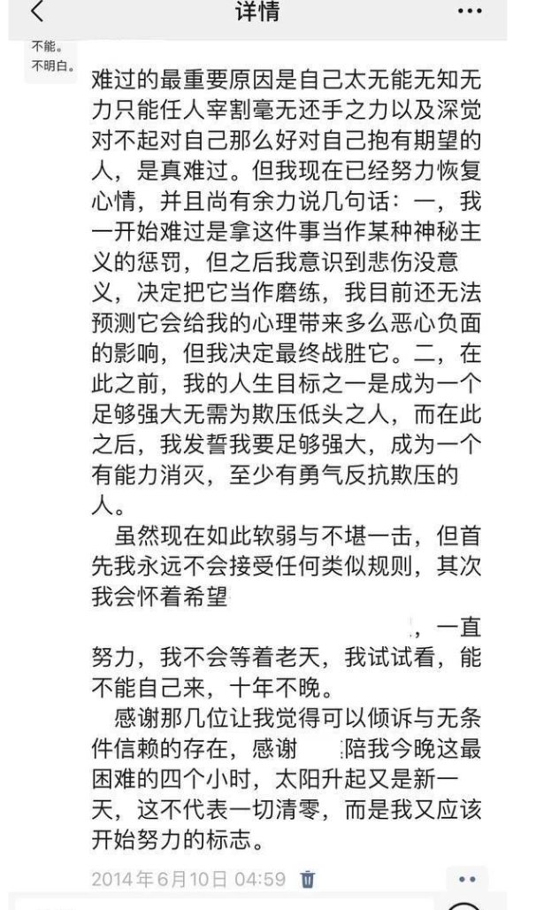  A李老师不是你老师 北京时间 2023-09-26T16:00:24Z 1706579458595942531 9月25日，陕西咸阳，一女子想见住建局领导，被三名保安踩在脚下。 https://t.co/7okigcCdzX   A李老师不是你老师 北京时间 2023-09-26T16:30:01Z 1706586912998277344 9月25日，西安电子科技大学一名女博士生跳楼
据传因为来自导师的压力过大 https://t.co/LKs26iSu3A 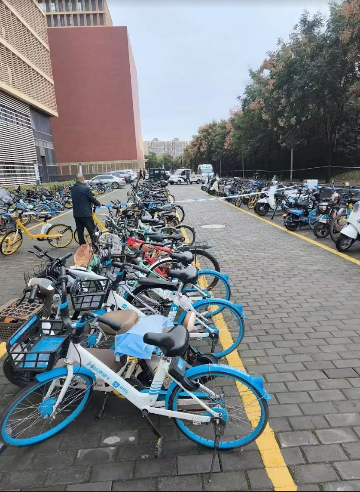  A李老师不是你老师 北京时间 2023-09-26T15:46:51Z 1706576049339842828 网友热议承德程序员被罚案 https://t.co/NtKLegtSXn 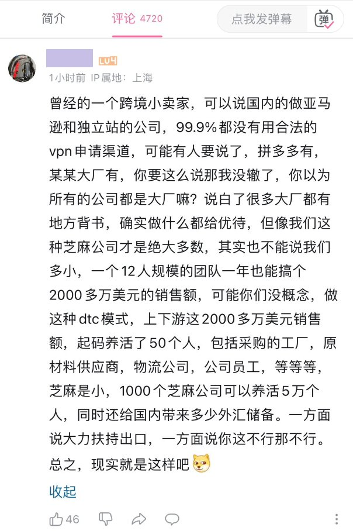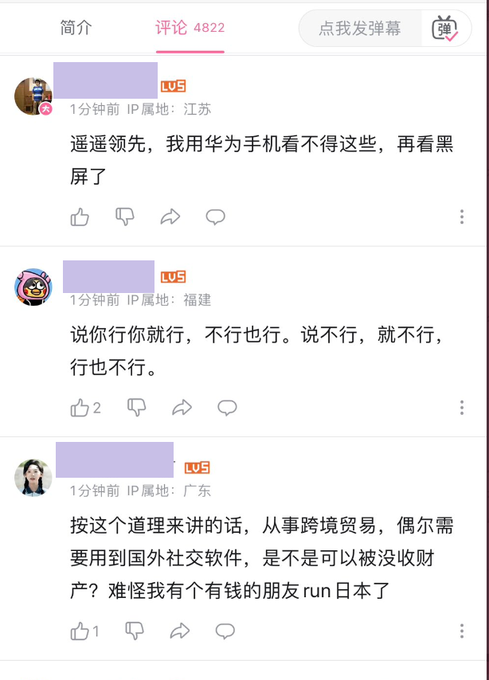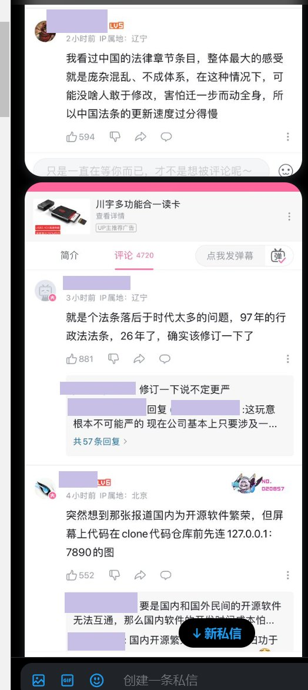  A李老师不是你老师 北京时间 2023-09-26T15:47:43Z 1706576267431006502 郑州一中目前情况 https://t.co/RyyX3UXi8c 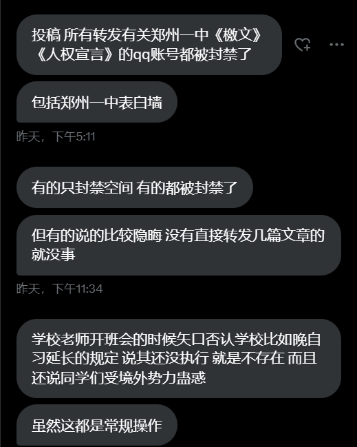  A李老师不是你老师 北京时间 2023-09-26T15:57:30Z 1706578728170438666 内蒙古赤峰，警察正在拦路检查行人是否下载国家反诈app https://t.co/LpgjD2DK0v 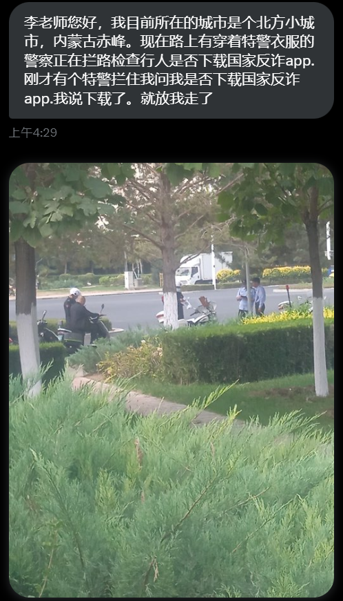  A李老师不是你老师 北京时间 2023-09-26T16:05:01Z 1706580619935772999 9月26日，江西师范大学4栋有工人跳楼，据称是因为暑期宿舍改造校方拖欠工人工资导致。 https://t.co/Q4edqBRBMF 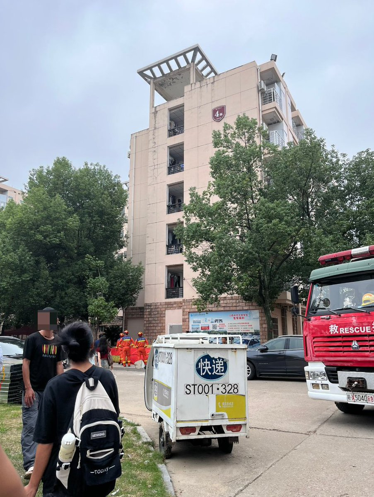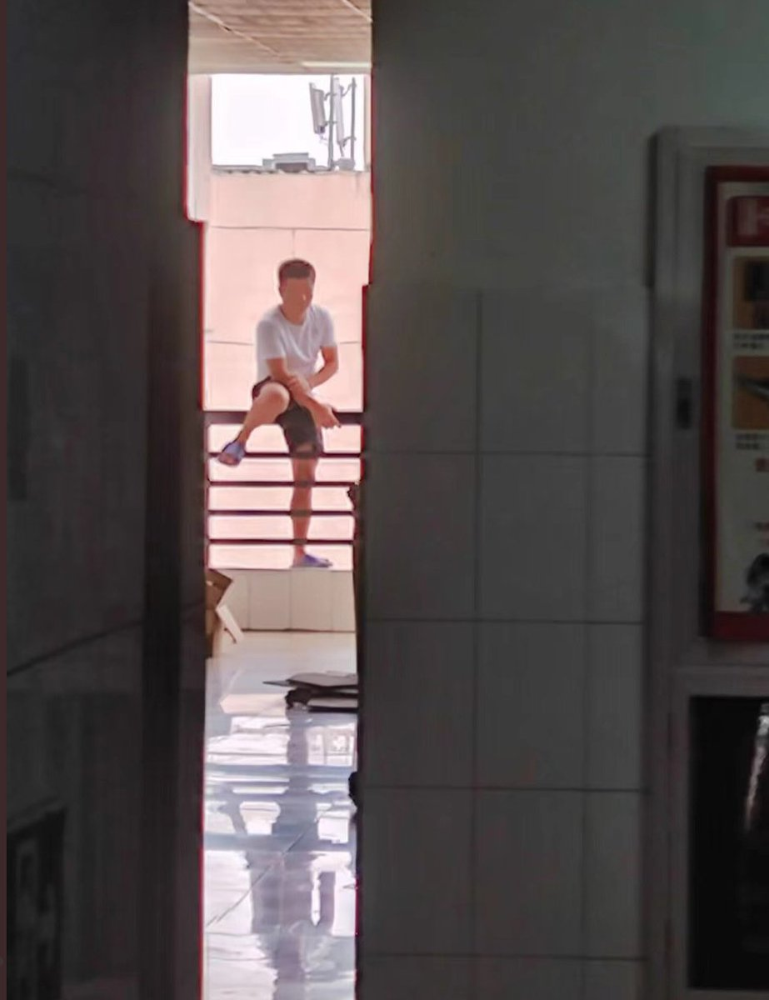  