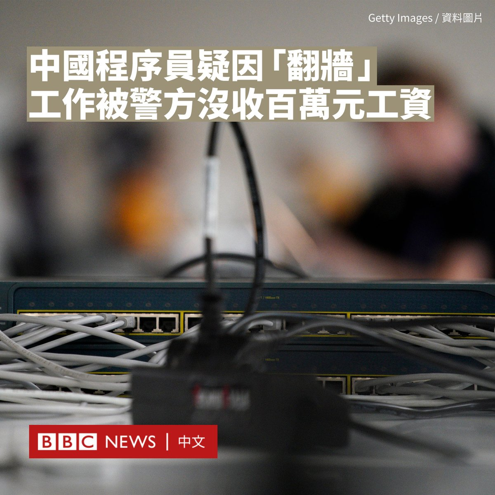
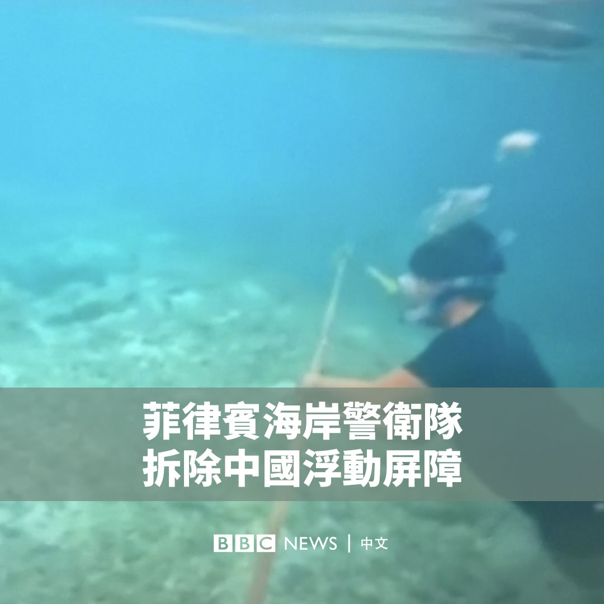
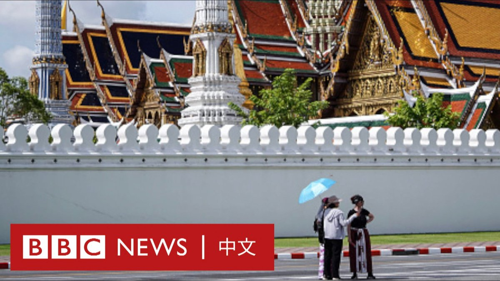

D英国广播公司BBC 北京时间 2023-09-26T19:02:43Z 1706625342935605639 中国一名程序员通过网络“翻墙”给外企打工，据称遭到警方重罚100万元人民币（13.7万美元），该事件在社交媒体引发轩然大波。

一名来自河北省承德市的网友近日在社交媒体上表示，他因使用VPN（虚拟专用网络）工具上X（推特）而被当局注意到。当地公安部门指“翻墙”是违法行为，因此他105.8万元人民币的工作收入被认定为非法所得，需要没收。

他表示，自己向警方多次阐明其工作与“翻墙”无关，因为他所使用的代码托管平台GitHub和公司网站均不需要“翻墙”即可访问，但该解释“没有被采纳”。

中国长期以安全为由屏蔽一些海外的网站，而通过VPN技术突破网络封锁常被该国网民俗称为“翻墙”。中国法律将其列为违法行为，“翻墙”者可被处以罚款和没收违法所得，而VPN提供商则可能面临更严重的牢狱之灾。

该男子贴出的一份行政处罚决定书显示，他被指在2019年9月份至2022年11月期间“擅自使用非法定信道进行国际联网”，为公司提供网络顾问服务，被警告并处罚款200元人民币，以及没收违法所得105.8万元。

处罚决定书还写道，公安部门通过该男子被扣押的笔记本电脑、电子数据、银行交易流水、视频资料和购买服务记录等多项“证据证实”。

这位网民表示，他不服处罚决定，将在10月提起行政诉讼，但是他的微博和这篇文章已被删除。

BBC根据该处罚决定书编号在河北省公安厅进行信息公示的“阳光警务执法办案系统”查到一份大致相同的处罚决定，但两者的区别在于该系统上的版本没有“没收违法所得105.8万元”这半句话。

有些奇怪的是，该句话所在段落的结尾也没有句号，这加大了网络上的质疑声。有网友表示，这似乎显示警方对公开发布的处罚决定进行了删改。

BBC无法独立证实该男子发布的内容。承德市公安局没有回应BBC的置评请求。

该话题周一（9月25日）在中国社交媒体上引发热议。一些网友质疑如果该网友所言属实，当地公安有借该处罚以“创收”之嫌，也有人担忧这将引发寒蝉效应。

还有大量网友涌入“承德公安”的官方抖音帐号下嘲讽，该账号目前已设置为私密可见。

官方媒体《环球时报》评论员胡锡进也表示，该案件是迄今中国对“翻墙”最重的经济处罚，如果被处罚者去外网仅仅是编写软件，该处罚“颇为值得商榷”。

“从事技术、媒体、和国际交流的人员需要接入国际互联网的情况太多太多了，如果把他们的需求都给切断，那么中国民间将封闭起来。”他写道。

中国官方媒体曾强调，无论以任何理由进行“翻墙”都是违法行为，但由于该国实际进行“翻墙”的人数众多，当局一般选择性地对在海外社交媒体发布异议言论的人进行处罚。   D英国广播公司BBC 北京时间 2023-09-26T20:33:09Z 1706648099542663465 美国宇航局局长比尔·纳尔逊（Bill Nelson）在接受BBC采访时表示，美国正在“与中国处在重返月球的太空竞赛中”，而他想要确保美国“率先到达那里”。https://t.co/OaP4fGnTo7   D英国广播公司BBC 北京时间 2023-09-26T12:42:17Z 1706529600996803064 研究人员在一次深海勘探过程中，在水下3000米处发现了一只罕见的“小飞象”章鱼。🐙🐘

它有着白白胖胖的外表，两个大大的耳朵状鳍使其酷似1940年代迪士尼《小飞象》（Dumbo）的主角。

该片段是由“海洋勘探信托”（Ocean Exploration Trust）在北太平洋夏威夷附近通过远程遥控设备拍摄的。 https://t.co/UCtouovbjB   D英国广播公司BBC 北京时间 2023-09-26T16:57:54Z 1706593928752066776 菲律宾周一（9月25日）表示，该国执行了一项“特别行动”，拆除了中国为阻止菲律宾渔船进入南中国海有争议地区而安装的浮动障碍物。

来自菲律宾海岸警卫队的一段新影片显示，一人割断了连接白色浮标的绳索。

马尼拉在周日（9月24日）表示，中国在斯卡伯勒浅滩（黄岩岛）设置了长约300米的屏障，剥夺了菲律宾渔民的捕鱼权及所仰赖的生计。

北京则表示，该国海警采取了“必要措施”以拦阻和驱离擅自闯入的菲律宾船只，操作“专业克制”。   D英国广播公司BBC 北京时间 2023-09-26T15:39:24Z 1706574173529891140 玩具制造巨头乐高（LEGO）公司取消了用回收塑料瓶制造积木的计划，将寻找其他方案减少碳排放。

两年多前，乐高曾表示希望用回收塑料瓶代替通过石油提炼的塑料材料。但乐高周一（9月25日）表示，该公司发现新材料导致产品碳排放量更高。

乐高公司生产约4,400种不同的积木，其中许多目前都是用ABS树脂制造的，这是一种从原油中提炼出来的原始塑料。

乐高曾在2021年表示，已开发出了用聚对苯二甲酸乙二酯（PET）瓶制成的原型积木，并添加了一些其他化学物质，以取代ABS树脂。

但经过两年多的测试，由于生产过程中需要额外步骤，乐高发现使用回收PET并不能减少碳排放，并表示已“决定不再继续”使用这种材料制造积木。

该公司表示，目前正在测试和开发由“一系列可持续替代材料”制成的积木。

乐高首席执行官尼尔斯·克里斯蒂安森（Niels Christiansen）告诉《金融时报》，没有一种“神奇材料”可以解决该公司面临的可持续发展挑战。他说：“我们测试了成百上千种材料，但就是找不到这样的材料。”

乐高的一位发言人告诉BBC，乐高“将继续致力于在2032年之前用可持续材料制造乐高积木”，以实现在2032年前将碳排放量减少37%的目标。   D英国广播公司BBC 北京时间 2023-09-26T13:54:41Z 1706547820671721812 据路透社援引塔利班官员称，塔利班正在阿富汗建立大规模的摄像头监控网络，并已经与中国通讯巨头华为就潜在合作进行磋商。

塔利班内政部发言人阿卜杜勒·马廷·卡尼（Abdul Mateen Qani）称，这项监控网络计划的重点是整饬治安和打击已在该国制造多起袭击的所谓“伊斯兰国”分支。

据报道，这可能涉及重新利用美国在2021年撤军前制定的计划，但具体细节尚未被公开。

一些分析人士质疑这个资金匮乏的政府是否有能力为该计划提供资金，而人权组织则担心监控会被用于镇压抗议者。

卡尼对路透社说，大规模摄像头的部署是新安全战略的一部分，需要四年才能全面实施，重点将集中在喀布尔和其他地方的“重要地点”。

他指安全专家正在绘制喀布尔的安全地图，目前已经有两张地图，一张是美国为前政府绘制的，第二张是土耳其绘制的。

美国国务院发言人表示，华盛顿没有与塔利班“合作”，并已向塔利班表明，他们有责任确保不向恐怖分子提供安全庇护。

卡尼表示，塔利班曾在8月与华为就潜在合作进行“简单交谈”，但尚未达成任何合同或确定计划。

据塔利班称，喀布尔和其他城市有超过62,000个摄像头，由中央控制室进行监控。据前政府称，喀布尔摄像系统的最后一次重大更新发生在2008年，阿富汗政府在安全方面严重依赖西方领导的国际部队。   D英国广播公司BBC 北京时间 2023-09-26T09:51:14Z 1706486555383333113 泰国曾是中国游客出境游最热衷的目的地之一，但今年以来，中国社交媒体上有关这里的诸如“割腰子”等犯罪传言以及卖座电影中游客被绑架的情节，让许多中国游客望而却步。

疫情前，泰国每年接待超过一千万次中国游客，但今年以来仅有230万人次。泰国正在展开一场攻势，希望旅游业能尽快复苏。 https://t.co/igunKya3rG   