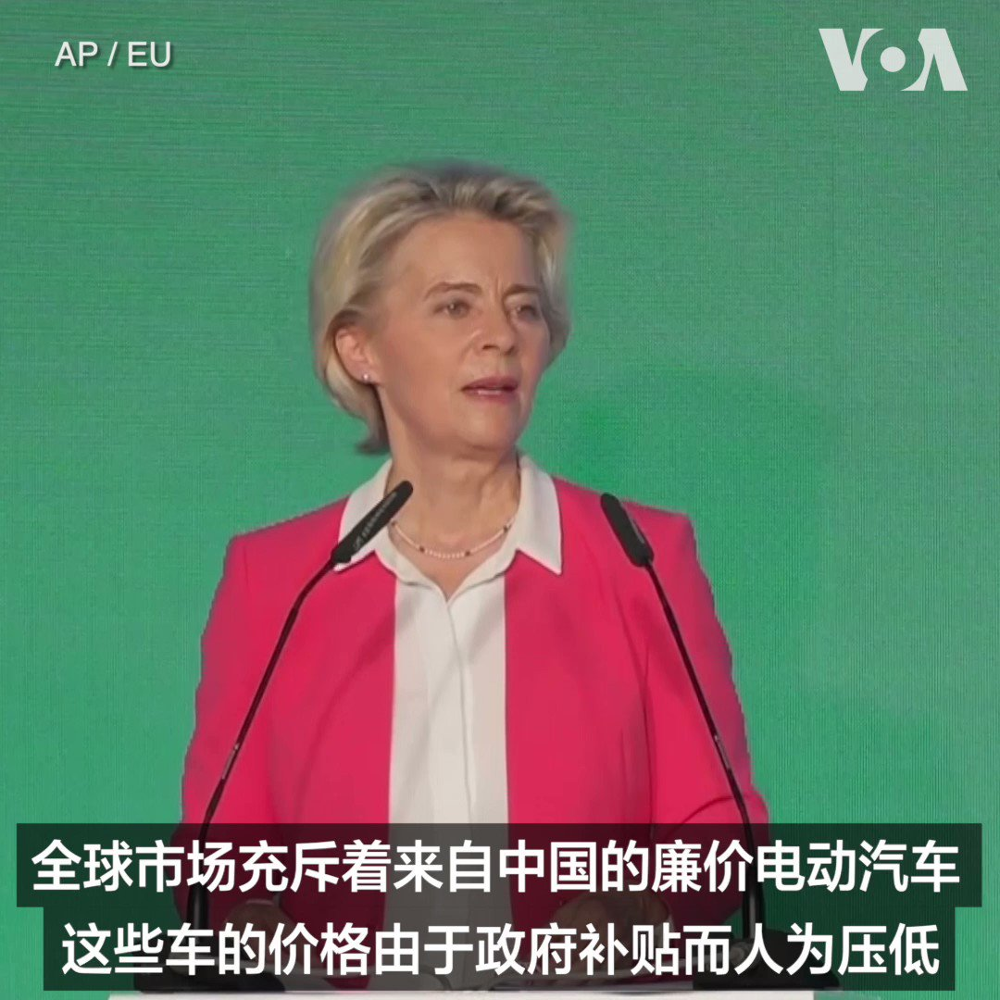
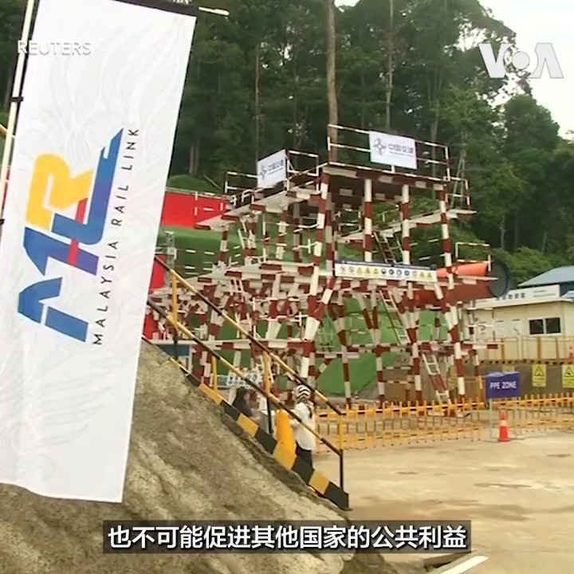
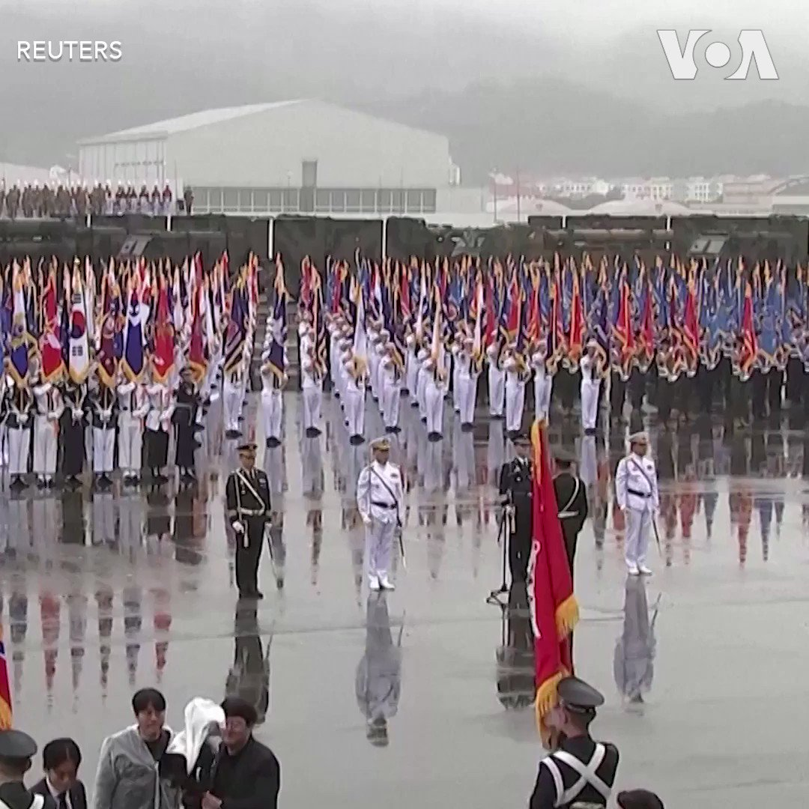
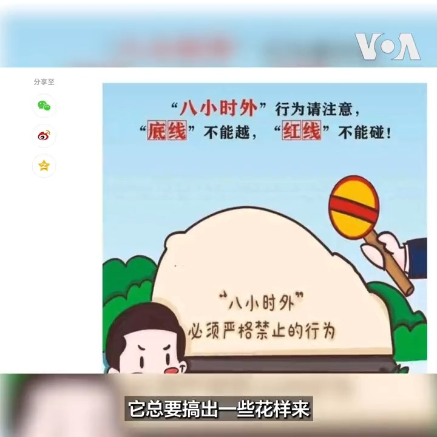

美国之音中文网 北京时间 2023-09-26T21:05:11Z 1706656158759387143 9/26【#时事大家谈】李尚福“交友不慎”落马？习近平再提“净化社交圈”；台防长称“敌情异常” 解放军攻台准备曝光？

嘉宾：台湾淡江大学国际事务与战略研究所助理教授林颖佑；加拿大女王大学历史系兼职助理教授赖小刚
主持人：樊冬宁

Youtube🔗 https://t.co/q1y30dI7co https://t.co/zQwbxs9rja   美国之音中文网 北京时间 2023-09-26T23:58:04Z 1706699669366251538 数千人逃离纳卡地区，美国呼吁阿塞拜疆保护亚美尼亚人权利 https://t.co/BAjlciX0hq   美国之音中文网 北京时间 2023-09-26T17:44:35Z 1706605677400224180 韩国举行十年来首次大规模阅兵 以展示对抗朝鲜更加强硬的决心 https://t.co/OwFiHCDBNL   美国之音中文网 北京时间 2023-09-26T21:07:20Z 1706656702278303821 欧盟委员会主席乌尔苏拉·冯德莱恩9月26日说，欧盟针对来自中国的电动汽车展开反补贴调查有利于在欧洲汽车市场打造更公平的竞争环境。冯德莱恩是在布拉格出席一次新能源会议时这样说的。欧盟委员会9月中旬宣布对来自中国的电动汽车展开调查。 https://t.co/MsEsv0Q8PW   美国之音中文网 北京时间 2023-09-26T21:10:04Z 1706657389590552631 中国国家主席习近平2013年推出“一带一路”时，受到各国欢迎，但十年过去了，这个计划近年风光不再，且饱受贪腐、债务和劳工剥削等争议。观察人士说，中国若想续推“一带一路”2.0版，除了强调绿色和高科技的底色外，也要引进社会责任和治理标准，才能重新擦亮“一带一路”的招牌。https://t.co/xd7PxJvEz0 https://t.co/DmXp2Pz9ak   美国之音中文网 北京时间 2023-09-26T21:31:35Z 1706662805208998113 中菲关系剑拔弩张 菲律宾誓言不会在中国霸凌下退缩 https://t.co/UYaobiTbGQ   美国之音中文网 北京时间 2023-09-26T21:45:06Z 1706666207238410551 习近平是否与会APEC 王毅作出回应但未确认，李家超还在等待邀请 https://t.co/zThB7vzTba   美国之音中文网 北京时间 2023-09-26T18:46:05Z 1706621156021952625 “一带一路”十年毁誉参半 “五通”招牌下的五大争议 https://t.co/Fen3nB0Uen   美国之音中文网 北京时间 2023-09-26T13:58:34Z 1706548799551000665 日韩与美不断亲近 韩国力推重启中日韩峰会以降低北京忧虑 https://t.co/zcADumKKOb   美国之音中文网 北京时间 2023-09-26T17:29:06Z 1706601780120048027 危及美国国家安全利益 美商务部制裁清单再添11个中国实体 https://t.co/wB3mEEdjAX   美国之音中文网 北京时间 2023-09-26T17:47:00Z 1706606285372731622 面对朝鲜近期动作频频，韩国星期二(9月26日) 举行纪念“国军日”大规模阅兵，这也是韩国自2013年以来，在首尔街道上再度举行阅兵活动。总统尹锡悦在首尔空军基地演说时强调，若朝鲜动用核武，韩美同盟将以压倒性力量立刻予以反击。报道: https://t.co/fu5gf2oR0d https://t.co/oIAWAEC6qk   美国之音中文网 北京时间 2023-09-26T14:46:51Z 1706560950726189223 中日韩于周二（9月26日）在首尔召开三国高官会议（SOM），正式讨论年内重启三国峰会。同时，美日韩三国驻华大使保持密切沟通。外界认为，在美日韩加强结盟之际推动重启中日韩峰会，是日韩作为美国盟友试图稳定与北京关系的举措。 https://t.co/ynFuhXfuTt   美国之音中文网 北京时间 2023-09-26T15:29:05Z 1706571579994538048 台湾国安谘委：中国犯台需具备三支航母战斗群 国造潜舰能有效反制共军包围 https://t.co/KBoTXMEqcD   美国之音中文网 北京时间 2023-09-26T15:57:07Z 1706578633832501697 劳资纠纷缠身 福特暂停建设与中国宁德时代合作的汽车电池厂 https://t.co/o7usUthIzF   美国之音中文网 北京时间 2023-09-26T13:58:36Z 1706548807411106189 中国持续反对福岛核处理水排海 韩国原子能专家再赴日检测未发现异常 https://t.co/aVhGTQgqe9   美国之音中文网 北京时间 2023-09-26T10:27:45Z 1706495744729895018 中共上周重申党员监管从严，工作之馀的“八小时外也要管起来”，接著又出台五年反腐规划。对此，分析人士说，中国国家主席习近平打贪10年，贪腐仍未见底，最终恐反噬，拖累到他的领导权威。且面对中国社会情势动荡，习近平再收紧党员监管，凸显的恐是他的执政不安感。报道: https://t.co/eb3oUgSfx6 https://t.co/DEkLKFD75Z   美国之音中文网 北京时间 2023-09-26T04:43:15Z 1706409049754112442 美韩将加强对朝鲜威胁的威慑 https://t.co/E3J1tH8weJ   美国之音中文网 北京时间 2023-09-26T06:51:35Z 1706441344959525256 越南据称同时向莫斯科和华盛顿寻求军事援助 https://t.co/BRYI4SDaWv   美国之音中文网 北京时间 2023-09-26T10:00:05Z 1706488782562955519 拜登承诺向太平洋岛国提供气候和基础设施援助 https://t.co/jpzQA1ym9a   美国之音中文网 北京时间 2023-09-26T04:37:10Z 1706407517927194692 乌克兰称俄罗斯黑海舰队指挥官在克里米亚攻击中丧生 https://t.co/UprmUgB0EF   美国之音中文网 北京时间 2023-09-26T04:43:19Z 1706409064786477289 菲律宾海岸警卫队: 已成功拆除有争议水域上中方设置的障碍 https://t.co/izUKdMrGyO   美国之音中文网 北京时间 2023-09-26T05:10:34Z 1706415923295551662 一名阿族警察被塞族武装人员打死后，科索沃哀悼一天 https://t.co/gwa1rrZO32   美国之音中文网 北京时间 2023-09-26T05:25:10Z 1706419597443006653 被西方视为“屠夫”的叙利亚总统阿萨德访华受到网民热烈欢迎 https://t.co/WhjqmPy2Vp   美国之音中文网 北京时间 2023-09-26T06:23:07Z 1706434180119441776 亚美尼亚族人离开纳卡之际当地发生巨大爆炸；美国高级官员访问亚美尼亚 https://t.co/xdjc2bFqYI   美国之音中文网 北京时间 2023-09-26T07:00:00Z 1706443464034914432 中共防长李尚福传出被调查之际，解放军报称交友不慎是个别领导干部落马主因。习近平要求军官淨化社交圈是为反腐还是整肃？军队腐败与火箭军换将对中共攻台战力造成多大影响？台湾国防部表示近日侦测到敌情异常，作风问题频传的解放军是否还能打胜仗？週二时事大家谈请军事专家分析，欢迎留言互动。 https://t.co/O00J5cDPyE   美国之音中文网 北京时间 2023-09-26T07:06:03Z 1706444987523809426 欧中经贸对话议题多，地缘政治成焦点 https://t.co/1FoJtAmvUq   美国之音中文网 北京时间 2023-09-26T07:28:33Z 1706450649121227112 美国和肯尼亚签署反恐防务协议 https://t.co/tcvifdNY6T   美国之音中文网 北京时间 2023-09-26T08:30:10Z 1706466155450495272 欧盟贸易负责人警告商界质疑在中国的未来 https://t.co/HxiSAT0WIe   美国之音中文网 北京时间 2023-09-26T08:44:33Z 1706469775189381426 联合国调查人员发现越来越多的俄罗斯在乌克兰犯下战争罪的证据 https://t.co/zonMyQd4jS   美国之音中文网 北京时间 2023-09-26T09:14:07Z 1706477214026567940 拜登和特朗普表达对工会的支持以争夺工人选票 https://t.co/0JynVtRnL1   美国之音中文网 北京时间 2023-09-26T01:26:08Z 1706359444840518081 美国驻日大使屡屡炮轰中国 专家:为白宫表达对中国的不认同 https://t.co/eZSqpF619L   美国之音中文网 北京时间 2023-09-26T04:45:01Z 1706409494073192889 联合国的乌克兰问题独立国际调查委员会25日说，俄罗斯占领者对乌克兰人进行酷刑折磨，手段如此残酷导致一些受害者死亡。该委员会主席莫斯（(Erik Møse)在日内瓦的人权理事会会议上说，他们进一步收集的证据显示俄罗斯军队在他们占领的地区“实施了广泛且系统性的酷刑手段”。 https://t.co/zVWJaNfruK   美国之音中文网 北京时间 2023-09-26T05:32:15Z 1706421378679726494 越来越多美国官员及国会议员对中国买家在美购买大片土地感到担忧，这些担忧是否被夸大了？美国农业部长维尔萨克(Tom Vilsack)周一在参加白宫例行记者会时回答记者提问时说，“担忧是存在的”，他强调农业部需要更多参与美国外国投资委员会(CFIUS)的审查过程，另外还有更多工作要做。 https://t.co/QapOypOdUd   美国之音中文网 北京时间 2023-09-26T05:52:33Z 1706426489229738335 拜登与太平洋岛国论坛领导人举行第二次峰会 宣布强化伙伴关系新举措 https://t.co/NSJ2xnI4g8   美国之音中文网 北京时间 2023-09-26T06:10:05Z 1706430902753239182 尼泊尔总理访华讨论“一带一路”，双方签约6年进展乏善可陈 https://t.co/J0CdHj5Dc8   美国之音中文网 北京时间 2023-09-26T03:33:06Z 1706391395341308273 香港记协主席陈朗升阻差办公罪成被判监5日 准保释等候上诉 https://t.co/H6AWFjJZHm   美国之音中文网 北京时间 2023-09-26T04:09:33Z 1706400569668313349 美军在叙北展开直升机突击行动，抓获一名“伊斯兰国”官员 https://t.co/eqi7TgORoN   美国之音中文网 北京时间 2023-09-26T00:15:10Z 1706341582113329584 菲律宾官员9月25日说，菲律宾海岸警卫队在当天的一次特别行动中移除了中国海警在有争议海域设置的浮动屏障。官员说，中方在位于斯卡伯勒浅滩（Scarborough Shoal）（中国称黄岩岛）潟湖入口处的300米长的屏障是“非法的、不正当的”。详细： https://t.co/IpP839xtKS https://t.co/Lri02psvbq   美国之音中文网 北京时间 2023-09-26T01:01:05Z 1706353137123250374 塔利班与华为探讨潜在合作 加强阿富汗大规模监视网络 https://t.co/vZWIdlyFmB   美国之音中文网 北京时间 2023-09-26T01:10:35Z 1706355530980270490 中共加紧对党员“八小时外”监督 分析：显露习近平不安全感 https://t.co/DuMKWpFEBo   美国之音中文网 北京时间 2023-09-26T01:35:02Z 1706361683583602932 美国总统拜登9月25日在白宫与太平洋岛国论坛的领导人举行第二次峰会，进一步强化美国与这些国家的关系，并宣布与库克群岛(Cook Islands)和纽埃(Niue)建立正式外交关系，以应对中国在该地区日益扩大的影响力。与北京关系密切的所罗门群岛总理索加瓦雷和瓦努阿图上任不久的总理基尔曼缺席了这次峰会。 https://t.co/MODclDkMeE   美国之音中文网 北京时间 2023-09-26T00:24:05Z 1706343825772531939 中国婚姻登记大幅减少，不到十年前的三分之二 https://t.co/DxtgV18B6L   