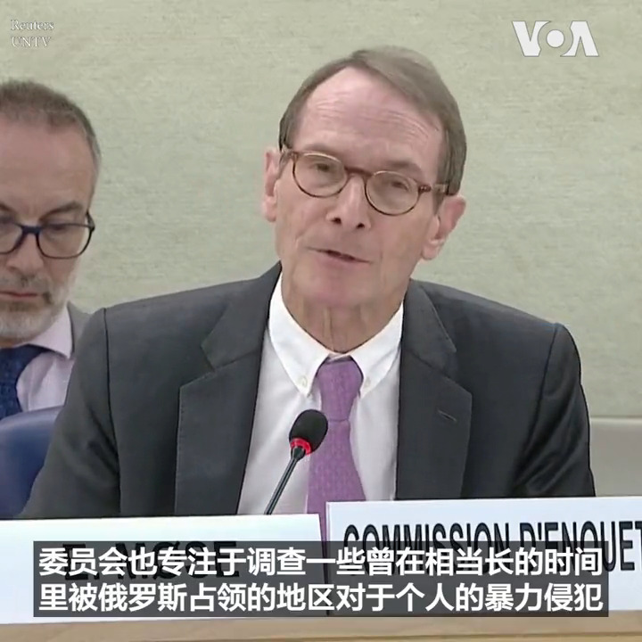
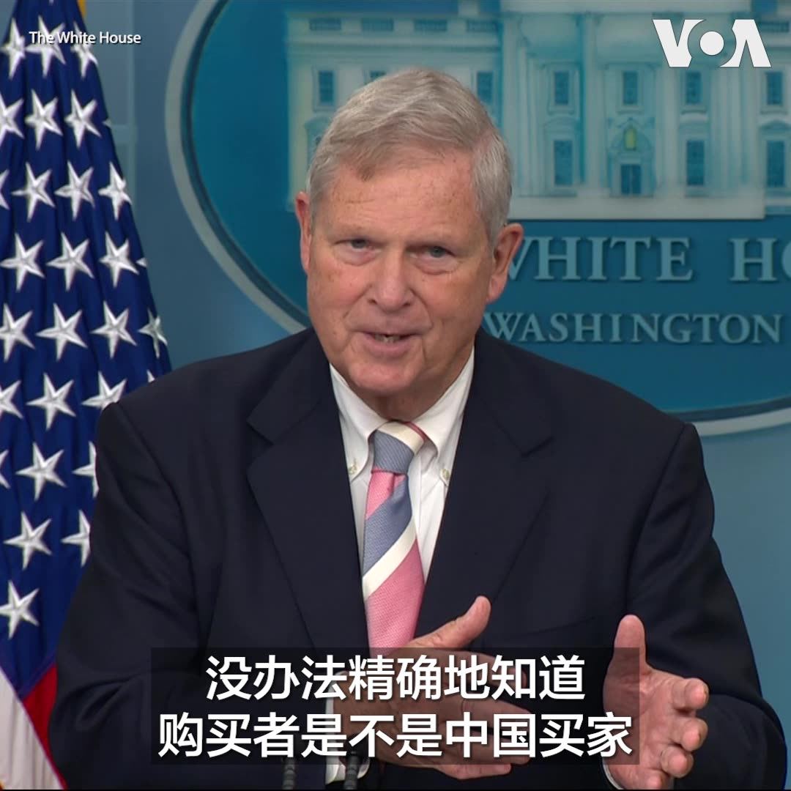

美国之音中文网 北京时间 2023-09-26T08:44:33Z 1706469775189381426 联合国调查人员发现越来越多的俄罗斯在乌克兰犯下战争罪的证据 https://t.co/zonMyQd4jS   美国之音中文网 北京时间 2023-09-26T09:14:07Z 1706477214026567940 拜登和特朗普表达对工会的支持以争夺工人选票 https://t.co/0JynVtRnL1   美国之音中文网 北京时间 2023-09-26T01:26:08Z 1706359444840518081 美国驻日大使屡屡炮轰中国 专家:为白宫表达对中国的不认同 https://t.co/eZSqpF619L   美国之音中文网 北京时间 2023-09-26T04:45:01Z 1706409494073192889 联合国的乌克兰问题独立国际调查委员会25日说，俄罗斯占领者对乌克兰人进行酷刑折磨，手段如此残酷导致一些受害者死亡。该委员会主席莫斯（(Erik Møse)在日内瓦的人权理事会会议上说，他们进一步收集的证据显示俄罗斯军队在他们占领的地区“实施了广泛且系统性的酷刑手段”。 https://t.co/zVWJaNfruK   美国之音中文网 北京时间 2023-09-26T05:32:15Z 1706421378679726494 越来越多美国官员及国会议员对中国买家在美购买大片土地感到担忧，这些担忧是否被夸大了？美国农业部长维尔萨克(Tom Vilsack)周一在参加白宫例行记者会时回答记者提问时说，“担忧是存在的”，他强调农业部需要更多参与美国外国投资委员会(CFIUS)的审查过程，另外还有更多工作要做。 https://t.co/QapOypOdUd   美国之音中文网 北京时间 2023-09-26T05:52:33Z 1706426489229738335 拜登与太平洋岛国论坛领导人举行第二次峰会 宣布强化伙伴关系新举措 https://t.co/NSJ2xnI4g8   美国之音中文网 北京时间 2023-09-26T06:10:05Z 1706430902753239182 尼泊尔总理访华讨论“一带一路”，双方签约6年进展乏善可陈 https://t.co/J0CdHj5Dc8   美国之音中文网 北京时间 2023-09-26T03:33:06Z 1706391395341308273 香港记协主席陈朗升阻差办公罪成被判监5日 准保释等候上诉 https://t.co/H6AWFjJZHm   美国之音中文网 北京时间 2023-09-26T04:09:33Z 1706400569668313349 美军在叙北展开直升机突击行动，抓获一名“伊斯兰国”官员 https://t.co/eqi7TgORoN   美国之音中文网 北京时间 2023-09-26T00:15:10Z 1706341582113329584 菲律宾官员9月25日说，菲律宾海岸警卫队在当天的一次特别行动中移除了中国海警在有争议海域设置的浮动屏障。官员说，中方在位于斯卡伯勒浅滩（Scarborough Shoal）（中国称黄岩岛）潟湖入口处的300米长的屏障是“非法的、不正当的”。详细： https://t.co/IpP839xtKS https://t.co/Lri02psvbq   美国之音中文网 北京时间 2023-09-26T01:01:05Z 1706353137123250374 塔利班与华为探讨潜在合作 加强阿富汗大规模监视网络 https://t.co/vZWIdlyFmB   美国之音中文网 北京时间 2023-09-26T01:10:35Z 1706355530980270490 中共加紧对党员“八小时外”监督 分析：显露习近平不安全感 https://t.co/DuMKWpFEBo   美国之音中文网 北京时间 2023-09-26T01:35:02Z 1706361683583602932 美国总统拜登9月25日在白宫与太平洋岛国论坛的领导人举行第二次峰会，进一步强化美国与这些国家的关系，并宣布与库克群岛(Cook Islands)和纽埃(Niue)建立正式外交关系，以应对中国在该地区日益扩大的影响力。与北京关系密切的所罗门群岛总理索加瓦雷和瓦努阿图上任不久的总理基尔曼缺席了这次峰会。 https://t.co/MODclDkMeE   美国之音中文网 北京时间 2023-09-26T00:24:05Z 1706343825772531939 中国婚姻登记大幅减少，不到十年前的三分之二 https://t.co/DxtgV18B6L   