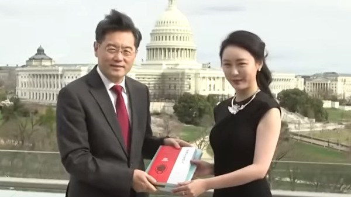
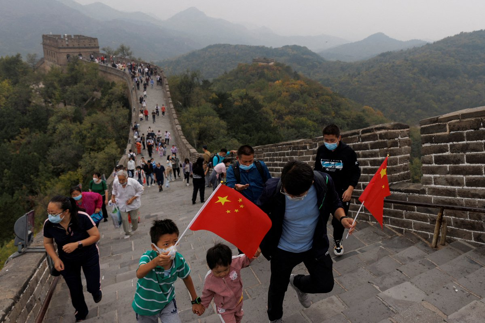
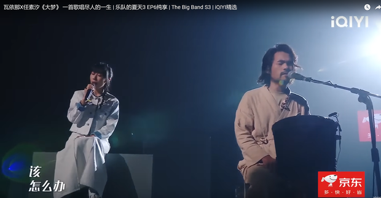
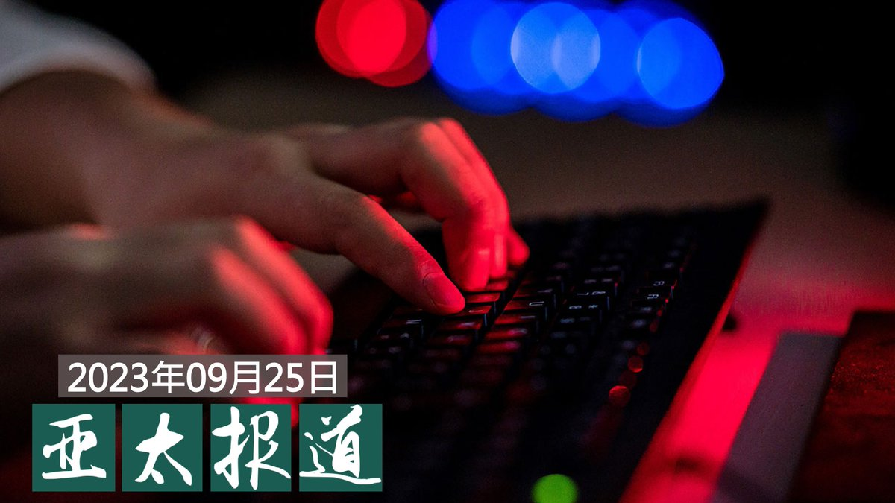

自由亚洲电台 北京时间 2023-09-26T23:00:55Z 1706685286380425356 在台北桃园国际机场"跳机"的湖南异议人士 #陈思明 目前仍然滞留机场。据了解，他已从机场的转机区被移到入境区。协调救援行动的台湾组织相信，陈思明很有可能入境台湾，在获得第三国收容之前，由台方负责照顾他的生活。
https://t.co/yr4c01r6Qs   自由亚洲电台 北京时间 2023-09-26T23:43:32Z 1706696011648008467 本周二，#菲律宾 海岸警卫队拆除了中方此前在 #南海 主权争议水域设置的浮动屏障。菲律宾政府强调，此举是展现捍卫主权和渔权的坚定立场。

 https://t.co/w687zUhnVS   自由亚洲电台 北京时间 2023-09-26T23:56:56Z 1706699382639202483 【金融时报：秦刚与傅晓田代孕生子】
据英国《金融时报》报道，有多名知情人透露，原凤凰卫视主持人 #傅晓田 与前不久刚刚被免职的中国外交部长 #秦刚 有一段婚外情，并通过 #代孕 方式生下了孩子。

知情人表示，中国政府仍在审查傅晓田与秦刚的关系，尚不清楚这对于秦刚在六月突然失踪和一个月后被免去外交部长职务有多大影响。

秦刚被免职时，中国方面没有解释具体原因。但有分析指出，秦刚还未被取消国务委员的职务，有可能重返中国政坛。

与傅晓田亲近的人表示，她在2010年左右在伦敦与秦刚相识，但他们是在差不多十年后在北京才开始了更为亲密的关系。

秦刚今年被任命为外交部长后，他开始限制与傅晓田的联系，这促使后者在社交媒体暗示他们之间的关系。

中国外交部和凤凰卫视都没有回复金融时报的置评请求，秦刚与傅晓田也无法联系到。   自由亚洲电台 北京时间 2023-09-26T21:00:33Z 1706654995649552768 RT @RFA_Chinese: 近日有可靠消息确认，新疆大学维族女教授热依拉· 达吾提（Rahile Dawut）被中国政府以危害国家安全的罪名判处终身监禁。她身在美国的女儿阿克达·普拉提（Akida Polat）呼吁国际社会关注她母亲和所有受迫害的新疆知识分子的遭遇。… h…   自由亚洲电台 北京时间 2023-09-26T22:10:40Z 1706672639471997131 湖南株洲赵老师说，自从《反间谍法》生效后，到处是这类警示和提醒，大部分普通老百姓何来军事情报和国家机密：“我就算我想做间谍，我能搞到国家机密吗？现在 #抓间谍 抓到我们日常生活中，比如提醒小孩子听爸爸妈妈谈话，报告给老师说是特务。这让人会想到以前小时候。” https://t.co/gOnJoU76ts   自由亚洲电台 北京时间 2023-09-26T15:07:29Z 1706566140594626669 【#十一黄金周 官方宣传旅游高成长】
【民众吐槽：没工作无钱消费】
中国官媒不断预测今年十一假期繁荣的景象，并将其形容为“超级黄金周”，预计黄金周国内旅客量比疫情前增长近两成。不过，民间却有不同的声音。
https://t.co/rpqwTsvBeX https://t.co/QLKE4aCVXQ   自由亚洲电台 北京时间 2023-09-26T04:42:50Z 1706408943365640375 近日到访美国的台湾彰化市市长 #林世贤 于9月23日下午来到了位于加州湾区城市圣何塞的侨团北加州台湾会馆所在地，发表了题为《台湾价值与彰化价值》的演说。他说，台湾和美国共享着平等、自由、民主的价值：“我想捍卫台湾，最重要的就是这个价值。”

 https://t.co/tg01NoAro5   自由亚洲电台 北京时间 2023-09-26T11:58:33Z 1706518597386825812 RT @RFA_Chinese: 【欢迎加入自由亚洲电台电报群】https://t.co/UkKZmFSRkG https://t.co/Qid2LNZxJn   自由亚洲电台 北京时间 2023-09-26T06:30:00Z 1706435915244359868 美国总统拜登周一（25日）在白宫的举行了与太平洋岛国领导人的第二次峰会。这是拜登政府“魅力攻势”的一部分，旨在遏制中国进一步侵入被美国长期视为“后院”的战略地区。
 https://t.co/9P8HXFB9QE   自由亚洲电台 北京时间 2023-09-26T00:44:31Z 1706348969918640253 【功败垂成！】长期被中国当局重点监控的广州异议人士 #梁颂基 流亡美国的计划受挫。他在墨西哥过境时遇上当地政府官员执法，被没收护照和财物，更被遣送到数千公里外的另一座城市。
梁颂基促请国际社会对他伸出援手。

 https://t.co/FKSGet5HD7   自由亚洲电台 北京时间 2023-09-26T05:56:24Z 1706427456511521136 【又一神曲刷屏：凡人一生，大梦一场】

近日，在中国音乐综艺节目《乐队的夏天3》中，#瓦依那乐队 和 #任素汐 合唱的一曲《#大梦》爆红，不仅得到了全场最高票，赛后当天，还获得高达44.2万的转发量，刷屏各个圈层的视频号。

这首长达九分钟的歌曲，以朴素的歌词和深情的曲调，描述了人的一生，从六岁到八十八岁。歌词展现了中国人在不同人生阶段面临的社会现实问题和烦恼。贯穿整首歌的“怎么办”，让许多观众产生共鸣。比如，” 我已十八岁,没考上大学, 是应该继续, 还是打工去, 该怎么办?” “她姐姐问我，没正式工作，要不要房子，要不要孩子，该怎么办？” “我已七十八，突然间倒下, 躺在病床上, 时间变很漫长, 该怎么办?”

很多网友评论说，歌曲把他们“听哭了”；也有的说：“一首歌浓缩了很多强国人的一生”；还有人说：“在那个地方，每天疲于应付各种苦难，永远无解。当你离开那个地方，发现那些苦难只在那个地方存在，真的是噩梦。”   自由亚洲电台 北京时间 2023-09-26T07:00:09Z 1706443501385535823 【亚太报道（2023-9-25）】
欢迎收听和订阅播客 https://t.co/MjLNSvVMqc
 承德一程序员“#翻墙”遭警方处罚 / #石正丽 警告疫情“极可能”再次爆发 / 新疆大学 #达吾提 教授家属接受本台专访 / "#雪饼案"起诉书曝光 / 广州异议人士 #梁颂基 赴美受挫 https://t.co/p5sK7mfopO   自由亚洲电台 北京时间 2023-09-26T08:41:11Z 1706468926752952584 专栏 | #夜话中南海：历史故事：#邓朴方 和他曾经的"康华共和国"
 https://t.co/tYmEkINSJa   自由亚洲电台 北京时间 2023-09-26T08:42:46Z 1706469326318936545 RT @RFA_Chinese: 【欢迎订阅自由亚洲电台电邮新闻】
点击https://t.co/197BDI75B2
输入您的电邮地址，即可收到本台“新闻快递”。
不翻墙也知天下事！ https://t.co/Ng5WQbxQdV   自由亚洲电台 北京时间 2023-09-26T02:42:00Z 1706378534451810628 50多个人权组织21日致信中国国家主席习近平，表达了对中国当局强制遣返被拘留的 #脱北者 的担忧。这些团体呼吁中国根据国际法中的不驱回原则，停止强制遣返这些 #朝鲜难民。
 https://t.co/dQ6MB58rbN   自由亚洲电台 北京时间 2023-09-26T03:00:32Z 1706383198463332370 【中国程序员 #翻墙 工作被罚上百万元】
在微博上，有中国网友讽刺说，“这就好比我住在a地，上班在b地。我每天开车去上班，但我的车没过年检。然后有一天被发现了，处罚我说我的上班所得是违法所得，得没收？”还有网友回应说，“是有点搞笑，但是你要服从。”

 https://t.co/JvXP7xQESU   自由亚洲电台 北京时间 2023-09-26T04:28:22Z 1706405301774381254 据英国《金融时报》报道, 在香港金融圈任职多年的高级主管 #王忠和 被中国当局边控，不能离开中国大陆。正值多家外企对其在华经营状况表达悲观之际, 又爆出商界人士被禁止出境的事件，令投资者深感困惑。
#野村证券
 https://t.co/6JsdEHzUWM   自由亚洲电台 北京时间 2023-09-26T05:51:09Z 1706426135062704566 #石正丽 发警告：冠状病毒疫情恐再爆发
这是中国在威胁世界吗？ https://t.co/yf1xmK5euc   自由亚洲电台 北京时间 2023-09-26T05:57:48Z 1706427810506559538 近日有可靠消息确认，新疆大学维族女教授热依拉· 达吾提（Rahile Dawut）被中国政府以危害国家安全的罪名判处终身监禁。她身在美国的女儿阿克达·普拉提（Akida Polat）呼吁国际社会关注她母亲和所有受迫害的新疆知识分子的遭遇。

达吾提教授今年57岁。她在2017年12月被拘留时，是新疆大学人文学院教授。她在该大学创办了少数民族研究中心，并在新疆各地实地考察，是民族志领域的研究专家。达吾提教授多年来一直是中共党员，并曾获中国文化部颁发的奖项和资助。她还曾在美国哈佛大学、康奈尔大学等学校进行讲座，也曾在宾夕法尼亚大学、华盛顿大学和印第安纳大学担任访问学者。
根统计，自2016年以来已有300多维族知识分子遭到当局长期拘留、逮捕和监禁。   自由亚洲电台 北京时间 2023-09-26T02:30:39Z 1706375677094793729 有关起诉中国独立记者 #黄雪琴 与工运人士 #王建兵 的"#雪饼案"的起诉书近日曝光。外界发现，用境外通联软件、定期聚会和参加网课培训等，均成为被控告"煽动颠复国家政权”的罪证。
这将对中国社会带来什么影响？

 https://t.co/BroSTnVtJL   自由亚洲电台 北京时间 2023-09-26T03:00:07Z 1706383096264970697 #华为 要做 #塔利班 的生意？ https://t.co/TdfCJENlS2   自由亚洲电台 北京时间 2023-09-26T03:30:01Z 1706390619533480384 评论 | 王丹 @wangdan1989：中国政局诡谲多变，外界应当有心理准备
#秦刚。#火箭军 #李尚福 
 https://t.co/ODOaOhZKEr   自由亚洲电台 北京时间 2023-09-26T01:53:46Z 1706366395368518094 国际媒体广泛报道，#新疆 大学维族女教授热依拉· 达吾提（Rahile Dawut）被中国政府以危害国家安全的罪名判处终身监禁。她身在美国的女儿阿克达·普拉提（Akida Polat）近日接受本台记者王允 @Jeff23Wang 的专访，呼吁国际社会关注她母亲和所有受迫害的新疆知识分子的遭遇。 https://t.co/mJJCXBnoz6   