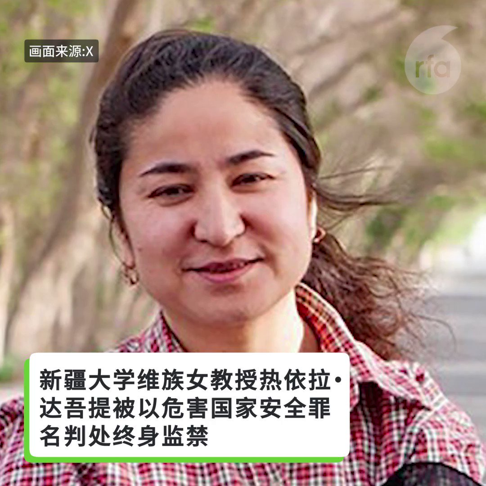

自由亚洲电台 北京时间 2023-09-26T04:28:22Z 1706405301774381254 据英国《金融时报》报道, 在香港金融圈任职多年的高级主管 #王忠和 被中国当局边控，不能离开中国大陆。正值多家外企对其在华经营状况表达悲观之际, 又爆出商界人士被禁止出境的事件，令投资者深感困惑。
#野村证券
 https://t.co/6JsdEHzUWM   自由亚洲电台 北京时间 2023-09-26T05:51:09Z 1706426135062704566 #石正丽 发警告：冠状病毒疫情恐再爆发
这是中国在威胁世界吗？ https://t.co/yf1xmK5euc   自由亚洲电台 北京时间 2023-09-26T05:57:48Z 1706427810506559538 近日有可靠消息确认，新疆大学维族女教授热依拉· 达吾提（Rahile Dawut）被中国政府以危害国家安全的罪名判处终身监禁。她身在美国的女儿阿克达·普拉提（Akida Polat）呼吁国际社会关注她母亲和所有受迫害的新疆知识分子的遭遇。

达吾提教授今年57岁。她在2017年12月被拘留时，是新疆大学人文学院教授。她在该大学创办了少数民族研究中心，并在新疆各地实地考察，是民族志领域的研究专家。达吾提教授多年来一直是中共党员，并曾获中国文化部颁发的奖项和资助。她还曾在美国哈佛大学、康奈尔大学等学校进行讲座，也曾在宾夕法尼亚大学、华盛顿大学和印第安纳大学担任访问学者。
根统计，自2016年以来已有300多维族知识分子遭到当局长期拘留、逮捕和监禁。   自由亚洲电台 北京时间 2023-09-26T02:30:39Z 1706375677094793729 有关起诉中国独立记者 #黄雪琴 与工运人士 #王建兵 的"#雪饼案"的起诉书近日曝光。外界发现，用境外通联软件、定期聚会和参加网课培训等，均成为被控告"煽动颠复国家政权”的罪证。
这将对中国社会带来什么影响？

 https://t.co/BroSTnVtJL   自由亚洲电台 北京时间 2023-09-26T03:00:07Z 1706383096264970697 #华为 要做 #塔利班 的生意？ https://t.co/TdfCJENlS2   自由亚洲电台 北京时间 2023-09-26T03:30:01Z 1706390619533480384 评论 | 王丹 @wangdan1989：中国政局诡谲多变，外界应当有心理准备
#秦刚。#火箭军 #李尚福 
 https://t.co/ODOaOhZKEr   自由亚洲电台 北京时间 2023-09-26T01:53:46Z 1706366395368518094 国际媒体广泛报道，#新疆 大学维族女教授热依拉· 达吾提（Rahile Dawut）被中国政府以危害国家安全的罪名判处终身监禁。她身在美国的女儿阿克达·普拉提（Akida Polat）近日接受本台记者王允 @Jeff23Wang 的专访，呼吁国际社会关注她母亲和所有受迫害的新疆知识分子的遭遇。 https://t.co/mJJCXBnoz6   