谁将十万横扫三江 北京时间 2023-09-26T12:44:23Z 1706530129810473306 一篇《40岁以上中年人失业都干嘛去了？》，文章以作者的亲身经历表达了一个中年人的无奈和坚强，读罢久久不能平静，恍然间已泪眼模糊 https://t.co/YBH0WnPFBk 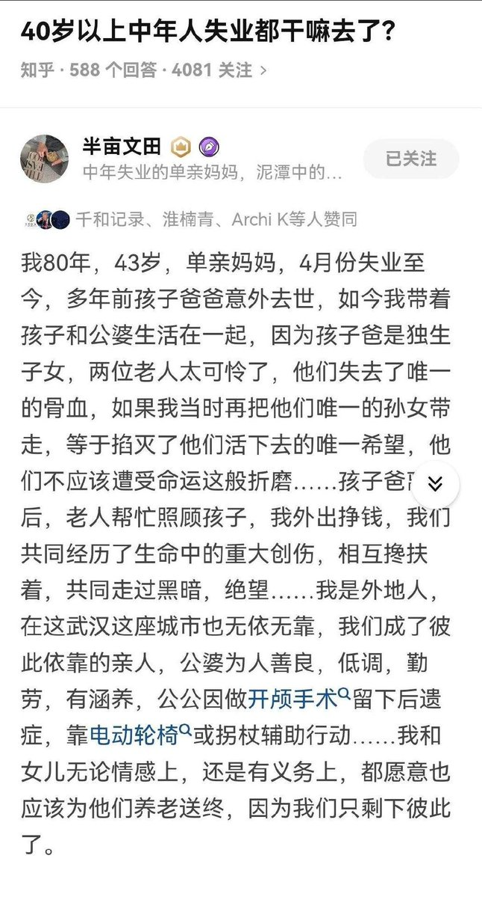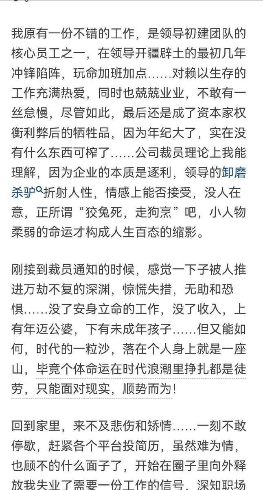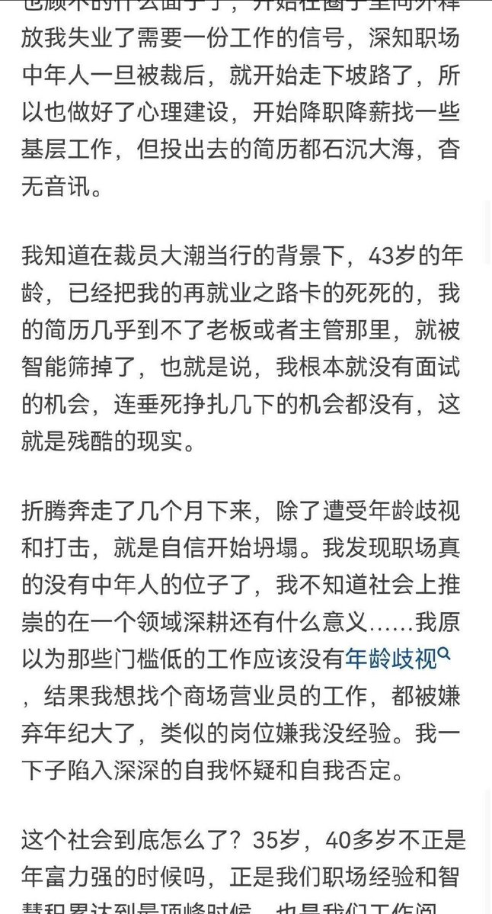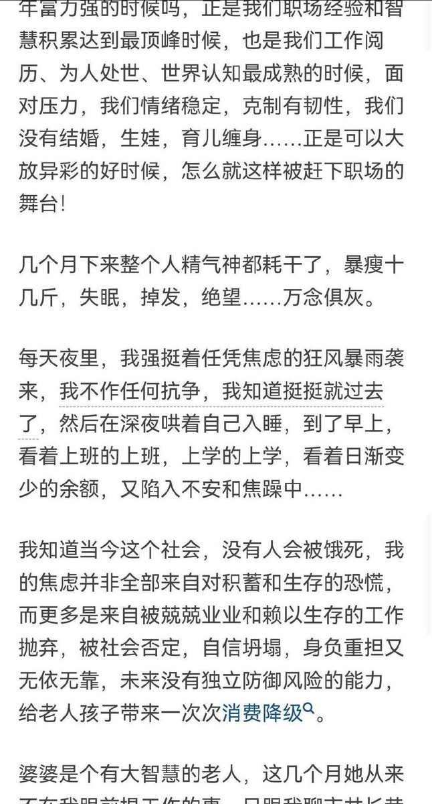  谁将十万横扫三江 北京时间 2023-09-26T22:21:29Z 1706675360514093142 RT @whyyoutouzhele: 进入9月，“预制菜进校园”问题在中国社会引发了轩然大波 
为什么中国的食堂问题频发？ 
为什么老百姓宁愿相信可能出产“鼠头鸭脖”的校方食堂，也不愿意相信中央厨房统一制作的预制菜？
 因为老百姓可能不懂预制菜，但是懂中国。

https:/…   谁将十万横扫三江 北京时间 2023-09-26T23:09:03Z 1706687334723260597 人民军队简单打一打老百姓 https://t.co/brPPrFNkQA 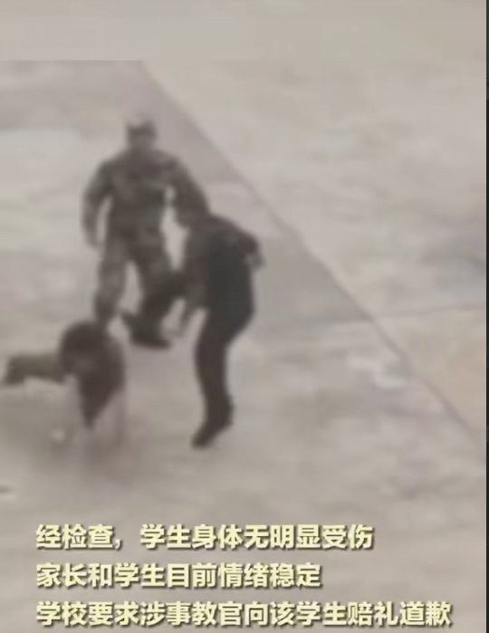  谁将十万横扫三江 北京时间 2023-09-26T12:48:35Z 1706531188226339254 刑事司法改革正在从“公开化”走向“封闭化”——文鑫说法

司法公开是司法公正的重要保障。前几年，刑事司法改革，一直在朝公开化的方向上努力，其中就包括庭审直播和裁判文书公开。

但这几年，这种公开化的改革正在倒退。
一是，司法文件封闭化。

早在2500年前的春秋时期，郑国执政大臣子产就通过铸刑鼎，公开法律条文，改变“法不可知则威不可测”的局面。几千年来，法律条文公开不仅成为共识，更是一种常识，因为法律的特征之一就是可预测性，只有法律条文公开，公民才知道什么行为是为立法所禁止，才能预测自己的行为，是否符合规范，才能避免触碰法律。

但现在，作为具有法律效力的一些司法文件，却经常不被公开，比如2023年6月26日最高人民法院印发的《全国法院毒品案件审判工作会议纪要》就明确要求该纪要不得再媒体上刊登。

又比如2022年2月，国家监察委员会会同最高人民法院、最高人民检察院共同发布了《关于办理国有企业管理人员渎职犯罪案件适用法律若干问题的意见》，但该份意见在任何公开渠道上根本无法检索到，我私下询问纪委监委的朋友，被告知这份文件涉密，不能公开。

这些司法文件具有明确的法律效力，在定罪量刑时适用，但就是不公开。作为律师，在公开渠道上，根本无法查询到这些规定，甚至不知道，涉及多少金额可以构成犯罪，可以判处几年有期徒刑，甚是荒唐！
二是，司法过程封闭化。

2018年刑诉法修改给我国刑事司法带来“颠覆性”的变化，监察体制改革和认罪认罚制度改革影响尤烈：

第一个是，监察体制改革之后，职务犯罪案件以及与职务犯罪关联的罪名，从原来的检察院反贪反渎局管辖改革为监察委调查。根据监察法的规定，监察委调查期间（主要指调查犯罪），不属于侦查行为，被调查人不享受宪法赋予的获得律师辩护的权利。

调查行为本质上行使的就是侦查权力，因为无论是调查的证据还是之后与检察院的衔接，都和侦查没什么两样，连陈光中教授都认为这就是实质性的侦查行为，应当赋予被调查人享受律师辩护的权利。

但目前法律没有授权，监察委也不允许律师介入。而留置期限最长有六个月，很显然，职务犯罪的案子，整个调查期间，被留置之后，被调查人不能见律师、不能见家属，整个过程都是封闭式的，程序缺乏公开性。

第二个是，认罪认罚制度确立之后，检察院获得了实质上的裁判权，因为根据刑诉法的规定，检察院的量刑建议原则上法院必须采纳，根据两高公开的数据，当前检察院认罪认罚适用率已经达到90％以上，而法院的采纳率也高达95％，这就说明大多数案件都是通过认罪认罚解决的，而不是通过庭审解决的，更不是在法院阶段解决。

检察院以及检察官享有巨大的裁判权力，控辩双方不再是平等对抗的相对方，检察院／检察官成为裁判方，既是裁判员又是运动员的角色了。更关键的是，量刑协商实质上往往异化成量刑通知。协商显然不足的，检察官往往也不愿意和律师协商，律师很难像拥有庭审一样公开的程序去表达意见。

从此前的改革方向，我们看到了法院在司法公开方面的努力，尤其是庭审直播和裁判文书公开，但现在，申请庭审直播相当困难，法官一般也不同意。另一方面就是裁判文书公开也逐渐变成选择性公开。有一天，我自己在中国文书裁判网中输入自己的信息，发现原来好多个可以查阅的成功案例现在都查询不到了，仅仅按照可查询的信息看，我甚至很难看出是一个刑事律师了，因为跟刑事案件有关的案子，似乎都被屏蔽了。更甚者是，现在法院经常用各种方式限制旁听，疫情期间不允许旁听，疫情之后，则是各种限制旁听。

在这种决策封闭的环境下，辩护人也只能无奈的扩大辩护范围，决策权在哪里，辩护就要延伸到哪里。
三是，司法决策封闭化。

我国刑事诉讼是参照西方控辩对抗法官居中裁判的模式进行设计的，但这个模式很显然经常不起作用。比如纪委监委办理的案子，检法两家原则上很难有不同的意见，也不敢轻易改变，甚至在非纪委监委办理的案子中，有的案子法院在判决之前，也要请示纪委监委的意见。

从法院内部看，法官很多时候也无法自行决定案子的处理结果，在疑难案子中，一直都遵循的是审委会的集体决策机制，比如要判无罪、判定罪免刑等是必须上审委会的，而按照当前的规定，律师无权参与审委会，但检察院依据2010年1月12日与最高法联合发布的《关于人民检察院检察长列席人民法院审委会会议的实施意见》，可以参加审委会，在实质上决策被告人命运的审判中，辩护人是缺席的，被告人也是缺席的，这实质上就形成了秘密的法庭，决定了当事人的命运，被告人却成为局外人。

在实践中，一审法官／法院在判决之前，也经常向上级法院请示，形成内审，一旦上级法院给了意见之后，一审法官／法院就敢大胆的判决，这样实质上就剥夺了当事人上诉的权

利，因为上诉只剩下形式意义，没有实质意义，两审变一审。甚至有的职务犯罪的案子，办案单位限制被告人上诉，直接剥夺被告人的上诉权，最近原安徽省肥西县委书记金成俊案件就有相关的报道。而滁州中院也曾经在网上公开《滁州市中级人民法院关于办理刑事案件内审、请示的暂行规定》，把上不了台面的东西祭出来，引起广泛批评，之后被迫撤下，但互联网是有记忆的，只不过文件虽然撤了，但不影响它的运行。

还有诸如扫黑除恶案件，检法两家都提前介入，甚至上级法院也提前介入，在政法委扫黑办的统一部署下，形成意见，剩下就是公安依葫芦画瓢调查取证的问题了。比如内蒙古刘素琴涉黑案，二审法院不小心泄露出来的副卷显示，该案公检法三长甚至是上级法院早就介入讨论，并认为“涉案特征不明显”“本案确实先天不足”等无罪意见，但结论还是“黑打下去”，造出了一个涉黑案子。
四是，司法结果封闭化。

司法结果的封闭，主要是裁判文书不公开。裁判文书不公开，所谓的类案适用规则就无法实现，同案不同判的现象就无法被纠正。但现在，刑事案件的裁判文书，越来越难公开了，尤其是一些有争议的案子，往往是不被公开的，如此一来，又回到原来不公开的路子去了。

当我们看刑事司法的时候，需要跳出刑事司法，才能窥见全局。从宏观的角度看，我们需要了解国际局势以及既往的中国经验，从历史中去看整个官僚体制改革的背景和原因。但宏观的趋势，我们个体无力影响。

我们只能关注微观的事实，面对微观的结果，具体到刑事司法，我们需要面对未来相当长一段时间的封闭化状态，在这种封闭化的环境中，去寻找路径，去解决个案的问题。

道路将越来越曲折，内心将越来越痛苦，但这是现实，而无论结果如何，我们始终不能忘记，我们应该做好自己的责任，穷尽一切，去为当事人的权益而努力。至于求而不得，只能学会接受和释然。 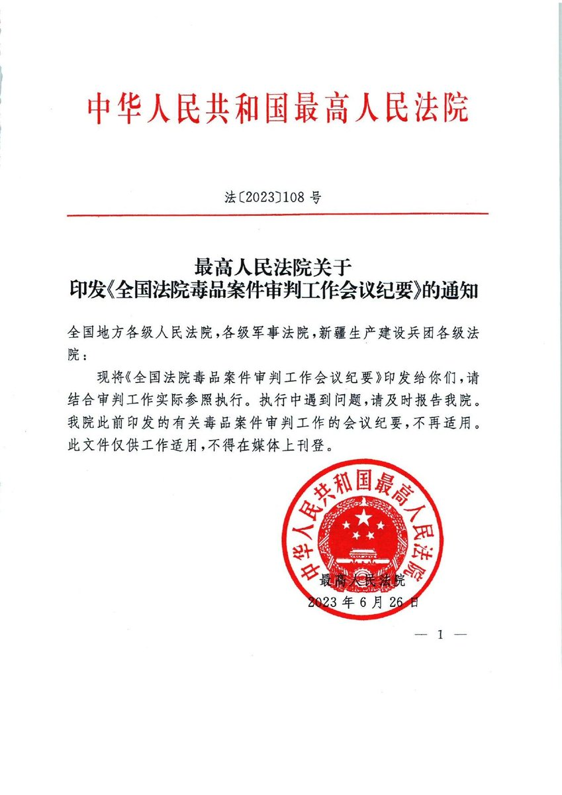  谁将十万横扫三江 北京时间 2023-09-26T12:36:10Z 1706528063771771034 9月25日，因敦白铁路DBSG-4标段欠薪，群众围堵沈阳铁路局讨薪。 https://t.co/zLsPN56MEb   谁将十万横扫三江 北京时间 2023-09-26T14:17:09Z 1706553477349196024 RT @Pandazhq: 这篇文章看得人好悲哀好无助，那些孤独死的人，基本都是被社会和家人抛弃的。所以才会死了几个月都没人知道，身体都腐烂了，家里都是垃圾、气味和难以处理的体液，才不得不请特殊场地清理师来清理。… https://t.co/Lgt332hzRY 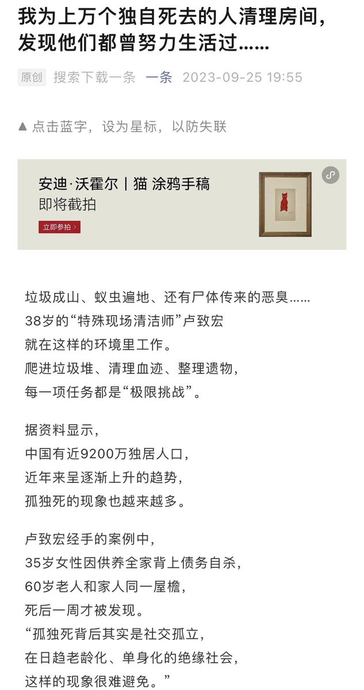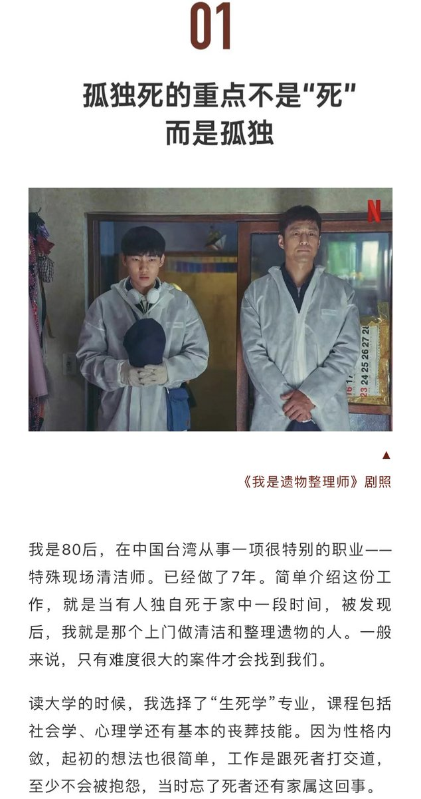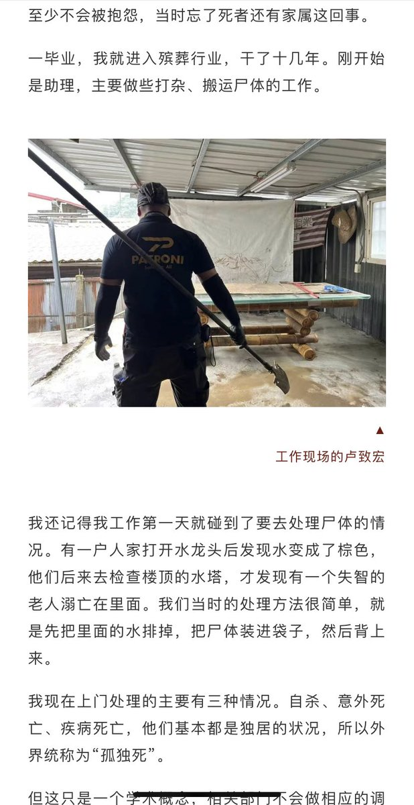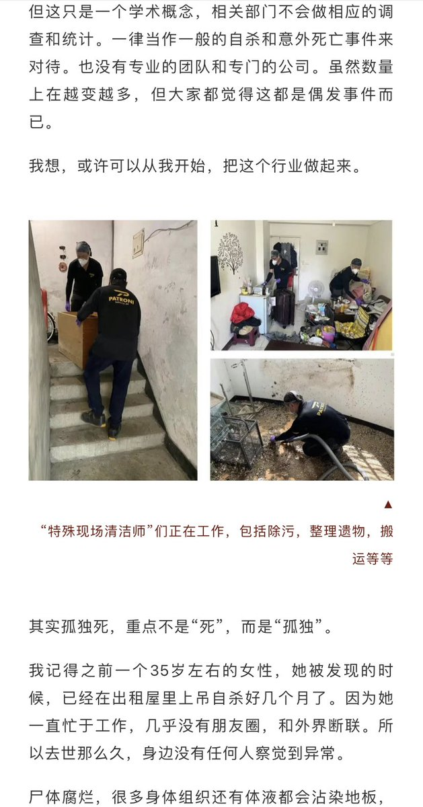  谁将十万横扫三江 北京时间 2023-09-26T14:17:15Z 1706553502921851020 看了承德罚程序员的事情，估计今年红圈这项收入能再创辉煌。靠专业能力吃饭的朋友，还是别逃离北上广了，外面不止有诗和远方，还有大檐帽叔叔阿姨。 https://t.co/Ohk34EDeuh 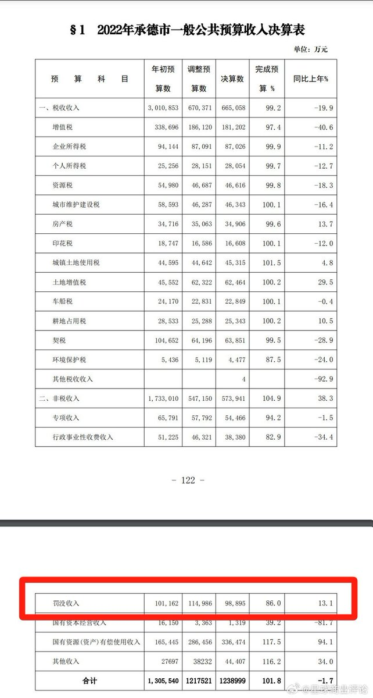  谁将十万横扫三江 北京时间 2023-09-26T14:17:25Z 1706553542339895314 RT @jakobsonradical: 2023年9月1日，河北魏县一位64岁的老太婆想看看国家信访局，结果被当成想伸冤的老百姓“截访”，致腰椎3处骨折、爆裂性骨折。她至今卧床不起，大小便不能自理。这就是“全面依法治国”。 https://t.co/5tin3qfsbh 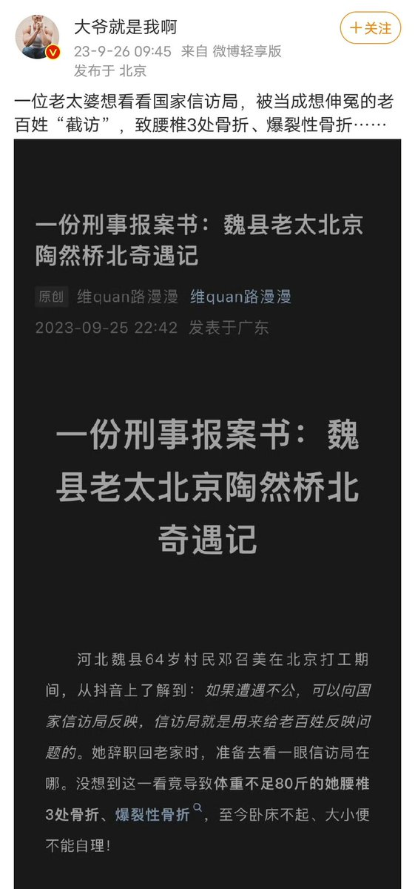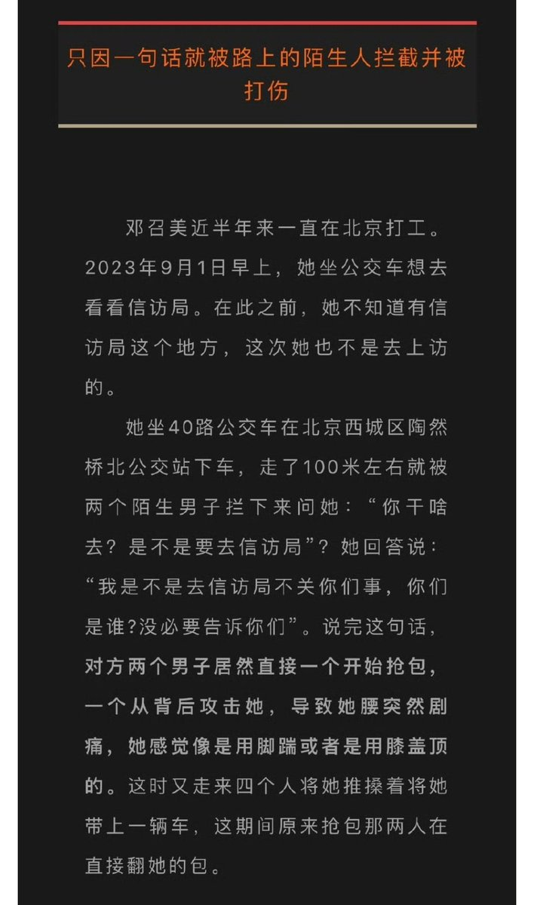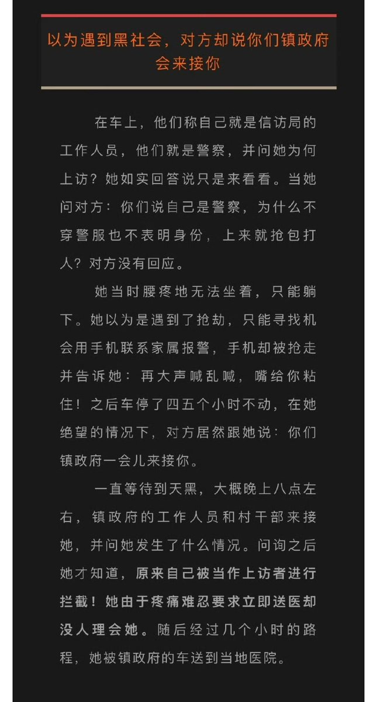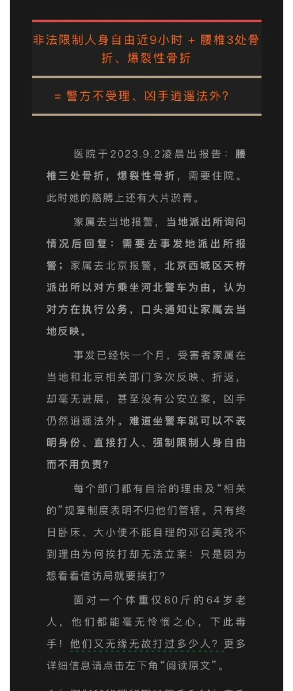  谁将十万横扫三江 北京时间 2023-09-26T08:37:15Z 1706467936909853086 孩子遇到校园霸凌怎么办？

校园霸凌霸凌，如果你们家孩子真的遇上了，你让孩子忍下来，让孩子告诉老师，或者你叫孩子打回去都不对，怎么做？一定要听今天我给你讲的这5步法。

第一步，事件定性。一定要把这件事情定性清楚，它是校园霸凌，它不是孩子之间的嬉戏打闹。所以这个时候一定要第一时间找到班主任，告诉他通知对方家长，家长不来，好的告诉他，我会直接选择报警。他不是你想的嬉戏打闹，好像我们家两个孩子推了我一下，推了你一下，注意他是霸凌，霸凌属于青少年犯罪。

这第一个就是要把这个事件的性质定好喽。

第二件事情就是表明态度。为什么？有很多老师，很多班主任不希望在自己的班上发生事情，对不对？所以老师通常的做法是什么和稀泥。要在老师面前，表明你的态度就是告诉老师这件事情。如果老师不去及时处理，会通知教育局介入，会通知教育局来介入，并且一管到底。电影少年的你已经反映了恶劣事件，现在国家正在大力管控校园霸凌。

第三步，说明后果。对方的家长来了，很有可能大事化小，小事化了，或者认为自己家或者认为自己家的孩子压根没有错，没有关系的，直接告诉他，如果你不准备以我要的方式来解决问题，那么我就直接报警。处理这个事就是一个青少年犯罪事件，我可以让你们家孩子进到拘留所。

第四步，宣布诉求。很多家长在面对自己孩子被欺负的时候会特别生气委屈，对吧？对着对方大吼大叫，或者把自己的情绪去发泄出来。但是你没有宣布好自己的诉求，正确的诉求是什么？你是希望你们家孩子这种恶劣的事情不再发生，应该要做的是什么？是让家长当众道歉，说明这当中的厉害性。

如果已经涉及到孩子的伤害，一定要去医院，而且注意去医院，要让医生出具伤情说明书。这一点很重要，一定不要让孩子受到任何一点点的孩子经历的伤害，因为很有可能，因为孩子有可能会留下心理或者生理上的后果。

第五步，敲山震虎。大家有没有发现当一个孩子被人欺负之后，很容易其他的人也过来欺负他。所以当这次校园霸凌出现之后，你要让这个家长和他的孩子当着全班同学的面来道歉。而且在这个时候，你要注意你们家孩子有可能是懵的，甚至还会害怕。

所以作为家长，你要上去说一句让所有人为之一振的话，你要告诉他你绝不允许这件事情再发生。如果下一次还有任何人敢欺负我们家孩子，那么我将会用同样的手段直接报警来解决这件事。这就是孩子在遇到校园霸凌的5步法。每个家长都要记住，保护孩子是我们作为父母的天职。   谁将十万横扫三江 北京时间 2023-09-26T08:37:56Z 1706468110667296857 【美国加州直人店主因悬挂彩虹旗遭枪杀】

当地时间 8 月 18 日，美国加利福尼亚州 66 岁的服装店主劳拉·卡尔顿（图1）因在店内悬挂彩虹旗遭到一名男子枪杀身亡。警方宣布，已将这起事件当做仇恨犯罪进行调查。凶手名叫特拉维斯·池口（Travis Ikeguchi），今年 27 岁。警方透露，案发当日他因不满悬挂的彩虹旗对店主使用了许多恐同性的词汇进行辱骂，导致两人发生了争执，之后掏枪将店主打死。行凶后，特拉维斯徒步逃离了现场。

警方在当天很快就找到了特拉维斯。拒不配合调查的他使用一把半自动手枪与警方进行了火拼，最终被当场击毙。警方透露，特拉维斯是加州本地居民，此前曾在多个社交媒体上发表过批评性少数群体和政府部门的帖子。

受害者劳拉·卡尔顿并非是性少数群体的一员，而是一名普通的异性恋女性。她与丈夫已经结婚 28 年，两人育有 9 个子女。

加州公益组织 Lake Arrowhead LGBTQ+ 向劳拉的家人表示了哀悼，并称赞劳拉虽然不是一名性少数者，但却是「社区中每个人的」倡导者。该组织在社交媒体上写道：「劳拉对性少数社区的坚定支持以及她在店内营造安全空间的行动感动了许多人，我们为她的离世深感悲痛。   谁将十万横扫三江 北京时间 2023-09-26T09:11:21Z 1706476520662052980 有网友在济宁市网络问政平台反映济宁市迪尔集团有限公司拖欠工人工资问题，据该网友描述，迪尔集团有限公司拖欠工人工资4个月，住房公积金目前才交到2022年5月份。

目前该诉求已交由济宁市高新区管委会受理。

据水滴信用显示，迪尔集团有限公司（曾用名：山东省建设第二安装有限公司,山东迪尔安装有限公司,山东迪尔安装集团有限公司）是一家从事工程设计,工程总承包,锅炉安装等业务的公司，成立于1999年05月12日，企业的经营范围为:工程设计，工程总承包；锅炉安装和改造、压力管道安装、起重机械安装维修；许可范围内的电力设施承装（修、试）；资格证书批准范围内的对外承包工程业务；认可范围内的检测和校准；资质证书许可范围内的工程施工；设备与材料的销售；建筑工程机械与设备租赁；金属构件制造；房地产开发与销售；货物进出口业务；设备吊装，货物装卸搬运；普通道路运输；环保工程；向境外派遣各类劳务人员（不含港澳台地区）业务”。   