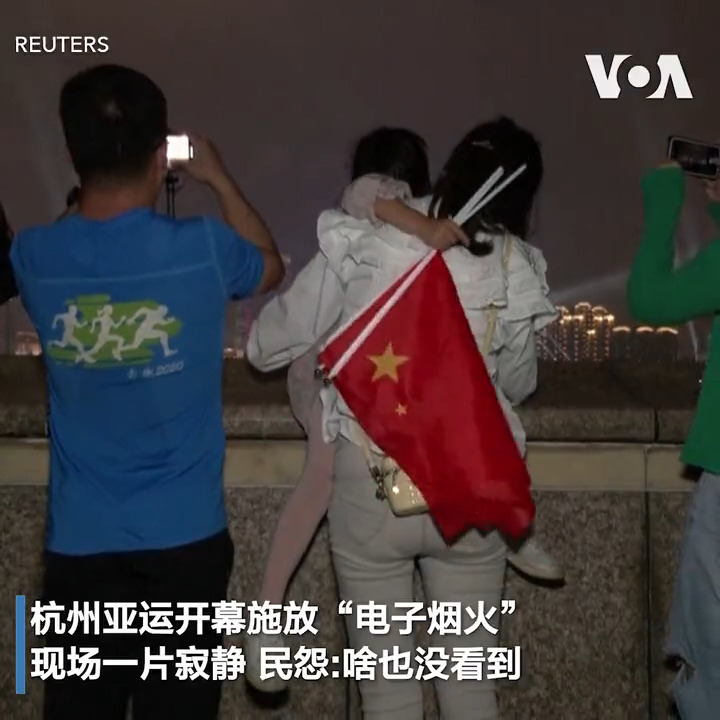
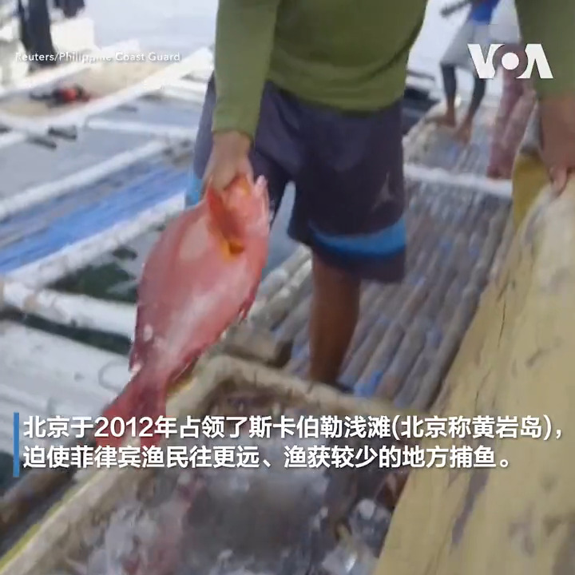

美国之音中文网 北京时间 2023-09-25T22:06:06Z 1706309104375890090 香港记协主席拒向警员出示身份证被裁定“阻差办公”罪成并被判囚五日 https://t.co/CUgaHGE33k   美国之音中文网 北京时间 2023-09-25T19:20:06Z 1706267327464161358 为了缓和美中关系，北京微调与俄罗斯的关系？ https://t.co/naYVEmZnbe   美国之音中文网 北京时间 2023-09-25T19:42:10Z 1706272882899185729 杭州亚运9月23日晚间开幕，因官方宣传将有精彩烟火表演，吸引大批民众卡位争看烟火，不过，民众事后抱怨，现场“啥也没看到”，只能透过手机荧幕看“数位烟火秀”，让不少人直呼“非常失望”，更引发中国网友热议。报道: https://t.co/WdKGKr8FVh https://t.co/RbuVZu37Q1   美国之音中文网 北京时间 2023-09-25T20:02:53Z 1706278093831258505 菲律宾9月24日严词指控中国海警，于南中国海的争议海域设置“浮标障碍”，企图阻止菲律宾渔民进入该区捕鱼。马尼拉海岸警卫队发言人杰伊·塔里埃拉准将于X社媒平台发文，强烈谴责中国剥夺菲律宾渔民生计，他重申将与相关政府机构密切合作，维护菲国的领海权益。报道: https://t.co/5b6thr2eP3 https://t.co/eLAvd3oezu   美国之音中文网 北京时间 2023-09-25T12:59:35Z 1706171566764212239 台湾高尔夫球工厂大火酿10死 4消防员殉职 总统候选人就消防改革作出表态 https://t.co/wbS34goIJY   美国之音中文网 北京时间 2023-09-25T16:34:36Z 1706225677132009768 恒大无法发行票据 债务重组恐泡汤　打击中国房产投资人情绪 https://t.co/ABulyHxQG4   美国之音中文网 北京时间 2023-09-25T17:02:10Z 1706232616100479450 韩日中为恢复三国领导峰会开始磋商 韩国称习近平表达了访韩愿望 https://t.co/UM4Pc3uq4H   美国之音中文网 北京时间 2023-09-25T17:33:34Z 1706240518181802239 中欧经贸高层对话登场前 欧盟贸易专员吁中国以行动降低风险认知 https://t.co/cSfeSz0Y6y   美国之音中文网 北京时间 2023-09-25T16:05:34Z 1706218371031929085 台湾期待四年内部署两艘自制潜艇 潜舰国造专案“能让我们不输掉战争” https://t.co/362Oxcv06X   美国之音中文网 北京时间 2023-09-25T12:59:33Z 1706171558870536431 世卫促重启病毒溯源 科学问题为何扑朔迷离？ https://t.co/nIx90gBUaY   美国之音中文网 北京时间 2023-09-25T13:50:04Z 1706184271738904655 中国贵州一国营煤矿矿难，16人丧生 https://t.co/1AkLi7UrSG   美国之音中文网 北京时间 2023-09-25T09:44:05Z 1706122369163825285 塞族枪手暴力袭击科索沃修道院，造成4人死亡 https://t.co/Wp5UoC8fbD   美国之音中文网 北京时间 2023-09-25T06:26:43Z 1706072700538536249 中国十段线地图引众怒 马来西亚总理称中国承诺继续谈判争议领土https://t.co/AEQGjfEbpT   美国之音中文网 北京时间 2023-09-25T06:33:34Z 1706074422225076367 俄罗斯对赫尔松地区发动致命袭击 https://t.co/9e9ou8wDyz   美国之音中文网 北京时间 2023-09-25T07:00:02Z 1706081082272358527 中国耗巨资举办各种国际赛事的着眼点恐怕不是体育，而是意在炫富和扩大政治影响。经济低迷却极尽奢华，无竞争承办亚运会是不是“冤大头”？中国国家副主席韩正在联大传递习近平信息，称中国永远是发展中国家。和西方叫板要改变世界格局的”厉害国”是发展中国家吗？请看周一时事大家谈并留言互动。 https://t.co/RcDYzUi4VC   美国之音中文网 北京时间 2023-09-25T07:24:34Z 1706087258800238615 菲律宾谴责中国在南中国海设立“浮动障碍” https://t.co/3k0153NRc3   美国之音中文网 北京时间 2023-09-25T08:43:33Z 1706107133421650271 马克龙：尼日尔政变后法国将撤回驻尼大使和军队 https://t.co/h1XdDkJ91r   美国之音中文网 北京时间 2023-09-25T09:07:33Z 1706113175467577843 国事光析：中国政局的斯大林逻辑 https://t.co/v1aLkuCwr8   美国之音中文网 北京时间 2023-09-25T04:20:12Z 1706040860239106066 中国央行顾问提出结构性改革以重振经济 https://t.co/HvcusspkAx   美国之音中文网 北京时间 2023-09-25T00:41:15Z 1705985759000359324 第19届亚运会23日傍晚于杭州举行开幕式，这场号称史上规模最大、参赛人数最多的体育赛事由中国国家主席习近平亲自出席，并于会接待前来观礼的各国高层嘉宾。观察人士说，中国希望透过亚运的盛大场面，重塑大国形象，但亚运不过是热闹一场，无助于北京应对内外挑战。报道：https://t.co/XYFQ41Wp9Z https://t.co/8pT4t3EX4z   美国之音中文网 北京时间 2023-09-25T03:37:54Z 1706030216827503032 美国航天署NASA24日从犹他州回收了NASA的首个小行星样本。小行星探测器“欧西里斯-雷克斯”(Osiris-Rex)飞掠地球时释放出装有小行星贝努 Bennu 样本的返回舱，返回舱带着降落伞四个小时后降落在犹他州；为这次历时7年的任务画上句号。而 “欧西里斯-雷克斯”则继续飞向另一个小行星。 https://t.co/v3BXJxNe6w   美国之音中文网 北京时间 2023-09-25T00:01:40Z 1705975799038280166 埃塞俄比亚选手阿塞发（ Tigst Assefa ）在24日的柏林马拉松上以两小时11分53秒夺得女子冠军，并将先前的世界纪录缩短了两分钟。 https://t.co/iLuHgLjq31   美国之音中文网 北京时间 2023-09-25T00:44:06Z 1705986475354099956 中国一家法院秘密判处知名维吾尔族学者热依拉·达吾提终身监禁 https://t.co/9pEGKYE1Z1   美国之音中文网 北京时间 2023-09-25T00:14:34Z 1705979043143885141 杭州亚运开幕 分析:热闹有余，但不足以应对内外挑战 https://t.co/Q6BsYCjiuF   