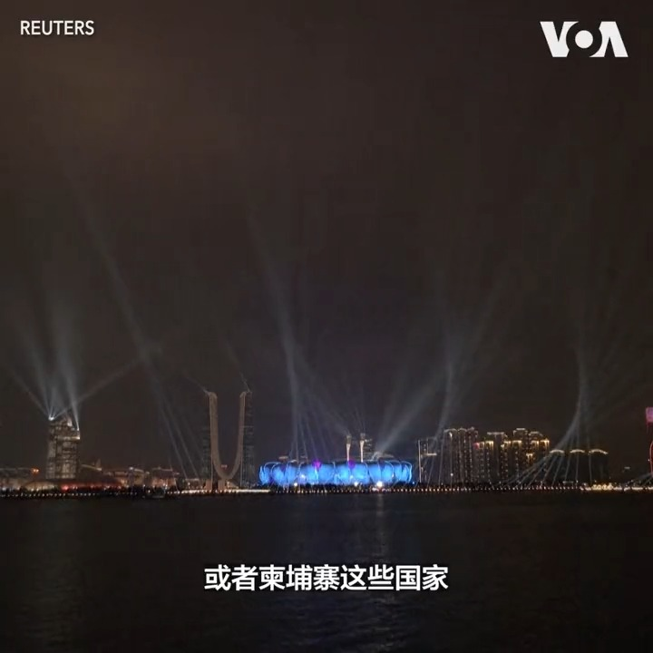
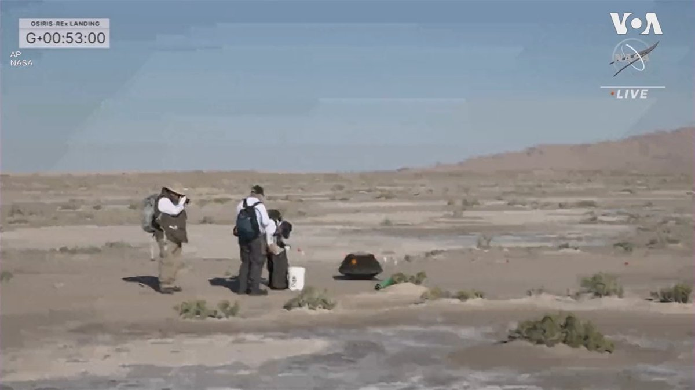

美国之音中文网 北京时间 2023-09-25T06:33:34Z 1706074422225076367 俄罗斯对赫尔松地区发动致命袭击 https://t.co/9e9ou8wDyz   美国之音中文网 北京时间 2023-09-25T07:00:02Z 1706081082272358527 中国耗巨资举办各种国际赛事的着眼点恐怕不是体育，而是意在炫富和扩大政治影响。经济低迷却极尽奢华，无竞争承办亚运会是不是“冤大头”？中国国家副主席韩正在联大传递习近平信息，称中国永远是发展中国家。和西方叫板要改变世界格局的”厉害国”是发展中国家吗？请看周一时事大家谈并留言互动。 https://t.co/RcDYzUi4VC   美国之音中文网 北京时间 2023-09-25T07:24:34Z 1706087258800238615 菲律宾谴责中国在南中国海设立“浮动障碍” https://t.co/3k0153NRc3   美国之音中文网 北京时间 2023-09-25T08:43:33Z 1706107133421650271 马克龙：尼日尔政变后法国将撤回驻尼大使和军队 https://t.co/h1XdDkJ91r   美国之音中文网 北京时间 2023-09-25T09:07:33Z 1706113175467577843 国事光析：中国政局的斯大林逻辑 https://t.co/v1aLkuCwr8   美国之音中文网 北京时间 2023-09-25T04:20:12Z 1706040860239106066 中国央行顾问提出结构性改革以重振经济 https://t.co/HvcusspkAx   美国之音中文网 北京时间 2023-09-25T00:41:15Z 1705985759000359324 第19届亚运会23日傍晚于杭州举行开幕式，这场号称史上规模最大、参赛人数最多的体育赛事由中国国家主席习近平亲自出席，并于会接待前来观礼的各国高层嘉宾。观察人士说，中国希望透过亚运的盛大场面，重塑大国形象，但亚运不过是热闹一场，无助于北京应对内外挑战。报道：https://t.co/XYFQ41Wp9Z https://t.co/8pT4t3EX4z   美国之音中文网 北京时间 2023-09-25T03:37:54Z 1706030216827503032 美国航天署NASA24日从犹他州回收了NASA的首个小行星样本。小行星探测器“欧西里斯-雷克斯”(Osiris-Rex)飞掠地球时释放出装有小行星贝努 Bennu 样本的返回舱，返回舱带着降落伞四个小时后降落在犹他州；为这次历时7年的任务画上句号。而 “欧西里斯-雷克斯”则继续飞向另一个小行星。 https://t.co/v3BXJxNe6w   美国之音中文网 北京时间 2023-09-25T00:01:40Z 1705975799038280166 埃塞俄比亚选手阿塞发（ Tigst Assefa ）在24日的柏林马拉松上以两小时11分53秒夺得女子冠军，并将先前的世界纪录缩短了两分钟。 https://t.co/iLuHgLjq31   美国之音中文网 北京时间 2023-09-25T00:44:06Z 1705986475354099956 中国一家法院秘密判处知名维吾尔族学者热依拉·达吾提终身监禁 https://t.co/9pEGKYE1Z1   美国之音中文网 北京时间 2023-09-25T00:14:34Z 1705979043143885141 杭州亚运开幕 分析:热闹有余，但不足以应对内外挑战 https://t.co/Q6BsYCjiuF   