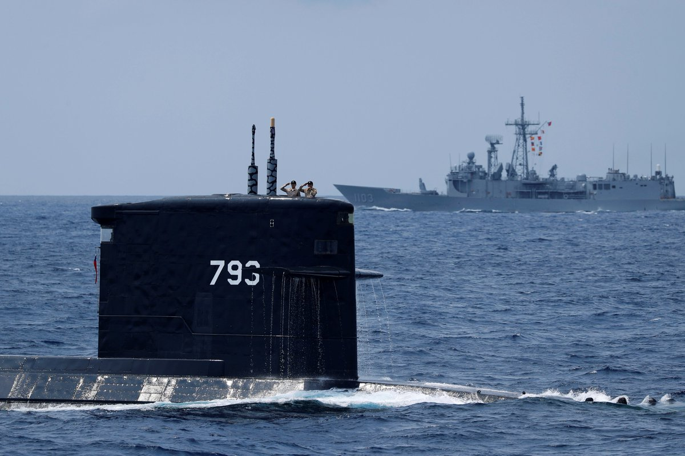
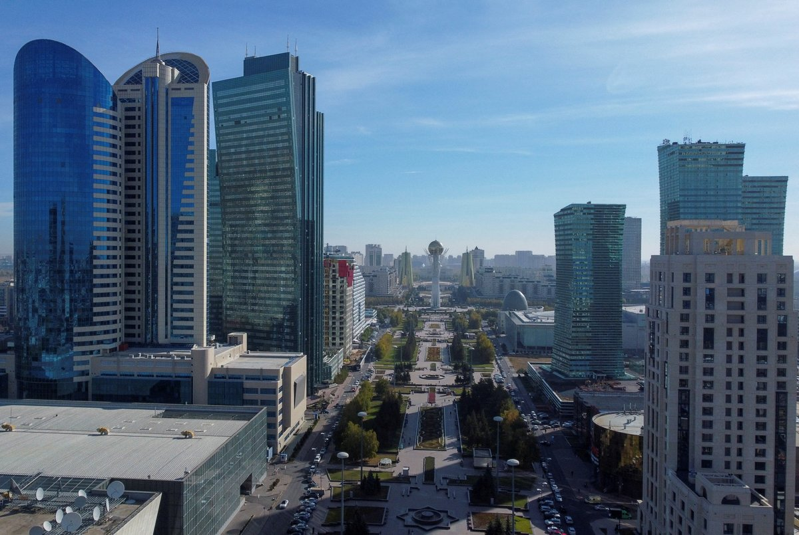
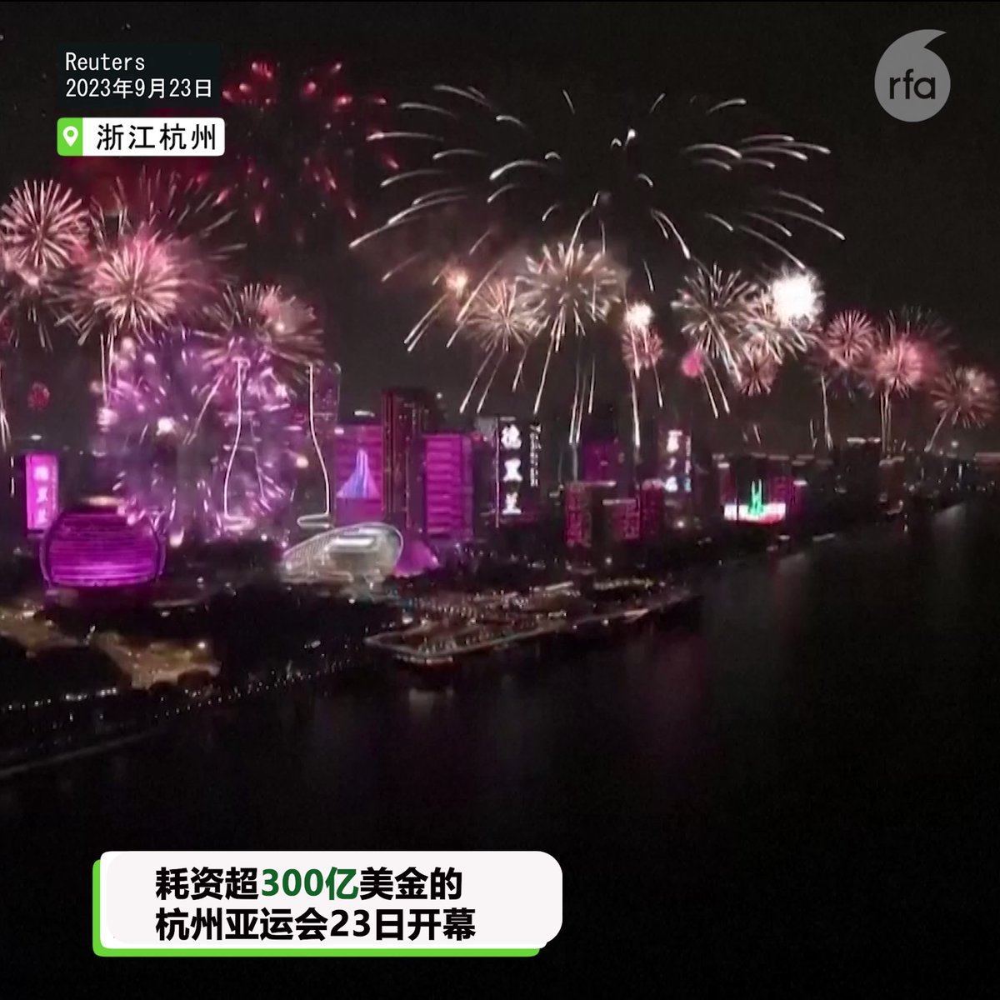
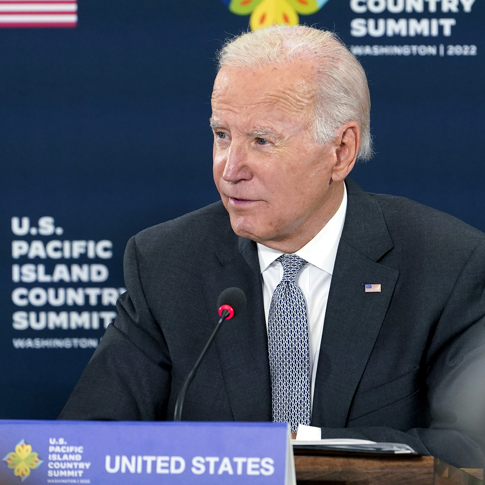

自由亚洲电台 北京时间 2023-09-25T16:48:13Z 1706229106948669729 【台湾首艘自制潜舰28日下水】
【遏制中国突破第一岛链】
台湾第一艘 #自制潜舰 将在28日进行下水典礼，首艘预计在明年交付台湾的海军。负责专案执行的台湾国家安全委员会谘询委员 #黄曙光 表示，台湾建立潜艇舰队可遏制解放军穿越西太平洋 #第一岛链，防止中国对台湾的四面包围。https://t.co/a1QQV3a1s1   自由亚洲电台 北京时间 2023-09-25T15:51:09Z 1706214744099889172 【中哈两国协定公民信息交换】 
【新疆人入籍哈萨克须中方准许】
中国与 #哈萨克斯坦 政府达成交换两国公民信息协定。该协定重点交换 #新疆 少数民族移民信息，包括遣返非法入境者。哈萨克居民说，新疆人加入哈萨克国籍须提交 #中国 政府出具的“#放弃国籍”证明。
https://t.co/cj1dnflx9C https://t.co/bZ4RihxRCP   自由亚洲电台 北京时间 2023-09-25T12:47:22Z 1706168492406255798 RT @RFA_Chinese: 【#李孟居：网络随处可见的影像 却莫名因此被判间谍 】
【宋国诚：#全民抓间谍 国家恐怖主义 人民互疑 确保红色江山】
https://t.co/q9TUPsi7vU https://t.co/3SEFThJfFT   自由亚洲电台 北京时间 2023-09-25T07:02:04Z 1706081594308472978 【杭州亚运 | 隐形烟花?】亲临开幕现场的游客，没有预料到烟火表演原来是看不见的 #电子烟花，失望而归。没有失望的，是饱受抗议和制裁的叙利亚总统 #阿萨德, 在 #杭州 受到习近平星级接待。 https://t.co/3rLmIbPP67   自由亚洲电台 北京时间 2023-09-25T06:15:16Z 1706069817491399112 上午8时10分左右，#盘州市 盘关镇山脚树 #煤矿 发生一起事故，初步判断为运输胶带着火，造成16人被困。经矿山救护队施救，目前火已扑灭
https://t.co/S4DHDIBaa6 https://t.co/khmqR2PL9S   自由亚洲电台 北京时间 2023-09-25T00:42:11Z 1705985993906483319 【亚运会之际，上海维权人士失联】宝山区 #李雪梅 被综治人员把守小区出入口; 宝山区 #吴宝林 住家小区被黑社会限制出入；控江五村 #华秀珍 被当局控制在家中; 黄浦区 #胡忆中 以谈话为名带走后 #失联。
https://t.co/g7AwhS63NY   自由亚洲电台 北京时间 2023-09-25T02:12:41Z 1706008769291817462 RT @RFA_Chinese: 【#李孟居：网络随处可见的影像 却莫名因此被判间谍 】
【宋国诚：#全民抓间谍 国家恐怖主义 人民互疑 确保红色江山】
https://t.co/q9TUPsi7vU https://t.co/3SEFThJfFT   自由亚洲电台 北京时间 2023-09-25T02:13:19Z 1706008927597367572 RT @RFA_Chinese: 【#中国人权律师团 特稿 |向中国人权律师团致敬】
高智晟宁折不弯；江天勇愈挫愈勇；王宇嫉恶如仇；谢阳义无反顾；唐吉田统筹帷幄；李和平坚忍不拔；周世锋勇于担当；余文生大义凛然；刘书庆理性客观；蔺其磊不辞劳苦；莫少平深谙有理有利有节之道；王全章落…   自由亚洲电台 北京时间 2023-09-25T02:14:40Z 1706009268330127836 RT @RFA_Chinese: 【#您怎么看？】
自9月开学以来，中国 #抵制预制菜进校园 的浪潮一浪高过一浪。 家长恐慌而愤怒，为防止孩子在学校食堂吃 #预制菜，有家长每天中午给孩子送饭。
2021年起，预制菜概念像龙卷风一样席卷了中国大江南北。2022年中国预制菜市场规模…   自由亚洲电台 北京时间 2023-09-25T02:27:06Z 1706012399721971721 【来过台湾12次】#蔡英文 总统将于周一接见英国对台贸易特使 #福克纳勋爵 访问团，期盼在各领域的合作更为紧密，为全球民主与经贸发展贡献力量。
https://t.co/9PCJABcSw2   自由亚洲电台 北京时间 2023-09-25T03:41:56Z 1706031228799873310 【魅力攻势 保卫后院?】美国总统 #拜登 将于本周参与 #太平洋岛国 第二次峰会，并将宣布与库克群岛和纽埃确立外交关系，为互联网基建提供资金，旨在阻止中国进一步侵入美国后院。
https://t.co/5f3twJhnv7 https://t.co/a3a9TELcBx   自由亚洲电台 北京时间 2023-09-25T01:41:39Z 1706000959338373296 【蝙蝠女侠再发声】#石正丽 在《新兴微生物与感染》上表示，多达40种具有感染人类风险的 #冠状病毒，半数“高风险”，6种能传人，3种还能人传动物。https://t.co/OVHrHmobQj https://t.co/BvJYCBoZrc   自由亚洲电台 北京时间 2023-09-25T02:13:26Z 1706008960476590192 RT @RFA_Chinese: 【数据来了！日本驻华大使馆接到40多万通骚扰电话】
据日本共同社报道，自8月24日日本 #福岛核电站排水 以来，位于北京的日本驻华大使馆接到来自中国国内的骚扰电话超过40万通。… https://t.co/tppxFmo7iV   自由亚洲电台 北京时间 2023-09-25T02:13:33Z 1706008986053468368 RT @RFA_Chinese: 【#红砖巷涂鸦 主创一鹊：我的作品是面镜子 别人评价它时也在评价自己｜#观点】
https://t.co/kZQ6PD3s6k
 #一鹊 @ArtYique 理解某些人看来东伦敦的24个字像是纳粹符号，他鼓励大家二次创作，但对一个想要引发讨论揭…   自由亚洲电台 北京时间 2023-09-25T02:13:40Z 1706009015732294017 RT @RFA_Chinese: 【#您怎么看？】
最近中国驻美使领馆大力号召在美中国公民下载“中国领事”APP，并尽快真实、准确、完整地进行“#海外公民登记”，以便有针对性地推送安全信息，为在美中国公民提供及时有效的领事保护与协助。
中国为什么要敦促大家安装这个手机APP，收…   自由亚洲电台 北京时间 2023-09-25T02:14:10Z 1706009142480044327 RT @RFA_Chinese: 【RFA独家：中国留美学生为民主发声　国内家人遭骚扰】
https://t.co/AYsfLamnHA
美国大学校园本应是学子积极向学、勇于发表看法的安全空间。不过，就读于华盛顿特区乔治城大学（Georgetown University）法学院…   自由亚洲电台 北京时间 2023-09-25T02:14:53Z 1706009323111886878 RT @RFA_Chinese: 【#您怎么看】德国外长贝尔伯克（Annalena Baerbock）上周访美，在接受美国媒体访问时力挺乌克兰，她犀利发问：“如果普京赢得了这场战争，对于世界上其他独裁者，例如中国国家主席习近平，会是什么讯号”？… https://t.co/Gf…   