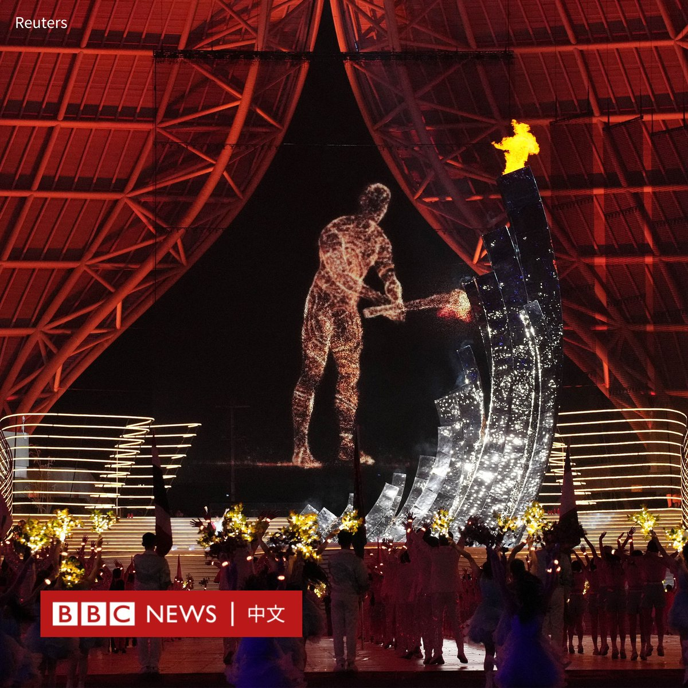
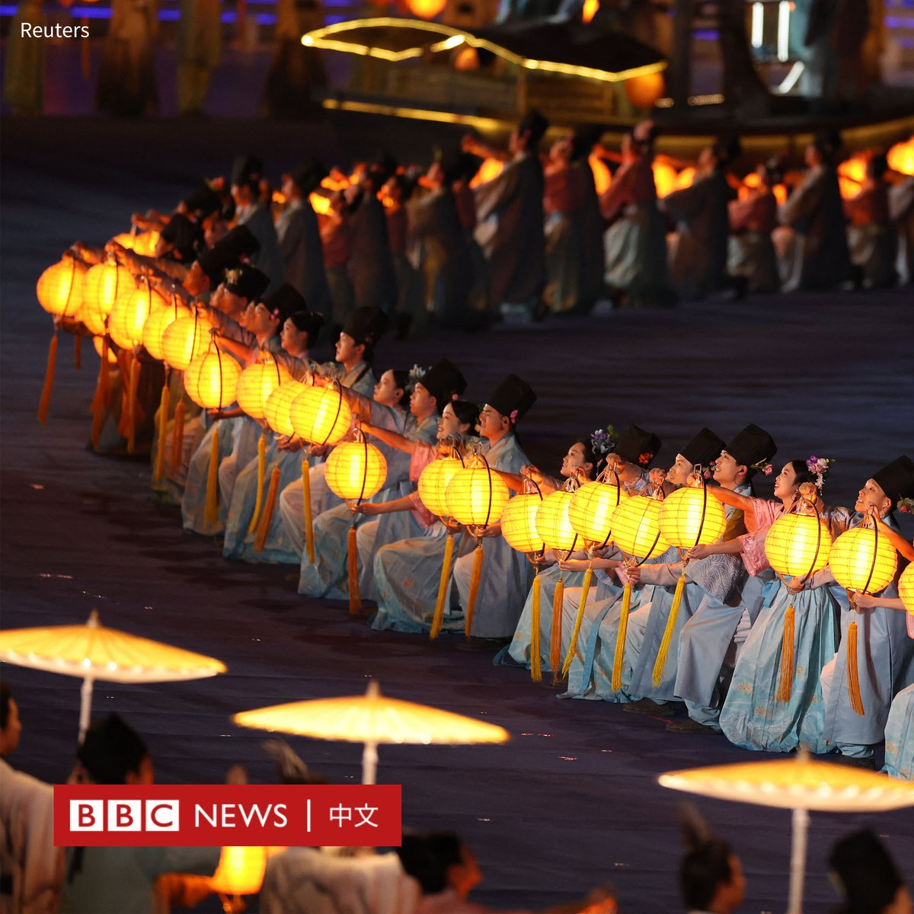
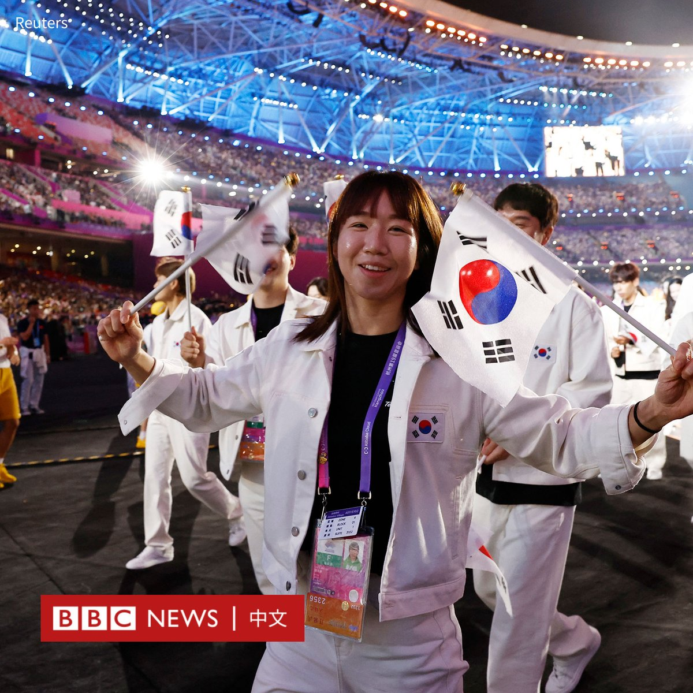

D英国广播公司BBC 北京时间 2023-09-24T00:30:47Z 1705620738747875603 第19届亚洲运动会周六（9月23日）晚在中国东部城市杭州开幕。

本届亚运会原定于2022年举行，但因为新冠疫情而推迟了一年。来自45个国家约12,000名运动员将参加40个项目的角逐。

中国国家主席习近平、叙利亚总统阿萨德（Bashar al-Assad）和柬埔寨国王西哈莫尼（Norodom Sihamoni）等出席了开幕式。

在运动员进场后，首支出场的队伍是阿富汗，由于塔利班禁止妇女参加体育运动，阿富汗女运动员只能居于国外，她们与男运动员走在一起，手举阿富汗伊斯兰共和国的三色旗，而非塔利班政权的白旗。

开幕式的表演将科技与传统元素融合在一起。在其中一个场景，数十名穿着古风服饰的芭蕾舞者在数字投影的湖面上翩翩起舞。

在点火环节，一个巨大的虚拟动画火炬手跑过整个体育场，然后与真正的火炬手——中国奥运游泳冠军汪顺——同步点燃了主火炬塔。

和中国此前举办的很多大型赛事一样，杭州为准备此次亚运会投入了大量的资金和人力。该市还采取了严格的安保措施，包括在开幕式当天临时关闭了25座地铁站。   