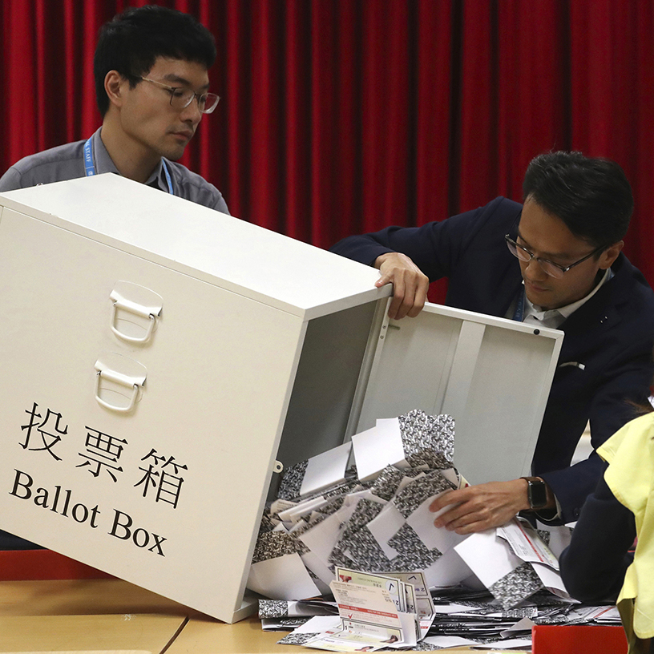
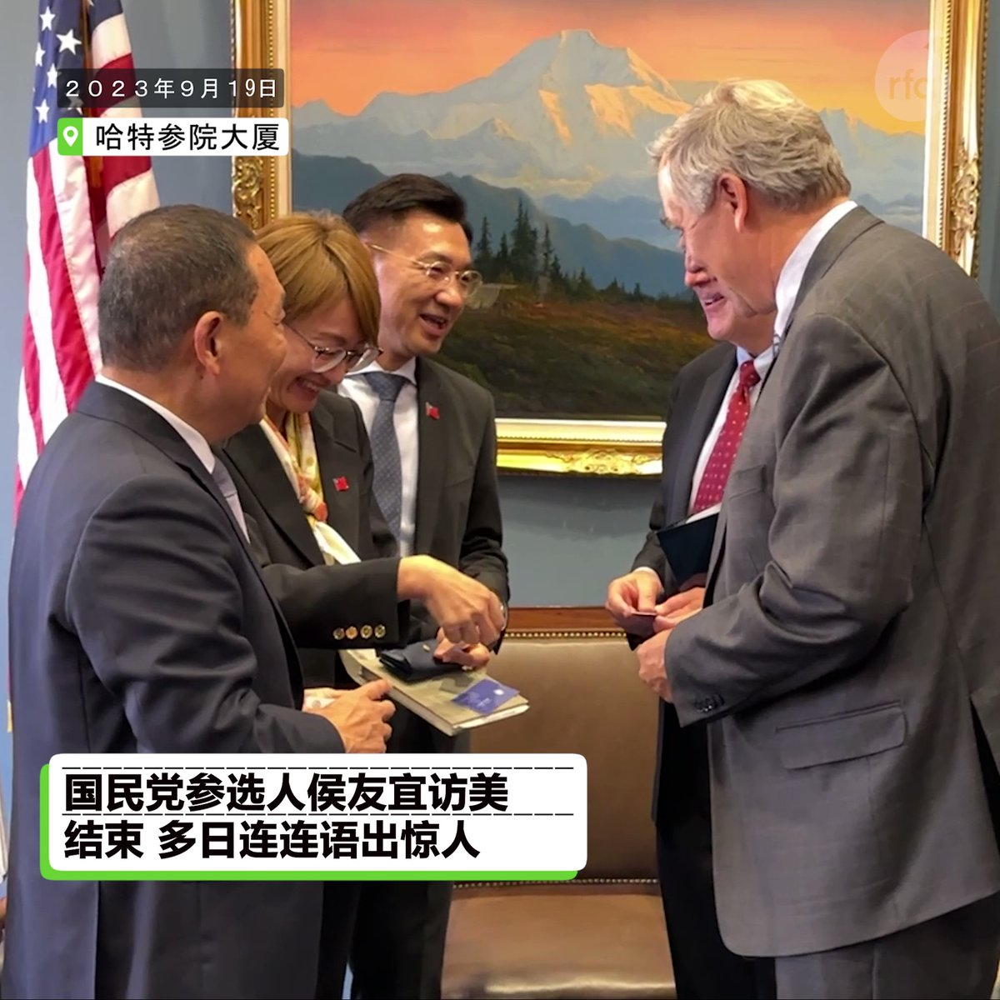
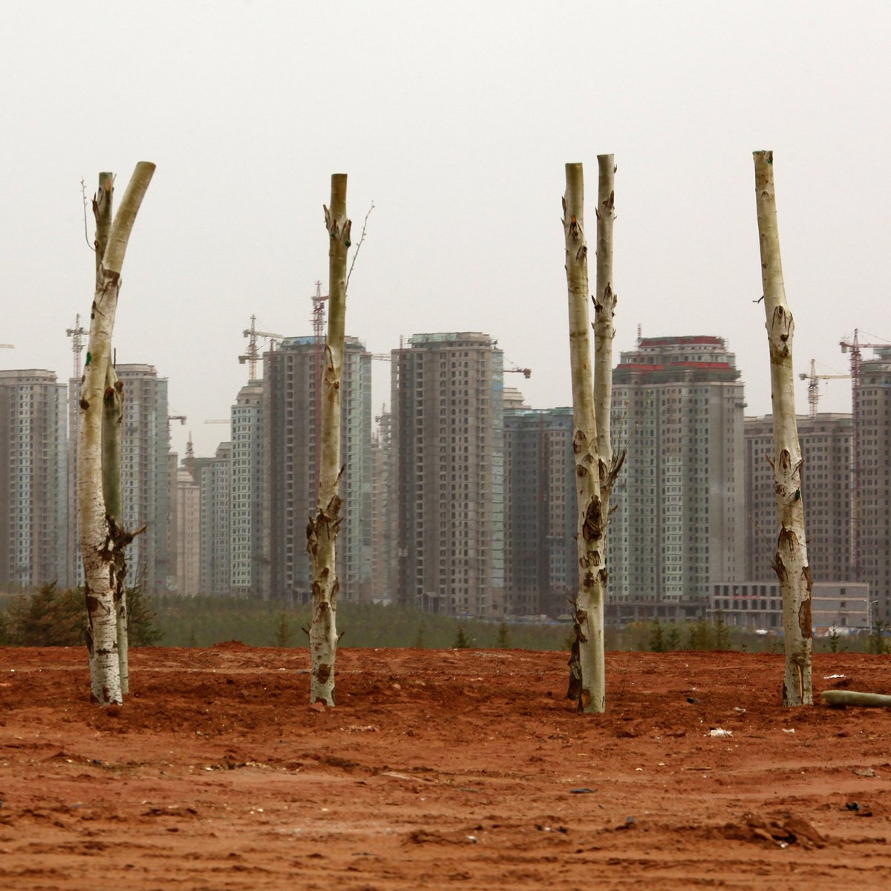

自由亚洲电台 北京时间 2023-09-24T09:22:10Z 1705754465280618882 RT @RFA_Chinese: 本台记者王允 @Jeff23Wang 有详细报道。
https://t.co/U55d8jXuHE   自由亚洲电台 北京时间 2023-09-24T09:22:54Z 1705754647967703226 RT @RFA_Chinese: 习近平拿掉 #邓朴方 的 #全国残联名誉主席 职务，不但是报了五年前邓朴方利用这一职务之便在公开讲话中对他习近平大加批判的一箭之仇，而且从此令他们邓家再无合“法”对外发声渠道。

#夜话中南海  https://t.co/eDNT7HvBpX   自由亚洲电台 北京时间 2023-09-24T02:51:33Z 1705656165055541566 #香港民主党 宣布将参加年底 #区议会选举，但需建制派的“三会”成员提名。据报道， #三会 已收到指示不能让“反对派”入闸参选，暂时不敢轻举妄动提名。
https://t.co/zdzN4zoasT https://t.co/YwXqGmqeCi   自由亚洲电台 北京时间 2023-09-24T04:29:20Z 1705680769673294023 【菲中两国 唇枪舌剑】菲律宾或向 #国际法庭 控告中国开采破坏南海鲎藤 #珊瑚礁。#毛宁 反击：若菲方真关心南海生态，应尽快拖走非法搁浅仁爱暗沙的军舰。
https://t.co/vQMnyYWnVE https://t.co/d9KFfVUX1X   自由亚洲电台 北京时间 2023-09-24T05:44:44Z 1705699746071888066 【侯友宜访美 | 口误集锦】误将拉美人当台湾人，呼吁不给老板发工资，背错 #三民主义 ，把前总统说成台北路名... 国民党参选人 #侯友宜 的美国之行，给人们留下了多个难忘的"雷人"瞬间。回台后，侯市长今正式暂停职务，以致力 #台湾大选。 https://t.co/ZeRjKKeRsV   自由亚洲电台 北京时间 2023-09-24T03:36:02Z 1705667358755361090 【#寻衅滋事?】公盟负责人、新公民运动参与者 #宋泽（宋光强）今年8月15日被刑拘。代理律师控告武汉公安 #国保 支队非法剥夺公民辩护权和律师会见权。
https://t.co/tlKuY2NIhB https://t.co/WDqjWmO30c   自由亚洲电台 北京时间 2023-09-24T00:31:37Z 1705620947162513773 【想太多，就不好了】港队吉祥物 #坚仔 的“黄狮”形象，遭批评让人联想到支持反送中运动的“#黄丝”，因此在 #亚运 开幕前夕遭停用。https://t.co/pxK75fLt7o https://t.co/9g9AlrIe70   自由亚洲电台 北京时间 2023-09-24T01:09:00Z 1705630354814427467 【能生就生，有的是地方】目前的空置房屋数量，最极端的认为足以容纳30亿人。国统局前副局长贺铿罕见表示，14亿人无法填满 #空置房。
https://t.co/HM6O0BIzXt https://t.co/OFu1dRHQSy   自由亚洲电台 北京时间 2023-09-24T01:54:51Z 1705641894011637789 RT @RFA_Chinese: 【#红砖巷涂鸦 主创一鹊：我的作品是面镜子 别人评价它时也在评价自己｜#观点】
https://t.co/kZQ6PD3s6k
 #一鹊 @ArtYique 理解某些人看来东伦敦的24个字像是纳粹符号，他鼓励大家二次创作，但对一个想要引发讨论揭…   